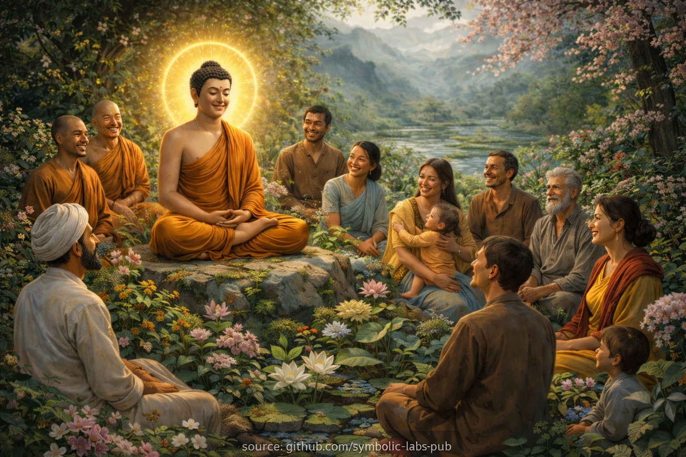
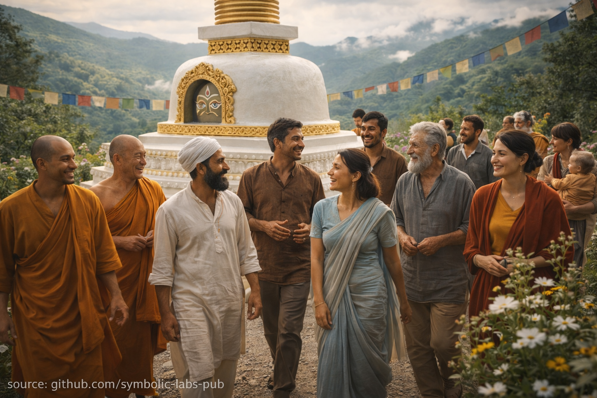
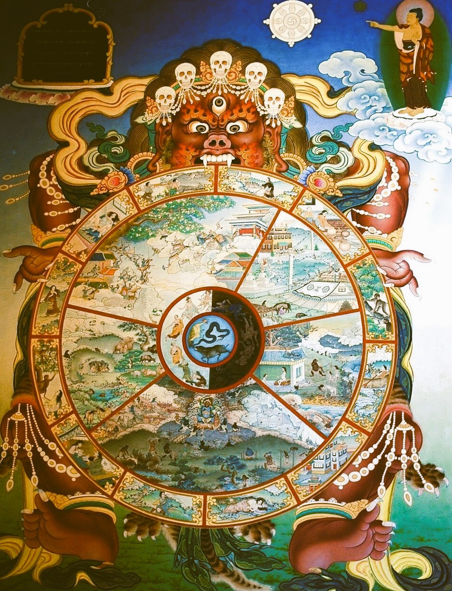
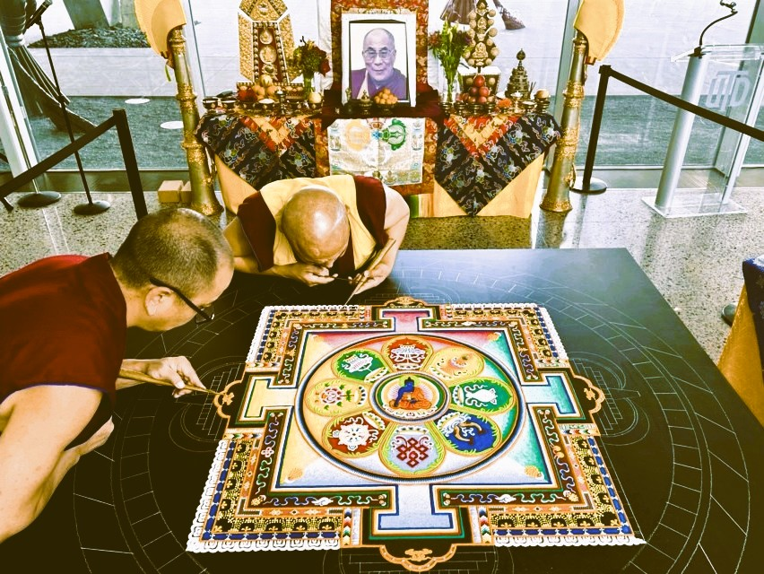

# [A Buddhist View](https://github.com/symbolic-labs-pub/a-buddhist-view/blob/master/README.md)

If genuine interest and commitment arise, the classical Buddhist path recommends the following approach:

* **Connect with a Buddhist center or community** near you that maintains an authentic lineage
* **Attend teachings and meditation sessions**, cultivating familiarity with both view and practice
* **Rely on a qualified teacher (lama, kalyāṇamitra)** whose conduct, understanding, and compassion inspire trust
* **Formally take Refuge** in the Buddha, Dharma, and Saṅgha, establishing the foundation of the path
* **Receive oral transmissions (*lung*) and practical instructions (*tri*)** directly from your qualified teacher, ensuring continuity of lineage
* **Begin the Preliminary Practices (*Ngöndro*)**, which prepare the mind and stabilize realization

---

### Important Clarifications

* A **teacher is not “chosen” casually**; trust develops gradually through observation and reflection
* **Refuge is not symbolic**—it represents a decisive reorientation of one’s life toward awakening
* **Transmissions are essential in Vajrayāna**, as realization is inseparable from lineage and direct introduction
* **Preliminary practices are not remedial**—they are complete paths that purify obscurations and mature insight

---

## Table of Contents

- [Core Teachings](more/01_core_teachings/README.md)
- [From Ignorance to Awakening](more/02_from_ignorance_to_awakening/README.md)
- [The Path to End Suffering](more/03_the_path_to_end_suffering/README.md)
- [The Three Bodies](more/04_kayas/README.md)
- [Vehicles of The Path](more/05_yanas/README.md)
- [Intermediate States and Reincarnation](more/06_intermediate_states_and_reincarnation/README.md)
- [Present and History](more/07_history/README.md)
- [Lineages and Buddhas](more/08_lineage/README.md)
- [Symbols](more/09_symbols/README.md)
- [Concepts](more/10_concepts/README.md)
- [Preliminary Practices](more/11_ngondro/README.md)
- [Frequently Asked Questions](more/80_faq/README.md)
---

 The Teachings (Dharma) 

## The Teachings (Dharma)

Even if Buddhism is mostly approached as a religion, it does **not** require blind faith or a leap of belief.

On the contrary, Buddhism explicitly encourages careful examination. You are invited to question, analyze, and test every teaching—and to accept nothing unless it proves true through your own experience.

At the same time, Buddhism cannot be realized through reading, listening, or intellectual understanding alone.

Understanding the ideas is only the beginning. To truly know whether they are valid, you must **investigate them directly**.
This investigation happens through **meditation**.

Meditation is the method by which Buddhist teachings are verified. It is how insight becomes personal, lived, and real. There is no alternative route. For this very reason, _there is no Buddhist practitioner who avoids meditation_.

In most areas of life, learning through study alone may be enough—you can pass exams, build careers, and solve problems without ever meditating. Buddhism, however, is not structured that way.

Studying Buddhist teachings without meditation is like receiving a new vehicle:
you examine its shape, admire its design, look inside, even hold the key—
but you never sit in the driver’s seat and you never start the engine.

Meditation is what turns the key.

The Community: Our Friends on the Way (Sangha)

## The Community: Our Friends on the Way (Sangha)

Buddhist meditation practices are widely available today, but the most effective way to begin is surprisingly simple: find a nearby Buddhist Center and join a few guided meditation sessions.

If you experience positive change, you’ll naturally continue.
If not, another community or tradition may suit you better.

Over time, many people discover that they’ve also found something else there:
well-intentioned, grounded, and supportive people—and accordingly wise teachers as well.

A Wrathful Buddha?

## A Wrathful Buddha?

In this ancient Tibetan image a frightening figure appears with fierce eyes, skull ornaments, and bared teeth. This appearance can be misleading at first.

The being is **not hostile toward us**. His terrifying form is meant to **frighten away obstacles, ignorance, and harmful forces**—not practitioners themselves.

In Buddhist iconography, such figures are known as **Protectors**. They embody powerful, uncompromising energy used in the service of awakening. This is why they are invoked in practice: not for fear, but for **protection and clarity**.

The wheel held by this figure is called the **Wheel of Life**, or **Bhavachakra**. It represents cyclic existence—birth, death, and reincarnation—driven by ignorance, craving, and aversion. The fierce figure holding the wheel is **Yama**, the Lord of Death, symbolizing impermanence and the inescapability of cause and effect.

Yama is not an evil deity. He reminds us that everything conditioned is temporary, and that liberation comes from understanding the wheel—not denying it.

Sand Mandalas

## Sand Mandalas

Mandalas are created with extraordinary care and precision using colored sand. The process is delicate and time-intensive, often taking many weeks of focused, patient work. Yet once the mandala is complete, it is deliberately swept away—like in a single moment—by a respected teacher.

_source: [Local Profile](https://www.localprofile.com/arts-culture/tibetan-monk-mandala-sand-painting-at-the-crow-museum-9770562)_

This intentional destruction is not an act of loss, but of teaching.

Sand mandalas remind us of core Buddhist insights, including:

* **Impermanence (anicca)** — all conditioned things arise and pass away
* **Non-attachment** — beauty and meaning do not require possession
* **The preciousness of the present moment** — value lies in the act, not the result
* **Interdependence** — countless small actions create a coherent whole
* **Letting go** — peace comes from release, not accumulation
* **Compassionate intention** — the mandala is made for the benefit of all beings, not personal ownership

In this way, the mandala itself becomes a meditation:
created with care, appreciated fully, and released without regret.

---

< [FAQ](more/80_faq/README.md) | [Core Teachings](more/01_core_teachings/README.md) >

_source: [github.com/sybolic-labs-pub](https://github.com/sybolic-labs-pub)_

---
