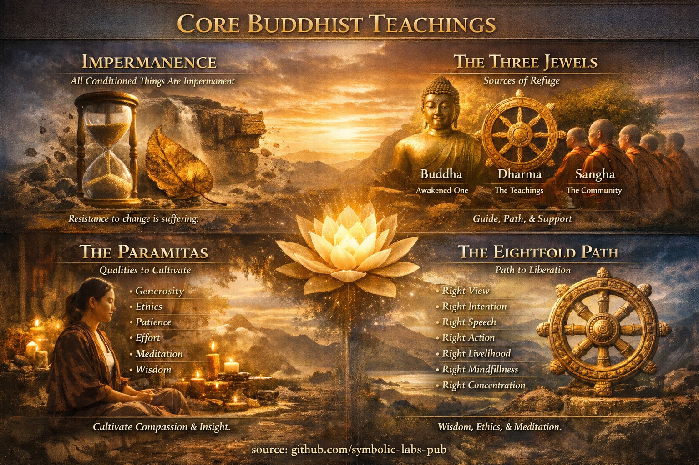

# [Mësimet Kryesore](https://github.com/symbolic-labs-pub/a-buddhist-view/blob/languages/al/master/more/01_core_teachings/README.md#mësimet-kryesore)

## 1. ["Të Gjitha Gjërat e Kondicionuara Janë të Përkohshme"](impermanence/README.md)

*(Pāli: **sabbe saṅkhārā aniccā**)*

Ky princip thotë se **çdo gjë që lind për shkak të shkaqeve dhe kushteve përfundimisht do të ndryshojë dhe do të kalojë**.

* "E kondicionuar" do të thotë **e varur nga shkaqet** (fizike, mendore, sociale, karmike).
* Asgjë e përbërë—objekte, emocione, identitete, institucione—nuk ka ekzistencë të përhershme.
* [Së përkohshme](impermanence/README.md#2-impermanence-anicca-is-structural-not-accidental) aplikohet në **të gjitha shkallët**:

  * Fizike: trupa, male, qytetërime
  * Mendore: mendime, emocione, qëllime
  * Ekzistenciale: role, koncepte të vetvetes, besime

**Pse kjo ka rëndësi**

* Të qëndrosh i lidhur me gjëra të përkohshme prodhon **[vuajtje (dukkha)](../02_from_ignorance_to_awakening/2_the_four_noble_truths/README.md#1-there-is-suffering--dukkha)**.
* Njohuria për së përkohshmen shkrij lidhjen, frikën dhe iluzionin e kontrollit.
* Së përkohshme nuk është pesimiste—ajo mundëson **ndryshimin, lirinë dhe [zgj imin](../10_concepts/README.md#3-enlightenment-bodhi-awakening)**.

> Së përkohshme nuk është problemi. **Rezistenca ndaj së përkohshmes është.**

---

## [2. Tre Xhevahirët (Xhevahiri i Trefishtë)](the_three_jewels/README.md)

[**Tre Xhevahirët**](the_three_jewels/README.md#the-three-jewels-triple-gem--ti-ratana) janë orientimi themeltar i jetës budiste—ajo në të cilën dikush *merr strehim*.

### 1. **Buddha**

* **Ai i zgjuar** (historikisht: Siddhārtha Gautama).
* Gjithashtu do të thotë **zgjimi vetë**—potenciali për ndriçim i pranishëm te të gjitha qeniet.

### 2. **Dharma**

* **Mësimet** e Buddhës.
* Gjithashtu **ligji i realitetit**: si funksionojnë gjërat në të vërtetë (së përkohshme, shkakshmëri, [jo-vetja](../02_from_ignorance_to_awakening/1_the_three_marks_of_existence/README.md#3-non-self-anattā)).
* Përfundimisht, [Dharma](the_three_jewels/README.md#2-dharma--the-path-and-the-law-of-reality) nuk është besim por **njohuri e drejtpërdrejtë**.

### 3. **Sangha**

* Fillimisht: **komuniteti i praktikuesve të urdhëruar**.
* Më gjerësisht: të gjithë praktikuesit e sinqertë që ruajnë dhe mishërojnë Dharmën.
* Në nivelin më të thellë: **fusha e marrëdhënies së zgjuar** që mban praktikën.

**Funksionalisht**

* Buddha = **shembulli**
* Dharma = **rruga**
* Sangha = **sistemi i mbështetjes**

---

## 3. Pāramitā-t (Përsosjet)

**Pāramitā-t** janë **cilësi të kultivuara për të kaluar nga injoranca në zgjim**.
Numri varet nga tradita.

---

### Gjashtë Pāramitā-t (Standardi Mahāyāna)

1. **Bujarisë (Dāna)**
   Të dhënurit pa lidhje—me rezultate, identitet ose shpërblim.

2. **Sjelljes Etike (Śīla)**
   Të vepruarit në mënyra që zvogëlojnë dëmin dhe stabilizojnë mendjen.

3. **Durimit (Kṣānti)**
   Jo-reagueshmëri ndaj dhimbjes, fyerjes, vonesës dhe pasigurisë.

4. **Përpjekjes së Zellshme (Vīrya)**
   Energji e qëndrueshme, e gëzuar e aplikuar në drejtimin e duhur.

5. **[Përqendrimit](../08_lineage/README.md) [Meditativ (Dhyāna)](the_noble_eightfold_path/README.md#8-right-concentration-sammā-samādhi)**
   Stabilitet i thellë mendor, qartësi dhe praninë.

6. **Urtësisë (Prajñā)**
   Njohuri e drejtpërdrejtë mbi së përkohshmen, jo-vetveten dhe [zbrazëtinë](../10_concepts/01_emptiness/README.md#emptiness-śūnyatā-in-vajrayāna-buddhism).

---

### Lista të Zgjeruara (Konteksti)

* Tradita **Theravāda** shpesh flet për **10 pāramī**.
* Disa burime Mahāyāna shtojnë:

  * **Mjete të Shkathtë (Upāya)**
  * **Aspiratë (Praṇidhāna)**
  * **Fuqi (Bala)**
  * **Dituri (Jñāna)**

> Urtësia pa [dhembshuri](../02_from_ignorance_to_awakening/7_compassion/README.md#compassion-as-a-structural-principle-in-buddhist-teaching) është e paplotë.
> Dhembshuria pa urtësi është e verbër.

---

## [4. Rruga Fisnike e Tetëfishtë](the_noble_eightfold_path/README.md)

[**Rruga Fisnike e Tetëfishtë**](the_noble_eightfold_path/README.md#what-the-noble-eightfold-path-is-in-buddhism) është **struktura praktike e çlirimit**.
Ajo nuk është lineare—është një **sistem me forcim të ndërsjellë**.

---

### 1. Urtësia (Paññā)

1. **Këndvështrimi i Drejtë** – Të kuptuarit e realitetit si të përkohshëm, të pakënaqshëm dhe jo-vetë.
2. **Qëllimi i Drejtë** – Përkushtimi ndaj heqjes dorë, vullnetit të mirë dhe jo-dëmit.

### 2. Sjellja Etike (Śīla)

3. **Fjala e Drejtë** – Komunikim i vërtetë, i kohës dhe jo-dëmtues.
4. **Veprimi i Drejtë** – Sjellje etike trupore.
5. **Jetesa e Drejtë** – Punë që nuk shkakton vuajtje.

### 3. Disiplina Mendore (Samādhi)

6. **Përpjekja e Drejtë** – Kultivimi i gjendj eve të shëndosha, braktisja e atyre të pashëndosha.
7. **[Vetëdija](the_noble_eightfold_path/README.md#7-right-mindfulness-sammā-sati) e Drejtë** – [Ndërgjegjje](../10_concepts/README.md#2-awareness-rigpa-vijñāna-knowing) e qartë e trupit, ndjenjave, mendjes dhe fenomeneve.
8. **Përqendrimi i Drejtë** – Thithje meditativ e thellë.

---

### Njohuri Strukturore

* Etika stabilizoi mendjen.
* Meditimi qartëson perceptimin.
* Urtësia shkrij injorancinë.
* Të tre **bashkëevoluojnë**.

---

## Sinteza e Pamjes së Madhe

| Koncepti       | Roli Kryesor                      |
| -------------- | --------------------------------- |
| [Së Përkohshme](#1-të-gjitha-gjërat-e-kondicionuara-janë-të-përkohshme)   | Diagnostikon iluzionin rrënjësor  |
| [Tre Xhevahirët](#2-tre-xhevahirët-xhevahiri-i-trefishtë)   | Orientimi dhe strehimi            |
| [Pāramitā-t](#3-pāramitāt-përsosjet)      | Cilësi të brendshme për të kultivuar |
| [Rruga e Tetëfishtë](#4-rruga-fisnike-e-tetëfishtë) | Sistem operacional për çlirim     |

**Budizmi është më pak një sistem besimesh dhe më shumë një kornizë precize për zvogëlimin e [vuajtjes](../02_from_ignorance_to_awakening/2_the_four_noble_truths/README.md#1-there-is-suffering--dukkha) përmes kuptimit të realitetit siç është.**

---

< [Një Këndvështrim Budist](../../README.md) | ["Të Gjitha Gjërat e Kondicionuara Janë të Përkohshme"](impermanence/README.md) >

_burimi: [github.com/symbolic-labs-pub](https://github.com/symbolic-labs-pub)_

---
