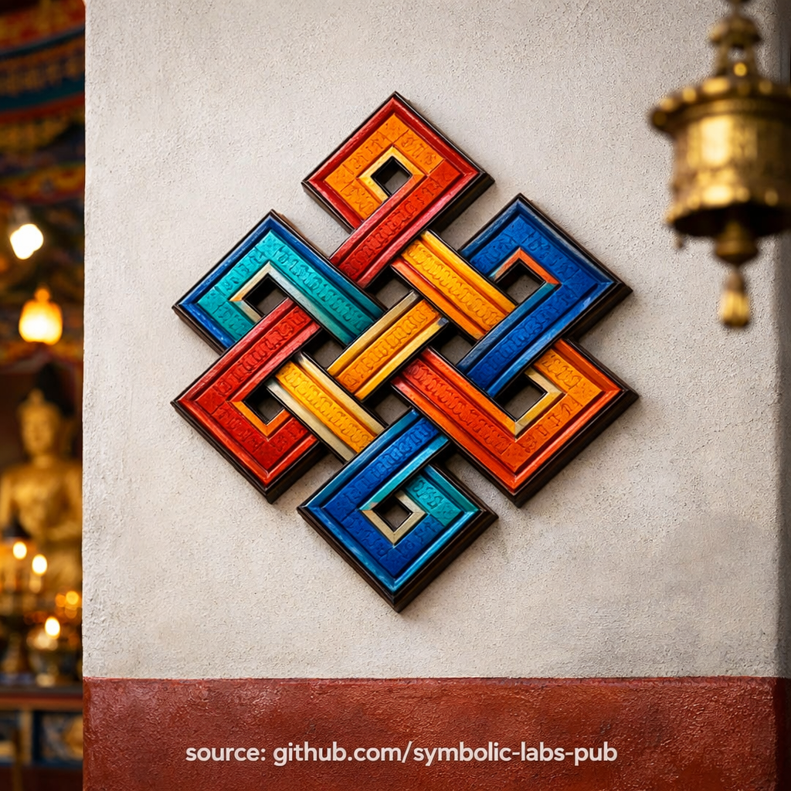

## [Nyja e Pafund (Śrīvatsa) — sipas mësimeve budiste](https://github.com/symbolic-labs-pub/a-buddhist-view/blob/languages/al/master/more/09_symbols/04_the_endless_knot/README.md#nyja-e-pafund-śrīvatsa--sipas-mësimeve-budiste)

---

**Nyja e Pafund** nuk është një model dekorativ. Është një **mësim vizual rreth se si realiteti funksionon në të vërtetë**.

### 1. Ndërvarësia (Pratītyasamutpāda)

Nyja nuk ka **fillim dhe as fund**. Çdo linjë ekziston vetëm sepse është endur me të tjerat.

Kjo ilustron [**origjinën e varur**](../../../02_from_ignorance_to_awakening/3_dependent_origination/README.md#the-twelve-links-the-classic-formulation):

* Asgjë nuk lind në mënyrë të pavarur
* Asgjë nuk ekziston në izolim
* Çdo fenomen është rezultat i **kushteve**

Nuk ka një "shkak të parë" të vetëm. Realiteti është **relacional**, jo linear.

> Nuk mund të tërheqësh një fije pa ndikuar të tërën.

---

### 2. Shkakshmëria jo-lineare

Ndryshe nga një vijë e drejtë (shkak → efekt), Nyja e Pafund tregon **cikle reagimi**:

* Shkaqet bëhen efekte
* Efektet ri-formësojnë shkaqet e ardhshme
* E kaluara, e tashmja, dhe e ardhmja janë **strukturalisht të ndërthurura**

Kjo është arsyeja pse budizmi refuzon llogaritjen morale të thjeshtë ("Bëra X, prandaj Y duhet të ndodhë").
Realiteti është **kompleks, kontekstual, dhe rekursiv**.

---

### 3. Karma si strukturë, jo fat

Në mësimin budist, **karma nuk është fat**.

Nyja e Pafund sqaron se:

* Karma është **nxitje modeluese**
* Është *arkitektura* e zakoneve, qëllimeve, dhe kushteve
* Sepse modelet janë të kushtuara, ato mund të **ri-kushtohen**

Liria është e mundur **brenda** strukturës, jo jashtë saj.

> Karma lidh vetëm atë që nuk shihet qartë.

---

### 4. Bashkimi i urtësisë dhe dhembshurisë

Në interpretimin e [Mahāyāna](../../../05_yanas/README.md#limitation-from-mahāyāna-view) dhe [Vajrayāna](../../../05_yanas/README.md#4-vajrayāna-tantrayāna-mantrayāna---the-diamond-vehicle), nyja përfaqëson gjithashtu **pandashësinë** e:

* [**Urtësisë**](../../../01_core_teachings/the_noble_eightfold_path/README.md#1-wisdom-paññā) (duke parë [zbrazëtinë](../../../10_concepts/01_emptiness/README.md#emptiness-śūnyatā-in-vajrayāna-buddhism) dhe ndërvarësinë)
* [**Dhembshurisë**](../../../02_from_ignorance_to_awakening/7_compassion/README.md#compassion-as-a-structural-principle-in-buddhist-teaching) (duke iu përgjigjur me aftësi brenda asaj rrjete)

Të shohësh ndërvarësinë *pa* dhembshuri çon në shkëputje.
Të veprosh me dhembshuri *pa* urtësi çon në ngatërrim.

Nyja e Pafund tregon se ato duhet të jenë **të enduara së bashku**.

---

### 5. Kuptimi praktik kontemplotiv

Si mbështetje [meditimi](../../../08_lineage/README.md), Nyja e Pafund trajnon mendjen për:

* Të braktisë të menduarit binar (mirë/keq, vetë/tjetri)
* Të vërejë kushtet e fshehura pas emocioneve dhe ngjarjeve
* Të zhvillojë durim me kompleksitetin
* Të marrë përgjegjësi **pa faj**

Ajo mëson **përgjegjësi pa vetë-fajësim** dhe **liri pa mohim të shkakshmërisë**.

---

### Insight-i themelor (i kondensuar)

* **Asgjë nuk ekziston vetëm**
* **Asgjë nuk ndodh rastësisht**
* **Asgjë nuk është e fiksuar përgjithmonë**

Nyja e Pafund është gjuha vizuale e kësaj të vërtete.

Ajo i kujton praktikuesit:

> [Zgjimi](../../../10_concepts/README.md#3-enlightenment-bodhi-awakening) nuk është ikja nga rrjeta —
> është **të shohësh rrjetën qartë dhe të lëvizësh brenda saj me mençuri**.

---

< [Thangka — Transmetimi Vizual i Rrugës](../../../more/09_symbols/15_thangka/README.md) | [Rrota e Dharmës (Dharmachakra) — sipas mësimeve budiste](../01_the_wheel_of_dharma/README.md) >

_burimi: [github.com/symbolic-labs-pub](https://github.com/symbolic-labs-pub)_

---
