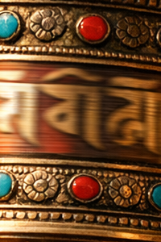
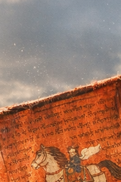
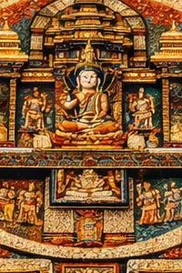
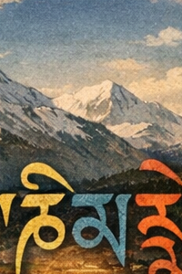
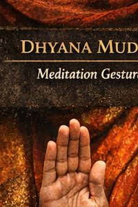
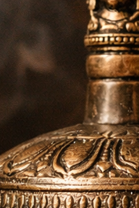
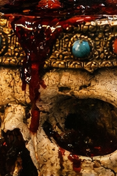
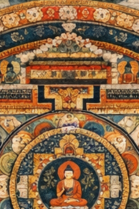

# [Simbole](https://github.com/symbolic-labs-pub/a-buddhist-view/blob/languages/al/master/more/09_symbols/README.md#symbols)

## [1. Litari i Bekimit (Litari i Mbrojtjes)](01_blessing_cord/README.md)

**Çfarë është**
Një litar i shenjtëruar, shpesh i lidhur rreth qafës ose kyçit të dorës.

**Kuptimi**

* **Bekimi i vazhdueshëm i linjës**
* Kujtim i **betimeve, strehimit ose fuqizimit**
* Fushë *mbrojtëse*, jo bestytni

**Si përdoret**

* Vishet në heshtje, jo për t'u shfaqur
* Nuk hiqet rastësisht
* Funksionon përmes **kujtimit dhe qëllimit**, jo magjisë

---

## [2. Dorje (Vajra)](02_dorje/README.md)

**Kuptimi**

* **Qartësia e pashkatërrueshme**
* Bashkimi i **metodës ([dhembshuri](../02_from_ignorance_to_awakening/7_compassion/README.md#compassion-as-a-structural-principle-in-buddhist-teaching))** dhe **[urtësi](../01_core_teachings/the_noble_eightfold_path/README.md#1-wisdom-paññā) (zbrazëti)](../10_concepts/01_emptiness/README.md#emptiness-śūnyatā-in-mahāyāna-buddhism)**
* Realiteti që nuk mund të shkatërrohet nga konfuzioni

**Funksioni i praktikës**

* Mbahet në dorën e djathtë gjatë ritualeve
* Përdoret me zilen (urtësia)
* Përfaqëson **[vetëdijen](../10_concepts/README.md#2-awareness-rigpa-vijñāna-knowing) e zgjitur të patundshme**

---

## [3. Rrota e Lutjes (Rrota Mani)](03_prayer_wheel/README.md)

**Kuptimi**

* Mantra në **rrotullim fizik**
* Mendja + trupi + mantra të sinkronizuar

**Si funksionon**

* Kthehet **në drejtim orar**
* Çdo rrotullim = recitim
* Thekson **vazhdimësinë**, jo shpejtësinë

---

## [4. Flamujt e Lutjes (Lungta)](04_prayer_flags/README.md)

**Kuptimi**

* Era bart lutjet në hapësirë
* Mësimet treten në botë

**Ngjyrat & elementet**

* Blu (hapësira)
* E bardhë (ajri)
* E kuqe (zjarri)
* E gjelbër (uji)
* E verdhë (toka)

**Njohuri e rëndësishme**
Ndërsa flamujt zbehin, **ego-ja tretet**—bekimi mbetet.

---

## [5. Stupa](05_stupa/README.md)

**Çfarë është një [stupa](05_stupa/README.md#1-what-a-stupa-is-beyond-architecture)**

* **[Ndriçimi](../10_concepts/README.md#3-enlightenment-bodhi-awakening) i mishëruar**
* Përfaqëson mendjen, fjalën dhe trupin e Budës

**Pse në drejtim orar (pradakshina)**

* Përputhet me **rendin kozmik**
* Pasqyron ciklet natyrore (dielli, yjet)
* Mban **zemrën drejt zgjimit**

Qarkullimi është **[meditim](../08_lineage/README.md) duke ecur**, jo turizëm.

---

## [6. Mala](06_mala/README.md)

 (Rruzullat e Lutjes)

**Struktura**

* 108 rruzulla (ose ndarje të tyre)
* Rruzulla guru = **spiranc i palnumëruar**

**Si përdoret**

* Lëvizni rruzullat **drejt vetes**
* Mos e kaloni rruzullën guru
* Përdoret për mantra, frymëmarrje ose qëllim

**Kuptimi**
Çdo rruzull = **një moment vetëdijeje i rikthyer**

---

## [7. Mandala](07_mandala/README.md)

**Kuptimi**

* **Hartë e shenjtë e mendjes së zgjitur**
* Gjeometria e realizimit

**Funksioni i praktikës**

* Trajnim vizualizimi
* Shpërbërja mëson [**papërshtatshmërinë**](../01_core_teachings/impermanence/README.md#2-impermanence-anicca-is-structural-not-accidental)
* Ndërton strukturë të brendshme

[Mandala](07_mandala/README.md#mandala--explained-according-to-buddhist-teachings) nuk është zbukurim—është **arkitekturë njohëse**.

---

## [8. Lotus](08_lotus/README.md)

**Kuptimi**

* Pastërtia **pa refuzim**
* Zgjimi *përmes* kushteve, jo larg tyre

**Mësimi qendror**
Balta ushqen lotusin.
[Vuajtja](../02_from_ignorance_to_awakening/2_the_four_noble_truths/README.md#1-there-is-suffering--dukkha) ushqen zgjimin.

---

## 9. Pozicioni Lotus (Padmāsana)

**Kuptimi**

* **Stabiliteti fizik pasqyron stabilitetin mendor**
* Trupi bëhet një mandala

**Shënim i rëndësishëm**
Pozicioni lotus është **simbolik**, jo i detyrueshëm.
Vetëdija > fleksibiliteti.

---

## [10. Mantra](10_mantra/README.md)

**Kuptimi**

* "Mbrojtje e mendjes"
* Tingulli si **vetëdije me model**

**Funksioni**

* Ndërpret mendjen diskursive
* Kodon njohjen e linjës
* Përshtatet fjalën me realizimin

[Mantra](10_mantra/README.md#what-a-mantra-is-buddhist-view) është **disiplinë frekuence**, jo pohim.

---

## [11. Mudra](11_mudra/README.md)

**Kuptimi**

* Gjeste dore si **çelësa njohës**
* Gjuha e trupit të ndriçimit

**Shembuj**

* [Mudra](11_mudra/README.md#abhaya-mudrā-fearlessness) e mësimit
* Mudra e meditimit
* Mudra e pafrikësisë

Mudra stërvit **urtësinë e mishëruar**, jo vetëm simbolizëm.

---

## [12. Zile](12_bell/README.md)

 (Ghanta)

* Urtësia
* [Zbrazëtia](../10_concepts/01_emptiness/README.md#emptiness-śūnyatā-in-vajrayāna-buddhism)
* Dora e majtë (receptiviteti)

---

## [13. Kupa e Kafkës](13_skull_cup/README.md)

 (Kapala)

* Transformimi i egos
* Vdekja si mësues
* Përdoret në [Vajrayāna](../05_yanas/README.md#4-vajrayāna-tantrayāna-mantrayāna---the-diamond-vehicle) të përparuar

---

## [14. Numëruesit e Mala-s](14_mala_counters/README.md)

* Ndjekin betimet dhe angazhimet
* Theksojnë **disiplinën mbi frymëzimin**

---

## [15. Thangka](15_thangka/README.md)

* Mandala e lëvizshme
* Transmetim vizual
* Përdoret për trajnim vizualizimi

---

## [16. Nyja e Pafundme](16_endless_knot/README.md)

* Ndërvarësia
* Shkakësia jo-lineare
* Karma si strukturë, jo fat

---

## [17. Rrota e Dharma-s](17_dharma_wheel/README.md)

* Mësimi në lëvizje
* Orientimi etik
* Struktura tetëpalëshe

---

## [18. Guaska e Kërmillit](18_conch_shell/README.md)

* Proklamimi i Dharma-s
* Thirrje zgjimi për vetëdijen

---

## Njohuri Strukturore (Shumë e Rëndësishme)

Simbolet budiste tibetiane **nuk janë metafora**.
Ato janë:

* **Mjete njohëse**
* **Udhëzime të mishëruara**
* **Spiranca kujtese**
* **Pajisje trajnimi**

Ato funksionojnë **vetëm kur integrohen** me:

* [Etikën (śīla)](../01_core_teachings/the_noble_eightfold_path/README.md#2-ethical-conduct-śīla)
* Meditimin ([samādhi)](../03_the_path_to_end_suffering/README.md#right-action)
* Njohjen (prajñā)

---

## [Peshqit e Artë](19_golden_fish/README.md)

**Kuptimi qendror**
Liria nga frika dhe vuajtja.

**Mësimi**
Dy peshqit e artë simbolizojnë qeniet që kanë kaluar oqeanin e saṃsāra-s dhe tani lëvizin lirshëm, pa u mbytë në vuajtje. Peshqit notojnë pa përpjekje në ujë—ashtu si qeniet e zgjitura lëvizin brenda përvojës pa u bërë peng prej saj.

**Njohuri më e thellë**

* Liria **nuk është arratisje**, por zotërimi i kushteve
* Përfaqëson gëzimin, spontanitetin dhe pafrikësinë
* Tregon çlirimin **brenda** botës, jo jashtë saj

Peshqit e Artë u kujtojnë praktikuesve që zgjimi është *rrjedhshmëria e mendjes*, jo tërheqja.

---

## [️ Ombrella](20_parasol/README.md)

**Kuptimi qendror**
Mbrojtja nga vuajtja dhe gjendjet e dëmshme mendore.

**Mësimi**
Tradicionalisht e lidhur me mbretërinë, ombrella përfaqëson dinjitetin dhe mbrojtjen e zgjimit. Ajo mbron mendjen nga nxehtësia e injorancës, lidhjes, zemërimit dhe kryelartësisë.

**Njohuri më e thellë**

* Simbolizon disiplinën etike dhe [vëmendjen](../01_core_teachings/the_noble_eightfold_path/README.md#7-right-mindfulness-sammā-sati)
* Mbrojtja është **e brendshme**, jo e jashtme
* Përfaqëson udhëheqjen dhembshuruese të mendjes së dikujt

Ombrella mëson që **urtësia siguron hije**, jo izolim.

---

## [Vazo e Thesarit](21_treasure_vase/README.md)

**Kuptimi qendror**
Bollëku i pashterrshëm dhe pasuria shpirtërore.

**Mësimi**
Vazo e thesarit është gjithmonë plot dhe nuk shterrët kurrë. Ajo përfaqëson pasurimin e pakufishëm të Dharma-s—meritat, urtësinë, dhembshurinë dhe mjetet e aftë që rriten përmes përdorimit sesa konsumit.

**Njohuri më e thellë**

* Bollëku i vërtetë është **jo zero-sum**
* Bujaritë zgjeron kapacitetin e brendshëm
* Zbrazëtia lejon plotësinë pa kapje

Vazo e Thesarit mëson **bollëkun pa lidhje**.

---

## [Flamuri i Fitores](22_victory_banner/README.md)

**Kuptimi qendror**
Triumfi i urtësisë mbi injorancën.

**Mësimi**
Flamuri i fitores kremton fitoren e plotë të Budës mbi Māra-n—simbolizues i pushtimt të pengesave të brendshme: kapje pas egos, dyshimi, frikës dhe iluzionit.

**Njohuri më e thellë**

* Fitoria është **e brendshme**, jo konkurruese
* Përfaqëson këmbënguljen dhe disiplinën
* Zgjimi është i pakthyeshëm pasi stabilizohet

Flamuri i Fitores shpall që **qartësia mund të mbizotërojë**, edhe kundër zakoneve të rrënjosura thellë.

---

### Sintezë

Këta katër simbole së bashku formojnë një **hartë strukturore të çlirimit**:

* **Peshqit e Artë** → Liria
* **Ombrella** → Mbrojtja
* **Vazo e Thesarit** → Bollëku
* **Flamuri i Fitores** → Plotësimi

Ato nuk janë motive dekorative—ato janë **udhëzime njohëse dhe etike**, të koduara në formë simbolike për kontemplim të vazhdueshëm.

---

< [Flamuri i Fitores (Skt. *Dhvaja*) — Kuptimi Budist](22_victory_banner/README.md) | [Zbrazëtia (Śūnyatā) në Budizmin Vajrayāna](../10_concepts/01_emptiness/README.md) >

_burimi: [github.com/symbolic-labs-pub](https://github.com/symbolic-labs-pub/blob/languages/al/master)_

---
