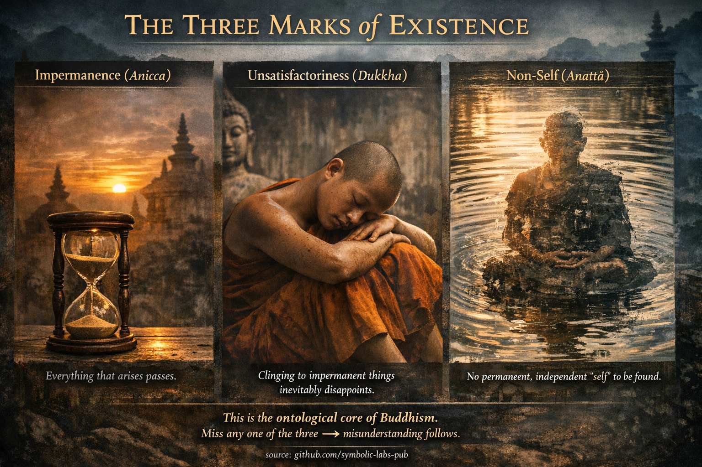

## [Трите белега на съществуването — будистко обяснение](https://github.com/symbolic-labs-pub/a-buddhist-view/blob/master/more/02_from_ignorance_to_awakening/1_the_three_marks_of_existence/README.md#the-three-marks-of-existence--buddhist-explanation)

Буда учи, че **всички обусловени явления** (всичко, което възниква поради причини и условия) споделят **три неразделни характеристики**. Те не са метафизични твърдения; те са **проверими свойства на опита**.

---

### 1. **Непостоянство (Anicca)**

**"Всичко, което възниква, преминава."**

В будизма [непостоянството](../../01_core_teachings/impermanence/README.md#2-непостоянство-anicca-е-структурно-а-не-случайно) не означава "нещата свършват един ден."
То означава:

* Нищо не остава идентично **дори за момент**
* Приемствеността е илюзия, създадена от бърза промяна
* Стабилността е *изведена*, не наблюдавана

Мислите се променят.
Сетивата пулсират.
Телата остаряват от момент на момент.

**Защо това има значение**

Ако нещо се променя:

* то не може да се осигури
* то не може да се замрази
* то не може да служи като надеждно прибежище

Прозрението на Буда не беше песимистично—то беше *точно*:

> Това, което е нестабилно, не може да осигури трайно удовлетворение.

Виждането на непостоянството ясно започва разтварянето на привързването.

---

### 2. **Незадоволителност (Dukkha)**

**"Привързването към непостоянни неща неизбежно разочарова."**

Dukkha често се превежда погрешно като "[страдание](../2_the_four_noble_truths/README.md#1-има-страдание--dukkha)", но в будистките учения то означава:

* структурна неудовлетвореност
* хронично триене
* стресът на съпротивата

Dukkha възниква **не защото животът е болезнен**, а защото умът:

* иска приятното да остане
* иска неприятното да спре
* иска неутралното да стане значещо

Това създава напрежение.

**Ключово будистко прозрение**

> Dukkha не е в опита — тя е в *хващането*.

Дори радостта става dukkha, когато е:

* притежавана
* защитавана
* изплашена от загуба

Следователно Буда не учи бягство от живота, а **свобода от компулсивно изискване**.

---

### 3. **Не-аз (Anattā)**

**"Никакъв постоянен, независим аз не може да се намери."**

Anattā **не** означава:

* "не съществувате"
* "нищо няма значение"

То означава:

* никакъв фиксиран контролер не съществува в опита
* никаква непроменяща се същност не може да се локализира

Това, което наричаме "аз", е **процес**, съставен от:

* телесни усещания
* чувства
* възприятия
* ментални формации
* съзнание

Всеки от тях:

* възниква поради причини
* се променя
* се разтваря

**Съществено учение**

> Ако нещо се променя, то не може да бъде аз.
> Ако нещо е неконтролируемо, то не може да бъде аз.

Усещането за "аз" е *модел*, не обект.

---

## Защо трите трябва да се учат заедно

Будизмът настоява, че те са **неразделни**:

* Непостоянство без не-аз → тревожност
* Не-аз без dukkha → философия
* Dukkha без непостоянство → нихилизъм

Заедно те разкриват:

> Опитът е динамичен, незадоволителен, когато се хваща, и без собственик.

Тази триада предотвратява непонимание.

---

## Целта на учението

Трите белега **не са доктрина** за вярване.
Те са **инструменти за освобождение**.

Когато се видят директно:

* привързването се отпуска
* страхът омекотява
* [състраданието](../7_compassion/README.md#състраданието-като-структурен-принцип-в-будистките-учения) възниква естествено

Не защото ставате по-добри —
а защото **не остава нищо за защита**.

---

## Радикалният извод на Буда

Освобождението не е:

* усъвършенстване на аза
* унищожение на аза

Освобождението е:

> **Виждане ясно, че азът никога не е бил това, което изглеждаше да е.**

Когато това се види, страданието няма опора.

---

### Накратко

* **Anicca** премахва фалшивата стабилност
* **Dukkha** изобличава цената на привързването
* **Anattā** разтваря въображавания собственик

Заедно те формират **онтологичното ядро на будизма**.

---

< [Трите скъпоценности (Тройната скъпоценност) — *Ti-ratana*](../../01_core_teachings/the_three_jewels/README.md) | [Четирите благородни истини — както Буда ги е имал предвид](../2_the_four_noble_truths/README.md) >

_източник: [github.com/symbolic-labs-pub](https://github.com/symbolic-labs-pub)_

---
