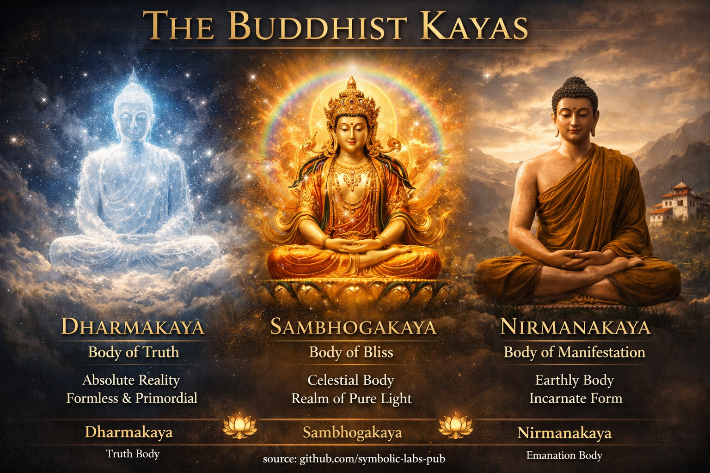

## [Трите Kāyas (Trikāya)](https://github.com/symbolic-labs-pub/a-buddhist-view/blob/master/more/04_kayas/README.md#the-three-kāyas-trikāya)

Учение

# Учение за трите тела на пробуждането

*(Как реалността, преживяването и [съчувствието](../02_from_ignorance_to_awakening/7_compassion/README.md#compassion-as-a-structural-principle-in-buddhist-teaching) са едно)*

---

## Въведение: защо Буда говореше за "тела"

Буда не преподаваше [просветлението](../10_concepts/README.md#3-enlightenment-bodhi-awakening) като абстрактна идея.
Той го преподаваше като **начин на живот на реалността**.

Понеже същества се различават по способности, пробуденото състояние се появява по различни начини.
За да обясни това без да попадне в етернализъм или нихилизъм, учителите говореха за **три kāyas** — не като отделни същности, а като **три неразделни аспекта на пробуждането**.

Това не са етапи за събиране.
Те са **измерения за разпознаване**.

---

## 1. Dharmakāya — Тялото на истината

На най-дълбоко ниво пробуждането е [**празно**](../10_concepts/01_emptiness/README.md#emptiness-śūnyatā-in-vajrayāna-buddhism).

Тази празнота не е нищо.
Тя е отсъствие на фиксация, отсъствие на вътрешно аз, отсъствие на изкривяване.

Когато човек гледа директно на преживяването:

* Никоя мисъл няма ядро
* Никоя емоция не притежава себе си
* Никой "наблюдател" не може да бъде намерен

Но [осведомеността](../10_concepts/README.md#2-awareness-rigpa-vijñāna-knowing) е налице.

Това отворено, безоснов�но знание се нарича **Dharmakāya**.

То не се създава чрез практика.
Практиката само премахва това, което го скрива.

> Dharmakāya не се постига.
> То се разпознава, когато схващането се отпусне.

Ако човек се привърже към формата, Dharmakāya се пропуска.
Ако човек се привърже към празнотата, Dharmakāya също се пропуска.

Истинската празнота е **жива**.

---

## 2. Sambhogakāya — Тялото на наслаждение

Понеже празнотата не е мъртва, тя естествено **знае**.

Това знание е ясно, светло и смислено.
То се появява като прозрение, радост, символика, визия и рафинирана перцепция.

Това се нарича **Sambhogakāya**.

Тук осведомеността се наслаждава на собствената си яснота:

* Прозрението възниква без усилие
* Красотата се възприема без привързаност
* Смисълът се появява без концепции

В [Vajrayāna](../05_yanas/README.md#4-vajrayāna-tantrayāna-mantrayāna---the-diamond-vehicle) това се изразява чрез:

* Божествени форми
* [Мандали](../09_symbols/07_mandala/README.md#mandala--explained-according-to-buddhist-teachings)
* [Мантра](../09_symbols/10_mantra/README.md#what-a-mantra-is-buddhist-view) и звук
* Светлина и цвят

Това не са фантазии.
Те са **езици на пробудено познание**.

> Sambhogakāya е празнота, която говори на себе си във форма.

Ако човек отхвърли тази яснота, практиката става суха.
Ако човек се привърже към нея, практиката става опиянение.

Яснотата трябва да остане **непритежавана**.

---

## 3. Nirmāṇakāya — Тялото на еманация

Когато празнотата е ясна, тя естествено **отговаря**.

Този отговор е съчувствие.

Съчувствието не е морална заповед.
То е това, което осведомеността прави, когато не е препятствана.

Това съчувствено откликване се появява като:

* Учители
* Действия
* Думи
* Мълчание
* Обикновено човешко присъствие

Това се нарича **Nirmāṇakāya**.

Ходенето на Буда, преподаването, стареенето и умирането не беше ограничение на просветлението — то беше негово **изразяване**.

> Ако пробуждането не помага на същества, то е непълно.

Ако човек се привърже само към празнотата, съчувствието вехне.
Ако човек се привърже само към съчувствието, [мъдростта](../01_core_teachings/the_noble_eightfold_path/README.md#1-wisdom-paññā) се губи.

Истинското съчувствие е **без усилие и прецизно**.

---

## Единството на трите

Трите kāyas не са три неща.

* Празнота без яснота не е Dharmakāya
* Яснота без съчувствие не е Sambhogakāya
* Действие без мъдрост не е Nirmāṇakāya

Те са една реалност, видяна от три ъгъла.

Като:

* Небето (празнота)
* Слънчевата светлина (яснота)
* Топлина на кожата (полза)

Не избирате едно.
Разпознавате и трите **наведнъж**.

---

## Грешката на практикуващия — и корекцията

**Често срещани грешки**

* Преследване на мистични преживявания → схващане на Sambhogakāya
* Разтваряне в празнота → неразбиране на Dharmakāya
* Принуждаване на съчувствие → имитиране на Nirmāṇakāya

**Корекция**

* Отпусни фиксацията
* Доверявай се на яснотата
* Позволи отговора да възникне естествено

> Просветлението не е интензивност.
> То е *безпрепятствено функциониране*.

---

## Как това учение се практикува

* Седни и разпознай откритост → **Dharmakāya**
* Забележи ярко знание → **Sambhogakāya**
* Отговори подходящо → **Nirmāṇakāya**

На възглавницата, в разговор, в конфликт, на работа.

Тестът за реализация не е визия.
Той е **непрекъснатост**.

---

## Заключителна инструкция

Не се опитвай да бъдеш Буда.
Не се опитвай да поддържаш състояние.

Просто забележи:

* Осведомеността вече е отворена
* Знанието вече е налице
* Съчувствието вече се движи

Когато нищо не е блокирано,
**трите тела са пълни**.

---

Обяснение

### 1. **Dharmakāya** — *Тяло на истината*

**Същност:** Самата крайна реалност
**Природа:** Празнота (*śūnyatā*) неразделна от осведомеността

**Ключови точки**

* Отвъд форма, цвят, локация и време
* **Основа** на всички Буди
* Чисто **знаещо-пространство**: празно, но ясно
* Еднакво за всички Буди — не лично

**Класически метафори**

* Ясно, отворено небе
* Безкрайно пространство
* Тиха океанска дълбочина

**В практиката**

* Реализирано чрез **директно прозрение** в празнотата
* Централно за [**Dzogchen** и **Mahāmudrā**](mahamudra_and_dzogcsen/README.md#1-dharmakāya-ground-recognition)
* Не нещо, което "ставаш" — нещо, което **разпознаваш**

> Dharmakāya не е бог, душа или субстанция.
> То е **реалност, видяна без изкривяване**.

---

### 2. **Sambhogakāya** — *Тяло на наслаждение / блаженство*

**Същност:** Сияйна яснота на пробуждането
**Природа:** Блажена, светла осведоменост с форма

**Ключови точки**

* Тънка, архетипна, символична форма
* Възприемана от **високо реализирани [bodhisattvas](../08_lineage/08_bodhisattva/README.md#4-the-bodhisattva-vow-as-structural-alignment)**
* Появява се в **чисти области**
* Изразена като мандали, светлина, цветове, божества

**Класически метафори**

* Дъгова светлина
* Отражения в кристал
* Слънчева светлина през мъгла

**В практиката**

* Достъпна чрез [**deity yoga**](../03_the_path_to_end_suffering/README.md#right-action), мантра, визуализация на мандала
* Централна за **Vajrayāna tantra**
* Не въображение — **символично познание**, тренирано да разкрива реалността

> Sambhogakāya е **пробуждане, комуникиращо със себе си**
> в рафинирана, смислена форма.

---

### 3. **Nirmāṇakāya** — *Тяло на еманация*

**Същност:** Съчувствие в действие
**Природа:** Форма с обикновен вид в света

**Ключови точки**

* Физическа манифестация във времето и пространството
* Включва исторически учители (напр. Śākyamuni Buddha)
* Може да бъде **всяка форма**, която облагодетелства същества
* Подложена на раждане, болест, смърт

**Класически метафори**

* Луна, отразена във вода
* Глас на учителя
* Лекарство, адаптирано към болестта

**В практиката**

* [Етика](../01_core_teachings/the_noble_eightfold_path/README.md#2-ethical-conduct-śīla), служене, преподаване, ежедневен живот
* Където просветлението **среща [страданието](../02_from_ignorance_to_awakening/2_the_four_noble_truths/README.md#1-there-is-suffering--dukkha)**
* Как пробуждането става полезно

> Ако Dharmakāya е истина
> и Sambhogakāya е смисъл,
> Nirmāṇakāya е **помощ**.

---

## Как Kāyas се свързват (решаващо тибетско прозрение)

Те **не са три отделни неща**.

| Аспект           | Аналогия                    |
| ---------------- | -------------------------- |
| [**Dharmakāya**](#1-dharmakāya---the-body-of-truth)   | Откритото небе               |
| [**Sambhogakāya**](#2-sambhogakāya---the-body-of-enjoyment) | Облаци, светлина, дъги    |
| [**Nirmāṇakāya**](#3-nirmāṇakāya---the-body-of-emanation)  | Дъжд, който храни земята |

И трите са **едновременно присъстващи** в [пробуждането](../10_concepts/README.md#3-enlightenment-bodhi-awakening).

* Без Dharmakāya → съчувствието губи мъдрост
* Без Sambhogakāya → мъдростта не може да комуникира
* Без Nirmāṇakāya → мъдростта не помага на никого

---

## Разширени тибетски разширения (накратко)

Някои тибетски системи говорят за **пет kāyas**:

* **Svabhāvikakāya** — неразделимостта на трите (тяхното единство)
* **Mahāsukhakāya** — тяло на велико блаженство (често Dzogchen / Highest Yoga Tantra)

Това са **усъвършенствания**, не противоречия.

---

## Защо Kāyas са важни практически

Тибетският будизъм използва kāyas, за да отговори на:

* *Какво наистина е просветлението?*
* *Как безформеното може да помогне на света?*
* *Защо пробуждането може да се появи като човешки учител?*

Те гарантират, че будизмът избягва:

* **Етернализъм** (постоянна богоподобна същност)
* **Нихилизъм** (нищо смислено не съществува)

---

## Резюме в едно изречение

> **Dharmakāya** е пробуждане като истина,
> **Sambhogakāya** е пробуждане като светъл смисъл,
> **Nirmāṇakāya** е пробуждане като съчувствено действие.

---

Медитация

# Trikāya медитационна последователност

*(От основа → сияние → съчувствие)*

---

## Подготовка (2–5 минути)

**Поза**

* Седни изправен, отпуснат, достоен
* Гръбначен стълб като купчина монети
* Ръце, почиващи естествено
* Очи меко отворени или нежно затворени

**Установяване**

* Позволи на дишането да попадне в собствен ритъм
* **Не** го контролирай
* Позволи на мислите да идват и отиват без корекция

> Не се подготвяш да *създадеш* състояние
> Подготвяш се да *разпознаеш* едно.

---

## Фаза I — Dharmakāya

**Почивка като отворена осведоменост** (10–15 минути)

**Инструкция**

1. Позволи на вниманието да се отпусне **навън и навътре едновременно**
2. Не фокусирай върху обект
3. Не блокирай мисли
4. Просто забележи:

   * Осведомеността е налице
   * Тя няма форма
   * Тя не е притежавана

**Ключово разпознаване**

* Мислите възникват **в** осведомеността
* Усещанията възникват **в** осведомеността
* Самата осведоменост не се движи

Ако се появи мисъл:

* Не прави нищо
* Не следвай
* Не потискай
* Позволи й да се разтвори сама

**Указател**

> Можеш ли да намериш *края* на осведомеността?

Ако се опиташ да я намериш и се провалиш — този провал *е разпознаването*.

**Често срещана грешка**

* Опит да "изключиш"
* Опит да задържиш неподвижност

**Правилна ориентация**

* Отворена
* Ненаправена
* Естествено присъстваща

Почини тук.

---

## Фаза II — Sambhogakāya

**Позволяване на светло присъствие** (8–12 минути)

Сега, без да напускаш откритостта:

1. Забележи, че осведомеността не е тъпа
2. Тя е **ясна**
3. Тя е **жива**
4. Тя знае

Позволи на възприятието да стане малко по-**сензорно богато**:

* Цветове зад затворените очи
* Тънка светлина
* Топлина в тялото
* Пространна яснота

Ако е полезно, леко въобрази:

* Осведомеността като **мека сияйна светлина**
* Не визуализирана рязко
* По-скоро *усетена*, отколкото видяна

Позволи на чувства като:

* Лекота
* Радост
* Тиха признателност
  да възникнат естествено **без схващане**

> Това не е емоционално възбуждане
> Това е *наслаждението на самата яснота*

**Мантра (по избор, тиха)**

* Нежно "Ah" при издишване
* Като знак за откритост, не повторение

**Ключово разпознаване**

* Празнотата не е празна
* Яснотата не е твърда
* Те са **неразделни**

Почини.

---

## Фаза III — Nirmāṇakāya

**Съчувствие във форма** (8–12 минути)

Без да губиш откритост или яснота:

1. Доведи в ума **едно същество**

   * Някой, за когото се грижиш
   * Или някой неутрален
   * Или дори себе си

2. **Не** мисли за тяхната история

3. Просто разпознай:

   * Те искат щастие
   * Те искат облекчение от страдание

Позволи на естествената топлина на осведомеността да **се движи навън**.

Не изпращаш нещо.
Ти **позволяваш изразяване**.

Тихо:

> "Нека тази осведоменост да приеме формата, от която се нуждаеш."

Позволи на съчувствието да бъде:

* Обикновено
* Непринудено
* Практично

Ако възникнат образи на помагане, слушане или присъствие — позволи им да преминат естествено.

**Ключово разпознаване**

* Съчувствието не е усилие
* То е **това, което яснотата прави, когато не е препятствана**

---

## Интеграция — Трите като едно (3–5 минути)

Сега забележи:

* Осведомеността е **празна** → Dharmakāya
* Осведомеността е **ясна** → Sambhogakāya
* Осведомеността е **откликваща** → Nirmāṇakāya

Те вече не са последователни.

Те са **едно движение**.

Седни без да модифицираш нищо.

---

## Затваряне (1–2 минути)

Преди да станеш:

* Възнамери това разпознаване да продължи
* Особено в:

  * Реч
  * Решения
  * Малки взаимодействия

> Просветлението не се доказва в медитация
> То се доказва в непрекъснатост.

---

## Ежедневна микро-практика (много важно)

Няколко пъти на ден, спри за **3 секунди**:

1. Забележи осведомеността ([Dharmakāya)](../10_concepts/README.md#2-awareness-rigpa-vijñāna-knowing)
2. Забележи яснотата (Sambhogakāya)
3. Отговори любезно (Nirmāṇakāya)

Така медитацията **влиза в живота**.

---

## Знаци, че практикуваш правилно

* По-малка реактивност
* Повече пространство преди реч
* Естествено съчувствие без умора
* По-малък интерес към "духовно постижение"
* Повече интерес към **прецизност и доброта**

---

---

< [Какво всъщност означава "прекратяване на страданието"](../03_the_path_to_end_suffering/README.md) | [1. Dharmakāya → *Разпознаване на основа*](mahamudra_and_dzogcsen/README.md) >

_източник: [github.com/symbolic-labs-pub](https://github.com/symbolic-labs-pub)_

---
