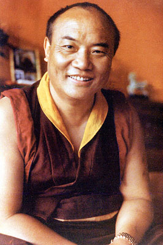
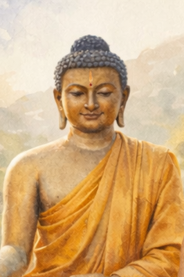

|                       [Днес](present.md)                        |                     [Вчера](past.md)                      |
|:-------------------------------------------------------------------:|:--------------------------------------------------------------:|
|          |           |
|  [16-ият Кармапа](https://www.youtube.com/watch?v=XokE6yKhH8g)    | [Сидхарта Гаутама](https://en.wikipedia.org/wiki/The_Buddha) |

Школата **Kagyu (Bka' brgyud)** често се нарича **"линия на практиката"** на тибетския будизъм, защото наблягана *директно преживяно реализиране* вместо схоластична разработка. Нейната медитационна система е кохерентна и йерархична: **всичко в крайна сметка сочи към разпознаване на природата на ума**.

---

## Основна ориентация на школата Kagyu

Пътят Kagyu отговаря на един въпрос:

> **Какъв е умът, директно, точно сега?**

Всички практики—предварителни, тантрични, йогически и безформени—са **умели средства**, за да се пристигне до това разпознаване и да се стабилизира то.

---

## 1. **Mahamudra**

### *(Централна Kagyu медитационна цел)*

**[Mahamudra ("Велик печат")](../04_kayas/mahamudra_and_dzogcsen/README.md#mahāmudrā-nature-of-mind-སེམས་ཀྱི་གནས་ལུགས་)** е *сърцето* на практиката Kagyu.

**[Медитационен](../08_lineage/README.md) предмет**

* **Самата природа на ума** ([празна](../10_concepts/01_emptiness/README.md#emptiness-śūnyatā-in-vajrayāna-buddhism), светла, осведомена)
* [Осведомеността](../10_concepts/README.md#2-awareness-rigpa-vijñāna-knowing), разпознаваща себе си **без измисляне**

**Ключови характеристики**

* Не базирана на визуализация на най-високото си ниво
* Директна, не-концептуална, преживяна
* Наблягана **обикновен ум** като път

**Етапи**

1. **Śamatha** – стабилизиране на вниманието
2. **Vipaśyanā** – изследване на природата на ума
3. **Не-медитация** – безусилна осведоменост

> "Мислите не са препятствия; те са украшения на осведомеността."

Mahamudra често се преподава **постепенно или внезапно**, в зависимост от ученика.

---

## 2. **Ngöndro (Предварителни практики)**

### *(Подготовка на ума за Mahamudra)*

Преди напреднала реализация Kagyu наблягана **психологическо и кармично пречистване**.

**Медитационни предмети**

* Его фиксация
* Кармични затъмнения
* Емоционална твърдост

**Основни елементи**

* Refuge & bodhicitta
* [Vajrasattva](../08_lineage/13_vajrasattva/README.md#vajrasattva-dorje-sempa) пречистване
* [Мандала](../09_symbols/07_mandala/README.md#mandala--explained-according-to-buddhist-teachings) принасяне (отказ от схващане)
* **Guru Yoga** (отдаденост като технология за отваряне на ума)

Ngöndro не е "начинаещо нещо"—то е **невро-етично препрограмиране**.

---

## 3. **Guru Yoga**

### *(Най-бързият път в Kagyu)*

Guru Yoga е *изключително централна* в Kagyu.

**Медитационен предмет**

* **Колапс на субект–обект двойственост чрез отдаденост**
* Отваряне на ума към **директна трансмисия (благословия)**

Общи подкрепи на линията:

* [**Milarepa**](../08_lineage/09_milarepa/README.md#a-buddhist-teaching-milarepa-and-the-law-of-irreversible-transformation)
* **[Marpa](../08_lineage/10_marpa/README.md#a-buddhist-teaching-marpa-the-translator--the-dharma-that-refuses-to-be-softened) преводачът**
* **Gampopa**

Отдадеността тук не е вяра—тя е **прецизен инструмент за разтваряне на егото**.

---

## 4. **Deity Yoga (Yidam практика)**

### *(Препрограмиране на възприятието)*

Общи Kagyu yidams:

* **Chakrasamvara**
* **Vajrayogini**

**Медитационни предмети**

* Фиксация на идентичност
* Обикновено възприятие
* Емоционални енергии (желание, страх, агресия)

Това работи чрез **въплътена визуализация** и [мантра](../09_symbols/10_mantra/README.md#what-a-mantra-is-buddhist-view), за да реализира:

> *Формата е празнота, проявяваща се.*

Deity yoga подкрепя Mahamudra—тя **не я замества**.

---

## 5. **Шест йоги на Наропа**

### *(Напреднали йоги на фазата на завършване)*

Тези йоги работят директно с **тънко тяло и съзнание**.

**Шестте**

1. Tummo (вътрешна топлина)
2. Илюзорно тяло
3. Йога на съня
4. Ясна светлина
5. Бардо йога
6. Phowa (съзнателна смърт)

**Медитационен предмет**

* **Най-тънките нива на осведомеността**
* Непрекъснатост на реализацията през будуване, сънуване и умиране

Тези практики **изискват силна Mahamudra основа**.

---

## 6. **Dzogchen (понякога практикувана)**

Някои Kagyu учители също преподават [**Dzogchen**](../04_kayas/mahamudra_and_dzogcsen/README.md#dzogchen-rigpa-རིག་པ་---direct-introduction), особено в **Shangpa Kagyu** и Rimé (не-сектантски) контекст.

Цел:

* Изначална осведоменост (*[rigpa*)](../10_concepts/README.md#2-awareness-rigpa-vijñāna-knowing)
* Дори по-незабавна от Mahamudra, но философски паралелна

---

## 🧭 Резюме в един ред

> **Медитацията Kagyu целителства разпознаването на природата на ума, използвайки отдаденост, въплъщение и йогическа прецизност като ускорители.**

Всичко се сближава към **Mahamudra**.

---

## 🔍 Практическо прозрение

Ако се преведе в език на съвременните системи:

* **Ngöndro** → етично и емоционално почистване
* **Guru Yoga** → колапс на егото, базиран на доверие
* **Deity Yoga** → препрограмиране на идентичността
* **Шест йоги** → инженерство на нервната система и съзнанието
* **Mahamudra** → стабилизация на недвойствена осведоменост

Ниска цена, високо въздействие стартова точка днес:

* Ежедневно **shamatha → Mahamudra-стил открита осведоменост**
* Проста **Milarepa Guru Yoga**
* Леки Ngöndro елементи (refuge + bodhicitta)

---

< [Междинни състояния (*Bardo*) и прераждане](../06_intermediate_states_and_reincarnation/README.md) | [Медитация на бяла Тара](../08_lineage/01_white_tara/README.md) >

_източник: [github.com/symbolic-labs-pub](https://github.com/symbolic-labs-pub)_

---
