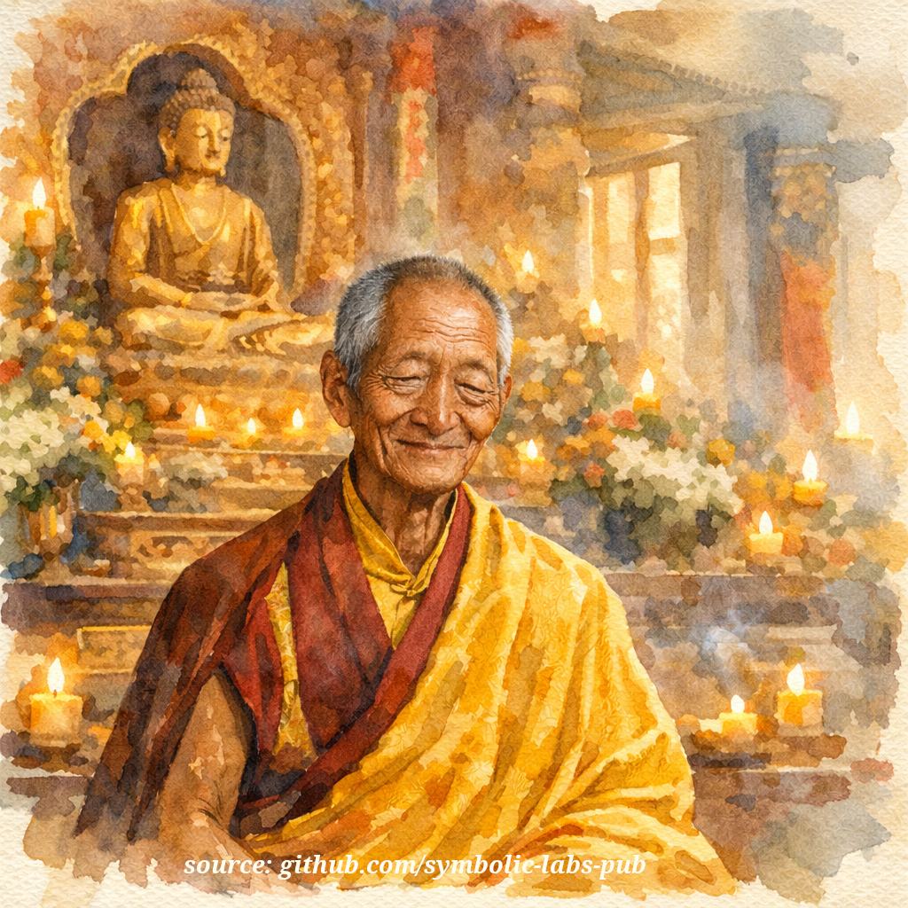

## [Празнота (Śūnyatā) в будизма Ваджраяна](https://github.com/symbolic-labs-pub/a-buddhist-view/blob/master/more/10_concepts/01_emptiness/README.md#emptiness-śūnyatā-in-vajrayāna-buddhism)

_Този раздел е вдъхновен от [Кябдже Калу Ринпоче](https://treasuryoflives.org/biographies/view/kalu-rinpoche/12180), фантастичен учител на учения за празнотата._

Учение

## Учение на Ваджраяна за празнотата

**Празнотата като свобода на явлението**

---

### 1. Основното учение

Буда не учеше празнотата, за да отрече света,
а да **освободи ума от фиксация**.

Всички явления се появяват.
Всички явления функционират.
И все пак никое не притежава независимо ядро.

Това е празнотата.

Както се учи в линията Мадхямака, свързана с **Нагарджуна**:

> *Каквото и да възниква зависимо, е празно.
> Каквото и да е празно, може да се появи.*

Така празнотата не е отсъствие — тя е **възможност**.

---

### 2. Гледна точка на Ваджраяна: празнотата е неотделима от яснотата

Във Ваджраяна празнотата никога не се учи самостоятелно.

Тя винаги е обединена с **яснота**, [**знание**](../README.md#2-awareness-rigpa-vijñāna-knowing) и **отзивчивост**.

* Празнота без яснота става нихилизъм
* Яснота без празнота става фиксация

Тяхната неотделимост е самият пробуден ум.

Символично:

* **Камбана** → празнота ([мъдрост](../../01_core_teachings/the_noble_eightfold_path/README.md#1-wisdom-paññā))
* **Ваджра** → явление, метод, състрадание

Държани заедно, те изразяват **недуална реализация**.

---

### 3. Как се познава празнотата

Празнотата не се разбира чрез вяра или философия.
Тя се **разпознава директно**.

Когато мисъл се появи и бъде изследвана:

* Не се намира произход
* Не се намира местоположение
* Не се намира субстанция

И все пак мисълта се появи ясно.

Това разпознаване е вратата, учена в **Махамудра** и **Дзогчен**:

> *Умът е празен в същност, ясен по природа и необструктиран в изразяването.*

Виждането на това веднъж разхлабва фиксацията.
Виждането му многократно я разтваря.

---

### 4. Празнота и страдание

Страданието не възниква, защото явленията се появяват.
Страданието възниква, защото явленията се **хващат като плътни**.

* Мислите се вярват
* Емоциите се овеществяват
* Идентичността се защитава

Когато празнотата се разпознае:

* Мислите се самоосвобождават
* Емоциите се освобождават като енергия
* Идентичността губи твърдостта си

Така Ваджраяна заявява:

> *Омърсяванията са мъдрост, когато празната им природа е позната.*

Това не е потворство.
То е **прецизност**.

---

### 5. Празнота, приложена към идентичността

Най-дълбоката фиксация е усещането за "аз".

Когато това усещане се изследва:

* Не може да се локализира в тялото
* Не може да се локализира в мисълта
* Не може да се локализира в самото съзнание

Това, което остава, е **знание без притежател**.

Това не е унищожение на себе си —
то е свобода от фалшив център.

---

### 6. Празнота в действие: състрадание

Тъй като нищо не е фиксирано:

* Промяната е възможна
* Отзивчивостта е естествена
* [Състраданието](../../02_from_ignorance_to_awakening/7_compassion/README.md#compassion-as-a-structural-principle-in-buddhist-teaching) възниква без усилие

Празнотата не отстранява [етиката](../../01_core_teachings/the_noble_eightfold_path/README.md#2-ethical-conduct-śīla).
Тя ги **основава**.

Виждайки, че същества страдат поради объркване,
практикуващият действа — не от дълг, а от яснота.

Така поведението на Ваджраяна се описва като:

> *Спонтанно състрадание, произтичащо от не-фиксация.*

---

### 7. Финалният печат

Празнотата не е състояние, което да се поддържа.
Тя не е преживяване, което да се повтаря.

Тя е **истинският начин на това, как нещата вече са**.

Когато се разпознае:

* Нищо не е нужно да бъде отхвърлено
* Нищо не е нужно да бъде подобрено
* Нищо не е нужно да бъде защитено

Явлението продължава.
Животът продължава.
Но хващането не.

Това е освобождение **вътре в** света.

---

### Заключително учение

> **Празнотата не е отсъствието на реалност.**
> **Тя е отсъствието на хващане на реалността.**
>
> Когато хващането се разтвори,
> мъдростта е ясна,
> състраданието е естествено,
> и умът е свободен.

---

Обяснение

### 1. Какво "празнота" всъщност означава (и какво *не*)

**Празнотата НЕ означава:**

* Нищо не съществува
* Реалността е празна или нихилистична
* Преживяването е безсмислено

**Празнотата ОЗНАЧАВА:**

* Нищо не съществува **от своя страна**
* Всичко възниква **зависимо** (причини, условия, възприятие)
* Явленията са **нефиксирани, текливи и неуловими**

Класическа формулировка на Мадхямака (свързана с **Нагарджуна**) е:

> "Тъй като нещата възникват зависимо, те са празни.
> Тъй като те са празни, те могат да възникнат."

Този парадокс е **двигателят на освобождението**.

---

### 2. Надграждането на Ваджраяна: празнота + светлост

Ваджраяна никога не учи празнотата самостоятелно.

Тя учи:

> **Празнота, неотделима от яснота (светлост).**

Това единство се нарича:

* **Мъдрост (празнота)**
* **Метод / Състрадание (явление, енергия, отзивчивост)**

Символично:

* **Камбана (гханта)** = празнота
* **Ваджра (дорже)** = метод / състрадание
  Заедно = пробуден ум

Ето защо ритуалите на Ваджраяна изглеждат *пълни*, не минимални.
Формите се използват **защото** са празни.

---

### 3. Празнота като преживяно преживяване (Махамудра и Дзогчен)

В системите на Ваджраяна като [**Махамудра**](../../04_kayas/mahamudra_and_dzogcsen/README.md#mahāmudrā-nature-of-mind-སེམས་ཀྱི་གནས་ལུགས་) и [**Дзогчен**](../../04_kayas/mahamudra_and_dzogcsen/README.md#dzogchen-rigpa-རིག་པ་---direct-introduction), празнотата се разпознава **директно в самото съзнание**.

Когато гледате мисъл:

* Откъде идва?
* Къде остава?
* Накъде отива?

Намирате:

* Без плътен произход
* Без местоположение
* Без субстанция

И все пак... мисълта **се появява ясно**.

Това разпознаване *е* празнота.

Не концептуално.
Не потиснато.
Не анализирано.

**Видяно.**

---

### 4. Защо празнотата освобождава страданието

Страданието продължава, защото третираме:

* Мислите като плътни
* Емоциите като постоянни
* Идентичността като фиксирана
* Преживяването като "мое" и "мое"

Празнотата разкрива:

* Емоциите се самоосвобождават, когато не се хващат
* Идентичността е процес, не нещо
* Преживяването тече без притежание

В термините на Ваджраяна:

> **Омърсяванията се освобождават сами в момента на разпознаването.**

Ето защо Ваджраяна може да използва:

* Желание
* Гняв
* Страх
* Интензивност

Не чрез потворство им — а чрез **виждане на тяхната празна природа директно**.

---

### 5. Празнота и йога на божествата (радикалният ход)

Уникално приложение на Ваджраяна:

Вие **визуализирате себе си като божество**
→ след това **разтваряте божеството в празнота**
→ след това **почивате в съзнание**
→ след това **се появявате отново състрадателно**

Това обучава:

* Без фиксация към *обикновеното себе си*
* Без фиксация към *свещена форма*
* Пълна свобода на явлението

Формата възниква **от празнота**, връща се **в празнота**, но **функционира състрадателно**.

Това не е въображение — това е **онтологично преобучение**.

---

### 6. Ключовото прозрение на Ваджраяна (компресирано)

> **Празнотата не е отсъствието на реалност.**
> **Тя е отсъствието на фиксация.**

Когато фиксацията се срине:

* Състраданието става естествено
* Страхът губи почва
* Умът става използваем

Ето защо Ваджраяна казва:

> *"Гледната точка е празнота, медитацията е яснота, поведението е състрадание."*

---

### 7. Често срещани грешки, които да избягвате

* ❌ Третиране на празнотата като идея, в която да вярвате
* ❌ Използване на празнотата за заобикаляне на етика или отговорност
* ❌ Откъсване от света

Истинската празнота на Ваджраяна произвежда:

* **Повече прецизност**, не неяснота
* **Повече ангажираност**, не оттегляне
* **Повече отговорност**, не по-малко

---

### Финален синтез

Във Ваджраяна будизъм, **празнотата е свобода на ума**:

* Нищо, за което да се хваща
* Нищо, което да се отхвърля
* Нищо, което да се защитава

И все пак всичко се появява.

> **Празно. Ясно. Отзивчиво.**

---

---

< [Символи](../../09_symbols/README.md) | [Концепции](../README.md) >

_източник: [github.com/symbolic-labs-pub](https://github.com/symbolic-labs-pub)_

---
