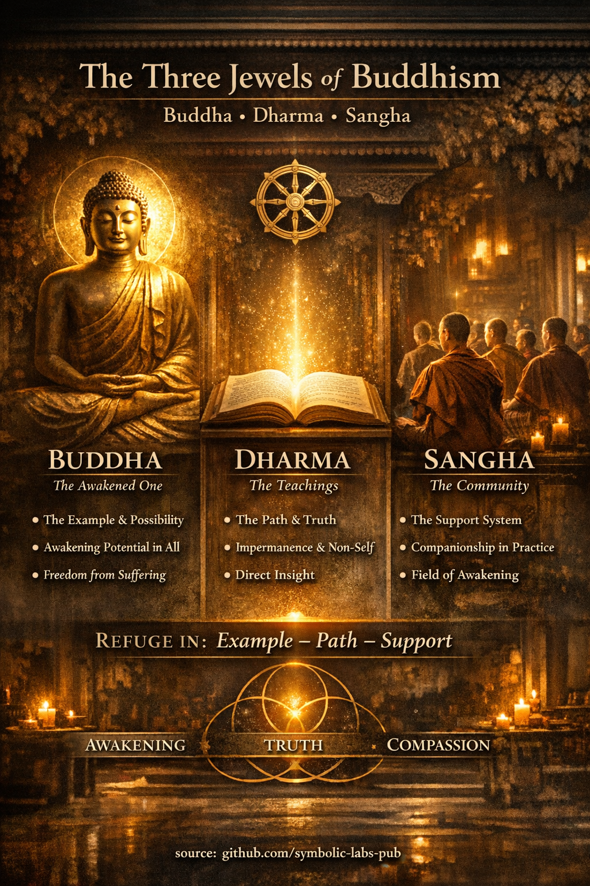

## [Tri dragulja (Trojni dragulj) — *Ti-ratana*](https://github.com/symbolic-labs-pub/a-buddhist-view/blob/master/more/01_core_teachings/the_three_jewels/README.md#the-three-jewels-triple-gem--ti-ratana)

U klasičnom budističkom učenju, **primanje utočišta** u Tri dragulja nije obećanje vjerovanja već **praktična orijentacija života**—posvećenost buđenju prema stvarnosti kakve ona jeste, i životu u skladu sa tim. Utočište znači *"ono što štiti od [patnje](../../02_from_ignorance_to_awakening/2_the_four_noble_truths/README.md#1-postoji-patnja--dukkha)"* (Pāli: *saraṇa*).

---

## 1) **Buda** — Probuđeni, i samo buđenje

Historijski, Buda se odnosi na **Siddhārtha Gautama**, koji je ostvario oslobođenje kroz direktan uvid u prirodu uma i stvarnosti.

Doktrinarno, **Buda** ima tri neodvojiva značenja:

1. **Historijski Buda** — dokaz da je [buđenje](../../10_concepts/README.md#3-enlightenment-bodhi-awakening) ljudski moguće.
2. **Budstvo** — *stanje buđenja*: potpuna sloboda od neznanja (*avijjā*), žudnje (*taṇhā*) i patnje (*dukkha*).
3. [**Priroda Bude**](../../02_from_ignorance_to_awakening/6_buddha_nature/README.md#priroda-bude-tathāgatagarbha--objašnjeno-kroz-budistička-učenja) (naglašeno u [Mahāyāna](../../05_yanas/README.md#limitation-from-mahāyāna-view)) — *kapacitet za buđenje urođen u svim bićima*.

> Primanje utočišta u Budi znači povjerenje u **buđenje nad navikom**, [mudrost](../the_noble_eightfold_path/README.md#1-mudrost-paññā) nad impulsom.

---

## 2) **Dharma** — put i zakon stvarnosti

**Dharma (Dhamma)** djeluje na dva nivoa istovremeno:

### a) **Učenja**

* [Četiri plemenite istine](../../02_from_ignorance_to_awakening/2_the_four_noble_truths/README.md#četiri-plemenite-istine--kako-ih-je-buda-mislio)
* [Plemeniti osmostruki put](../the_noble_eightfold_path/README.md#šta-je-plemeniti-osmostruki-put-u-budizmu)
* [Zavisno nastajanje (*paṭicca-samuppāda*)](../../02_from_ignorance_to_awakening/3_dependent_origination/README.md#dvanaest-karika-klasična-formulacija)
* [Nepostojanost (*anicca*)](../impermanence/README.md#2-nepostojanost-anicca-je-strukturna-a-ne-slučajna), [ne-ja (*anattā*)](../../02_from_ignorance_to_awakening/1_the_three_marks_of_existence/README.md#3-ne-ja-anattā), nezadovoljavajućnost (*dukkha*)

Ovo su **dijagnostički i terapeutski**, a ne metafizičke doktrine.

### b) **Sama stvarnost**

Dharma također znači *"kako stvari zaista jesu"*:

* fenomeni nastaju usled uzroka i uslova,
* ništa trajno ili nezavisno se ne može pronaći,
* vezivanje neizbježno proizvodi patnju.

Ključno, Buda je učio:

> **Dharma treba da se ostvari, a ne vjeruje u nju.**

Učenja se porede sa **splavom**—suštinskim za prelazak rijeke, ali se ne nose kada se prelazak završi.

---

## 3) **Sangha** — živi kontinuitet buđenja

Tradicionalno, **Sangha** znači zajednicu rukopoloženih monaha i monahinja koji čuvaju učenja i disciplinu (*Vinaya*).

U širem i dubljem smislu:

1. **Praktična Sangha** — svi iskreni praktičari koji jedni druge podržavaju u etičkom životu, [meditaciji](../../08_lineage/README.md) i mudrosti.
2. **Plemenita Sangha** — oni koji su direktno ostvarili faze buđenja (ulaz u tok i dalje).
3. **Relaciona Sangha** — *polje probuđenog odnosa* u kojem se uvid održava kroz dijalog, primjer, korekciju i [saosećanje](../../02_from_ignorance_to_awakening/7_compassion/README.md#saosećanje-kao-strukturni-princip-u-budističkom-učenju).

Buda je uporno naglašavao da **izolacija slabi praksu**, dok mudro prijateljstvo (*kalyāṇa-mittatā*) ubrzava oslobođenje.

---

## Funkcionalno jedinstvo Tri dragulja

[Tri dragulja](#tri-dragulja-trojni-dragulj---ti-ratana) nisu odvojeni objekti već **jedan integrisan sistem**:

| Dragulj      | Funkcija u praksi                 |
| ---------- | ------------------------------------ |
| **Buda** | **Mogućnost** i živi dokaz |
| [**Dharma**](#2-dharma--put-i-zakon-stvarnosti) | **Metod** i istina             |
| **Sangha** | **Potporni uslovi**        |

Uklonite jedan, i praksa se urušava:

* Bez Bude → nema povjerenja u buđenje.
* Bez Dharme → nema pravca.
* Bez Sanghe → nema stabilnosti ili korekcije.

---

## Utočište kao kontinuirana praksa

U ranim tekstovima, utočište se prima **tri puta**, simbolizujući:

* tijelo, govor i um,
* prošlost, sadašnjost i budućnost,
* razumijevanje, praksu i ostvarenje.

Ali utočište nije jednokratni događaj. Ono se produbljuje dok:

* povjerenje postaje uvid,
* [etika](../the_noble_eightfold_path/README.md#2-etičko-ponašanje-śīla) postaje spontana,
* napor postaje prirodan.

> Konačno, primanje utočišta u Tri dragulja znači **postati oni**:
> buđenje kao Buda, jasnoća kao Dharma, i saosećanje kao Sangha.

---

< [Šta je Plemeniti osmostruki put (u budizmu)](../the_noble_eightfold_path/README.md) | [Tri obilježja egzistencije — Budističko objašnjenje](../../02_from_ignorance_to_awakening/1_the_three_marks_of_existence/README.md) >

_izvor: [github.com/symbolic-labs-pub](https://github.com/symbolic-labs-pub)_

---
