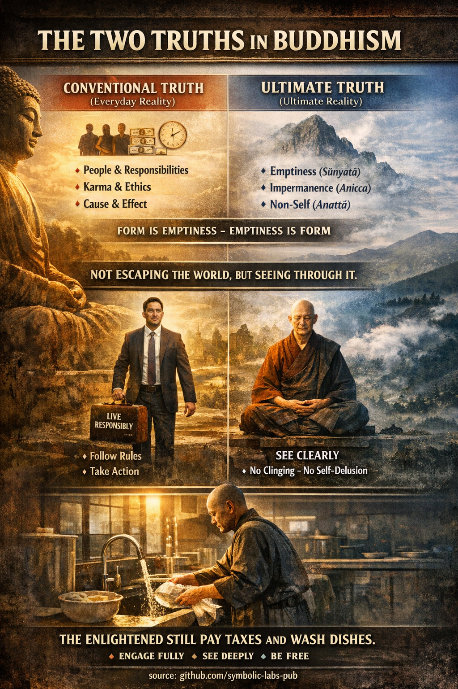

## [Dvije istine u budističkom učenju](https://github.com/symbolic-labs-pub/a-buddhist-view/blob/master/more/02_from_ignorance_to_awakening/5_the_two_truths/README.md#the-two-truths-in-buddhist-teaching)

*(Saṃvṛti-satya & Paramārtha-satya)*

Učenje o **Dvije istine** je **precizan alat** u budizmu. Sprečava dvije uobičajene greške:

* **Reifikovanje svijeta** (shvatanje pojava kao konačno realnih)
* **Negiranje svijeta** (padanje u nihilizam)

Umjesto toga, pokazuje **kako stvarnost funkcioniše na dva neodvojiva nivoa odjednom**.

---

## 1. Konvencionalna istina (Saṃvṛti-satya)

Ovo je **funkcionalni, svakodnevni nivo stvarnosti**.

Na ovom nivou:

* Postoje **osobe, imena, uloge**
* Akcije imaju **posljedice** (karma)
* [Etika](../../01_core_teachings/the_noble_eightfold_path/README.md#2-etičko-ponašanje-śīla), jezik, zakoni, vrijeme i kauzalnost **djeluju pouzdano**

Primjeri:

* "Ovo je šolja."
* "Odgovorni ste za svoje akcije."
* "Ako govorim oštro, [patnja](../2_the_four_noble_truths/README.md#1-postoji-patnja--dukkha) slijedi."

Budizam **nikada ne negira ovaj nivo**.
Bez konvencionalne istine:

* Učenje nije moguće
* Put se ne može praktikovati
* [Saosećanje](../7_compassion/README.md#saosećanje-kao-strukturni-princip-u-budističkom-učenju) se ne može izraziti

Buda je učio **na konvencionalnom jeziku**, živio u društvu, slijedio pravila, primao hranu, učio učenike.

➡️ **Konvencija nije lažna** — ona je *kontekstualna*.

---

## 2. Krajnja istina (Paramārtha-satya)

Krajnja istina ukazuje na **kako stvari zaista postoje kada se duboko ispituju**.

Na ovom nivou:

* Svi fenomeni su **prazni od urođene suštine** (śūnyatā)
* Sve je **nepostojano** ([anicca](../../01_core_teachings/impermanence/README.md#2-nepostojanost-anicca-je-strukturna-a-ne-slučajna))
* Nema **nezavisnog ja** ([anattā](../1_the_three_marks_of_existence/README.md#3-ne-ja-anattā))

"Šolja":

* Nije jedna stvar, već glina + toplota + vrijeme + percepcija + imenovanje
* Ne može se pronaći kao čvrst, nezavisan entitet

"Ja":

* Je dinamički proces (tijelo, osjećanje, percepcija, formacije, svijest)
* Ne fiksna srž ili vlasnik

➡️ Krajnja istina **ne zamjenjuje** konvencionalnu istinu
➡️ Ona **otkriva njen nedostatak čvrstine**

---

## 3. Zašto su Dvije istine neophodne (a ne opcione)

Ako držite **samo konvencionalnu istinu**:

* Vezujete se
* Čvrsto utvrđujete identitete
* Patite kada se stvari mijenjaju

Ako držite **samo krajnju istinu**:

* Rizikujete nihilizam
* Možete odbaciti etiku, brigu, odgovornost

Budin uvid je **nedualan**:

> Konvencionalna istina je kako stvari **rade**
> Krajnja istina je kako stvari **jesu**

One **nisu dvije stvarnosti**, već **dva načina viđenja iste stvarnosti**.

---

## 4. "Oblik je praznina; praznina je oblik"

Ova čuvena linija iz Heart Sūtra **su Dvije istine u jednoj rečenici**.

* **Oblik je [praznina](../../10_concepts/01_emptiness/README.md#emptiness-śūnyatā-in-vajrayāna-buddhism)** → sve nema urođenu suštinu
* **Praznina je oblik** → praznina se pojavljuje *kao* svakodnevni fenomeni

Ništa ne nestaje.
Ništa ne postaje besmisleno.
Iluzija se rastvara, **funkcija ostaje**.

---

## 5. Buđenje prema budizmu

[Buđenje](../../10_concepts/README.md#3-enlightenment-bodhi-awakening) **nije bjekstvo od svijeta**.

Probuđena osoba:

* Još uvijek koristi imena i koncepte
* Još uvijek slijedi etičko ponašanje
* Još uvijek iskusuje senzacije i emocije

Ali:

* Bez vezivanja
* Bez samoizmicanja
* Bez mješanja konvencije sa konačnom stvarnošću

Stoga tradicionalna fraza:

> "Prije buđenja: sjeci drva, nosi vodu.
> Poslije buđenja: sjeci drva, nosi vodu."

Ili u modernim terminima:

> **Prosvijetljeni još uvijek plaćaju poreze i peru posuđe.**

Razlika je **unutrašnja**:

* Nema iluzije trajnosti
* Nema vjerovanja u čvrsto ja
* Nema hvatanja pojava

---

## 6. Praktična implikacija

Dvije istine vas uče da:

* **Djelujete potpuno** u svijetu
* **Vidite jasno** kroz njega u isto vrijeme

Ovo proizvodi:

* Odgovornost bez tereta
* Saosećanje bez vezanosti
* Slobodu **unutar** oblika, a ne izvan njega

---

### Ukratko

* Konvencionalna istina održava svijet **radnim**
* Krajnja istina održava um **slobodnim**
* Buđenje je **integracija oboje**

Ne transcendencija života —
već **jasnoća unutar života kakav jeste**.

---

< [Praznina (Śūnyatā) u Mahāyāna budizmu](../4_emptiness/README.md) | [**Priroda Bude (Tathāgatagarbha)** — objašnjeno kroz budistička učenja](../6_buddha_nature/README.md) >

_izvor: [github.com/symbolic-labs-pub](https://github.com/symbolic-labs-pub)_

---
