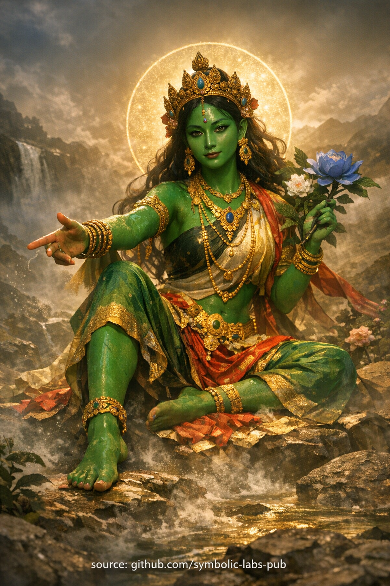

## [**Učenje Kagyu tradicije o Zelenoj Tari: Saosječanje koje ne Okleva**](https://github.com/symbolic-labs-pub/a-buddhist-view/blob/master/more/08_lineage/02_green_tara/README.md#a-kagyü-teaching-on-green-tārā-compassion-that-does-not-hesitate)

Učenje

## **Učenje Kagyu tradicije o Zelenoj Tari:

Saosječanje koje ne Okleva**

### 1. **Problem koji se Razmatra**

Većina patnje ne nastaje zbog toga što bića nemaju saosječanje.
Ona nastaje zato što se **jasnoća odlaže**.

Strah prekida prirodni tok mudrosti:

* um pauzira
* sumnja proliferiše
* mogućnost za vješto djelovanje kolabira

Tako da šteta često dolazi **ne iz zloće**, već iz **oklevanja**.

Zelena Tara se bavi ovom preciznom tačkom neuspjeha.

---

### 2. **Ko je Zelena Tara**

**Zelena Tara** nije odvojena boginja koja interveniše spolja.

Ona je **aspekt aktivnosti prosvjetljenog uma**.

U Kagyu razumijevanju:

* **Mudrost** jasno vidi
* **Saosječanje** duboko brine
* **Aktivnost** trenutno odgovara

Zelena Tara *jeste* prosvjetljena aktivnost.

Njena ispružena noga simbolizira ovu istinu:

> Buđenje nije statična realizacija —
> to je **spremnost da se uključimo u uslove dok se pojavljuju**.

---

### 3. **Gledište: Strah je Signal, ne Neprijatelj**

Iz ultimativnog gledišta:

* Strah je prazan
* Prepreke zavisno nastaju
* Nema fiksnog ja koje je ugroženo

Iz relativnog gledišta:

* Strah se pojavljuje
* Uslovi zahtijevaju odgovor
* Odlaganje ima posljedice

Zelena Tara objedinjuje dvije istine:

> **Strah ne blokira buđenje.
> Oklevanje blokira.**

Tako strah postaje **poziv na jasnoću**, ne razlog za povlačenje.

---

### 4. **Meditacija: Treniranje Dostupnosti**

Praksa Zelene Tare ne cilja na blaženstvo ili apsorpciju.

Ona trenira:

* trenutnost
* odzivnost
* etički refleks

Mantra ne umiruje um u tišinu.
Ona **mobilizuje svjesnost**.

Vremenom, praktičar uči:

> Trenutak kada jasno vidim
> je trenutak kada moram da se pokrenem.

Ovo je meditacija koja postaje **funkcija**.

---

### 5. **Ponašanje: Saosječanje kao Blagovremeno Djelovanje**

U ovom učenju, saosječanje se ne mjeri samo po namjeri.

Saosječanje se procjenjuje po:

* vremenskom rasporedu
* primjerenosti
* hrabrosti

Odložena ljubaznost može propasti.
Oklevajuća istina može naštetiti.

Zelena Tara uči:

> **Pravo djelovanje se dešava brzinom jasnoće.**

Zato se njena praksa naglašava:

* u opasnosti
* u tranziciji
* u moralnoj neizvjesnosti

---

### 6. **Ispravljanje Uobičajenog Nerazumijevanja**

Zelena Tara **ne** potiče impulzivnost.

Njena aktivnost proizlazi iz:

* stabilnosti (jedna noga uzemljena)
* jasnoće (otvorena svjesnost)
* brige (korist bića)

Tako:

> **Trenutno ne znači reaktivno.
> Trenutno znači neometano.**

---

### 7. **Plod: Znak Prakse**

Kada praksa Zelene Tare sazri:

* strah se i dalje pojavljuje
* ali ne paralizuje
* saosječanje se izražava prirodno

Praktičar postaje neko ko:

* djeluje bez drame
* odgovara bez odlaganja
* pomaže bez samorefleksije

Ovo je prosvjetljena aktivnost u običnom životu.

---

## **Završna Instrukcija**

Ne čekajte da strah nestane prije nego što djelujete.
Ne čekajte sigurnost prije nego što odgovorite.

> **Jasnoća dolazi prva.
> Saosječanje se kreće drugo.
> Oklevanje je napušteno.**

Ovo je živo učenje Zelene Tare.

---

Objašnjenje

### 1. **Problem koji se Razmatra**

Većina patnje ne nastaje zbog toga što bića nemaju saosječanje.
Ona nastaje zato što se **jasnoća odlaže**.

Strah prekida prirodni tok mudrosti:

* um pauzira
* sumnja proliferiše
* mogućnost za vješto djelovanje kolabira

Tako da šteta često dolazi **ne iz zloće**, već iz **oklevanja**.

Zelena Tara se bavi ovom preciznom tačkom neuspjeha.

---

### 2. **Ko je Zelena Tara**

**Zelena Tara** nije odvojena boginja koja interveniše spolja.

Ona je **aspekt aktivnosti prosvjetljenog uma**.

U Kagyu razumijevanju:

* **Mudrost** jasno vidi
* **Saosječanje** duboko brine
* **Aktivnost** trenutno odgovara

Zelena Tara *jeste* prosvjetljena aktivnost.

Njena ispružena noga simbolizira ovu istinu:

> Buđenje nije statična realizacija —
> to je **spremnost da se uključimo u uslove dok se pojavljuju**.

---

### 3. **Gledište: Strah je Signal, ne Neprijatelj**

Iz ultimativnog gledišta:

* Strah je prazan
* Prepreke zavisno nastaju
* Nema fiksnog ja koje je ugroženo

Iz relativnog gledišta:

* Strah se pojavljuje
* Uslovi zahtijevaju odgovor
* Odlaganje ima posljedice

Zelena Tara objedinjuje dvije istine:

> **Strah ne blokira buđenje.
> Oklevanje blokira.**

Tako strah postaje **poziv na jasnoću**, ne razlog za povlačenje.

---

### 4. **Meditacija: Treniranje Dostupnosti**

Praksa Zelene Tare ne cilja na blaženstvo ili apsorpciju.

Ona trenira:

* trenutnost
* odzivnost
* etički refleks

Mantra ne umiruje um u tišinu.
Ona **mobilizuje svjesnost**.

Vremenom, praktičar uči:

> Trenutak kada jasno vidim
> je trenutak kada moram da se pokrenem.

Ovo je meditacija koja postaje **funkcija**.

---

### 5. **Ponašanje: Saosječanje kao Blagovremeno Djelovanje**

U ovom učenju, saosječanje se ne mjeri samo po namjeri.

Saosječanje se procjenjuje po:

* vremenskom rasporedu
* primjerenosti
* hrabrosti

Odložena ljubaznost može propasti.
Oklevajuća istina može naštetiti.

Zelena Tara uči:

> **Pravo djelovanje se dešava brzinom jasnoće.**

Zato se njena praksa naglašava:

* u opasnosti
* u tranziciji
* u moralnoj neizvjesnosti

---

### 6. **Ispravljanje Uobičajenog Nerazumijevanja**

Zelena Tara **ne** potiče impulzivnost.

Njena aktivnost proizlazi iz:

* stabilnosti (jedna noga uzemljena)
* jasnoće (otvorena svjesnost)
* brige (korist bića)

Tako:

> **Trenutno ne znači reaktivno.
> Trenutno znači neometano.**

---

### 7. **Plod: Znak Prakse**

Kada praksa Zelene Tare sazri:

* strah se i dalje pojavljuje
* ali ne paralizuje
* saosječanje se izražava prirodno

Praktičar postaje neko ko:

* djeluje bez drame
* odgovara bez odlaganja
* pomaže bez samorefleksije

Ovo je prosvjetljena aktivnost u običnom životu.

---

## **Završna Instrukcija**

Ne čekajte da strah nestane prije nego što djelujete.
Ne čekajte sigurnost prije nego što odgovorite.

> **Jasnoća dolazi prva.
> Saosječanje se kreće drugo.
> Oklevanje je napušteno.**

Ovo je živo učenje Zelene Tare.

---

## **Zelena Tara: Meditacija Trenutnog Saosječajnog Djelovanja**

*(Treniranje neustrašivosti, jasnoće i spremnosti za djelovanje)*

> ⚠️ **Napomena o opsegu**
> Ono što slijedi je **neobilježavajuća kontemplativna forma** (*praksa značenja*).
> Ona **ne** zamjenjuje prenošenje linije (*wang, lung, tri*).
> Njena funkcija je **stabilizacija, aspiracija i kauzalno usklađivanje**, ne tantrička autorizacija.

---

### 1. **Priprema – Smirivanje Polja**

Sjedite udobno, kičma uspravna ali opuštena.
Ruke prirodno odmaraju.

Uzmite **tri spore udahe**.

Sa svakim izdahom, oslobodite:

* oklevanje
* anksioznost
* mentalnu buku

Tiho priznajte:

> *"Ovaj trenutak je radan."*

Neka pažnja se smjesti u **srčanom centru**—ne emocionalno, već kao **stabilan centar percepcije**.

---

### 2. **Vizualizacija – Prisustvo Zelene Tare**

Vizualizirajte **Zelenu Taru** koja se pojavljuje **ispred vas**, živahna i živa.

Ključne karakteristike (ne naprezite se—jasnoća iznad detalja):

* Smaragdno-zeleno tijelo, svjetlucavo i živo
* Desna noga ispružena naprijed — **spremnost za djelovanje**
* Lijeva noga savijena — **uzemljena stabilnost**
* Desna ruka ispružena u **gestui neustrašivog davanja**
* Lijeva ruka drži **plavi utpala lotos**, simbol prosvjetljenog djelovanja u svijetu
* Izraz: **budan, ljubazan, nepokolebljiv**

Ona nije udaljena.
Ona je **odzivna**.

Osjetite da je njena pažnja već **sa vama**.

---

### 3. **Prizivanje – Trenutni Odgovor**

Nježno ponavljajte (glasno ili tiho):

> **OM TĀRE TUTTĀRE TURE SOHA**

Neka ritam bude **prirodan**, ne forsiran.

Sa svakim ponavljanjem, osjetite:

* Strah se oslobađa
* Um se oštri
* Energija se mobilizuje

Ova mantra nije za utjehu—ona je za **kretanje bez panike**.

---

### 4. **Otjelovljenje – Od Vizije do Funkcije**

Sada pomjerite vizualizaciju:

Zelena Tara **se rastvara u svjetlost**
Ta svjetlost teče **u vaše srce**

Vaše tijelo postaje:

* stabilno kao njen sjedeći položaj
* odzivno kao njena ispružena noga

Odmorite se u ovom osjećaju:

> **Jasnoća bez odlaganja**
> **Saosječanje bez oklevanja**

Ako se misli pojave, neka dođu i odu—**nemojte pratiti**.

Trenirate **dostupnost**, ne analizu.

---

### 5. **Kontemplacija – Osnovna Instrukcija**

Nježno razmislite (jedan red po red, sa pauzama):

* *"Strah ne zahtijeva eliminaciju—samo jasnoću."*
* *"Djelovanje usklađeno sa saosječanjem nikada nije prerano."*
* *"Tišina i kretanje nisu suprotnosti."*

Neka razumijevanje nastane **somatski**, ne intelektualno.

---

### 6. **Primjena – Integracija Svakodnevnog Života**

Prije završetka, postavite jednostavnu namjeru:

> *"Kada se strah pojavi danas, odgovorićи—ne zamrznuti."*

Ova praksa je posebno efikasna:

* prije teških razgovora
* tokom neizvjesnosti ili tranzicije
* kada hitnost iskušava reaktivnost

Jedno **ponavljanje mantre** u svakodnevnom životu je dovoljno da je reaktivirate.

---

### 7. **Posveta (Opciono, Kagyu stil)**

Tiho posvetite:

> *"Neka ova jasnoća koristi bićima
> kroz blagovremeno, vješto djelovanje."*

---

## Bilješke o Praksi (Važno)

* Ovo **nije smirujuća meditacija** — to je **funkcionalna**
* Napredak se pokazuje kao:

  * brži etički odgovor
  * manje razmišljanja
  * stabilnija hrabrost
* Kratke, česte sесије (5–10 minuta) su **bolje od dugih**

---

## Sažetak Suštine

Praksa Zelene Tare trenira ovu sposobnost:

> **Da se pokrenemo trenutno — bez agresije, bez odlaganja, bez straha.**

---

Meditacija

## **Zelena Tara: Meditacija Trenutnog Saosječajnog Djelovanja**

*(Treniranje neustrašivosti, jasnoće i spremnosti za djelovanje)*

> ⚠️ **Napomena o opsegu**
> Ono što slijedi je **neobilježavajuća kontemplativna forma** (*praksa značenja*).
> Ona **ne** zamjenjuje prenošenje linije (*wang, lung, tri*).
> Njena funkcija je **stabilizacija, aspiracija i kauzalno usklađivanje**, ne tantrička autorizacija.

---

### 1. **Priprema – Smirivanje Polja**

Sjedite udobno, kičma uspravna ali opuštena.
Ruke prirodno odmaraju.

Uzmite **tri spore udahe**.

Sa svakim izdahom, oslobodite:

* oklevanje
* anksioznost
* mentalnu buku

Tiho priznajte:

> *"Ovaj trenutak je radan."*

Neka pažnja se smjesti u **srčanom centru**—ne emocionalno, već kao **stabilan centar percepcije**.

---

### 2. **Vizualizacija – Prisustvo Zelene Tare**

Vizualizirajte **Zelenu Taru** koja se pojavljuje **ispred vas**, živahna i živa.

Ključne karakteristike (ne naprezite se—jasnoća iznad detalja):

* Smaragdno-zeleno tijelo, svjetlucavo i živo
* Desna noga ispružena naprijed — **spremnost za djelovanje**
* Lijeva noga savijena — **uzemljena stabilnost**
* Desna ruka ispružena u **gestui neustrašivog davanja**
* Lijeva ruka drži **plavi utpala lotos**, simbol prosvjetljenog djelovanja u svijetu
* Izraz: **budan, ljubazan, nepokolebljiv**

Ona nije udaljena.
Ona je **odzivna**.

Osjetite da je njena pažnja već **sa vama**.

---

### 3. **Prizivanje – Trenutni Odgovor**

Nježno ponavljajte (glasno ili tiho):

> **OM TĀRE TUTTĀRE TURE SOHA**

Neka ritam bude **prirodan**, ne forsiran.

Sa svakim ponavljanjem, osjetite:

* Strah se oslobađa
* Um se oštri
* Energija se mobilizuje

Ova mantra nije za utjehu—ona je za **kretanje bez panike**.

---

### 4. **Otjelovljenje – Od Vizije do Funkcije**

Sada pomjerite vizualizaciju:

Zelena Tara **se rastvara u svjetlost**
Ta svjetlost teče **u vaše srce**

Vaše tijelo postaje:

* stabilno kao njen sjedeći položaj
* odzivno kao njena ispružena noga

Odmorite se u ovom osjećaju:

> **Jasnoća bez odlaganja**
> **Saosječanje bez oklevanja**

Ako se misli pojave, neka dođu i odu—**nemojte pratiti**.

Trenirate **dostupnost**, ne analizu.

---

### 5. **Kontemplacija – Osnovna Instrukcija**

Nježno razmislite (jedan red po red, sa pauzama):

* *"Strah ne zahtijeva eliminaciju—samo jasnoću."*
* *"Djelovanje usklađeno sa saosječanjem nikada nije prerano."*
* *"Tišina i kretanje nisu suprotnosti."*

Neka razumijevanje nastane **somatski**, ne intelektualno.

---

### 6. **Primjena – Integracija Svakodnevnog Života**

Prije završetka, postavite jednostavnu namjeru:

> *"Kada se strah pojavi danas, odgovorićи—ne zamrznuti."*

Ova praksa je posebno efikasna:

* prije teških razgovora
* tokom neizvjesnosti ili tranzicije
* kada hitnost iskušava reaktivnost

Jedno **ponavljanje mantre** u svakodnevnom životu je dovoljno da je reaktivirate.

---

### 7. **Posveta (Opciono, Kagyu stil)**

Tiho posvetite:

> *"Neka ova jasnoća koristi bićima
> kroz blagovremeno, vješto djelovanje."*

---

## Bilješke o Praksi (Važno)

* Ovo **nije smirujuća meditacija** — to je **funkcionalna**
* Napredak se pokazuje kao:

  * brži etički odgovor
  * manje razmišljanja
  * stabilnija hrabrost
* Kratke, česte sesije (5–10 minuta) su **bolje od dugih**

---

## Sažetak Suštine

Praksa Zelene Tare trenira ovu sposobnost:

> **Da se pokrenemo trenutno — bez agresije, bez odlaganja, bez straha.**

---

< [Bijela Tārā Meditacija](../01_white_tara/README.md) | [Prizivanje Zaštitnika Mahākāla](../03_mahakala/README.md) >

_izvor: [github.com/symbolic-labs-pub](https://github.com/symbolic-labs-pub)_

---
