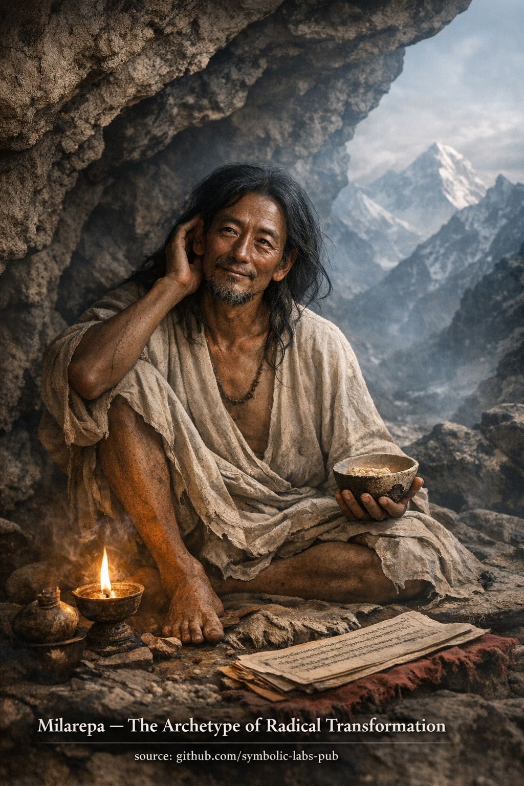

## [**Budističko učenje: Milarepa i Zakon neopozive transformacije**](https://github.com/symbolic-labs-pub/a-buddhist-view/blob/master/more/08_lineage/09_milarepa/README.md#a-buddhist-teaching-milarepa-and-the-law-of-irreversible-transformation)

Učenje

## **Budističko učenje: Milarepa i Zakon neopozive transformacije**

**Milarepa** stoji u budističkoj tradiciji ne kao svetački ideal, već kao **dokaz principa**.
Njegov život demonstrira osnovni zakon [Dharme](../../01_core_teachings/the_three_jewels/README.md#2-dharma--the-path-and-the-law-of-reality):

> **[Buđenje](../../10_concepts/README.md#3-enlightenment-bodhi-awakening) je određeno uslovima, a ne historijom.**

Ovo učenje ruši jednu od najupornijih prepreka na putu:
vjerovanje da prošla djela, karakter ili psihološki sklop *diskvalifikuju* ostvarenje.

---

## 1. Greška moralnog determinizma

Mnogi praktičari nesvjesno drže ovo viđenje:

> "Zato što sam učinio X, ne mogu postići Y."

Budizam to potpuno odbacuje.

Prema [**zavisnom nastajanju**](../../02_from_ignorance_to_awakening/3_dependent_origination/README.md#the-twelve-links-the-classic-formulation), sadašnji um nije proizvod fiksirane suštine, već **sadašnjih uzroka i uslova**.
Prošla karma uslovljava polje—ali **ne zaključava ishod**.

Mladi život Milarepe uključivao je tešku štetu.
Da je buđenje sistem moralnih nagrada, njegova priča bi bila nemoguća.

Njegovo ostvarenje dokazuje:

> Karma je **transformabilna**, a ne kumulativna sudbina.

---

## 2. Odricanje kao strukturalna jasnoća

Milarepa se nije odrekao društva iz mržnje ili straha.
Odrekao se **rasejivanja**.

Odricanje ovdje znači:

* Smanjenje ulaza
* Pojednostavljenje uslova
* Uklanjanje puteva za bijeg

Ovo otkriva ključno učenje:

> **Kada su uslovi dovoljno pojednostavljeni, istina postaje neizbježna.**

Moderni praktičari često traže uvid zadržavajući složenost.
Milarepa pokazuje suprotno:
**pojednostavite svijet dok se um više ne može sakriti.**

---

## 3. Predanost bez sentimentalnosti

Predanost Milarepe prema [Marpa](../10_marpa/README.md#a-buddhist-teaching-marpa-the-translator--the-dharma-that-refuses-to-be-softened) nije bila emocionalna zavisnost.
Bila je **potpuno usklađivanje sa putem**, čak i kada je bilo bolno.

Ovo ilustruje suptilnu budističku tačku:

> Predanost nije o voljenju učitelja.
> Već o predaji pregovaračke moći ega.

Kada je predanost istinska:

* Samooправдavanjе se urušava
* Otpor postaje vidljiv
* Praksa postaje neopciona

Zato predanost ubrzava ostvarenje—ne mistično, već **mehanički**.

---

## 4. Upornost kao motor oslobođenja

Praksa Milarepe bila je ekstremna, ali je princip univerzalan:

> **Oslobođenje se pojavljuje gdje upornost nadživi otpor.**

Većina [patnje](../../02_from_ignorance_to_awakening/2_the_four_noble_truths/README.md#1-there-is-suffering--dukkha) traje ne zato što je jaka,
već zato što se pažnja povlači prerano.

Milarepa je ostao.

Ostao je sa:

* Hladnoćom
* Glađu
* Strahom
* Mentalnim mučenjem
* Dosadom

I nešto kritično se dogodilo:

> Um je iscrpio svoje strategije.

Kada hvatanje neprestano propadne, **jasnoća ostaje**.

---

## 5. Doktrina neopozivosti

Centralna lekcija iz života Milarepe je ova:

> **Istinska transformacija je neopoziva.**

Ne zato što postajemo savršeni,
već zato što **zabluda gubi kredibilitet**.

Poslije istinskog uvida:

* Zbunjenost može nastati
* Emocije mogu fluktuirati
* Teškoće nastavljaju

Ali vjerovanje u čvrsto, fiksirano ja se ne vraća.

Zato Kagyu loza naglašava **direktno iskustvo nad konceptualnom čistoćom**.

---

## 6. Učenje u jednoj rečenici

Milarepa uči:

> **Ništa ne diskvalifikuje buđenje osim odbijanja da se praktikuje pod stvarnim uslovima.**

Ne nedostatak inteligencije
Ne emocionalne rane
Ne prošla djela

Samo izbjegavanje.

---

## Završna refleksija

Ovo učenje je zahtjevno—ali duboko ohrabrujuće.

Postavlja odgovornost tačno tamo gdje Budizam uvijek postavlja:
ne u identitetu, ne u zaslugama, ne u vjeri—

već u **kojim uslovima ste spremni da izdržite dovoljno dugo da se istina pojavi**.

---

Objašnjenje

**Milarepa** stoji u budističkoj tradiciji ne kao svetački ideal, već kao **dokaz principa**.
Njegov život demonstrira osnovni zakon Dharme:

> **Buđenje je određeno uslovima, a ne historijom.**

Ovo učenje ruši jednu od najupornijih prepreka na putu:
vjerovanje da prošla djela, karakter ili psihološki sklop *diskvalifikuju* ostvarenje.

---

## 1. Greška moralnog determinizma

Mnogi praktičari nesvjesno drže ovo viđenje:

> "Zato što sam učinio X, ne mogu postići Y."

Budizam to potpuno odbacuje.

Prema **zavisnom nastajanju**, sadašnji um nije proizvod fiksirane suštine, već **sadašnjih uzroka i uslova**.
Prošla karma uslovljava polje—ali **ne zaključava ishod**.

Mladi život Milarepe uključivao je tešku štetu.
Da je buđenje sistem moralnih nagrada, njegova priča bi bila nemoguća.

Njegovo ostvarenje dokazuje:

> Karma je **transformabilna**, a ne kumulativna sudbina.

---

## 2. Odricanje kao strukturalna jasnoća

Milarepa se nije odrekao društva iz mržnje ili straha.
Odrekao se **rasejivanja**.

Odricanje ovdje znači:

* Smanjenje ulaza
* Pojednostavljenje uslova
* Uklanjanje puteva za bijeg

Ovo otkriva ključno učenje:

> **Kada su uslovi dovoljno pojednostavljeni, istina postaje neizbježna.**

Moderni praktičari često traže uvid zadržavajući složenost.
Milarepa pokazuje suprotno:
**pojednostavite svijet dok se um više ne može sakriti.**

---

## 3. Predanost bez sentimentalnosti

Predanost Milarepe prema Marpa nije bila emocionalna zavisnost.
Bila je **potpuno usklađivanje sa putem**, čak i kada je bilo bolno.

Ovo ilustruje suptilnu budističku tačku:

> Predanost nije o voljenju učitelja.
> Već o predaji pregovaračke moći ega.

Kada je predanost istinska:

* Samooправдavanjе se urušava
* Otpor postaje vidljiv
* Praksa postaje neopciona

Zato predanost ubrzava ostvarenje—ne mistično, već **mehanički**.

---

## 4. Upornost kao motor oslobođenja

Praksa Milarepe bila je ekstremna, ali je princip univerzalan:

> **Oslobođenje se pojavljuje gdje upornost nadživi otpor.**

Većina patnje traje ne zato što je jaka,
već zato što se pažnja povlači prerano.

Milarepa je ostao.

Ostao je sa:

* Hladnoćom
* Glađu
* Strahom
* Mentalnim mučenjem
* Dosadom

I nešto kritično se dogodilo:

> Um je iscrpio svoje strategije.

Kada hvatanje neprestano propadne, **jasnoća ostaje**.

---

## 5. Doktrina neopozivosti

Centralna lekcija iz života Milarepe je ova:

> **Istinska transformacija je neopoziva.**

Ne zato što postajemo savršeni,
već zato što **zabluda gubi kredibilitet**.

Poslije istinskog uvida:

* Zbunjenost može nastati
* Emocije mogu fluktuirati
* Teškoće nastavljaju

Ali vjerovanje u čvrsto, fiksirano ja se ne vraća.

Zato Kagyu loza naglašava **direktno iskustvo nad konceptualnom čistoćom**.

---

## 6. Učenje u jednoj rečenici

Milarepa uči:

> **Ništa ne diskvalifikuje buđenje osim odbijanja da se praktikuje pod stvarnim uslovima.**

Ne nedostatak inteligencije
Ne emocionalne rane
Ne prošla djela

Samo izbjegavanje.

---

## Završna refleksija

Ovo učenje je zahtjevno—ali duboko ohrabrujuće.

Postavlja odgovornost tačno tamo gdje Budizam uvijek postavlja:
ne u identitetu, ne u zaslugama, ne u vjeri—

već u **kojim uslovima ste spremni da izdržite dovoljno dugo da se istina pojavi**.

---

### **Meditacija Milarepa — Radikalna transformacija u jednom životu**

**Milarepa** utjelovljuje istinu da **nijedno prošlo djelo ne diskvalifikuje buđenje**.
Ova praksa koristi njegov život kao *funkcionalni obrazac* za unutrašnju transformaciju.

> ⚠️ **Napomena o opsegu**
> Ono što slijedi je **neintenzivni kontemplativni oblik** (*praksa značenja*).
> **Ne** zamjenjuje linijsko prenošenje (*wang, lung, tri*).
> Njegova funkcija je **stabilizacija, aspiracija i kauzalno usklađivanje**, a ne tantrička autorizacija.

---

## 1. Namjera (5 minuta)

Udobno sjedite. Neka se tijelo stabilizuje.

Tiho postavite ovu namjeru:

> *"Ništa u mojoj prošlosti ne diskvalifikuje buđenje.
> Ono što ima značaja je iskrenost prakse sada."*

Ovo pravilno uokviruje sesiju: **praksa prije samo-suđenja**.

---

## 2. Utemeljenje tijela (5 minuta)

Donesite pažnju na:

* Težinu tijela
* Disanje koje prirodno ulazi i izlazi
* Surovost prostote biti ovdje

Zamislite sebe u **planinskoj pećini**:

* Oskudna
* Tiha
* Nezaštićena od rasejivanja

Ovo predstavlja **odricanje**, ne kao odbacivanje života, već kao **slobodu od viška**.

---

## 3. Kontemplacija: Težina karme (10 minuta)

Nježno dovedite u um:

* Prošla djela za koja žalite
* Navike u koje se osjećate zarobljeno
* Narative „Kasno je" ili „Oštećen sam"

**Ne** analizirajte.
**Ne** opravdavajte.
Jednostavno priznajte.

Zatim razmislite:

> *"Milarepa je nosio težu karmu od ove—i transformisao je kroz praksu."*

Neka težina bude **viđena**, a ne suprotstavljena.

---

## 4. Okretanje uma (Faza predanosti) (10 minuta)

Vizualizirajte Milarepu kako sjedi iznad vas:

* Mršav
* Bez ukrasa
* Zrači mirnu sigurnost

On **ne** sudi.
On **ne** tješi.

On **zna** da je transformacija moguća.

Tiho ponavljajte (ili prilagodite):

> *"Kroz predanost, upornost i iskrenost,
> neka se zamagljenja rastvori."*

Neka ova predanost bude **strukturalna**, a ne emocionalna:
povjerenje u *sam put*.

---

## 5. Meditacija upornosti (15–20 minuta)

Sada oslobodite slike.

Sjedite sa:

* Disanjem
* Osјećanjima
* Mislima koje nastaju i rastvaraju se

Ključna instrukcija:

> **Ne poboljšavajte iskustvo.
> Ne bježite od nelagodnosti.
> Ostanite.**

Ovo je centralna instrukcija Milarepe:
**oslobođenje kroz izdržavanje bez samomržnje**.

Svaki put kada um želi da odustane, nježno obilježite:

> *"Ovo je ivica transformacije."*

Vratite se prisustvu.

---

## 6. Pečaćenje prakse (5 minuta)

Posvetite sesiju:

> *"Neka ova praksa doprinese neopozivoj transformaciji—
> za mene i sva bića."*

Osјetite **usmjerenost** puta:
jednom iskreno prođen, ne okreće se nazad.

---

## Napomene o praksi (Veoma važno)

* Ova praksa **nije nježna**—ali je [saosјećajna](../../02_from_ignorance_to_awakening/7_compassion/README.md#compassion-as-a-structural-principle-in-buddhist-teaching).
* Napredak se ovdje mjeri:

  * Smanjenom samoprevаrom
  * Povećanom stabilnošću u teškoćama
  * Spremnošću da se praktikuje *bez rezultata*

Milarepa uči:

> **Buđenje se ne daje.
> Izdržava se do jasnoće.**

---

Meditacija

### **Meditacija Milarepa — Radikalna transformacija u jednom životu**

**Milarepa** utjelovljuje istinu da **nijedno prošlo djelo ne diskvalifikuje buđenje**.
Ova praksa koristi njegov život kao *funkcionalni obrazac* za unutrašnju transformaciju.

> ⚠️ **Napomena o opsegu**
> Ono što slijedi je **neintenzivni kontemplativni oblik** (*praksa značenja*).
> **Ne** zamjenjuje linijsko prenošenje (*wang, lung, tri*).
> Njegova funkcija je **stabilizacija, aspiracija i kauzalno usklađivanje**, a ne tantrička autorizacija.

---

## 1. Namjera (5 minuta)

Udobno sjedite. Neka se tijelo stabilizuje.

Tiho postavite ovu namjeru:

> *"Ništa u mojoj prošlosti ne diskvalifikuje buđenje.
> Ono što ima značaja je iskrenost prakse sada."*

Ovo pravilno uokviruje sesiju: **praksa prije samo-suđenja**.

---

## 2. Utemeljenje tijela (5 minuta)

Donesite pažnju na:

* Težinu tijela
* Disanje koje prirodno ulazi i izlazi
* Surovost prostote biti ovdje

Zamislite sebe u **planinskoj pećini**:

* Oskudna
* Tiha
* Nezaštićena od rasejivanja

Ovo predstavlja **odricanje**, ne kao odbacivanje života, već kao **slobodu od viška**.

---

## 3. Kontemplacija: Težina karme (10 minuta)

Nježno dovedite u um:

* Prošla djela za koja žalite
* Navike u koje se osjećate zarobljeno
* Narative „Kasno je" ili „Oštećen sam"

**Ne** analizirajte.
**Ne** opravdavajte.
Jednostavno priznajte.

Zatim razmislite:

> *"Milarepa je nosio težu karmu od ove—i transformisao je kroz praksu."*

Neka težina bude **viđena**, a ne suprotstavljena.

---

## 4. Okretanje uma (Faza predanosti) (10 minuta)

Vizualizirajte Milarepu kako sjedi iznad vas:

* Mršav
* Bez ukrasa
* Zrači mirnu sigurnost

On **ne** sudi.
On **ne** tješi.

On **zna** da je transformacija moguća.

Tiho ponavljajte (ili prilagodite):

> *"Kroz predanost, upornost i iskrenost,
> neka se zamagljenja rastvori."*

Neka ova predanost bude **strukturalna**, a ne emocionalna:
povjerenje u *sam put*.

---

## 5. Meditacija upornosti (15–20 minuta)

Sada oslobodite slike.

Sjedite sa:

* Disanjem
* Osјećanjima
* Mislima koje nastaju i rastvaraju se

Ključna instrukcija:

> **Ne poboljšavajte iskustvo.
> Ne bježite od nelagodnosti.
> Ostanite.**

Ovo je centralna instrukcija Milarepe:
**oslobođenje kroz izdržavanje bez samomržnje**.

Svaki put kada um želi da odustane, nježno obilježite:

> *"Ovo je ivica transformacije."*

Vratite se prisustvu.

---

## 6. Pečaćenje prakse (5 minuta)

Posvetite sesiju:

> *"Neka ova praksa doprinese neopozivoj transformaciji—
> za mene i sva bića."*

Osјetite **usmjerenost** puta:
jednom iskreno prođen, ne okreće se nazad.

---

## Napomene o praksi (Veoma važno)

* Ova praksa **nije nježna**—ali je [saosјećajna](../../02_from_ignorance_to_awakening/7_compassion/README.md#compassion-as-a-structural-principle-in-buddhist-teaching).
* Napredak se ovdje mjeri:

  * Smanjenom samoprevаrom
  * Povećanom stabilnošću u teškoćama
  * Spremnošću da se praktikuje *bez rezultata*

Milarepa uči:

> **Buđenje se ne daje.
> Izdržava se do jasnoće.**

---

< [Put Bodisatve](../08_bodhisattva/README.md) | [**Budističko učenje: Marpa Prevodilac — Dharma koja odbija da bude ublažena**](../10_marpa/README.md) >

_izvor: [github.com/symbolic-labs-pub](https://github.com/symbolic-labs-pub)_

---
