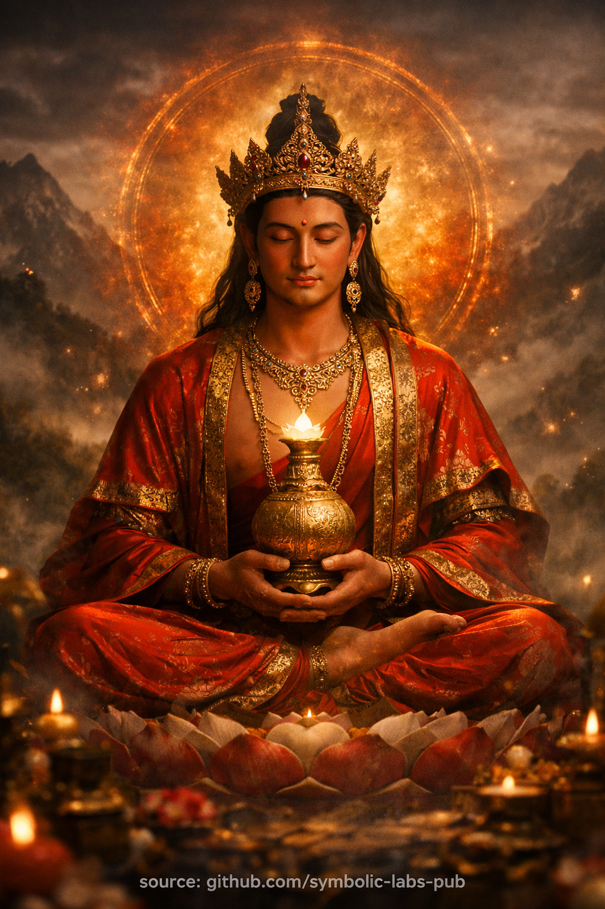

## [Amitāyus — Buda beskonačnog života](https://github.com/symbolic-labs-pub/a-buddhist-view/blob/master/more/08_lineage/15_amitayus/README.md#amitāyus--the-buddha-of-boundless-life)

Učenje

## **Učenje o beskonačnom životu**

*Budističko uputstvo otkriveno kroz praksu Amitāyus*

### 1. Problem koji učenje adresira

Obična bića se plaše smrti i teže dugovječnosti kao **proširenju posjedovanja**:
više vremena da osiguraju identitet, udobnost, uspomenu, ime.

Budizam posmatra nešto preciznije:

> Život ne završava primarno zato što tijelo propada.
> Život se erodira zato što **[svijest](../../10_concepts/README.md#2-awareness-rigpa-vijñāna-knowing) curi**.

Rasijanje, hvatanje, agresija i zbunje nost iscrpljuju vitalnost dugo prije posljednjeg daha.

Učenje **Amitāyus** adresira ovaj koreni uzrok.

---

### 2. Centralni uvid

**Dugovječnost nije trajanje.
Dugovječnost je kontinuitet probuđene svijesti.**

Život ispunjen zbunje nošću je kratak čak i ako traje stotinu godina.
Život usklađen sa jasnošću je dugačak čak i ako je kratak.

Dakle Amitāyus ne obećava *više vremena* —
on otkriva **zašto vrijeme kolapsira ili stabilizuje**.

---

### 3. Dva oblika, jedna istina

Budističko učenje predstavlja dva nerazdvojiva aspekta:

* **Amitābha** — jasnost, iluminacija, viđena istina
* **Amitāyus** — kontinuitet, stabilnost, održana istina

Svjetlost bez kontinuiteta bljeska i blijedi.
Kontinuitet bez jasnosti propada u naviku.

[Buđenje](../../10_concepts/README.md#3-enlightenment-bodhi-awakening) zahtijeva **oboje**.

---

### 4. Vaza dugog života (Učiteljski simbol)

Amitāyus drži vazu *amṛta* (besmrtnog nektara).

Ovo **ne** znači magičnu supstancu.

Uči:

* Vitalnost teče kada je [etika](../../01_core_teachings/the_noble_eightfold_path/README.md#2-ethical-conduct-śīla) čista
* Život se stabilizuje kada je um nepodijeljen
* Dugovječnost raste kada [saosećanje](../../02_from_ignorance_to_awakening/7_compassion/README.md#compassion-as-a-structural-principle-in-buddhist-teaching) zamjenjuje samoodbranu

Vaza se puni **automatski** kada su uzroci ispravni.

---

### 5. Etička dimenzija

Amitāyus je nerazdvojiv od ponašanja.

Učenje glasi:

> Akcije ukorijenjene u nasilju skraćuju život.
> Akcije ukorijenjene u brizi produžuju ga.

Ovo nije moralizam.
To je **kauzalna fizika uma**.

Agresija gori energiju.
Pohlepa fragmentira pažnju.
Prevara stvara unutrašnje trenje.

Jasnost čuva život.

---

### 6. Zašto praksa dugovječnosti nije sebična

U [Mahajani](../../05_yanas/README.md#limitation-from-mahāyāna-view) i [Vadžrajani](../../05_yanas/README.md#4-vajrayāna-tantrayāna-mantrayāna---the-diamond-vehicle), neko ne moli za dug život da bi ga uživao.

Neko teži:

> "Neka ovaj život traje dovoljno dugo
> da se kompletira ostvarenje
> i koristi bićima."

Dugovječnost bez svrhe je karmički dug.
Dugovječnost sa [mudrošću](../../01_core_teachings/the_noble_eightfold_path/README.md#1-wisdom-paññā) je **služba**.

Dakle praksa Amitāyus se često posvećuje:

* učiteljima
* starijima
* nosiocima loze
* zajednicama koje održavaju [Dharmu](../../01_core_teachings/the_three_jewels/README.md#2-dharma--the-path-and-the-law-of-reality)

---

### 7. Meditativna instrukcija kodirana

Meditacija uči tri strukturne istine:

1. **Stabilnost produžava život**
2. **Jasnost sprečava propadanje**
3. **Samozaboravljanje čuva vitalnost**

Kada svijest više ne troši energiju održavajući lažno ja,
život prirodno **usporava, produbljuje se i koheriše**.

Zato meditacija naglašava:

* miran položaj
* ujedinjeno disanje
* odsustvo nastojanja

---

### 8. Smrt reinterpretirana

Amitāyus ne negira smrt.

On je reokviruje:

> Smrt je kolaps zbunjenog kontinuiteta,
> ne kraj svijesti.

Život trenovan u kontinuitetu ne prekida naglo.
On **prelazi**.

Dakle praksa dugovječnosti je također **priprema za dobro umiranje**.

---

### 9. Završna rečenica učenja

Cijelo učenje Amitāyus može biti precizno navedeno:

> **Ono što je usklađeno ne propada.
> Ono što je jasno ne žuri.
> Ono što je saosećajno ne završava prevremeno.**

Ovo nije vjerovanje.
To je opservacija.

---

### 10. Završna instrukcija

Ne pitajte:

> "Kako mogu živjeti duže?"

Umjesto toga pitajte:

> "Gdje moj život curi?"

Gdje se pažnja povrati,
život se prirodno **sam produžava**.

To je učenje Amitāyus.

---

Objašnjenje

---

### Osnovno značenje u budističkom učenju

Amitāyus **ne** obećava besmrtnost ega ili tijela. Njegovo učenje je suptilnije i rigoroznije:

* **Život se produžava kada se uklone zamagljenja**
* **Vitalnost raste kada se um i ponašanje uskladu sa Dharmom**
* **Dugovječnost je *funkcija mudrosti*, ne slučaja**

U ovom smislu, Amitāyus predstavlja **životnu silu pročišćenu ostvarenjem**.

---

### Ikonografija (Zašto izgleda kako izgleda)

Svaki element Amitāyusovog prikaza je instruktivan:

* **Crveno tijelo** – životna-energija rafinirana u saosećanje i toplinu
* **Sjedi u meditativnom položaju** – dugovječnost nastaje iz *stabilnosti*, ne aktivnosti
* **Vaza dugog života (amṛta)** – neiscrpna vitalnost rođena iz uvida
* **Ukrašen (sambhogakāya)** – probuđeni kvaliteti *potpuno uživani*, ne odričeni
* **Spokojan, mladoliki izgled** – sloboda od propadanja uzrokovanog neznanjem

Ovo je **simbolička anatomija**, ne dekoracija.

---

### Funkcija prakse Amitāyus

U Vadžrajana kontekstima, praksa Amitāyus se koristi za:

* Podršku **dugog života praktičara, učitelja i loza**
* Obnavljanje **vitalnosti iscrpljene bolešću, traumom ili neravnotežom**
* Stabilizaciju **uslova neophodnih za duboku meditaciju**
* Produžetak vremena **ne za zadovoljstvo, već za ostvarenje**

Dugovječnost ovdje znači *vrijeme učinjeno smislenim*.

---

### Filozofski uvid

Amitāyus uči precizan kauzalni zakon:

> **Kratak život je često karmički rezultat zbunje nosti, agresije i zanemarivanja uma.
> Dug život je prirodan izraz jasnosti, uzdržavanja i saosećanja.**

Dakle, dugovječnost je **etička, meditativna i kognitivna**—ne puko biološka.

---

### Odnos prema drugim budama

* **Amitābha** → beskonačna svjetlost (jasnost uma)
* **Amitāyus** → beskonačni život (kontinuitet ostvarenja)
* **Čista zemlja** → okruženje gdje su oba usavršena zajedno

Možete reći:

> *Amitābha otkriva istinu; Amitāyus vam daje vrijeme da je živite.*

---

### Meditativni princip (Koncizno)

Kada kontemplira Amitāyus, praktičar razmišlja:

* *Neka moj život bude dovoljno dug da se potpuno probudim*
* *Neka moja vitalnost služi saosećanju, ne rasijanju*
* *Neka jasnost štiti život, i život štiti jasnost*

Ovo je **život usklađen sa buđenjem**, ne preživljavanjem.

---

### Suštinsko rezime

Amitāyus nije o večnom životu.
On je o **životu bez unutrašnje erozije**.

**Dugovječnost = održana jasnost.

---

Meditacija

## **Meditacija dugovječnosti Amitāyus**

> ⚠️ **Napomena o opsegu**
> Ono što slijedi je **neintenzivni kontemplativni oblik** (*praksa značenja*).
> **Ne** zamjenjuje linijsko prenošenje (*wang, lung, tri*).
> Njegova funkcija je **stabilizacija, aspiracija i kauzalno usklađivanje**, a ne tantrička autorizacija.

---

## 0. Priprema (2–3 minuta)

**Položaj**

* Sjedi uspravno ([lotos](../../09_symbols/08_lotus/README.md#the-lotus-in-buddhist-teaching), polulotos ili stabilna stolica)
* Kičma vertikalna, brada malo spuštena
* Ruke odmaraju u **mudrā ekvanimnosti** ili na koljenima

**Stav uma**

* Ne traži duži život *za sebe*, već **da kompletira buđenje za dobrobit bića**

Tiho postavite motivaciju:

> *"Neka ovaj život bude dovoljno dug, jasan i stabilan
> da potpuno ostvarim Dharmu i koristim drugima."*

---

## 1. Utočište i orijentacija (1–2 minuta)

Donesite svijest u **polje probuđene podrške**:

> *Uzimam utočište u Budi, Dharmi i Sanghi—
> ne kao eksternim spasiocima,
> već kao probuđenoj strukturi već prisutnoj.*

Osjetite kako se tijelo opušta u **povjerenje**.

Dugovječnost počinje kada se **strah rastvara**.

---

## 2. Vizualizacija Amitāyus (5–7 minuta)

Vizualizirajte **Amitāyus** kako se pojavljuje u prostoru pred vama, na nivou očiju:

* Tijelo od **duboke rubin-crvene svjetlosti**
* Mladoliki, spokojan, svjetlosan
* Sjedi na lotosu i disku mjeseca
* Drži **vazu amṛta** (nektara besmrtne svijesti)
* Okružen mekim poljem **zlatno-crvene zračnosti**

Ovo je **sambhogakāya**—savršen oblik, ne meso.

Ne naprežite se.
Neka slika bude **jasna ali nježna**.

---

## 3. Usklađivanje identiteta (3–5 minuta)

Prebacite se sa posmatrača na rezonanc iju.

Tiho razmislite:

> *Amitāyus nije izvan mene.*
> *Njegov beskonačni život je prirodni kontinuitet probuđenog uma.*

Iz srca Amitāyus, **topla crveno-zlatna svjetlost** teče:

* Ulazi u vaše tjeme
* Ispunjava tijelo
* Stabilizuje se u srcu

Ova svjetlost:

* Popravlja karmički umor
* Rastvara unutrašnje propadanje
* Ponovno povezuje **životnu silu sa mudrošću**

Osjetite **vrijeme koje usporava**.
Prisustvo produbljuje.

---

## 4. Mantra dugovječnosti (Opciono, 5–10 minuta)

Ako koristite [mantru](../../09_symbols/10_mantra/README.md#what-a-mantra-is-buddhist-view), recitirajte meko ili mentalno:

> **OM AMARANI JIVANTIYE SVAHA**

(Značenje: *O besmrtni, održi život i svijest*)

Sa svakim recitovanjem:

* Nektar puni vazu
* Svjetlost stabilizuje vaše disanje
* Život postaje **koherentan**, ne samo produžen

Ako mantra djeluje vještački, odmorite se umjesto toga u **kontinuitetu bez riječi**.

---

## 5. Apsorpcija (3–5 minuta)

Neka se vizualizacija **rastvori u svjetlost**.

Amitāyus se topi u vaše srce.
Ne ostaje oblik.

Odmorite se u:

* Jasnoj svijesti
* Stabilnom disanju
* Bezvremenom prisustvu

Ovo je **istinska dugovječnost**:
život koji više ne curi kroz rasijanje.

---

## 6. Posvećenje života (2 minuta)

Završite sa namjernim posvećenjem:

> *"Neka bilo koja dužina ovog života
> bude korištena bez otpada.*
> *Neka jasnost štiti vitalnost.*
> *Neka vitalnost služi buđenju.*
> *Neka sva bića imaju uslove za ostvarenje."*

Osjetite rešenost—ne emociju.

---

## Ključno učenje kodirano u ovoj praksi

* **Dugovječnost nije biološka sreća**
* **Dugovječnost je karmička koherencija**
* **Jasnost smanjuje entropiju**
* **Buđenje čuva život**

Amitāyus ne *dodaje* godine.
On **uklanja ono što ih skraćuje**.

---

## Kada je ova praksa posebno prikladna

* Tokom bolesti ili oporavka
* Kada praksa djeluje fragmentirano ili užurbano
* Kada radimo da podržimo učitelje, starije ili loze
* Kada se suočavamo sa strahom od vremena, starenja ili smrti

---

< [**Amitābha** — prema budističkim učenjima](../14_amitabha/README.md) | [**Vairocana** — Buda **univerzalne iluminacije**](../16_vairocana/README.md) >

_izvor: [github.com/symbolic-labs-pub](https://github.com/symbolic-labs-pub)_

---
