Linija i Bude

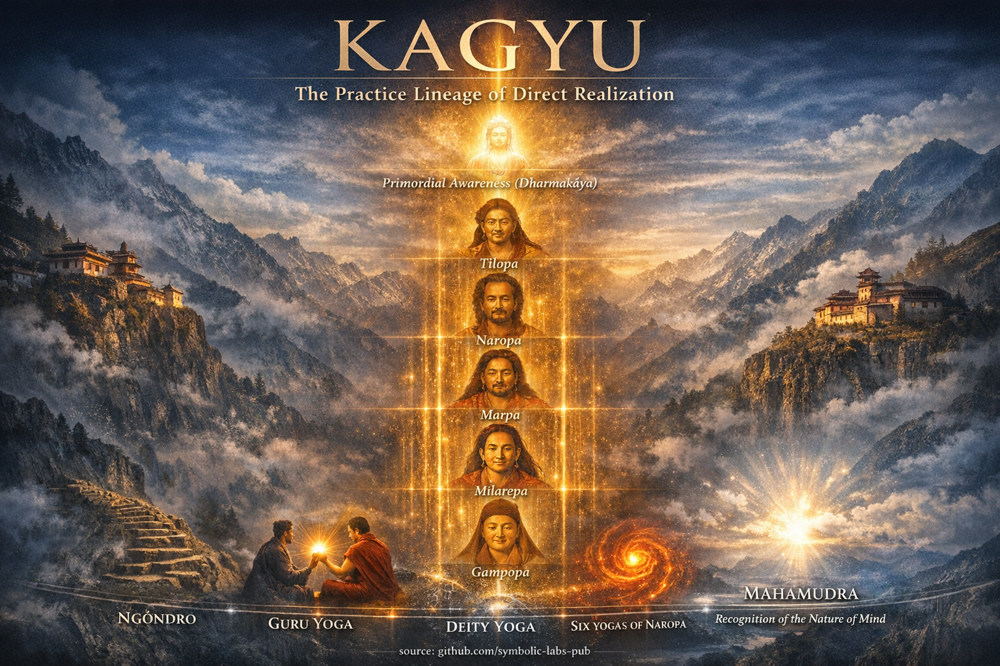

U ovom trenutku je veoma važno naglasiti ulogu Sanghe - naših prijatelja na putu. Ako još uvijek niste stupili u kontakt sa budističkim centrom ili zajednicom u vašoj blizini, uzmite pretraživač i pronađite ih.

Pravilo je isto kao kod meditacije, što ste možda do sada naučili. Stvarno je strukturno nemoguće napredovati i razvijati se bez Sanghe, stoga ustanite i pronađite ih!

---

## [White Tārā (Sitatārā) – Majka Dugovječnosti i Saos​ječanja](01_white_tara/README.md)

| [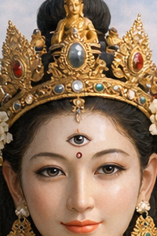](01_white_tara/README.md#white-tārā--učenje-o-održavanju-uslova) |

**White [Tara](#green-tārā--syamatārā---brzo-saosječanje-u-akciji)** utjelovljuje **[saosječanje](#green-tārā--syamatārā---brzo-saosječanje-u-akciji) izraženo kao iscjeljenje i dug život**.

U tradiciji Kagyu:

* Poziva se za **dugovječnost**, **zdravlje** i **stabilnost prakse**
* Njenih **sedam očiju** simbolizira svevidjeću [svjesnost](../10_concepts/README.md#2-awareness-rigpa-vijñāna-knowing)
* Praksa naglašava **nježno prisustvo, kontinuitet i njegovanje mudrosti**

White Tārā nije apstraktna milost—ona je **briga koja održava uslove za [buđenje](../10_concepts/README.md#3-enlightenment-bodhi-awakening)**.

---

## [Green Tārā (Syamatārā) – Brzo Saosječanje u Akciji](02_green_tara/README.md)

[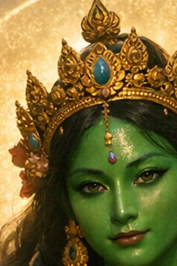](02_green_tara/README.md#učenje-kagyu-o-green-tārā-saosječanje-koje-ne-okleva)

**Green Tara** predstavlja **neposrednu, neustrašivu saosječajnu akciju**.

U razumijevanju Kagyu:

* Ona odgovara **trenutno** na strah i prepreke
* Jedna noga ispružena = **spremnost za djelovanje**
* Naročito se praktikuje u vremenima opasnosti, anksioznosti ili tranzicije

Green Tārā obučava praktičara da **djeluje iz jasnoće, a ne oklevanja**.

---

## [Mahākāla – Zaštitnik u Crnom Ogrtaču (Čuvar Dharme)](03_mahakala/README.md)

[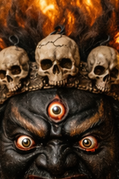](03_mahakala/README.md#mahākāla-i-dharma-nepovratnosti)

**Mahakala** je **primarni zaštitnik linije Kagyu**.

Ključne tačke:

* Gnjevan izgled = **žestoko saosječanje**
* Uništava **vezivanje za ego, prepreke i duhovnu korupciju**
* Zaštitnik **prakse**, a ne udobnosti

Mahākāla je **energija koja sprečava regresiju**.

---

## [Hiljaduruки Avalokiteśvara (Chenrezig) – Beskonačno Saosječanje](04_avalokitesvara/README.md)

[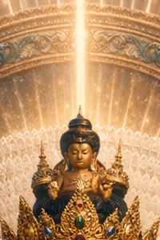](04_avalokitesvara/README.md#učenje-o-beskonačnoj-odzivnosti)

[**Avalokiteśvara**](04_avalokitesvara/README.md#praktična-integracija-van-jastuka), u svojoj hiljadurukoj formi, utjelovljuje **neograničenu saosječajnu aktivnost**.

Na putu Kagyu:

* Centralan za **trening uma (lojong)**
* Saosječanje nije emocija, već **strukturna orijentacija**
* Mnoge ruke predstavljaju **vješta sredstva primijenjena svuda**

Ova praksa **omekšava fiksiranost na sebe dok jača rješenost**.

---

## [Guru Rinpoche / Padmasambhava – Tantrički Majstor](05_padmasambhava/README.md)

[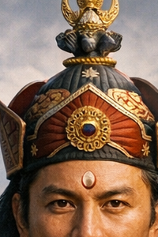](05_padmasambhava/README.md#budističko-učenje-buđenje-kao-vješta-adaptacija)

**Guru Rinpoche**, poznat i kao **Padmasambhava**, je **utjelovljenje prosvjetljenog metoda**.

Iako je centralan za školu Nyingma, u Kagyu:

* On predstavlja **neustrašivo tantričko majstorstvo**
* Integriše **gnevna i mirna sredstva**
* Poziva se u naprednim kontekstima [Vajrayāna](../05_yanas/README.md#4-vajrayāna-tantrayāna-mantrayāna---the-diamond-vehicle)

Guru Rinpoche pokazuje da se **buđenje prilagođava uslovima**.

---

## [Buda Medicine (Plavi Bhaisajyaguru) – Iscjelju​jućа Mudrost](06_medicine_buddha/README.md)

[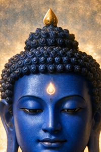](06_medicine_buddha/README.md#budističko-učenje)

[**Buda Medicine**](06_medicine_buddha/README.md#2-preorijentacija-bude-medicine) manifestuje **[mudrost](../01_core_teachings/the_noble_eightfold_path/README.md#1-wisdom-paññā) kao iscjeljujuću jasnoću**.

U upotrebi Kagyu:

* Iscjeljenje se primjenjuje na **um, karmu i uslove**
* Plava boja = **dubina i preciznost**
* Praksa usavršava svjesnost **uzroka i posljedice**

Iscjeljenje ovdje znači **jasno vidjeti šta mora biti promijenjeno**.

---

## [Kalu Rinpoche – Savremeni Majstor Kagyu](07_kalu_rinpoche/README.md)

**Kalu Rinpoche** je bio jedan od **velikih prenosilaca učenja Kagyu na Zapad**.

Značaj:

* Majstor **Mahamudra** i **Šest Joga Nāropa**
* Naglašavao **direktnu meditativnu realizaciju**
* Poznat po jasnoći, poniznosti i dubini

On predstavlja **živu liniju, a ne mitologiju**.

---

## [Bodhisattva – Zavjet Buđenja-za-Sve](08_bodhisattva/README.md)

[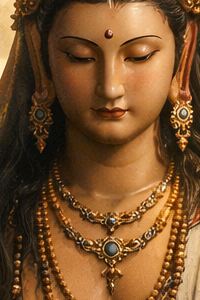](08_bodhisattva/README.md#buđenje-nije-privatno)

[**Bodhisattva**](08_bodhisattva/README.md#4-zavjet-bodhisattve-kao-strukturno-usklađivanje) nije božanstvo, već **način postojanja**.

U pogledu Kagyu:

* Prosvjetljenje je nepotpuno bez drugih
* Saosječanje i mudrost **nastaju zajedno**
* Zavjet oblikuje **svaku akciju i percepciju**

Bodhisattva je **buđenje u pokretu**.

---

## Strukturni Uvid (Kagyu Optika)

Ove figure nisu **objekti obožavanja**, već **funkcionalni arhetipi**:

* **Tārās** → saosječajna odzivnost
* **Zaštitnici** → strukturni integritet prakse
* **Bodhisattvas** → etički pravac
* **Guru** → prenos realizacije
* **Bude** → stabilizovana buđenja stanja

Zajedno formiraju **ekosistem prakse**, a ne panteon.

---

## [Milarepa — Arhetip Radikalne Transformacije](09_milarepa/README.md)

[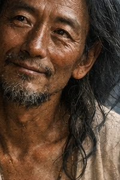](09_milarepa/README.md#budističko-učenje-milarepa-i-zakon-nepovratne-transformacije)

[**Milarepa**](09_milarepa/README.md#budističko-učenje-milarepa-i-zakon-nepovratne-transformacije) je **utjelovljeni dokaz** da je buđenje moguće **u jednom životu**, bez obzira na prošlost.

**Značaj Kagyu**

* Ranije opterećen teškom karmom, postigao je potpunu realizaciju kroz **strogu meditaciju**
* Živio je kao **planinski jogi**, praktikujući u izolaciji
* Poznat po spontanim **pjesmama realizacije (dohas)**

**Funkcija prakse**

* Predstavlja **nepovratnu transformaciju**
* Učи da **odricanje + predanost + istrajnost** rastvaraju čak i najteže zamućenja
* Centralna inspirativna figura za **kulturu povlačenja** u liniji Kagyu

Milarepa pokazuje da **ništa ne diskvalifikuje buđenje osim odbijanja da se praktikuje**.

---

## [Marpa Prevodilac — Nosilac Autentičnog Prenosa](10_marpa/README.md)

[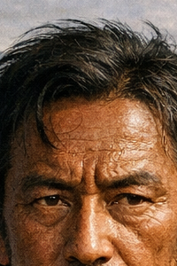](10_marpa/README.md#budističko-učenje-marpa-prevodilac--dharma-koja-odbija-da-bude-omekšana)

[**Marpa**](10_marpa/README.md#budističko-učenje-marpa-prevodilac--dharma-koja-odbija-da-bude-omekšana), poznat kao *Marpa Lotsāwa*, je **arhitekta prenosa Kagyu**.

**Značaj Kagyu**

* Putovao je više puta u Indiju da bi dobio **tantrična učenja direktno**
* Prevodio tekstove sa ekstremnom preciznošću
* Prenio liniju netaknutu na Milarepa

**Funkcija prakse**

* Utjelovljuje **vjernost liniji**
* Demonstrira da saosječanje može izgledati **strogo ili zahtjevno**
* Osigurava da realizacija **nije razblažena udobnošću ili sentimentalnošću**

Marpa predstavlja **strukturni integritet buđenja**—istinu prenesenu bez izobličenja.

---

## [Vajradhara — Izvor Mahāmudrā](11_vajradhara/README.md)

[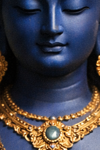](11_vajradhara/README.md#vajradhara-i-učenje-prepoznavanja)

[**Vajradhara**](11_vajradhara/README.md#vajradhara-i-učenje-prepoznavanja) je **izvorni Buda** u tradiciji Kagyu.

**Značaj Kagyu**

* Izvor **[Mahāmudrā](../04_kayas/mahamudra_and_dzogcsen/README.md#mahāmudrā-nature-of-mind-སེམས་ཀྱི་གནས་ལུགས་) realizacije**
* Nije historijski, već **bezvremena svjesnost sama**
* Prikazan držeći [vajra](../09_symbols/02_dorje/README.md#dorje-vajra--objašnjeno-prema-budističkim-učenjima) i zvono—**metod i mudrost ujedinjeni**

**Funkcija prakse**

* Predstavlja **osnovno stanje uma**
* Nije nešto što treba postići, već **prepoznati**
* Uputstva Mahāmudrā ukazuju direktno na prirodu Vajradhara u sopstvenoj svjesnosti

Vajradhara je **buđenje prije nego što koncepti nastanu**.

---

## [Crni Šestoruки Mahākāla — Ezoterični Čuvar Dharme](12_six_armed_mahakala/README.md)

[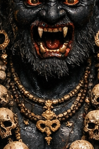](12_six_armed_mahakala/README.md#mahākāla-kao-disciplina-buđenja)

**Mahākāla** (Šestoruки, Crni oblik) je **najezoter​ičniji zaštitnik** linije Kagyu.

**Značaj Kagyu**

* Emanacija probuđenog saosječanja u **gnevnom obliku**
* Šest ruku simbolizira **majstorstvo nad šest carstava**
* Djeluje brzo i beskompromisno

**Funkcija prakse**

* Štiti **naprednu praksu Vajrayāna**
* Uklanja **unutrašnje prepreke** (ego, lenjost, korupciju)
* Poziva se samo sa odgovarajućim ovlaštenjem i disciplinom

Ovaj Mahākāla ne štiti udobnost—**on štiti realizaciju**.

---

## Strukturni Uvid (Kagyu Perspektiva)

Zajedno, ova četvorica formiraju **potpunu vertikalnu osovinu puta Kagyu**:

* **Vajradhara** → krajnja priroda uma
* **Marpa** → besprekoran prenos
* **Milarepa** → potpuna transformacija kroz praksu
* **Šestoruки Mahākāla** → beskompromisna zaštita puta

Oni nisu simbolične dekoracije; oni su **funkcionalne neophodnosti** u liniji izgrađenoj na **direktnoj realizaciji**.

---

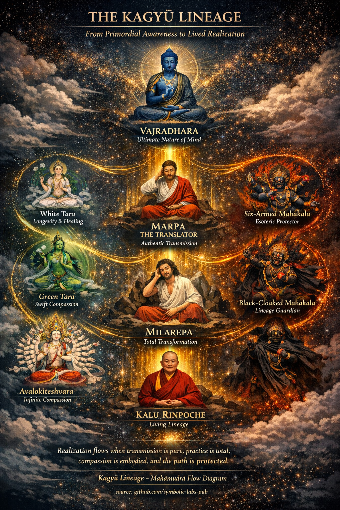

---

< [**Vairocana** — Buda **Univerzalne Iluminacije**](16_vairocana/README.md) | [Blagoslovena Vrpca (Zaštitna Vrpca) — Budistički Značaj](../09_symbols/01_blessing_cord/README.md) >

_izvor: [github.com/symbolic-labs-pub](https://github.com/symbolic-labs-pub)_

---
