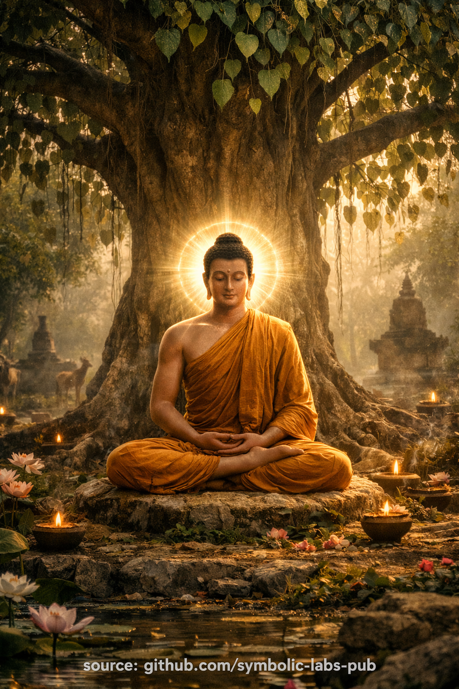

# [Koncepti](https://github.com/symbolic-labs-pub/a-buddhist-view/blob/master/more/10_concepts/README.md#concepts)

# Sadržaj

- [Praznina](#1-emptiness-śūnyatā)
- [Svjesnost](#2-awareness-rigpa--vijñāna--knowing)
- [Prosvjetljenje](#3-enlightenment-bodhi--awakening)

## 1. **Praznina (Śūnyatā)**

### Šta **nije**

* Nije ništavilo
* Nije uništenje
* Nije nihilizam
* Nije metafizički prazan prostor

### Šta **jeste**

**Praznina znači odsustvo inherentne, nezavisne egzistencije.**

Sve:

* nastaje **zavisno**
* postoji **relaciono**
* nema **fiksiranu suštinu**

Ovo se jednako primjenjuje na:

* objekte
* misli
* emocije
* identitet
* *čak i samo prosvjetljenje*

> Praznina je **kako stvari postoje**, ne ono što ih zamjenjuje.

### Mahāyāna naglasak

* Ukorijenjena u **Madhyamaka** (Nāgārjuna)
* Analitička dekonstrukcija:

  * "Gdje je stvar *sama po sebi*?"
  * Ne može se pronaći.
* Svrha: **uruši reifikaciju**

### Vajrayāna naglasak

* Praznina se **doživljava direktno**, ne izvodi
* Susreće se kao:

  * otvorenost
  * nehvatljivost
  * bezosnovnost
* Koristi se **funkcionalno**, ne filozofski

🔑 **Ključna poenta**
Praznina uklanja **ontološku fiksaciju**, ne pojavu.

---

## 2. **Svjesnost (Rigpa / Vijñāna / Znanje)**

### Dva nivoa (često se miješaju)

#### 1. Obična svjesnost (vijñāna)

* Dualistička
* Zasnovana na subjekt–objekt
* Fragmentirana na:

  * viđenje
  * slušanje
  * razmišljanje
* Reaktivna, uvjetovana

#### 2. Primordijalna svjesnost (rigpa / jñāna)

* Nedualna
* Samosaznajuća
* Luminozna
* Neizmišljena

> Svjesnost je **ono što zna**, čak i kada se ništa ne misli.

### Mahāyāna pogled

* Svjesnost je **prazna**
* Nema vječne "supstance uma"
* Izbjegava eternalizam

### Vajrayāna pogled

* Svjesnost je:

  * prazna **i**
  * lucidna
* Ova unija se naziva:

  * *praznina-jasnost*
  * *praznina-luminoznost*

🔑 **Ključna poenta**
Svjesnost nije stvar — to je **samo znanje**, prazno vlasnika.

---

## 3. **Prosvjetljenje (Bodhi / probuđenje)**

### Šta prosvjetljenje **nije**

* Vrhunsko iskustvo
* Trans blaženstva
* Trajno izmijenjeno stanje
* Moralna perfekcija
* Bjeganje iz svijeta

### Šta prosvjetljenje **jeste**

**Stabilno prepoznavanje:**

* praznine kao prirode fenomena
* svijesti kao režima znanja
* [saosjećanja](../02_from_ignorance_to_awakening/7_compassion/README.md#compassion-as-a-structural-principle-in-buddhist-teaching) kao spontanog izraza

Nema razdvajanja između:

* samsāre i nirvāṇe
* [meditacije](../08_lineage/README.md) i post-meditacije
* sebe i drugih

### Mahāyāna okvir

* Prosvjetljenje = **savršena [mudrost (prajñā)](../01_core_teachings/the_noble_eightfold_path/README.md#1-wisdom-paññā)** + **veliko saosjećanje**
* Buddhahood se odvija kroz **bhūmis** (stadijume)
* Snažna etička i altruistička orijentacija

### Vajrayāna okvir

* Prosvjetljenje = **prepoznavanje**, ne konstrukcija
* Već prisutno
* Praksa uklanja **zamućenja**, ne dodaje kvalitete
* Koristi:

  * [deity yoga](../03_the_path_to_end_suffering/README.md#right-action)
  * [mantra](../09_symbols/10_mantra/README.md#what-a-mantra-is-buddhist-view)
  * mudrā
  * [guru yoga](../11_ngondro/4_guru_yoga/README.md#samsāra's-unsatisfactoriness-→-guru-yoga)
    da **prečica** konceptualno kašnjenje

🔑 **Ključna poenta**
Prosvjetljenje **nije postajanje nečeg drugog** — to je prestanak pogrešnog prepoznavanja.

---

## Kako se troje prepliće (kritičan uvid)

| Aspekt            | Funkcija                 |
| ----------------- | ------------------------ |
| [**Praznina**](#1-emptiness-śūnyatā)     | Sprečava fiksaciju        |
| [**Svjesnost**](#2-awareness-rigpa-vijñāna-knowing)     | Omogućava znanje          |
| [**Prosvjetljenje**](#3-enlightenment-bodhi-awakening) | Stabilizovana ne-zbunjenost |

### Klasična Vajrayāna formula

> **Praznina bez svijesti → nihilizam**
> **Svjesnost bez praznine → eternalizam**
> **Njihovo jedinstvo → oslobođenje**

---

## Praktična dijagnoza (veoma važno)

Ako neko kaže:

* "Sve je prazno" ali se osjeća odvojeno → **propustio svjesnost**
* "Čista svjesnost je vječna" → **propustio prazninu**
* "Imao sam blaženo iskustvo" → **propustio stabilizaciju**
* "Ništa nije važno" → **praznina pogrešno shvaćena**
* "Ja sam prosvjetljen" → **ego reproprijacija**

Istinska realizacija:

* je **obična**
* povećava odgovornost
* oštri [etiku](../01_core_teachings/the_noble_eightfold_path/README.md#2-ethical-conduct-śīla)
* produbljuje saosjećanje
* uklanja dramu

---

## Rezime u jednoj rečenici

> **Praznina** je kako stvari postoje,
> **Svjesnost** je kako su poznate,
> **Prosvjetljenje** je više ne miješati to dvoje.

---

< [Praznina (Śūnyatā) u Vajrayāna budizmu](01_emptiness/README.md) | [Prva Ngöndro praksa](../11_ngondro/1_prostrations/README.md) >

_izvor: [github.com/symbolic-labs-pub](https://github.com/symbolic-labs-pub)_

---
