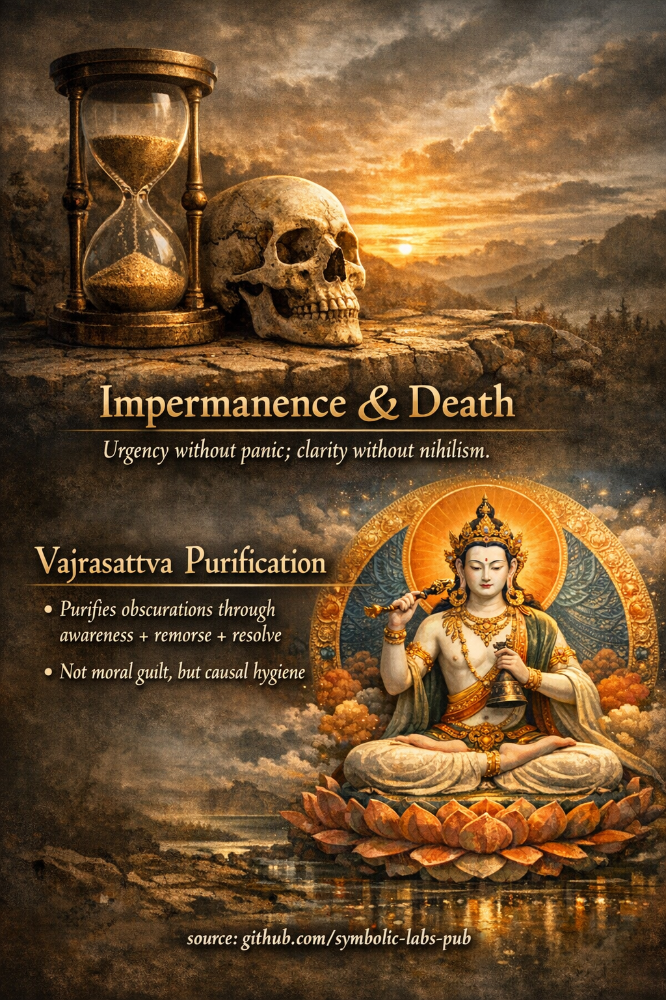

**Druga Ngöndro praksa** je **Vajrasattva pročišćavanje**.
To nije moralna samo-procjena i nije psihološka katarza — to je **tehnički metod za obnavljanje jasnosti svijesti** oslobađanjem karmičkih zamućenja koja blokiraju prepoznavanje prirode uma.

---

## 2. Vajrasattva — pročišćavanje zamućenja

### Osnovna funkcija

**Pročišćavanje prethodi realizaciji.**
Čak i ispravna [meditacija](../../08_lineage/README.md) ne može da se stabilizuje ako zamućenja ostanu aktivna. Vajrasattva praksa čisti *uslove* koji sprečavaju uvid da se ukorijeni.

Ova praksa djeluje na **tri nivoa istovremeno**:

* **Bihejvioralni** (nevješta djela)
* **Kognitivni** (navična fiksacija, iskrivljeni pogledi)
* **Energetski** (latentni karmički otisci)

---

## Koga Vajrasattva predstavlja

**Vajrasattva** nije vanjski bog.
On je **princip neuništive čistoće** — činjenica da probuđena [svjesnost](../../10_concepts/README.md#2-awareness-rigpa-vijñāna-knowing) *nikada zapravo nije zamrljana*, samo privremeno zamračena.

* Bijela boja → **bezuslovna čistoća**
* Vajra + zvono → **metod i [mudrost](../../01_core_teachings/the_noble_eightfold_path/README.md#1-wisdom-paññā) ujedinjeni**
* Sjedi u pozi unije → **neodvojivost [praznine](../../10_concepts/01_emptiness/README.md#emptiness-śūnyatā-in-vajrayāna-buddhism) i pojave**

Ne tražite od Vajrasattve da vas oprosti.
Vi **prepoznajete čistoću kao već prisutnu** i rastvarate ono što blokira to prepoznavanje.

---

## Četiri sile (strukturna jezgra)

Vajrasattva pročišćavanje je efikasno jer primjenjuje **četiri protivničke sile**, precizan kauzalni okvir:

### 1. Sila podrške

Uzimate utočište u:

* Buddha ([probuđenje](../../10_concepts/README.md#3-enlightenment-bodhi-awakening))
* [Dharma (istina uzroka i posljedice)](../../01_core_teachings/the_three_jewels/README.md#2-dharma--the-path-and-the-law-of-reality)
* Sangha (realizovani kontinuitet)

Ovo uspostavlja **ispravnu orijentaciju**.

---

### 2. Sila kajanja (ne krivice)

Kajanje ovdje znači:

> *Jasno prepoznavanje uzroka → posljedice*

Nema **samo-okrivljavanja**.
Samo lucidno priznanje: *"Ovo vodi [patnji](../../02_from_ignorance_to_awakening/2_the_four_noble_truths/README.md#1-there-is-suffering--dukkha)."*

Ovo se savršeno usklađuje sa modernim kognitivnim dekondicioniranjem:

* Svjesnost bez identifikacije
* Odgovornost bez stida

---

### 3. Sila lijeka

Recitirajete **100-slogovnu Vajrasattva [mantru](../../09_symbols/10_mantra/README.md#what-a-mantra-is-buddhist-view)** (ili kratku formu).

Mantra nije simbolična — to je **modelovana kognicija**:

* Prekida karmičke petlje ponavljanja
* Ponovno utiče jasnost na nivou navike
* Sinhronizuje tijelo, govor i um

Vizualizacija (opciona ali moćna):

* Nektar teče iz Vajrasattve
* Zamućenja se rastvaraju kao tamni dim
* Um postaje jasan, lak, neometan

---

### 4. Sila rješenja

Završavate sa **strukturalnom namjerom**:

> *"Neću ponoviti ovaj obrazac onoliko koliko mogu."*

Ne perfekcija — **korekcija putanje**.

Ovo zapečaćuje pročišćavanje tako da se ne odbija.

---

## Zašto ova praksa dolazi druga

[Ngöndro](../README.md#what-is-ngöndro-in-mahāyāna-buddhism) je **naručeni inženjering**, ne folklor odavanja.

1. **Utočište + Bodhicitta** → uspostavlja pravac
2. **Vajrasattva** → uklanja smetnje
3. [Mandala](../../09_symbols/08_mandala/README.md#mandala--explained-according-to-buddhist-teachings) ponuda → oslobađa vezanost
4. [Guru Yoga](../4_guru_yoga/README.md#samsāra's-unsatisfactoriness-→-guru-yoga) → urušava dualnost subjekt–objekt

Ako preskočite pročišćavanje:

* Odavanje postaje emocionalno
* Meditacija postaje nestabilna
* Uvid ne uspijeva da se integriše u ponašanje

---

## Ključni uvid (često propušteno)

> **Pročišćavanje vas ne čini čistim.
> Ono otkriva da čistoća nikada nije bila odsutna.**

Karma se ne briše naporom — ona se **čini neobavezujućom** kada je svjesnost neometana.

---

## Znaci da praksa djeluje

* Smanjena kompulzivna reaktivnost
* Manje psihološke "ljepljivosti"
* Brži oporavak poslije grešaka
* Povećana transparentnost uma
* [Etika](../../01_core_teachings/the_noble_eightfold_path/README.md#2-ethical-conduct-śīla) postaje *bez napora*, ne prisiljena

---

## Jednolinijsko učenje

**Vajrasattva praksa obnavlja um u funkcionalnu jasnost tako da realizacija zapravo može da se uhvati.**

---

< [Prva Ngöndro praksa](../1_prostrations/README.md) | [Treća Ngöndro praksa](../3_mandala_offering/README.md) >

_izvor: [github.com/symbolic-labs-pub](https://github.com/symbolic-labs-pub)_

---
