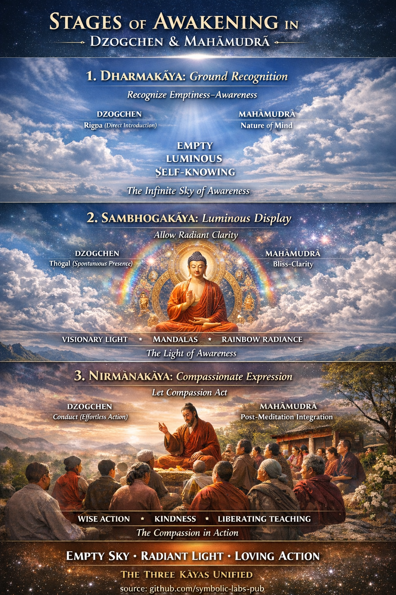

## [1. Dharmakāya → *Rozpoznání základu*](https://github.com/symbolic-labs-pub/a-buddhist-view/blob/master/more/04_kayas/mahamudra_and_dzogcsen/README.md#1-dharmakāya--ground-recognition)

### Dzogchen: **Rigpa (རིག་པ་) — Přímé uvedení**

**Co se děje**

* Učitel uvede **přirozenost mysli** (*sems nyid*)
* [Uvědomování](../../10_concepts/README.md#2-awareness-rigpa-vijñāna-knowing) rozpoznává samo sebe jako:

  * [Prázdné](../../10_concepts/01_emptiness/README.md#emptiness-śūnyatā-in-vajrayāna-buddhism)
  * Světelné
  * Samo-poznávající

**Klíčové Dzogchen etapy**

* **Přímé uvedení** (*ngo sprod*)
* **Pronikání** (*trekchö*) — stabilizování prázdnoty

**Zkušenostní signatura**

* Žádné centrum
* Žádný meditující
* Uvědomování bez úsilí

> Dharmakāya zde není dosaženo — je **rozpoznáno**.

---

### Mahāmudrā: **Přirozenost mysli (སེམས་ཀྱི་གནས་ལུགས་)**

**Co se děje**

* Progresivní usazení mysli
* Vhled (*vipashyanā*) odhaluje:

  * Myšlenky vznikají a rozpouštějí se v prázdnotě
  * Uvědomování je nenalezitelné, přesto přítomné

**Klíčové Mahāmudrā etapy**

1. Jednobodovost
2. Jednoduchost
3. Jedna chuť
4. Ne-meditace

Dharmakāya je plně zjevné při **Jednoduchost → Jedna chuť**.

---

## 2. Sambhogakāya → *Jasnost & světelné zobrazení*

### Dzogchen: **Spontánní přítomnost (ལྷུན་གྲུབ་)**

**Co se děje**

* Po stabilitě v prázdnotě
* **Přirozené záření** uvědomování se rozvíjí

**Praxe**

* **Thögal** (ཐོད་རྒལ་) — přímý skok
* Vizionářská zobrazení:

  * Světla
  * [Mandaly](../../09_symbols/07_mandala/README.md#mandala--explained-according-to-buddhist-teachings)
  * Božstva
  * Duhové jevy

**Klíčový bod**

* Toto **nejsou halucinace**
* Jsou to **symbolický jazyk uvědomování samého**

> Sambhogakāya = uvědomování rozpoznávající vlastní zobrazení.

---

### Mahāmudrā: **Blaženost–Jasnost–Ne-myšlenka**

**Co se děje**

* Meditační absorpce se prohlubuje
* Mysl se stává:

  * Blaženou
  * Živou
  * Neblokovanou

**Korespondence**

* Mahāmudrā přistupuje k Sambhogakāya **méně vizuálně**
* Více **cítěné jako jasnost a ne-dualita**
* Tantra akceleruje tuto fázi

---

## 3. Nirmāṇakāya → *Ztělesněný soucit*

### Dzogchen: **Chování (སྤྱོད་པ་)**

**Co se děje**

* [Rigpa](../../10_concepts/README.md#2-awareness-rigpa-vijñāna-knowing) zůstává nepřerušené v aktivitě
* Jednání vzniká **bez úvahy**

**Znaky**

* Bezúsilí [etika](../../01_core_teachings/the_noble_eightfold_path/README.md#2-ethical-conduct-śīla)
* Zručná řeč
* Učení bez strategie

> Soucit již není kultivován — **emanuje**.

---

### Mahāmudrā: **Integrace po meditaci**

**Co se děje**

* Žádné rozdělení mezi sezením a životem
* Myšlenky a emoce se samo-osvobozují
* Chování je přirozené, ne vnucované

**Klasická fráze**

> "[Meditace](../../08_lineage/README.md) je sezení.
> Chování je důkaz."

---

## Sjednocený pohled: Jak se Kāya rozvinou

| Etapa      | Kāya             | Co je realizováno       |
| ---------- | ---------------- | ---------------------- |
| Základ     | [**Dharmakāya**](#1-dharmakāya-→-rozpoznání-základu)   | [Prázdnota](../../10_concepts/01_emptiness/README.md#emptiness-śūnyatā-in-vajrayāna-buddhism)-[uvědomování](../../10_concepts/README.md#2-awareness-rigpa-vijñāna-knowing)    |
| Zobrazení    | [**Sambhogakāya**](#2-sambhogakāya-→-jasnost-světelné-zobrazení) | Světelná jasnost       |
| Vyjádření | [**Nirmāṇakāya**](#3-nirmāṇakāya-→-ztělesněný-soucit)  | [Soucitná](#3-nirmāṇakāya-→-ztělesněný-soucit) aktivita |

Jsou **současné**, ale **rozpoznané progresivně**.

---

## Jemný, ale esenciální vhled

* **Dzogchen** zdůrazňuje:

  * Okamžité rozpoznání
  * Ne-fabrikaci
  * Spontánní přítomnost

* **Mahāmudrā** zdůrazňuje:

  * Postupné zjemnění
  * Meditační stabilizaci
  * Bezproblémovou integraci

Přesto je **realizace identická**.

> Různé dveře. Tatáž místnost.

---

## Diagnostická otázka (používaná tibetskými mistry)

Zeptejte se praktikujícího:

* *Je tvé uvědomování prázdné?* → Dharmakāya
* *Je jasné a živé?* → Sambhogakāya
* *Přirozeně prospívá druhým?* → Nirmāṇakāya

Pokud chybí kterékoli, realizace je nekompletní.

---

## Jednořádková integrační formule

> **Rozpoznejte prázdnotu ([Dharmakāya)](../../10_concepts/01_emptiness/README.md#emptiness-śūnyatā-in-mahāyāna-buddhism),
> umožněte jasnosti zářit (Sambhogakāya),
> nechte soucit jednat (Nirmāṇakāya).**

---

< [Učení o třech tělech probuzení](../README.md) | [Co je Yāna?](../../05_yanas/README.md) >

_zdroj: [github.com/symbolic-labs-pub](https://github.com/symbolic-labs-pub)_

---
