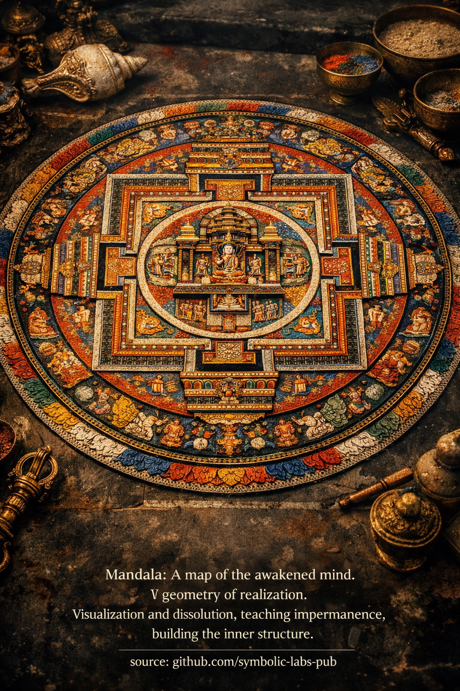

### Mandala — vysvětlena podle buddhistických učení

---

V buddhismu (zejména [Vajrayāně](../../05_yanas/README.md#4-vajrayāna-tantrayāna-mantrayāna---the-diamond-vehicle)) **mandala** není ornament ani symbolický obraz. Je to **funkční model probuzeného poznávání** — tréningové prostředí pro mysl.

---

## 1. Co *mandala* *je* (ontologicky)

*Mandala* je **reprezentace osvícené mysli jako struktury**.

* **Centrum** reprezentuje probuzené [vědomí (často Buddha nebo yidam)](../../10_concepts/README.md#2-awareness-rigpa-vijñāna-knowing).
* **Obklopující palác** reprezentuje stabilizované kvality mysli.
* **Brány, zdi a kruhy** reprezentují rozlišení, [etiku](../../01_core_teachings/the_noble_eightfold_path/README.md#2-ethical-conduct-śīla) a ochranu před zmatkem.
* **Vnější kruhy** (oheň, [*vajra*](../02_dorje/README.md#dorje-vajra--explained-according-to-buddhist-teachings), [lotos](../08_lotus/README.md#the-lotus-in-buddhist-teaching)) reprezentují očištění zaclonění.

V buddhistických pojmech je *mandala* **zobrazením [závislého vzniku](../../02_from_ignorance_to_awakening/3_dependent_origination/README.md#the-twelve-links-the-classic-formulation) viděného jasně** — jak [moudrost](../../01_core_teachings/the_noble_eightfold_path/README.md#1-wisdom-paññā), [soucit](../../02_from_ignorance_to_awakening/7_compassion/README.md#compassion-as-a-structural-principle-in-buddhist-teaching), jasnost a aktivita vznikají společně, když je nevědomost nepřítomná.

> *Mandala* ukazuje **jak vypadá mysl, když již není fragmentovaná**.

---

## 2. Proč geometrie záleží

Geometrie *mandaly* není estetická — je to **kognitivní inženýrství**.

* Symetrie trénuje **ne-preferenční vědomí**
* Osy trénují **bezsměrovou jasnost**
* Opakování stabilizuje **pozornost**
* Proporce kódují **vyvážené schopnosti**

Proto jsou *mandaly* v tradiční praxi přesné na milimetr.
Zkreslená *mandala* trénuje zkreslenou mysl.

> Ve Vajrayāně se **forma používá záměrně na přeprogramování vnímání**.

---

## 3. Vizualizační praxe (generační fáze)

Když praktikující vizualizuje *mandalu*:

1. Obyčejné vnímání se rozpouští
2. Prostor se stává luminózním a strukturovaným
3. *Mandala* vzniká **z [prázdnoty](../../10_concepts/01_emptiness/README.md#emptiness-śūnyatā-in-vajrayāna-buddhism)**
4. Praktikující ji obývá zevnitř

To **neznamená** "představovat si něco pěkného."

Trénuje:

* Stabilitu bez uchopení
* Jasnost bez úsilí
* Identitu bez ega

Nakonec **hranice mezi pozorovatelem a *mandalou* kolabuje**.

> *Mandala* není *videna* — je *rozpoznána*.

---

## 4. Rozpuštění a nepermanentnost (dokončovací fáze)

Po konstrukci je *mandala* **rozpuštěna**.

Pískové *mandaly* jsou záměrně zničeny, aby demonstrovaly:

* Všechny formy jsou podmíněné
* I posvátné struktury jsou prázdné
* Připoutání k čistotě je stále připoutání

To přímo trénuje **ne-připoutání k samotné realizaci**.

> Nejvyšší chyba v buddhismu je připoutání k [probuzení](../../10_concepts/README.md#3-enlightenment-bodhi-awakening) zkušenostem.

---

## 5. Proč se *mandala* nazývá "kognitivní architektura"

Protože dělá to, co filozofie nemůže:

* **Přestrukturuje vnímání**, ne víru
* Integruje emoci, vidění, tělo a pozornost
* Kóduje etiku, moudrost a soucit současně

*Mandala* je **fungující model mysli po odstranění iluze**.

Proto se používá jen s řádnou přípravou:

* etika (*śīla*)
* [koncentrace (*samādhi*)](../../01_core_teachings/the_noble_eightfold_path/README.md#8-right-concentration-sammā-samādhi)
* vhled (*prajñā*)

Bez toho se praxe *mandaly* stává estetickou fantazií.

---

## 6. Nejhlubší bod

Nakonec buddhistické učení uvádí:

* *Mandala* není **venku**
* Božstvo není **jiné**
* Palác je **vaše vlastní poznání, viděné jasně**

Když je to pochopeno:

> Každé vnímání se stává *mandalou*.
> Každý moment se stává posvátným prostorem.

---

### Shrnutí (jednou větou)

***Mandala* je disciplinované použití formy k odhalení bezformného vědomí — trénování mysli rozpoznat svou vlastní probuzenou strukturu, potom ji nechat jít.**

---

< [Mala (Modlitební korálky) — Vysvětleno podle buddhistických učení](../06_mala/README.md) | [1. Čistota *bez* odmítání](../08_lotus/README.md) >

_zdroj: [github.com/symbolic-labs-pub](https://github.com/symbolic-labs-pub)_

---
