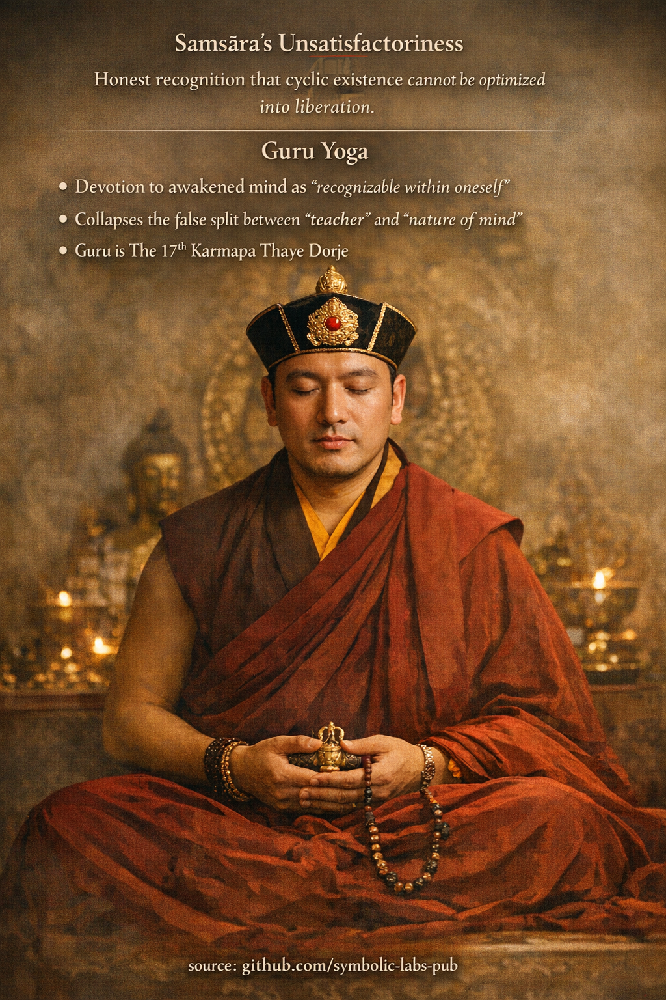

## [Čtvrtá praxe Ngöndro](https://github.com/symbolic-labs-pub/a-buddhist-view/blob/master/more/11_ngondro/4_guru_yoga/README.md#the-fourth-ngöndro-practice)

### **Neuspokojivost samsāry → Guru jóga**

V chápání **Ngöndro** školy Kagyü **čtvrtá praxe** dokončuje *vnější obracení mysli* a *otvírá vnitřní cestu*. Je to pant, kde **zřeknutí se dozrává na přímé rozpoznání**.

---

## 1) Neuspokojivost samsāry (Duḥkha cyklické existence)

Tato kontemplace **není pesimismus** a není to morální soud. Je to *diagnóza*.

### Co se rozpoznává

* **Všechny podmíněné stavy jsou nestabilní**
  Potěšení se rozpadá, bezpečnost se naruší, identita se fragmentuje.
* **Optimalizace se nerovná osvobození**
  Lepší okolnosti ≠ svoboda od narození, stárnutí, nemoci, smrti.
* **Kontrola je strukturálně nemožná**
  I úspěch posiluje připoutanost k tomu, co se změní.

> Klíčový vhled: ***Samsāra* není pokazená — funguje přesně tak, jak je navržena.**

Pokus o zdokonalení *samsāry* je jako pokus stabilizovat vlnu, zatímco zůstáváte v oceánu.

### Proč to záleží

Dokud tento vhled není **emocionálně internalizován**, praxe zůstává instrumentální:

* [meditace](../../08_lineage/README.md) se stává sebezlepšováním,
* [etika](../../01_core_teachings/the_noble_eightfold_path/README.md#2-ethical-conduct-śīla) se stává managementem reputace,
* oddanost se stává projekcí.

Čtvrtá kontemplace **přeřezává poslední naději**, že *samsāra* může být vybroušena na [probuzení](../../10_concepts/README.md#3-enlightenment-bodhi-awakening).

Ten řez vytváří *prostor*.

---

## 2) Guru jóga (bod obratu)

Když se naděje v *samsāru* zhroutí, mysl je konečně *dostupná*.

Guru jóga není uctívání.
Je to **trénink rozpoznání**.

### Co "Guru" skutečně znamená

* Guru **není osobnost**
* Guru **není vnější autorita**
* Guru je **živá funkce probuzené mysli**, učiněná *rozpoznatelnou*

V Kagyü je guru **rozhraní** mezi:

* netrénovaným obyčejným [vědomím](../../10_concepts/README.md#2-awareness-rigpa-vijñāna-knowing)
* a jeho vlastní již-probuzenou přirozeností

---

## 3) Oddanost jako kognitivní technologie

Oddanost zde je **přesné sladění**, ne emoce.

Vykonává tři funkce:

### 1. Kolabování rozdělení subjekt–objekt

* "Učitel" a "student" jsou provizorní role
* Guru jóga rozpouští přesvědčení, že probuzení je *někde jinde*

### 2. Obcházení ego-strategie

* Ego nemůže napodobit oddanost bez odhalení se
* Upřímnost odhaluje fixaci rychleji než analýza

### 3. Přenos struktury, ne informace

* Realizace je **strukturované vědomí**
* Guru jóga naladí mysl na ten vzor

Proto Kagyü zdůrazňuje **kontinuitu linie** nad filozofickou novostí.

---

## 4) 17. Karmapa Thaye Dorje v tomto kontextu

V současné praxi Kagyü **17. Karmapa Thaye [Dorje](../../09_symbols/02_dorje/README.md#dorje-vajra--explained-according-to-buddhist-teachings)** funguje jako **živý referenční bod** integrity linie.

Důležitá objasnění:

* **Nemedítuje se na něj jako na boha**
* **Není spasitel**
* Reprezentuje **nepřerušený přenos realizace [Mahāmudrā](../../04_kayas/mahamudra_and_dzogcsen/README.md#mahāmudrā-nature-of-mind-སེམས་ཀྱི་གནས་ལུགས་)**

Princip Karmapa je *strukturální*, ne osobní:

> Kdekoli se manifestuje autentická realizace, **mysl rozpoznává mysl**.

---

## 5) Proč Guru jóga přichází poslední v Ngöndro

Pořadí záleží.

| Bez předcházejících praxí  | S předcházejícími praxemi         |
| ------------------------ | ---------------------------- |
| Oddanost se stává fantazií | Oddanost se stává rozpoznáním |
| Guru se stává idealizovaným   | Guru se stává transparentním     |
| Praxe posiluje sebe | Praxe rozpouští sebe      |

[Neuspokojivost](../../02_from_ignorance_to_awakening/2_the_four_noble_truths/README.md#1-there-is-suffering--dukkha) *samsāry* **vyprázdňuje pohár**.
Guru jóga **ukazuje, co tam vždy bylo**.

---

## 6) Základní vhled čtvrté praxe

> **Osvobození se nedosahuje opravou zkušenosti,
> ale rozpoznáním přirozenosti toho, kdo zažívá.**

Guru jóga nic nepřidává.
**Odstraňuje poslední překážku**: přesvědčení, že probuzení patří někomu jinému.

---

### Jednověté shrnutí Kagyü

**Když je *samsāra* vidění jako nefunkční, oddanost se stává funkční — a rozpoznání se stává nevyhnutelným.**

---

< [Třetí praxe Ngöndro](../3_mandala_offering/README.md) | [Přípravné praktiky (Ngöndro)](../README.md) >

_zdroj: [github.com/symbolic-labs-pub](https://github.com/symbolic-labs-pub)_

---
