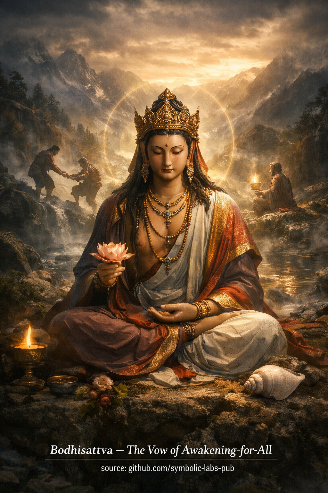

## [Erwachen ist nicht privat](https://github.com/symbolic-labs-pub/a-buddhist-view/blob/master/more/08_lineage/08_bodhisattva/README.md#awakening-is-not-private)

Lehre

# Der Bodhisattva-Pfad

## Erwachen ist nicht privat

### Eine Lehre über Erwachen-in-Beziehung

---

## 1. Die Kern-Umkehrung

Gewöhnliches Denken nimmt an:

> *Ich erwache, dann helfe ich anderen.*

Der **Bodhisattva-Pfad kehrt dies um**:

> *Erwachen tritt nur in Beziehung zu anderen auf.*

Dies ist kein moralischer Idealismus.
Es ist eine **Diagnose, wie Geist tatsächlich funktioniert**.

Solange Erwachen als *persönliche Errungenschaft* vorgestellt wird, bleibt subtiles Selbst-Anhaften.
Wo Selbst-Anhaften bleibt, ist Erwachen unvollständig.

---

## 2. Warum Erleuchtung nicht privat sein kann

Aus buddhistischer Sicht:

* [Leiden](../../../../../more/02_from_ignorance_to_awakening/2_the_four_noble_truths/README.md#1-there-is-suffering--dukkha) entsteht durch **Fehlwahrnehmung von Trennung**
* Befreiung entsteht durch **klares Sehen von Relationalität**

Wenn [Erwachen](../../../../../more/10_concepts/README.md#3-enlightenment-bodhi-awakening) privat wäre, würde es die Illusion verstärken, die es zu beenden behauptet.

Das Bodhisattva-Gelübde ist daher kein Altruismus.
Es ist **ontologische Korrektheit**.

Zu erwachen, während man andere ausschließt, wäre wie zu versuchen zu atmen, während man Luft verleugnet.

---

## 3. Weisheit und Mitgefühl: Nicht zwei Dinge

In früher Praxis erscheinen Weisheit und Mitgefühl als verschieden:

* **Weisheit** sieht [Unbeständigkeit](../../../../../more/01_core_teachings/impermanence/README.md#2-impermanence-anicca-is-structural-not-accidental), [Leerheit](../../../../../more/10_concepts/01_emptiness/README.md#emptiness-śūnyatā-in-vajrayāna-buddhism), [Nicht-Selbst](../../../../../more/02_from_ignorance_to_awakening/1_the_three_marks_of_existence/README.md#3-non-self-anattā)
* **Mitgefühl** reagiert auf Leiden

Auf dem Bodhisattva-Pfad werden sie als **zwei Ausdrücke einer Einsicht** verstanden:

* Weisheit ohne Mitgefühl wird kalte Distanziertheit
* Mitgefühl ohne Weisheit wird Erschöpfung

Wenn Leerheit wahrhaft gesehen wird, kollabiert Trennung.
Wenn Trennung kollabiert, wird Fürsorge automatisch.

So ist Mitgefühl **Leerheit in Aktion**.

---

## 4. Das Bodhisattva-Gelübde als strukturelle Ausrichtung

Das Gelübde wird oft als Versprechen missverstanden, *alle Wesen zu retten*.

Das ist unmöglich, wenn wörtlich genommen — und Buddhismus lehrt keine Unmöglichkeiten.

Das Gelübde tut tatsächlich dies:

* Es **entfernt Selbst-Ausnahme**
* Es richtet Wahrnehmung auf Interdependenz aus
* Es verhindert, dass Erwachen zu Identität kristallisiert

Das Gelübde formt **wie Wahrnehmung funktioniert** um, nicht welche Ergebnisse eintreten müssen.

Es ist eine **Richtung**, keine Ziellinie.

---

## 5. Erwachen in Bewegung

Ein Buddha repräsentiert **vollständige Verwirklichung in Ruhe**.
Ein Bodhisattva repräsentiert **Verwirklichung in Bewegung**.

Dieser Unterschied ist wichtig.

Leben ist dynamisch:

* Bedingungen verändern sich
* Leiden ändert Form
* Antworten müssen sich anpassen

Der Bodhisattva verkörpert Erwachen, das:

* Denkt
* Spricht
* Handelt
* Sich anpasst

Nicht perfekt — aber reaktionsfähig.

Erwachen ist nicht länger ein Zustand.
Es ist eine **Art zu funktionieren**.

---

## 6. Die ethische Konsequenz

Weil Erwachen relational ist:

* [Ethik](../../../../../more/01_core_teachings/the_noble_eightfold_path/README.md#2-ethical-conduct-śīla) sind keine Regeln
* Sie sind Ausdrücke von Klarheit

Ein Bodhisattva fragt nicht:

> *Ist dies erlaubt?*

Sondern:

> *Reduziert dies Verwirrung oder erhöht es sie?*

Ethisches Verhalten entsteht natürlich, wenn:

* Selbstzentrierter Bezug schwächer wird
* Ursache und Wirkung klar gesehen werden

Deshalb geht Moral Verwirklichung voraus, unterstützt sie und drückt sie aus.

---

## 7. Das stille Kriterium

Ein einfacher Test offenbart Bodhisattva-Ausrichtung:

> Macht dieser Gedanke, dieses Wort oder diese Handlung
> Erwachen verfügbarer — oder weniger verfügbar — für andere?

Wenn es das Feld zusammenzieht, ist es noch nicht vollständig.
Wenn es das Feld öffnet, stimmt es mit dem Pfad überein.

Dieser Test gilt gleichermaßen für:

* Sprache
* Arbeit
* Politik
* Technologie
* Lehren
* Schweigen

Der Bodhisattva-Pfad zieht sich nicht aus der Welt zurück.
Er **bewohnt sie intelligent**.

---

## 8. Abschließende Hinweise

Der Bodhisattva ist kein Heiliger, Retter oder Held.

Ein Bodhisattva ist jemand, der eine Sache klar verstanden hat:

> Es gibt keine Befreiung, die ausschließt.

Daher:

* Erwachen setzt sich fort
* Praxis setzt sich fort
* Reaktionsfähigkeit setzt sich fort

Nicht weil Erleuchtung fehlt —
sondern weil **Realität lebendig ist**.

---

### Abschließende Zeile (im Geist traditionell)

> Möge Weisheit Wahrnehmung klären.
> Möge Mitgefühl Antwort leiten.
> Möge Erwachen frei durch die Welt fließen.

Dies ist die **Bodhisattva-Lehre**.

---

Erklärung

## Erwachen ist nicht privat

### Eine Lehre über Erwachen-in-Beziehung

---

## 1. Die Kern-Umkehrung

Gewöhnliches Denken nimmt an:

> *Ich erwache, dann helfe ich anderen.*

Der **Bodhisattva-Pfad kehrt dies um**:

> *Erwachen tritt nur in Beziehung zu anderen auf.*

Dies ist kein moralischer Idealismus.
Es ist eine **Diagnose, wie Geist tatsächlich funktioniert**.

Solange Erwachen als *persönliche Errungenschaft* vorgestellt wird, bleibt subtiles Selbst-Anhaften.
Wo Selbst-Anhaften bleibt, ist Erwachen unvollständig.

---

## 2. Warum Erleuchtung nicht privat sein kann

Aus buddhistischer Sicht:

* Leiden entsteht durch **Fehlwahrnehmung von Trennung**
* Befreiung entsteht durch **klares Sehen von Relationalität**

Wenn Erwachen privat wäre, würde es die Illusion verstärken, die es zu beenden behauptet.

Das Bodhisattva-Gelübde ist daher kein Altruismus.
Es ist **ontologische Korrektheit**.

Zu erwachen, während man andere ausschließt, wäre wie zu versuchen zu atmen, während man Luft verleugnet.

---

## 3. Weisheit und Mitgefühl: Nicht zwei Dinge

In früher Praxis erscheinen Weisheit und Mitgefühl als verschieden:

* **Weisheit** sieht Unbeständigkeit, Leerheit, Nicht-Selbst
* **Mitgefühl** reagiert auf Leiden

Auf dem Bodhisattva-Pfad werden sie als **zwei Ausdrücke einer Einsicht** verstanden:

* Weisheit ohne Mitgefühl wird kalte Distanziertheit
* Mitgefühl ohne Weisheit wird Erschöpfung

Wenn Leerheit wahrhaft gesehen wird, kollabiert Trennung.
Wenn Trennung kollabiert, wird Fürsorge automatisch.

So ist Mitgefühl **Leerheit in Aktion**.

---

## 4. Das Bodhisattva-Gelübde als strukturelle Ausrichtung

Das Gelübde wird oft als Versprechen missverstanden, *alle Wesen zu retten*.

Das ist unmöglich, wenn wörtlich genommen — und Buddhismus lehrt keine Unmöglichkeiten.

Das Gelübde tut tatsächlich dies:

* Es **entfernt Selbst-Ausnahme**
* Es richtet Wahrnehmung auf Interdependenz aus
* Es verhindert, dass Erwachen zu Identität kristallisiert

Das Gelübde formt **wie Wahrnehmung funktioniert** um, nicht welche Ergebnisse eintreten müssen.

Es ist eine **Richtung**, keine Ziellinie.

---

## 5. Erwachen in Bewegung

Ein Buddha repräsentiert **vollständige Verwirklichung in Ruhe**.
Ein Bodhisattva repräsentiert **Verwirklichung in Bewegung**.

Dieser Unterschied ist wichtig.

Leben ist dynamisch:

* Bedingungen verändern sich
* Leiden ändert Form
* Antworten müssen sich anpassen

Der Bodhisattva verkörpert Erwachen, das:

* Denkt
* Spricht
* Handelt
* Sich anpasst

Nicht perfekt — aber reaktionsfähig.

Erwachen ist nicht länger ein Zustand.
Es ist eine **Art zu funktionieren**.

---

## 6. Die ethische Konsequenz

Weil Erwachen relational ist:

* Ethik sind keine Regeln
* Sie sind Ausdrücke von Klarheit

Ein Bodhisattva fragt nicht:

> *Ist dies erlaubt?*

Sondern:

> *Reduziert dies Verwirrung oder erhöht es sie?*

Ethisches Verhalten entsteht natürlich, wenn:

* Selbstzentrierter Bezug schwächer wird
* Ursache und Wirkung klar gesehen werden

Deshalb geht Moral Verwirklichung voraus, unterstützt sie und drückt sie aus.

---

## 7. Das stille Kriterium

Ein einfacher Test offenbart Bodhisattva-Ausrichtung:

> Macht dieser Gedanke, dieses Wort oder diese Handlung
> Erwachen verfügbarer — oder weniger verfügbar — für andere?

Wenn es das Feld zusammenzieht, ist es noch nicht vollständig.
Wenn es das Feld öffnet, stimmt es mit dem Pfad überein.

Dieser Test gilt gleichermaßen für:

* Sprache
* Arbeit
* Politik
* Technologie
* Lehren
* Schweigen

Der Bodhisattva-Pfad zieht sich nicht aus der Welt zurück.
Er **bewohnt sie intelligent**.

---

## 8. Abschließende Hinweise

Der Bodhisattva ist kein Heiliger, Retter oder Held.

Ein Bodhisattva ist jemand, der eine Sache klar verstanden hat:

> Es gibt keine Befreiung, die ausschließt.

Daher:

* Erwachen setzt sich fort
* Praxis setzt sich fort
* Reaktionsfähigkeit setzt sich fort

Nicht weil Erleuchtung fehlt —
sondern weil **Realität lebendig ist**.

---

### Abschließende Zeile (im Geist traditionell)

> Möge Weisheit Wahrnehmung klären.
> Möge Mitgefühl Antwort leiten.
> Möge Erwachen frei durch die Welt fließen.

Dies ist die **Bodhisattva-Lehre**.

---

## Bodhisattva-Meditation

### *Erwachen-in-Beziehung-Praxis*

Dies ist keine Visualisierung einer Gottheit.
Es ist ein **Training in Orientierung**.

> ⚠️ **Hinweis zum Umfang**
> Was folgt, ist eine **nicht-ermächtigende kontemplative Form** (eine *Praxis der Bedeutung*).
> Sie **ersetzt nicht** die Übertragung der Linie (*wang, lung, tri*).
> Ihre Funktion ist **Stabilisierung, Aspiration und kausale Ausrichtung**, nicht tantrische Autorisierung.

---

## 1. Vorbereitung — Den Grund etablieren

Sitze bequem. Wirbelsäule aufrecht, Körper entspannt.
Lass den Atem sich setzen, ohne ihn zu kontrollieren.

Bringe in Bewusstheit:

> *Erwachen ist nicht für mich allein.*

Mache dies nicht emotional.
Lass es als **strukturelle Tatsache** landen.

---

## 2. Eröffnende Kontemplation — Das Bodhisattva-Gelübde

Reflektiere still:

* Jedes Wesen sucht Befreiung vom Leiden
* Kein Wesen erwacht in Isolation
* Weisheit ohne Mitgefühl bricht auseinander
* Mitgefühl ohne Weisheit erschöpft sich

Lass diese Reflexionen **Motivation neu gestalten**, nicht Stimmung.

Dann forme sanft die Absicht:

> *Möge diese Praxis allen Wesen dienen, direkt oder indirekt.*

Diese Absicht ist die **Achse** der Meditation.

---

## 3. Kernpraxis — Ko-Entstehung von Weisheit und Mitgefühl

### Phase A: Weisheit (klar sehen)

Ruhe Gewahrsein auf Erfahrung, wie sie ist:

* Empfindungen entstehen
* Gedanken entstehen
* Emotionen entstehen

Bemerke:

* Keine sind fest
* Keine bleiben
* Keine gehören zu einem festen "Selbst"

Analysiere nicht.
Sieh einfach **Entstehen und Auflösen**.

Dies ist **prajñā** — Klarheit ohne Kommentar.

---

### Phase B: Mitgefühl (reagieren ohne Greifen)

Nun erweitere Gewahrsein, um andere einzuschließen:

* Menschen, die du kennst
* Menschen, die du nicht kennst
* Wesen, die auf offensichtliche und unsichtbare Weisen kämpfen

Stelle dir keine Geschichten vor.
Erkenne einfach:

> *Dieses Leiden fühlt sich für sie real an.*

Erlaube eine **nicht-sentimentale Wärme** zu entstehen.

Dies ist **karuṇā** — Reaktionsfähigkeit ohne Selbstbezug.

---

### Phase C: Integration — Erwachen in Bewegung

Nun lass die Unterscheidung fallen.

Lass Klarheit und Fürsorge **zusammen** funktionieren:

* Leiden klar sehen
* Reagieren ohne Anhaften
* Handeln ohne Anerkennung zu brauchen

Ruhe hier.

Dies ist der **Bodhisattva-Modus**:

> Gewahrsein, das sich bewegt.

---

## 4. Mit Hindernissen arbeiten

Wenn Stolz entsteht:

* Erkenne ihn als Fixierung
* Lass ihn sich auflösen

Wenn Erschöpfung entsteht:

* Erkenne Mitgefühl ohne Weisheit
* Kehre zu Klarheit zurück

Wenn Leerheit sich kalt anfühlt:

* Lass Mitgefühl sie erwärmen

Wenn Mitgefühl sich schwer anfühlt:

* Lass Weisheit sie erleichtern

Hindernisse sind **Diagnostik**, keine Misserfolge.

---

## 5. Widmung — Die Praxis versiegeln

Schließe mit Widmung:

> *Was auch immer an Klarheit oder Nutzen hier entstand,
> möge es eine Ursache für das Erwachen aller Wesen werden.*

Dramatisiere dies nicht.
Widmung **stabilisiert Kausalität**.

---

## 6. Fortsetzung außerhalb der Übung — Die wahre Praxis

Das Bodhisattva-Gelübde lebt **außerhalb der Meditation**.

Trainiere in drei täglichen Erkenntnissen:

1. **Vor dem Sprechen**
   Frage: *Reduziert dies Verwirrung oder erhöht es sie?*

2. **Vor dem Handeln**
   Frage: *Zieht dies Leiden zusammen oder lockert es es?*

3. **Beim Reagieren**
   Frage: *Wie würde Klarheit plus Fürsorge hier aussehen?*

Keine Heldentaten.
Kein Perfektionismus.

Nur **konsistente Orientierung**.

---

## Schlüsseleinsicht zum Mitnehmen

> Ein Bodhisattva ist nicht jemand, der die Welt rettet.
> Ein Bodhisattva ist jemand, der **aufhört, andere vom Erwachen auszuschließen**.

---

Meditation

## Bodhisattva-Meditation

### *Erwachen-in-Beziehung-Praxis*

Dies ist keine Visualisierung einer Gottheit.
Es ist ein **Training in Orientierung**.

> ⚠️ **Hinweis zum Umfang**
> Was folgt, ist eine **nicht-ermächtigende kontemplative Form** (eine *Praxis der Bedeutung*).
> Sie **ersetzt nicht** die Übertragung der Linie (*wang, lung, tri*).
> Ihre Funktion ist **Stabilisierung, Aspiration und kausale Ausrichtung**, nicht tantrische Autorisierung.

---

## 1. Vorbereitung — Den Grund etablieren

Sitze bequem. Wirbelsäule aufrecht, Körper entspannt.
Lass den Atem sich setzen, ohne ihn zu kontrollieren.

Bringe in Bewusstheit:

> *Erwachen ist nicht für mich allein.*

Mache dies nicht emotional.
Lass es als **strukturelle Tatsache** landen.

---

## 2. Eröffnende Kontemplation — Das Bodhisattva-Gelübde

Reflektiere still:

* Jedes Wesen sucht Befreiung vom Leiden
* Kein Wesen erwacht in Isolation
* Weisheit ohne Mitgefühl bricht auseinander
* Mitgefühl ohne Weisheit erschöpft sich

Lass diese Reflexionen **Motivation neu gestalten**, nicht Stimmung.

Dann forme sanft die Absicht:

> *Möge diese Praxis allen Wesen dienen, direkt oder indirekt.*

Diese Absicht ist die **Achse** der Meditation.

---

## 3. Kernpraxis — Ko-Entstehung von Weisheit und Mitgefühl

### Phase A: Weisheit (klar sehen)

Ruhe [Gewahrsein](../../../../../more/10_concepts/README.md#2-awareness-rigpa-vijñāna-knowing) auf Erfahrung, wie sie ist:

* Empfindungen entstehen
* Gedanken entstehen
* Emotionen entstehen

Bemerke:

* Keine sind fest
* Keine bleiben
* Keine gehören zu einem festen "Selbst"

Analysiere nicht.
Sieh einfach **Entstehen und Auflösen**.

Dies ist **prajñā** — Klarheit ohne Kommentar.

---

### Phase B: Mitgefühl (reagieren ohne Greifen)

Nun erweitere Gewahrsein, um andere einzuschließen:

* Menschen, die du kennst
* Menschen, die du nicht kennst
* Wesen, die auf offensichtliche und unsichtbare Weisen kämpfen

Stelle dir keine Geschichten vor.
Erkenne einfach:

> *Dieses Leiden fühlt sich für sie real an.*

Erlaube eine **nicht-sentimentale Wärme** zu entstehen.

Dies ist **karuṇā** — Reaktionsfähigkeit ohne Selbstbezug.

---

### Phase C: Integration — Erwachen in Bewegung

Nun lass die Unterscheidung fallen.

Lass Klarheit und Fürsorge **zusammen** funktionieren:

* Leiden klar sehen
* Reagieren ohne Anhaften
* Handeln ohne Anerkennung zu brauchen

Ruhe hier.

Dies ist der **Bodhisattva-Modus**:

> Gewahrsein, das sich bewegt.

---

## 4. Mit Hindernissen arbeiten

Wenn Stolz entsteht:

* Erkenne ihn als Fixierung
* Lass ihn sich auflösen

Wenn Erschöpfung entsteht:

* Erkenne Mitgefühl ohne Weisheit
* Kehre zu Klarheit zurück

Wenn Leerheit sich kalt anfühlt:

* Lass Mitgefühl sie erwärmen

Wenn Mitgefühl sich schwer anfühlt:

* Lass Weisheit sie erleichtern

Hindernisse sind **Diagnostik**, keine Misserfolge.

---

## 5. Widmung — Die Praxis versiegeln

Schließe mit Widmung:

> *Was auch immer an Klarheit oder Nutzen hier entstand,
> möge es eine Ursache für das Erwachen aller Wesen werden.*

Dramatisiere dies nicht.
Widmung **stabilisiert Kausalität**.

---

## 6. Fortsetzung außerhalb der Übung — Die wahre Praxis

Das Bodhisattva-Gelübde lebt **außerhalb der Meditation**.

Trainiere in drei täglichen Erkenntnissen:

1. **Vor dem Sprechen**
   Frage: *Reduziert dies Verwirrung oder erhöht es sie?*

2. **Vor dem Handeln**
   Frage: *Zieht dies Leiden zusammen oder lockert es es?*

3. **Beim Reagieren**
   Frage: *Wie würde Klarheit plus Fürsorge hier aussehen?*

Keine Heldentaten.
Kein Perfektionismus.

Nur **konsistente Orientierung**.

---

## Schlüsseleinsicht zum Mitnehmen

> Ein Bodhisattva ist nicht jemand, der die Welt rettet.
> Ein Bodhisattva ist jemand, der **aufhört, andere vom Erwachen auszuschließen**.

Dies ist **Erwachen in Bewegung**.

---

< [Kalu Rinpoche](../07_kalu_rinpoche/README.md) | [**Eine buddhistische Lehre: Milarepa und das Gesetz irreversibler Transformation**](../09_milarepa/README.md) >

_Quelle: [github.com/symbolic-labs-pub](https://github.com/symbolic-labs-pub)_

---
