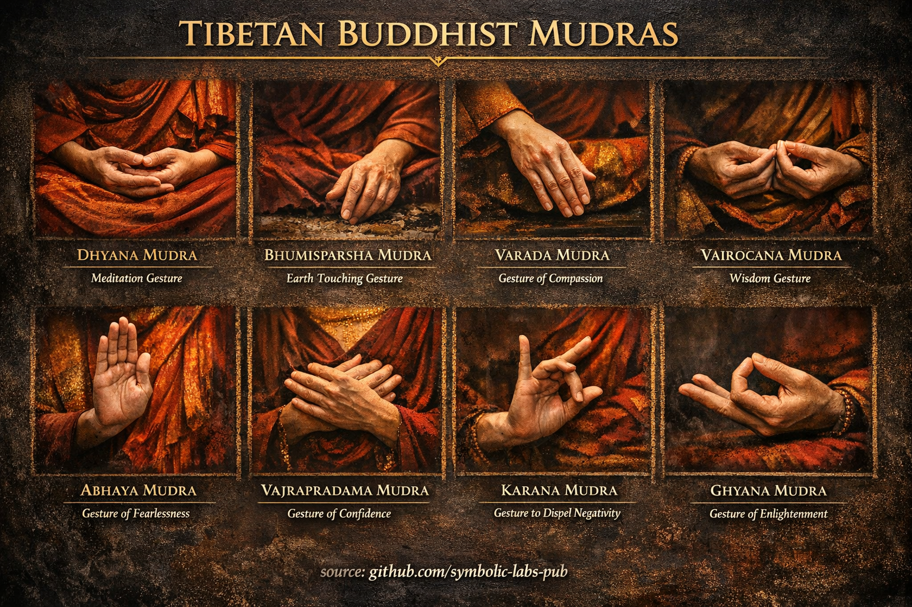

## [Mudras in buddhistischen Lehren](https://github.com/symbolic-labs-pub/a-buddhist-view/blob/languages/de/master/more/09_symbols/11_mudra/README.md#mudras-in-buddhistischen-lehren)

---

Im Buddhismus sind **Mudras** **absichtsvolle Handgesten**, die **Zustände des erwachten Geistes verkörpern**. Sie sind nicht dekorativ, symbolische Kurzschrift oder bloße rituelle Gewohnheiten. Ein Mudra ist **eine physische Konfiguration, die Kognition, Absicht und Verwirklichung gleichzeitig stabilisiert**.

Im Vajrayana und tibetischen Buddhismus besonders werden **Körper, Rede und Geist zusammen trainiert**. Mudras gehören zum **Körpertor**, aber sie konditionieren direkt das **Geisttor**.

> Ein Mudra ist **Geist, sichtbar gemacht durch den Körper**.

---

## Was Mudras tatsächlich tun (funktional)

Aus buddhistischer technischer Perspektive erfüllen Mudras vier Kernfunktionen:

### 1. **Kognitive Verankerung**

Die Körperhaltung **verriegelt Aufmerksamkeit** in einen spezifischen Modus des [Gewahrseins](../../10_concepts/README.md#2-gewahrsein-rigpa-vijnana-wissen).

* Verhindert Abdrift in Diskursivität
* Gibt dem Geist eine *Form* zum Verweilen

### 2. **Verkörperung der Sicht**

Jedes Mudra entspricht einer **verwirklichten Perspektive**:

* Furchtlosigkeit
* Nicht-Anhaftung
* Geerdetepräsenz
* Mitfühlendes Handeln

Man *drückt* diese Qualitäten nicht aus – man **nimmt ihre Struktur an**.

### 3. **Energetische Regulation (Vajrayana-Sicht)**

Mudras organisieren subtile Kanäle (*Tsa*), Winde (*Lung*) und Tropfen (*Thigle*).

* Dies ist **somatische Neuro-Regulation**, kein Aberglaube
* Vergleichbar mit moderner verkörperter Kognitionstheorie

### 4. **Abstammungs-Kodierung**

Bestimmte Mudras sind **abstammungsspezifische Anweisungen**, übertragen ohne Worte.

* Sie bewahren Verwirklichung, wenn Sprache sie verzerren würde
* Deshalb bleiben Mudras über Jahrhunderte konsistent

---

## Kernprinzip: Mudra ≠ Symbol

Eine kritische buddhistische Unterscheidung:

| Kein Mudra | Ein Mudra |
| ---------------- | -------------------------- |
| Geste als Zeichen | Geste als **Zustand** |
| Kulturelles Symbol | **Kognitive Architektur** |
| Ausdrucksvoll | **Stabilisierend** |
| Externe Bedeutung | **Interne Ausrichtung** |

Mudras funktionieren **nur wenn gepaart mit korrekter Absicht und Sicht**. Ohne das sind sie [leere](../../10_concepts/01_emptiness/README.md#leerheit-sunyata-im-vajrayana-buddhismus) Formen.

---

## Beispiele von Bedeutung auf struktureller Ebene

### Dhyana Mudra (Meditationsgeste)

* Hände bilden einen geschlossenen Kreislauf
* Repräsentiert **nicht-duales Gleichgewicht**
* Verwendet, um **ununterbrochenes Gewahrsein** zu trainieren

### Bhumisparsha Mudra (Erd-Berührung)

* Ruft Wirklichkeit selbst als Zeugen an
* Repräsentiert **unerschütterliche Erdung**
* Verwendet bei Konfrontation mit Zweifel, Angst oder innerer Fragmentierung

### Abhaya Mudra (Furchtlosigkeit)

* Nicht Beruhigung, sondern **Abwesenheit von Bedrohung**
* Trainiert Nervensystem, offen zu bleiben ohne Verteidigung

### Varada Mudra (Geben / Mitgefühl)

* Offene Handfläche nach unten
* Verkörpert **mühelose Großzügigkeit**
* Handlung ohne Festhalten an Ergebnissen

---

## Warum Mudras kraftvoll sind (selbst ohne Glauben)

Mudras funktionieren **prä-konzeptuell**.

Sie wirken, weil:

* Das Nervensystem auf Haltung reagiert
* Aufmerksamkeit körperlicher Konfiguration folgt
* Bedeutung aus **verkörperter Struktur** entsteht, nicht aus Glauben

Dies stimmt überein mit:

* Verkörperter Kognitionsforschung
* Prädiktiven Verarbeitungsmodellen
* Somatischen [Achtsamkeits](../../01_core_teachings/the_noble_eightfold_path/README.md#7-rechte-achtsamkeit-samma-sati)praktiken

Buddhismus entdeckte dies **vor 2.500 Jahren**, empirisch.

---

## Eine subtile, aber entscheidende Lehre

> Mudras *verursachen* [Erwachen](../../10_concepts/README.md#3-erleuchtung-bodhi-erwachen) nicht.
> Sie **entfernen Reibung**, damit Erwachen erkannt werden kann.

Sie sind **Einschränkungen, die Rauschen reduzieren**, wodurch Klarheit erscheinen kann.

---

## Wie man Mudras korrekt verwendet (Praxisrat)

1. **Nicht überspannen** – entspannte Präzision ist der Schlüssel
2. **Mudra auf Absicht abstimmen**, nicht auf Stimmung
3. **Stetig halten**, ohne Zappeln
4. **Ohne Anhaftung loslassen** – das Mudra endet, die Sicht bleibt

Wenn Spannung erscheint, ist das Mudra zu Kontrolle geworden – loslassen und neu beginnen.

---

## Abschließende Einsicht

Mudras sind **stumme Anweisungen**.

Sie lehren ohne Worte:

* Wie zu sitzen
* Wie zu handeln
* Wie unerschüttert zu bleiben

In fortgeschrittener Praxis **wird der Körper selbst zur Lehre**.

---

< [Was ein Mantra *ist* (buddhistische Sicht)](../10_mantra/README.md) | [Die Glocke (Ghanta)](../12_bell/README.md) >

_Quelle: [github.com/symbolic-labs-pub](https://github.com/symbolic-labs-pub)_

---
