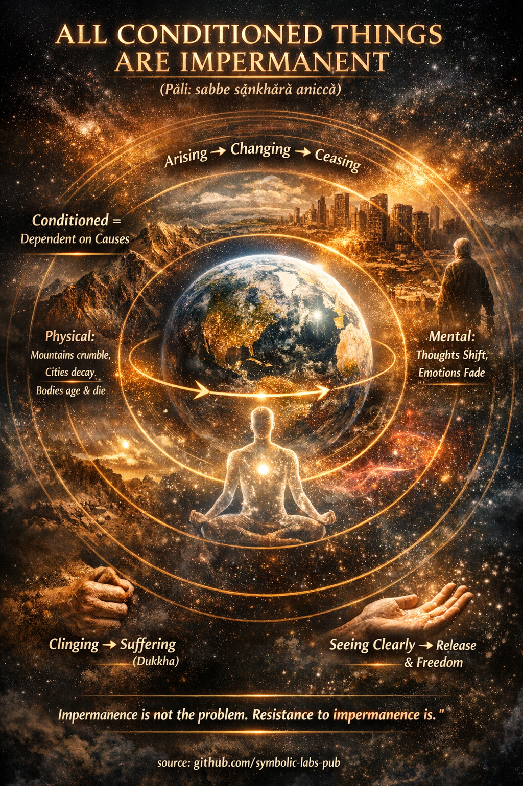

## ["Todas las cosas condicionadas son impermanentes"](https://github.com/symbolic-labs-pub/a-buddhist-view/blob/master/languages/es/more/01_core_teachings/impermanence/README.md#all-conditioned-things-are-impermanent)

**(Pāli: *sabbe saṅkhārā aniccā*)**

### 1. Lo que *saṅkhārā* realmente significa

En la enseñanza budista, *saṅkhārā* se refiere a **todos los fenómenos condicionados**—cualquier cosa que:

* surge debido a **causas y condiciones**
* depende de otros factores para existir
* es **fabricada, compuesta o construida**

Esto incluye:

* materia física (cuerpos, objetos, entornos)
* formaciones mentales (pensamientos, emociones, intenciones)
* construcciones sociales y existenciales (roles, identidades, instituciones, creencias)

La realidad incondicionada (*asaṅkhata*), por contraste, se refiere solamente a **Nibbāna**—aquello que no surge ni cesa.

---

### 2. La impermanencia (*anicca*) es estructural, no accidental

Según el análisis del Buda de la realidad:

> Lo que está condicionado **debe cambiar**, porque las condiciones que lo sostienen son en sí mismas inestables.

Esta no es una observación poética—es una **comprensión similar a una ley** sobre la causalidad (*paṭicca-samuppāda*, [origen dependiente](../../02_from_ignorance_to_awakening/3_dependent_origination/README.md#the-twelve-links-the-classic-formulation)).

* Cuando las causas cambian → los efectos cambian
* Cuando las condiciones de apoyo se disuelven → el fenómeno cesa

Por lo tanto, la impermanencia **no es algo que le sucede a las cosas**
→ es **lo que las cosas son**.

---

### 3. Impermanencia a todas las escalas

**Física**

* Los cuerpos envejecen, se deterioran y mueren
* Las montañas se erosionan, las estrellas se consumen
* Las civilizaciones surgen y colapsan

**Mental**

* Los pensamientos parpadean momento a momento
* Las emociones surgen, alcanzan su pico y se disuelven
* Las intenciones cambian con las condiciones

**Existencial**

* La identidad es un proceso, no un núcleo
* Los roles existen solo relacionalmente
* Las creencias dependen del contexto, cultura y estado mental

En el análisis budista temprano, incluso un solo momento de experiencia ya está **en flujo**.

---

### 4. Por qué la impermanencia lleva al sufrimiento (*dukkha*)

El Buda **no** dijo que la impermanencia misma es [sufrimiento](../../02_from_ignorance_to_awakening/2_the_four_noble_truths/README.md#1-there-is-suffering--dukkha).

El sufrimiento surge porque:

* nos **aferramos** a lo que cambia
* exigimos estabilidad de lo que no puede proporcionarla
* buscamos control sobre lo que no es poseible

> "Lo que es impermanente es poco confiable.
> Lo que es poco confiable es insatisfactorio."

Es por eso que *anicca → dukkha → anattā* (impermanencia → insatisfacción → [no-yo](../../02_from_ignorance_to_awakening/1_the_three_marks_of_existence/README.md#3-non-self-anattā)) forman una cadena de comprensión única.

---

### 5. La visión, no la creencia, es la cura

El budismo no pide un acuerdo intelectual.
Pide **ver directamente** (*[vipassanā](../../05_yanas/shikantaza_and_vipassana/README.md#1-vipassanā-theravāda-insight---"feature-extraction-de-reification")*).

Cuando la impermanencia se ve claramente:

* el apego se afloja naturalmente
* el miedo a la pérdida disminuye
* el anhelo pierde su fuerza
* la identidad se suaviza

La libertad surge **no al detener el cambio**,
sino al **ya no resistirlo**.

---

### 6. La impermanencia es liberadora, no pesimista

Desde una perspectiva budista:

* Si las cosas fueran permanentes → la liberación sería imposible
* Porque las cosas cambian → la transformación es posible
* El [despertar](../../10_concepts/README.md#3-enlightenment-bodhi-awakening) mismo depende de la impermanencia

> La impermanencia es la **abertura** por la cual entra la libertad.

---

En palabras atribuidas a **Gautama Buda**:

> "Todas las cosas condicionadas son impermanentes.
> Cuando uno ve esto con [sabiduría](../the_noble_eightfold_path/README.md#1-sabiduría-paññā),
> uno se aparta del sufrimiento."

---

< [Enseñanzas Fundamentales](../README.md) | [Qué significa "Pāramitā" en el budismo](../perfections/README.md) >

_fuente: [github.com/symbolic-labs-pub](https://github.com/symbolic-labs-pub)_

---
