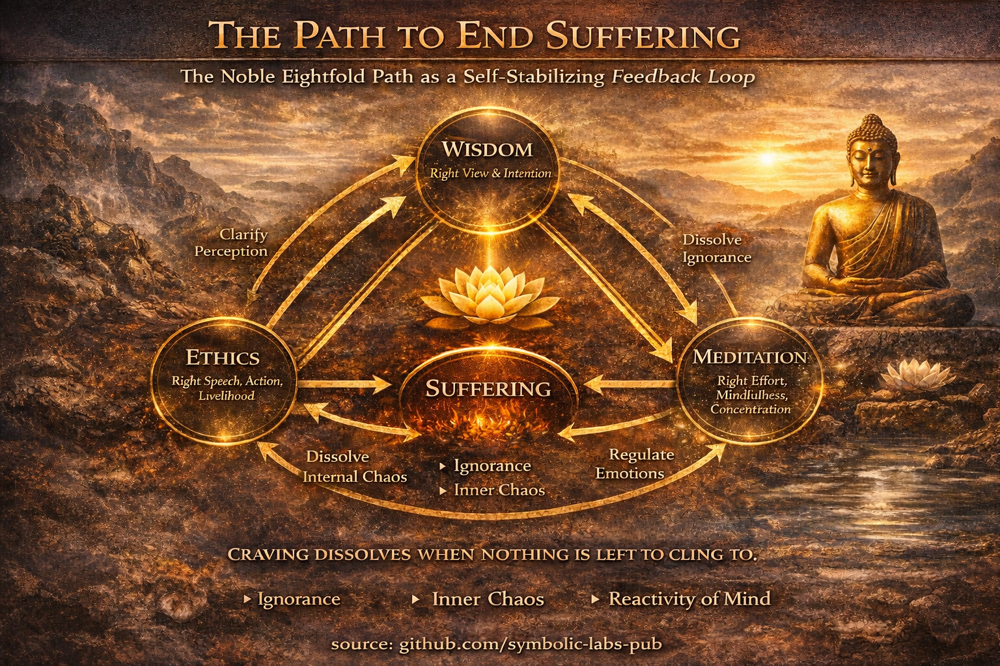
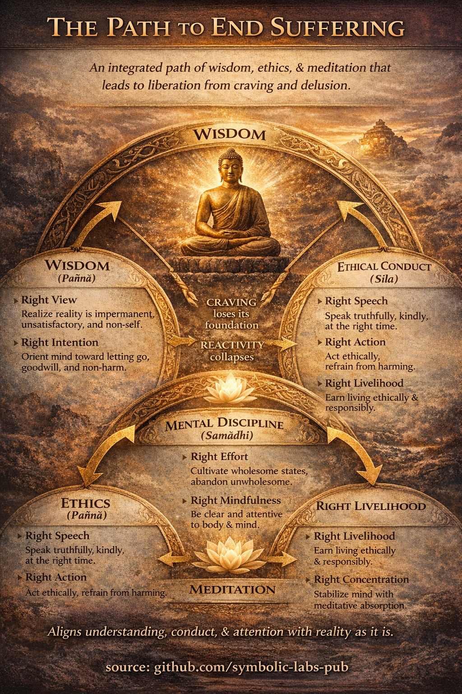

## [Mida "kannatuse lõpetamine" tegelikult tähendab](https://github.com/symbolic-labs-pub/a-buddhist-view/blob/master/languages/et/more/03_the_path_to_end_suffering/README.md#what-ending-suffering-actually-means)

Budistlikus õpetuses *kannatuse lõpetamine* **ei** tähenda:

* valu kõrvaldamist,
* maailma kontrollimist,
* või püsiva naudingu saavutamist.

See tähendab **ebavajaliku kannatuse lõpetamist** — kannatust, mis tekib:

* tegelikkuse vääratimõistmisest,
* muutuva külge klammerdumisel,
* ja sellega samastumisest, mis ei ole stabiilne mina.

Seda lakkamist nimetatakse **nirvāṇa**-ks: kannatust tekitavate mehhanismide *lahtiharutamine*.

---

## Põhidiagnoos (miks kannatus tekib)

Kannatus tekib **teadmatusest (avidyā)** — täpsemalt:

* [muutlikkuse](../01_core_teachings/impermanence/README.md#2-impermanence-anicca-is-structural-not-accidental) teadmatus,
* [mitte-mina](../02_from_ignorance_to_awakening/1_the_three_marks_of_existence/README.md#3-non-self-anattā) teadmatus,
* põhjusliku sõltuvuse teadmatus.

Teadmatusest järgneb:

* igatsus,
* vastumeelsus,
* harjumuspärased reaktsioonid,
* ja ähvardatud või mittetäieliku "mina" tunne.

Tee on seega **mitte moraalne karistus või preemia**, vaid **põhjuslik parandus**.

---

## Tee kannatuse lõpetamiseks: ainus kaheksakordne tee

Buddha õpetas **ühte integreeritud teed**, mis on tavaliselt rühmitatud **kolme vastastikku tugevdavasse valdkonda**.

---

## 1. Tarkus (paññā) — *arusaamatu parandamine*

### Õige vaade

Tegelikkuse täpne nägemine:

* asjad on muutlikud,
* klammerdumine tekitab kannatust,
* tegudel on tagajärjed.

See ei ole usk — see on *järk-järgult kinnitatud arusaam*.

### Õige kavatsus

Meele suunamine:

* loobumise poole (lahti laskmine),
* heasoovlikkuse poole (mitte-viha),
* mitte-kahjustamise poole.

**Tarkus alustab teed**, sest ilma selleta läheb pingutus valesse suunda.

---

## 2. Eetiline käitumine (śīla) — *elutingimuste stabiliseerimine*

### Õige kõne

Rääkimine ausalt, lahkelt ja õigel ajal.

### Õige tegevus

Tegude vältimine, mis põhjustavad kahju endale või teistele.

### Õige elatis

Elatise teenimine ilma teisi ärakasutamata, petta või vigastamata.

**Miks eetika on oluline**
Ebaeetiline käitumine tekitab erutust, süütunnet, hirmu ja kaitsvat hoiakut — muutes arusaamise võimatuks.

Eetika ei ole moraalism; see on **süsteemi stabiliseerimine**.

---

## 3. Vaimne distsipliin (samādhi) — *meele ümberprogrammeerimine*

### Õige pingutus

* Takistada ebasoodsate seisundite tekkimist
* Hülgata need, mis on tekkinud
* Arendada soodsaid seisundeid
* Säilitada neid

### Õige teadlikkus

Selge [teadlikkus](../10_concepts/README.md#2-awareness-rigpa-vijñāna-knowing):

* kehast,
* tunnetest,
* vaimsetest seisunditest,
* kogemuse mustrist.

[Teadlikkus](../01_core_teachings/the_noble_eightfold_path/README.md#7-right-mindfulness-sammā-sati) paljastab igatsuse *selle kujunemisel*, enne kui see muutub kannatuseks.

### Õige keskendumine

Sügav vaimne ühinemine ([meditatiivne](../08_lineage/README.md) süvenemine), mis võimaldab:

* selgust,
* emotsionaalset regulatsiooni,
* ja mõistmist väljaspool mõistelist mõtlemist.

---

## Kuidas tee lõpetab kannatuse (põhjuslik loogika)

1. **Eetika vähendab välist ja sisemist kaost**
2. **Meditatsioon stabiliseerib tähelepanu ja emotsioone**
3. **Tarkus näeb läbi fikseeritud mina illusiooni**
4. **Igatsus kaotab oma aluse**
5. **Reaktiivsus kokku variseb**
6. **Kannatus lakkab — mitte jõuga, vaid kütuse puudumise tõttu**

> Kannatus lõpeb samamoodi nagu tuli lõpeb:
> **kui ei ole enam midagi põletada.**

---

## Mida see *ei ole*

* Mitte pime usk
* Mitte eneseeitamine selle enda pärast
* Mitte tagasitõmbumine elust
* Mitte emotsionaalne tuimus

[Valgustumist](../10_concepts/README.md#3-enlightenment-bodhi-awakening) kirjeldatakse kui:

* selgust ilma jäikuseta,
* [kaastunnet](../02_from_ignorance_to_awakening/7_compassion/README.md#compassion-as-a-structural-principle-in-buddhist-teaching) ilma kohustuseta,
* osalemist ilma kinnituseta.

---

## Ühe lause kokkuvõte

**Tee kannatuse lõpetamiseks töötab, kooskõlastades arusaamise, käitumise ja tähelepanu sellega, kuidas tegelikkus tegelikult toimib — nii et igatsus, hirm ja vale identiteet enam ei teki.**

---

---

< [1. Kolm eksistentsi tunnust](../02_from_ignorance_to_awakening/README.md) | [Õpetus valgustumise kolmest kehast](../04_kayas/README.md) >

_allikas: [github.com/symbolic-labs-pub](https://github.com/symbolic-labs-pub)_

---
