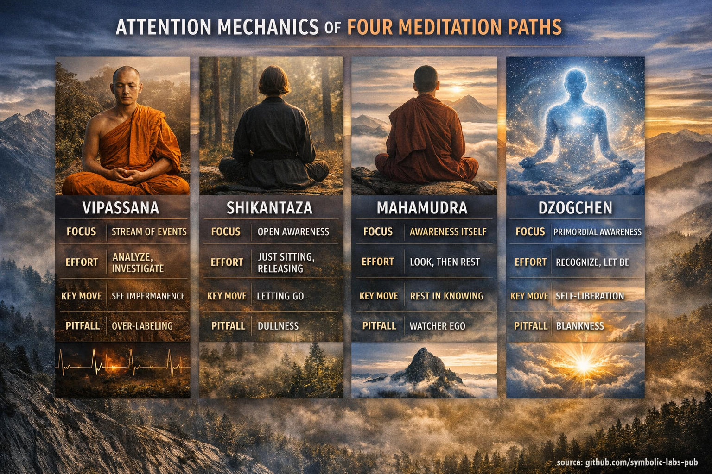

## [Jagatud alus: 3 tähelepanu nuppu](https://github.com/symbolic-labs-pub/a-buddhist-view/blob/master/languages/et/more/05_yanas/shikantaza_and_vipassana/README.md#shared-baseline-3-knobs-of-attention)

Kõik neli meetodit manipuleerivad mingit kombinatsiooni:

1. **Selektiivsus** — kitsas vs avatud väli (täpivalgus vs valgusvoolu)
2. **Pingutus** — aktiivne kontroll vs pingutusetu kohalolek
3. **Reifikatsioon** — kas sa käsitled kogemust kui "asju" (objekte) või kui "avaldus/teadmine"

Kasulik vaimne mudel:

* **Samatha-stiil**: vähenda müra (stabiliseeri)
* **Arusaama-stiil**: suurenda eraldusvõimet (näe struktuuri)
* **Mitteduaalse-stiil**: muuda *viitekaarti* (teadmine tunneb ära iseenda)

---

## 1) Vipassanā (Theravāda arusaam) — "tunnuse eraldamine + de-reifikatsioon"

### Objekti mudel

Kogemus parsitakse **sündmusteks**: aistingud, tunded, kavatsused, mõtted.
Tähelepanu õpib nägema **tekkimist/kadumist** ja põhjuslikke seoseid.

### Kontrolliring (mehaanika)

* Algab sageli **ankurdamisega** (hingamine/keha) stabiilsuse loomiseks
* Siis **süstemaatiline märkamine** või selge vaatlus:

  * märgista/jälgi fenomene
  * ava [muutlikkus](../../01_core_teachings/impermanence/README.md#2-impermanence-anicca-is-structural-not-accidental), [rahuldamatus](../../02_from_ignorance_to_awakening/2_the_four_noble_truths/README.md#1-there-is-suffering--dukkha), mitte-mina
* Tähelepanu on **aktiivne**: "hoia see protsessis, ära triivi."

### Äratundmise sündmus

Mitte tingimata üks "aha", vaid nihked nagu:

* kiire hetkelisuse selgus
* "vaatleja" lahutamine fenomenidest
* arusaam mitte-omamisest ([anattā](../../02_from_ignorance_to_awakening/1_the_three_marks_of_existence/README.md#3-non-self-anattā))

### Stabiliseerimine

Stabiilsus tuleb korduvate tsüklitega:

* **kontakt → vaatlus → mitte-klammerdumine**
  Aja jooksul muutub tähelepanu vähem kleepuvaks; fenomenid isevabanevad arusaamise kaudu.

### Lõksud (tähelepanu tõrgete režiimid)

* **Üle-märkimine**: praktikast saab narratiiv (mõisted asendavad taju)
* **Mikro-kontrollimine**: pinge, "tihe" tähelepanu
* **Arusaama taga ajamine**: destabiliseerimine ilma piisava samathata
* **Peenike duaalsus**: vaatleja vaatleb objekte igavesti

**Allkiri:** suure eraldusvõimega fenomenoloogia; "voo silumiste otsimine."

---

## 2) Shikantaza (Zeni "lihtsalt istumine") — "üleilmne teadlikkus minimaalsete sekkumistega"

### Objekti mudel

Puudub eelistatud objekt. Kõik ilmub **ühes väljal**.
Sa ei analüüsi; sa *ei manipuleeri sisusid*.

### Kontrolliring (mehaanika)

* Asend + hingamine kehtesta **mittedramaatiline alus**
* Tähelepanu on **avatud** ja **mittehaarav**:

  * mõtted tekivad
  * sa ei järgi
  * sa ei suruta alla
* "Ring" on põhimõtteliselt: **märka kaasatust → vabasta**.

Pingutus on peenike: mitte fookuse sundimine, vaid mitte ka välja lülitumine.

### Äratundmise sündmus

Sageli kirjeldatakse kui:

* väli on iseenesest piisav
* vähem keskme/perifeeria hierarhia
* "tavalise meele" selgus (eriline seisund sõltumatu)

### Stabiliseerimine

Korduvalt naastes **mitte-sekkumise** juurde ümberprogrammeeritakse tähelepanu:

* vähem sunnitud valik
* rohkem ühtlust (võrdsus)
* vähem "haake"

### Lõksud

* **Tuimus / välja lülitumine**: avatud tähelepanu variseb kokku uduks
* **Passiivne triiv**: "midagi teha pole" muutub "midagi ei toimu"
* **Salamisi pürgimine**: proovimine olla pingutusetu (vastuolu)
* **Integreerimata arusaam**: mitte-analüüs võib varjata pimedaid kohti

**Allkiri:** väga madal algoritmiline keerukus; võimas kui ärkvel, kasutu kui ebamäärane.

---

## 3) Mahāmudrā (Kagyu/Sakya jne) — "objektist teadlikkuseni pööre (mitteduaalne shamatha/arusaam)"

[Mahāmudrā](../../04_kayas/mahamudra_and_dzogcsen/README.md#mahāmudrā-nature-of-mind-སེམས་ཀྱི་གནས་ལུགས་)l on tavaliselt kaks faasi (või kaks "režiimi"):

* **toega** (objektipõhine stabiliseerimine)
* **toeta** (puhkamine meele loomuses)

### Objekti mudel

Põhinihe: *sisust* **meelele/teadmisele endale** (ja ilmingu ja [tühjuse](../../10_concepts/01_emptiness/README.md#emptiness-śūnyatā-in-vajrayāna-buddhism) lahutamatusele).

### Kontrolliring (mehaanika)

**Faas A: stabiliseeri**

* Kasuta hingamist/objekti paindlikkuse saamiseks
* Vähenda hajumist ja vajumist

**Faas B: uuri siis vabasta**

* "Vaata" meelt:

  * Kus on mõte?
  * Mis on selle värv/kuju/asukoht?
  * Kes on teadlik?
* See on **analüütiline tähelepanu**, mida kasutatakse lühidalt hoovana,
  siis sa **loobud analüüsist** ja puhkad.

Nii mehaanika vaheldub:

* **uuri → tunnista → puhka**
* **ilming tekib → nähtud kui tühi/avaldus → isevabanemine**

### Äratundmise sündmus

* selge, ärkvel **teadmine**, mis ei ole asi
* mõtted nähakse kui **liikumised teadlikkuses**
* keskpunkti vaatleja pehmendub

### Stabiliseerimine

Sa treenid "mitteduaalset stabiilsust":

* mitte välja lülitumine (selgus säilitatakse)
* mitte fikseerumine (avatus säilitatakse)

### Lõksud

* **Teadlikkuse reifitseerimine**: "vaatleja" muutmine peenikeseks objektiks
* **Mõisteline mitteduaalsus**: sõnade mõistmine, mitte pööre
* **Ostsillatsioon**: lühike selgus siis pikk hajumine
* **Õnnisuse fikseeritus**: meeldiva [samadhi](../../01_core_teachings/the_noble_eightfold_path/README.md#8-right-concentration-sammā-samādhi) ajamine segi realiseeritusega

**Allkiri:** kasutab *täpset päringut* tähelepanu pööratamiseks teadlikkuse režiimi, siis stabiliseerib seda.

---

## 4) Dzogchen (Nyingma jne) — "rigpa äratundmine + isevabanemine (pole valmistamist)"

[Dzogchen](../../04_kayas/mahamudra_and_dzogcsen/README.md#dzogchen-rigpa-རིག་པ་---direct-introduction) on rohkem "äratundmine-esimene" (ideaalis läbi *otsese tutvustuse*), siis stabiliseerimine.

### Objekti mudel

Sihtmärk on [**rigpa**](#2-shikantaza-zeni-"lihtsalt-istumine"---"üleilmne-teadlikkus-minimaalsete-sekkumistega"): algne, reflektiivne teadmine (mitteduaalne, elav, tühi).
Fenomenid on selle teadmise **avaldus**.

### Kontrolliring (mehaanika)

Kui äratundmine on olemas, on ring:

* **tunnista → jää → luba isevabanemine**
  Ei analüüsita sisu, ei manipuleerita tähelepanu kujuks.

Kaks klassikalist mehaanikat:

* **Trekchö**: lõdvenda fikseeritus täielikult; lõika läbi pingutus ja haare
* (Täiustatud) **Tögal**: töötab visiooniavaldusega; selle võrdluseks pole vaja

Peenike nüanss: tähelepanu ei ole "avatud jälgimine" tavalises mõttes;
see on **kohalolek, mis on juba enesteadlik**.

### Äratundmise sündmus

* terav, mittekonstrueeritud **kohalolek**
* mõtted tekivad ja lahenevad jättmata jälgi
* "vaatleja vs vaadeldav" variseb radikaalsemat kokku

### Stabiliseerimine

Stabiilsus tähendab:

* äratundmine on **pidev läbi muutuvate seisundite**
* hajutused ei ole võideldud; nad **isevabanevad** äratundmisel

### Lõksud

* **Tühjuse ajamine segi [rigpaga](#2-shikantaza-zeni-"lihtsalt-istumine"---"üleilmne-teadlikkus-minimaalsete-sekkumistega")** (#1)
* **Enneaegne "midagi teha pole"** ilma stabiilse äratundmiseta
* **Ületamine**: [eetika](../../01_core_teachings/the_noble_eightfold_path/README.md#2-ethical-conduct-śīla)/psühholoogilise integratsiooni vahele jätmine
* **Vaimustatud dissotsiatsioon**: rahulik tühjus ilma elava selguseta

**Allkiri:** minimaalne meetod pärast äratundmist—enamus "tööd" on *elavuse* säilitamine ilma haaramise.

---

## Tähelepanu-mehaanika kaart (põgusa pilgu heites)

| Praktika   |            Selektiivsus | Pingutuse stiil           | Esmane liigutus                       | "Ühik" progressis                  |
| ---------- | ---------------------: | ---------------------- | ---------------------------------- | ----------------------------------- |
| [Vipassanā](#1-vipassanā-theravāda-arusaam---"tunnuse-eraldamine-de-reifikatsioon")  |         keskmine → lai | aktiivne, uuriv  | dekomponeeri kogemus; näe märke    | selgem põhjuslikkus + mitte-klammerdumine    |
| Shikantaza |                  lai | minimaalne, vabastuspõhine | ära sekku; naase istumisele | vähem haakeid, rohkem ärkvel avatust |
| [Mahāmudrā](#3-mahāmudrā-kagyusakya-jne---"objektist-teadlikkuseni-pööre-mitteduaalne-shamatharusaam")  |               muutuv | uuri-siis-puhka        | pööre objektidest → [teadlikkusele](#2-shikantaza-zeni-"lihtsalt-istumine"---"üleilmne-teadlikkus-minimaalsete-sekkumistega")     | stabiilne mitteduaalne selgus              |
| [Dzogchen](#4-dzogchen-nyingma-jne---"rigpa-äratundmine-isevabanemine-pole-valmistamist")   | väga lai (kuid elav) | "valmistamatu"         | tunnista rigpa; isevabanemine     | äratundmise järjepidevus           |

---

## Neli "tabamist" (enim tavalised valeimplementatsioonid)

1. **Vipassanā → narratiiv**

   * Sa mõtled fenomenide kohta selle asemel, et neid tunda.

2. **Shikantaza → tuimus**

   * Avatus ilma ereduseta muutub uduks.

3. **Mahāmudrā → vaatleja**

   * Teadlikkusest saab peenike "asi", mida sa hoiad.

4. **Dzogchen → tühi**

   * Sa ajad segi mõtte puudumist rigpa kohalolekuga.

---

## Praktiline viis enesepiagnoosiks (tähelepanu signaalid)

Kui sa "teed seda õigesti," näed tavaliselt:

* **Vipassanā**: suurenenud ajaline eraldusvõime; vähem omamist; aistingud tunduvad graanulised
* **Shikantaza**: stabiilne ärkvelolek harilikku lihtsusega; mõtted kaotavad autoriteeti
* **Mahāmudrā**: pingutusetu selgus kus mõtted on läbipaistvad liikumised
* **Dzogchen**: elav kohalolek kus tekkivad mõtted isevabanevad koheselt

Ja kui sa oled väljas:

* liiga tihe → peavalu/pingutus/pinge (sageli Vipassanā väärkasutus)
* liiga lõdv → udu/unine triiv (Shikantaza/Dzogchen väärkasutus)
* liiga "kõrge" → õnnisuse taga ajamine (Mahāmudrā/[Vajrayāna](../README.md#4-vajrayāna-tantrayāna-mantrayāna---the-diamond-vehicle) triiv)
* liiga mõisteline → "Saan aru" ilma tajulise muutuseta (kõik neli)

---

< [Mis on yāna?](../README.md) | [1) Kuidas nad *struktueerivad* teed](../zen_and_theravada/README.md) >

_allikas: [github.com/symbolic-labs-pub](https://github.com/symbolic-labs-pub)_

---
