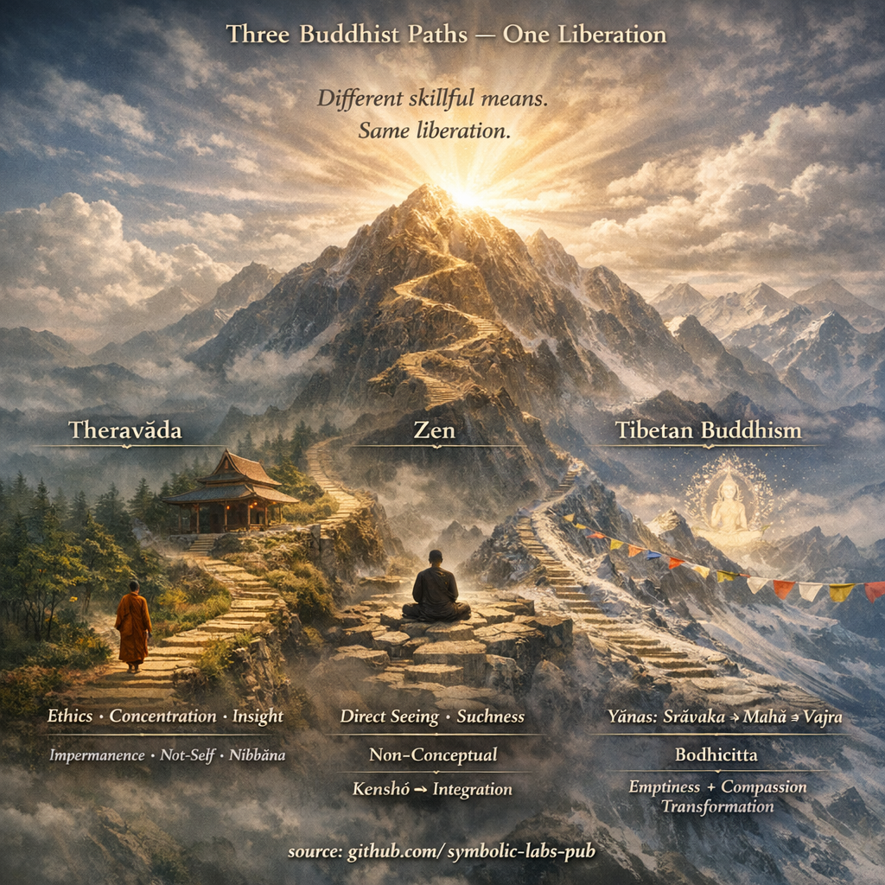

## [1) Kuidas nad *struktueerivad* teed](https://github.com/symbolic-labs-pub/a-buddhist-view/blob/master/languages/et/more/05_yanas/zen_and_theravada/README.md#1-how-they-structure-the-path)

### Tiibeti budism (üldiselt: Gelug/Kagyu/Sakya/Nyingma)

**Selgesõnaline mitme sõiduki arhitektuur**:

* **Śrāvakayāna** alused ([eetika](../../01_core_teachings/the_noble_eightfold_path/README.md#2-ethical-conduct-śīla), loobumine, [keskendumine](../../01_core_teachings/the_noble_eightfold_path/README.md#8-right-concentration-sammā-samādhi), arusaam)
* [**Mahāyāna**](../README.md#piirang-mahāyāna-vaatest) (bodhicitta + tühjus)
* [**Vajrayāna**](../README.md#4-vajrayāna-tantrayāna-mantrayāna---the-diamond-vehicle) (tantra: [jumaluse jooga](../../03_the_path_to_end_suffering/README.md#right-action), mantra, peenike keha)
* (Nyingmas) [**Dzogchen**](../../04_kayas/mahamudra_and_dzogcsen/README.md#dzogchen-rigpa-རིག་པ་---direct-introduction) kui haripunkti esitlus (meele loomuse otsene äratundmine)

Seda õpetatakse tavaliselt kui **kihilist virna** (sageli läbi *Lamrimi* / järkjärgulise tee).

### Zen (Chan/Seon/Zen)

**Mitte "sõiduki redel" samal selgesõnalisel viisil.**
Zen on oma alusel **Mahāyāna**, kuid ta tavaliselt rõhutab:

* **Otsest realiseerimist** (sageli kirjeldatakse kui "osutamine otse meelele")
* **Praktika konteineri** (zazen, koan introspektsioon või shikantaza) mitte mitme yāna taksonoomia

Zenil on oma "etapiline" (kenshō, kenshō järgne harjutamine), kuid see on **vähem skolastiline ja vähem enumeratiivne** disaini järgi.

Head sisalduskohtad:

* [Zen (Stanford Encyclopedia of Philosophy)](https://plato.stanford.edu/entries/japanese-zen/)
* [Chan Buddhism (Britannica ülevaade)](https://www.britannica.com/topic/Chan-Buddhism)

### Theravāda

**Ühe peamise sõiduki raam** (oma enesemõistmises): tee **Nibbānani** läbi:

* **Sīla / Samādhi / [Paññā](../../01_core_teachings/the_noble_eightfold_path/README.md#1-wisdom-paññā)**
* [Neli austa tõde](../../02_from_ignorance_to_awakening/2_the_four_noble_truths/README.md#the-four-noble-truths--as-the-buddha-meant-them), [ainus kaheksane tee](../../01_core_teachings/the_noble_eightfold_path/README.md#what-the-noble-eightfold-path-is-in-buddhism), [sõltuv tekkimine](../../02_from_ignorance_to_awakening/3_dependent_origination/README.md#the-twelve-links-the-classic-formulation)

Theravāda säilitab varast kanoonist rõhku **arhattusele** kui normatiivne tee "lõpetamine" (kuigi endiselt austab bodhisatta ideaale erinevatel viisidel).

Suurepärased kanoonsed keskused:

* [SuttaCentral](https://suttacentral.net/)
* [Access to Insight](https://www.accesstoinsight.org/)

---

## 2) Mida "ärkvelolek" tähendab (ja kuhu see "maandub")

### Tiibeti

* **Śrāvakayāna tulemus**: arhat-stiilis vabastus (jämedate ahistuste lakkamine)
* **Mahāyāna tulemus**: täielik **buddhasus** (kõiketeadlik [kaastundlik](../../02_from_ignorance_to_awakening/7_compassion/README.md#compassion-as-a-structural-principle-in-buddhist-teaching) tegevus)
* **Vajrayāna väide**: sama buddhasus, kuid **kiiremini** läbi "tulemuse võtmine teena"
* **Dzogchen idioom**: **rigpa** äratundmine (algne [teadlikkus](../../10_concepts/README.md#2-awareness-rigpa-vijñāna-knowing)) ja selle stabiliseerimine

Peamine Mahāyāna filosoofiline selgroog:

* [Madhyamaka (SEP)](https://plato.stanford.edu/entries/madhyamaka/)
* [Budha loomus / Tathāgatagarbha (SEP)](https://plato.stanford.edu/entries/buddha-nature/)

### Zen

Zeni "[ärkvelolek](../../10_concepts/README.md#3-enlightenment-bodhi-awakening) kõne" keskendub sageli:

* **kenshō / satori** (oma loomuse nägemine)
* Siis **integratsioon**: kehastamine läbi igapäevaelu ja jätkuva praktika

Zen kipub mitteusaldusse muutma ärkvelolekut "asjaks", mida sa saad kontseptuaalselt omada, nii et ta rõhutab *otsesuhtlust* ja *anti-reifikatsiooni*.

### Theravāda

Ärkvelolek on tavaliselt artikuleeritud läbi:

* etappide nagu **voo-sisenemine → üks-tagasi → mitte-tagasi → arahant**
* "ahnuse, vihkamise, eksituse lõpetamine" ja **nibbāna** realiseerituse

Theravāda on sageli selgesõnalisem **kognitiivsete markerite** (ahelad) ja **[meditatiivste](../../08_lineage/README.md) tegurite** kohta ja vähem tõenäoline kasutamaks Budha loomuse keelt.

---

## 3) Vaade: tühjus, mitte-mina ja "sellisus" (sama suund, erinevad dialektid)

### Jagatud tuum

Kõik kolm osutavad:

* **mitte-mina / mitte-omamine** kogemuses
* **sõltuvus / tingimuslikkus**
* vabastus kui **de-klammerdumine**

### Kus nad rõhuasetu erinevad

**Theravāda dialekt**

* Tugev fookus **anattā**l (mitte-mina) + sõltuv tekkimine + [muutlikkus](../../01_core_teachings/impermanence/README.md#2-impermanence-anicca-is-structural-not-accidental)
* Sageli rohkem "fenomenoloogiline": analüüsi kogemus protsessideks, näe nende tekkimist/lakkamist

**Tiibeti Mahāyāna dialekt**

* Tugev fookus **śūnyatāl** (omasest eksistentsist tühjus) ja [**kaks tõde**](../../02_from_ignorance_to_awakening/5_the_two_truths/README.md#the-two-truths-in-buddhist-teaching)
* Sageli rohkem "ontoloogiline-episteemiline": demonteerige omase eksistentsi eeldused, ühendage tarkus + kaastunne

**Zeni dialekt**

* Tugev fookus **mittemõistelisel vahetusel** (sellisus), õpetustega disainitud lühis-käik reifikatsioonile
* Kasutab paradoksi/koani murda "meelt, mis tahab seista väljaspool kogemust ja seda selgitada"

Kasulik sild kontseptuaalselt:

* Theravāda "mitte-mina" ja Mahāyāna "tühjus" on sageli **funktsionaalselt konvergentsed** praktikas, isegi kui filosoofiline pakendamine erineb.

---

## 4) Praktika kaardistamine (mis vastab millele)

| Treeningu valdkond      | Theravāda                                    | Zen                            | Tiibeti                                            |
| -------------------- | -------------------------------------------- | ------------------------------ | -------------------------------------------------- |
| [Eetika](../../01_core_teachings/the_noble_eightfold_path/README.md#2-ethical-conduct-śīla)               | ettekirjutused, kloostri vinaya                    | ettekirjutused + kogukondlik praktika   | tõotused (pratimoksha / [bodhisattva](../../08_lineage/08_bodhisattva/README.md#4-the-bodhisattva-vow-as-structural-alignment) / samaya)          |
| [Keskendumine](../../01_core_teachings/the_noble_eightfold_path/README.md#8-right-concentration-sammā-samādhi)        | jhāna / samatha                              | zazeni stabiilsus                | shamatha + [jumaluse jooga](../../03_the_path_to_end_suffering/README.md#right-action) stabiliseerimine                |
| Arusaam              | [vipassanā](../shikantaza_and_vipassana/README.md#1-vipassanā-theravāda-arusaam---"tunnuse-eraldamine-de-reifikatsioon") (anicca/[dukkha](../../02_from_ignorance_to_awakening/2_the_four_noble_truths/README.md#1-there-is-suffering--dukkha)/[anattā](#3-vaade-tühjus-mitte-mina-ja-"sellisus"-sama-suund-erinevad-dialektid))             | otsene nägemine (kenshō), koan   | analüütiline arusaam + [tühjus](#3-vaade-tühjus-mitte-mina-ja-"sellisus"-sama-suund-erinevad-dialektid) arutlemine           |
| [Kaastunne](../../02_from_ignorance_to_awakening/7_compassion/README.md#compassion-as-a-structural-principle-in-buddhist-teaching) kui meetod | olemas, kuid vähem keskne "tee identiteedis" | olemas (bodhisattva eethos)    | keskne: **bodhicitta** ei ole läbiräägitav          |
| Esoteerilised meetodid     | üldiselt ei                                 | üldiselt ei (haruldased erandid) | jah: [mantra](../../09_symbols/10_mantra/README.md#what-a-mantra-is-buddhist-view), jumaluse jooga, peenike keha, algatused |

---

## 5) Suurimad "valevõrdsed" (terminid, mis eksitavad traditsioonide vahel)

### "Äkk-ärkvelolek"

* **Zen**: äkk "nägemine", siis pikk harjutamine (sageli implitsiitne)
* **Tiibeti Dzogchen/[Mahamudra](../../04_kayas/mahamudra_and_dzogcsen/README.md#mahāmudrā-nature-of-mind-སེམས་ཀྱི་གནས་ལུགས་)**: otsene tutvustus/äratundmine, siis stabiliseerimine (selgesõnaliselt hoiatatud mitte ajada segi välja lülitumisega)
* **Theravāda**: võib olla äkkade arusaamise sündmused, kuid **treeningu kaar** on tavaliselt kirjeldatud rohkem järk-järgult ja süstemaatiliselt

### "Tühjus = miski ei eksisteeri"

Kõik kolm lükkavad nihilismi tagasi.
Zen väldib üle-selgitamist; Tiibeti selgitab seda hoolikalt; Theravāda rõhutab tingimuslikkust ja mitte-mina. Erinev pedagoogika, sama ohutus piirang.

### "Budha loomus"

* Põhikeel suuremas osas Mahāyānas (sealhulgas Tiibeti; samuti olemas mõnes Zenis)
* Ei ole standardne Theravāda doktrinaalne keskpunkt (kuigi on tõlgendusliku silla inimesed proovivad ehitada—sageli vastuoluliselt)

---

## 6) Praktiline "tõlke juhend" (kui sa liigud nende vahel)

Kui sa oled ühe traditsiooniga vool, siin on kuidas "portida" oskused:

* **Theravāda → Tiibeti**

  * Sinu tugevused: distsipliin, muutlikkuse/mitte-mina selgus, meditatiivne täpsus
  * Lisand: **bodhicitta treening** + tühjus arutlemine + (kui soovitud) tantriline meetod

* **Zen → Tiibeti**

  * Sinu tugevused: mittemõisteline otsesus, vaadetega kinniklammerdumise lahti laskmine
  * Lisand: struktureeritud tõotused/etapid + analüütiline tühjus + selgesõnaline kaastunde raamistikud

* **Tiibeti → Zen**

  * Sinu tugevused: rikas meetodi virn, selgesõnaline kaastunde/tarkuse integratsioon
  * Lisand: lihtsustamine "lihtsalt see" praktikasse, lubades realiseeritusel olla harilik ja kaunistamata

---

## Minu "arhitekti kokkuvõte"

Mõtle neist kui kolm optimiseerimise strateegiad samale objektifunktsioonile (vabastus):

* **Theravāda** optimeerib **puhtate invariantide ja mõõdetavate treeningu tegurite** jaoks (väga insener-sõbralik).
* **Zen** optimeerib **minimaalse liidese / maksimaalse otsesuhtluse** jaoks (vähendab mõistelist ülespasutamist).
* **Tiibeti** optimeerib **täies virnas õppekaava mitme kiirendiga** jaoks (võimas, kuid nõuab head valitsemist: tõotused/õpetaja/kontekst).

---

< [Jagatud alus: 3 tähelepanu nuppu](../shikantaza_and_vipassana/README.md) | [Vaheolekud (*Bardo*) ja reinkarnatsioon](../../06_intermediate_states_and_reincarnation/README.md) >

_allikas: [github.com/symbolic-labs-pub](https://github.com/symbolic-labs-pub)_

---
