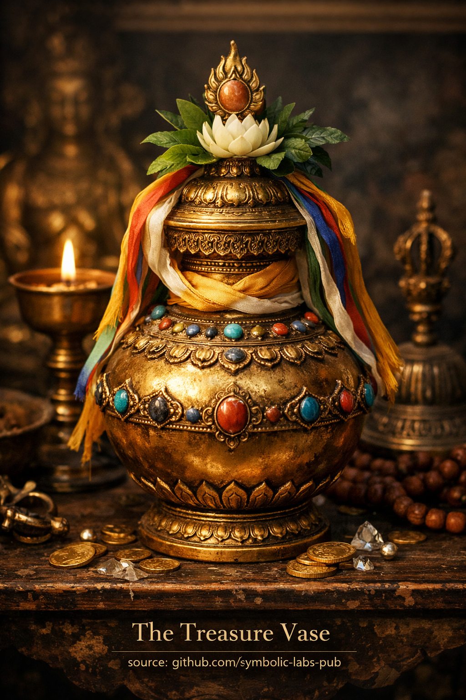

## [Aardevaas (Skt. *Nidhāna-kumbha*, Tib. *Bumpa*)](https://github.com/symbolic-labs-pub/a-buddhist-view/blob/master/more/09_symbols/21_treasure_vase/README.md#-the-treasure-vase-skt-nidhāna-kumbha-tib-bumpa)

---

**Aardevaas** on üks budismi **kaheksast õnnesümbolist**. See esindab **ammendamatut küllust**, kuid oluliselt mitte toores materiaalses mõttes. Selle õpetus on peenike, psühholoogiline ja sügavalt eetiline.

---

### 1. Põhitähendus — *küllus ilma ammendumiseta*

Aardevaas sümboliseerib **rikkust, mis ei otsa saa**:

* vaimne väärtus (*puṇya*)
* [tarkus (*prajñā*)](../../../01_core_teachings/the_noble_eightfold_path/README.md#1-wisdom-paññā)
* tervis, pikaealisus ja soodsad tingimused
* sisemine rikkus pigem kui kogunemine

Erinevalt tavalistest mahutajatest öeldakse, et vaas on **alati täis**, olenemata sellest, kui palju sellest võetakse. See osutab otse [Mahāyāna](../../../05_yanas/README.md#limitation-from-mahāyāna-view) arusaamale:

> Tõeline küllus on **mittekonkureeri v** — andmine ei vähenda seda.

---

### 2. Filosoofiline õpetus — *tühjus kui rikkuse allikas*

Sügavamal tasandil on aardevaas **Śūnyatā ([tühjuse](../../../10_concepts/01_emptiness/README.md#emptiness-śūnyatā-in-vajrayāna-buddhism))** sümbol, mida väljendatakse kui **potentsiaal**.

* Kuna nähtused on tühjad fikseeritud olemusest, on nad **funktsionaalselt lõpmatud**
* Nappus tekib klammerdumisest, mitte reaalsusest endast
* Kui klammerdumine lõdvestub, tsirkuleerivad ressursid vabalt

Selles mõttes õpetab aardevaas, et **tühjus ei ole puudus, vaid generatiivsus**.

---

### 3. Eetiline mõõde — *õige suhe ressurssidega*

Aardevaas vastustab otse kahte äärmus t:

* **Ahnus** (kogumine, kaotuse hirm)
* **Askeetiline tagasilükkamine** (maailmaliku toetuse eitamine)

Selle asemel õpetab see:

* rikkust kui **toetust [ärkamisele](../../../10_concepts/README.md#3-enlightenment-bodhi-awakening)**
* jõukust kui midagi, mida tuleb **ringluses lasta**, mitte omada
* vastutust võimsuse proportsionaalse lt

Küllus ei ole isiklik trof ee; see on **jagatud tingimus**.

---

### 4. Vajrayāna perspektiiv — *rituaalne ja energeetiline funktsioon*

[Vajrayāna](../../../05_yanas/README.md#4-vajrayāna-tantrayāna-mantrayāna---the-diamond-vehicle) budismis on aardevaas ka kirjeldades:

* vaasid pühitsetakse ja täidetakse ainete, [mantradega](../../../09_symbols/10_mantra/README.md#what-a-mantra-is-buddhist-view) ja reliikvia dega
* maetud või paigutatud **stabiliseerima maad, kogukondi ja praktikakeskusi**
* kasutatakse elementaar sete jõudude harmoniseerimiseks (*maa, vesi, tuli, õhk, ruum*)

Siin mõistetakse küllust kui **energeetilist koherentsust**, mitte raha.

---

### 5. Psühholoogiline arusaam — *turvalisus ilma klammerdumiseta*

Meele treenimise tasandil:

* vaas esindab **sügavat usaldust**
* hirmu põhine kogunemine laheneb
* heldus muutub pingutus etuks

Aardevaasi kehastav praktik:

* tunneb end sisemiselt ressurssidega varustatuks
* ei paanika tuleviku pärast
* annab loomulikult, ilma enesepuhastusdraama ta

---

### 6. Kokkusurutud õpetus

> **Aardevaas õpetab, et kui klammerdumine lõppeb, ilmub piisavus.
> Rikkus voolab kõige paremini läbi avatud käte ja avatud meele.**

See ei ole rikkuse lubadus — see on parandus **kuidas meel suhtub omamisesse**.

---

< [Vihmavari (Chatra) — budistlike õpetuste järgi](../../../09_symbols/20_parasol/README.md) | [Võidulipp (Skt. *Dhvaja*) — budistlik tähendus](../../../09_symbols/22_victory_banner/README.md) >

_allikas: [github.com/symbolic-labs-pub](https://github.com/symbolic-labs-pub)_

---
