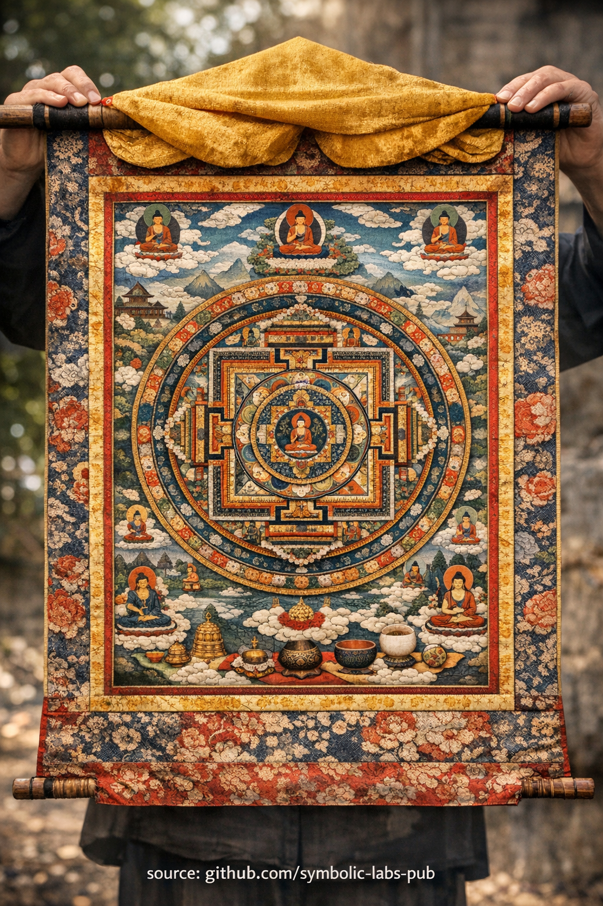

## [Thangka — tee visuaalne ülekanne](https://github.com/symbolic-labs-pub/a-buddhist-view/blob/master/more/09_symbols/15_thangka/README.md#thangka--visual-transmission-of-the-path)

---

Budistlikes õpetustes ei ole **thangka** religioosne kunst dekoratiivses mõttes. See on **funktsionaalne kognitiivne instrument** — **poratiivne mandala**, mis on loodud treenima taju, stabiliseerima tähelepanu ja edastama äratundmist läbi põlvkondade.

### 1. Thangka kui *poratiivne mandala*

[Mandala](../../../09_symbols/07_mandala/README.md#mandala--explained-according-to-buddhist-teachings) on **ärksammeele struktureeritud esitus**.
Thangka kondenseerib selle struktuuri **kokkurullitavasse, mobiilsesse vormi**, võimaldades praktikutel kanda kaasas *terviklikku teed*.

Põhiarusaam:

> [Ärkamine](../../../10_concepts/README.md#3-enlightenment-bodhi-awakening) ei ole abstraktne — sel on **vorm, orientatsioon ja sisemine geomeetria**.

Iga element (keskpunkt, suunad, värvid, proportsioonid) peegeldab, kuidas [teadvus](../../../10_concepts/README.md#2-awareness-rigpa-vijñāna-knowing) peaks ennast praktika ajal organiseerima.

### 2. Visuaalne ülekanne (kaugemal sõnadest)

Budism tunnistab, et **äratundmist ei saa täielikult keeles kodeerida**.
Thangkad toimivad kui **mitteverbaalse d liini kandjad**:

* Täpne ikonograafia säilitab õpetused muutmatuna sajandeid
* Proportsioonid järgivad rangeid kanoonilisi mõõtmeid
* Sümbolism möödub kontseptuaalsest mõtlemisest ja jätab jälje otse tajule

Seetõttu nimetatakse thangkasid *"nägeval isteks õpetusteks"* pigem kui illustratsioonideks.

> Mida tekstid selgitavad järjestikku, thangkad esitavad **samaaegselt**.

### 3. Visualiseerimise treening (meele inseneritöö)

[Vajrayāna](../../../05_yanas/README.md#4-vajrayāna-tantrayāna-mantrayāna---the-diamond-vehicle) praktikas kasutatakse thangkasid **[jumaluse joogale](../../../03_the_path_to_end_suffering/README.md#right-action) ja visualiseerimisele**:

* Praktik õpib pilti väliselt
* Seejärel rekonstrueerib seda sisemiselt kasvava täpsusega
* Lõpuks laheneb pilt, vaatleja ja meele vaheline erinevus

See treenib:

* **Stabiilsust** (śamatha)
* **Selgust** (vipaśyanā)
* **Mittedual istlikku taju**

Eesmärk ei ole kujutlusvõime, vaid **kontrollitud taju**.

### 4. Miks thangkasid rullitakse

Füüsiline vorm ise on õpetus:

* Rullitud → **potentsiaal** (avaldumat u)
* Lahti rullitud → **ilmnemine**
* Uuesti rullitud → **lahustamine**

See peegeldab:

* [Möödumust](../../../01_core_teachings/impermanence/README.md#2-impermanence-anicca-is-structural-not-accidental)
* [Tühjust](../../../10_concepts/01_emptiness/README.md#emptiness-śūnyatā-in-vajrayāna-buddhism)
* Nähtuste tekkimist ja lahenemist [meditatsioonis](../../../08_lineage/README.md)

Miski püha ei ole mõeldud püsima nähtavas vormis.

### 5. Püha täpsus, mitte kunstiline vabadus

Traditsiooniline thangka maalija treenitakse aastaid:

* Kõrvalekalded on vead, mitte loovus
* Ego-väljendust surutakse tahtlikult alla
* Maalija toimib **tehnilise edastajana**, mitte kunstnikuna

See peegeldab budismi põhiprintsiipi:

> Ärkamine avastatakse **joondusega**, mitte leiutisega.

### 6. Thangka igapäevases praktikas

Praktiliselt kasutatakse thangkasid:

* Meditatsiooni sessio onide ankurdamiseks
* Motivatsiooni ümberkalibreeri miseks
* Õige vaate taastamiseks, kui meel triivib
* Liini järjepidevuse säilitamiseks väljaspool kloostreid

Nad on **liidesed** tavalise taju ja ärksa struktuuri vahel.

---

### Kokkusurutud õpetus

**Thangka on meele kaart, mis treenib meelt nähes.**
See ei ole sümboolne kunst — see on **operatiivne [dharma](../../../01_core_teachings/the_three_jewels/README.md#2-dharma--the-path-and-the-law-of-reality)**.

---

< [Mala loendajad — selgitatud budistlike õpetuste kaudu](../../../09_symbols/14_mala_counters/README.md) | [Lõputu sõlm (Śrīvatsa) — budistlike õpetuste järgi](../../../09_symbols/16_endless_knot/README.md) >

_allikas: [github.com/symbolic-labs-pub](https://github.com/symbolic-labs-pub)_

---
