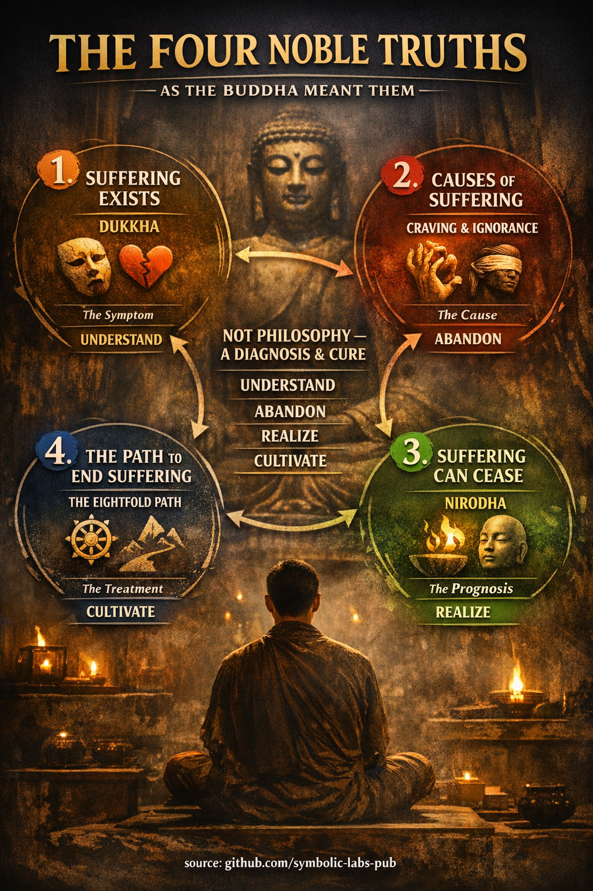

## [Les Quatre Nobles Vérités — comme le Bouddha les entendait](https://github.com/symbolic-labs-pub/a-buddhist-view/blob/master/languages/fr/more/02_from_ignorance_to_awakening/2_the_four_noble_truths/README.md#les-quatre-nobles-vérités--comme-le-bouddha-les-entendait)

Les **Quatre Nobles Vérités** ne sont pas des croyances sur la réalité.
Elles sont des **tâches à comprendre, effectuer et réaliser**.

Dans les textes anciens (par ex. *Dhammacakkappavattana Sutta*), chaque Vérité a :

* un **fait**
* et une **réponse-pratique**

Cela rend le cadre *expérientiel*, non philosophique.

---

## 1. Il y a la souffrance — **Dukkha**

### Ce que cela signifie dans le bouddhisme

**Dukkha** ne signifie *pas* seulement la douleur.

Il se réfère à l'**instabilité structurelle de l'existence conditionnée**.

Il y a trois couches :

1. **Souffrance évidente**

   * Douleur, maladie, vieillissement, mort
   * Perte, chagrin, frustration

2. **Souffrance due au changement**

   * Le plaisir s'estompe
   * Relations, santé, succès ne peuvent être retenus

3. **Insatisfaction omniprésente**

   * Même quand la vie est « bien », quelque chose semble incomplet
   * La tension subtile de maintenir un soi

> Dukkha n'est pas du pessimisme.
> C'est une **perception honnête**.

### La tâche

➡️ **Dukkha doit être pleinement compris**, non évité.

---

## 2. La souffrance a des causes — **Samudaya**

### Quelles sont les causes de la souffrance ?

Le Bouddha fut précis :

* **L'avidité (taṇhā)**
  Vouloir que les choses soient différentes de ce qu'elles sont
* **L'ignorance (avijjā)**
  Mal comprendre l'[impermanence](../../01_core_teachings/impermanence/README.md#2-limpermanence-anicca-est-structurelle-non-accidentelle), le [non-soi](../1_the_three_marks_of_existence/README.md#3-non-soi-anattā) et la causalité

L'avidité prend trois formes :

* Avidité pour le plaisir
* Avidité pour le devenir (identité, statut, contrôle)
* Avidité pour le non-devenir (échappatoire, annihilation)

Crucialement :

> Nous ne souffrons *pas parce que les choses changent*
> Nous souffrons parce que nous **nous accrochons** comme si elles ne devaient pas changer.

### La tâche

➡️ **La cause de la souffrance doit être abandonnée**

Non supprimée, non jugée—**vue clairement et relâchée**.

---

## 3. La souffrance peut cesser — **Nirodha**

### Ce que la cessation signifie réellement

Ceci est souvent mal compris.

**Nirvāṇa n'est pas un lieu, un état, ou une annihilation.**

C'est :

* La **fin de l'avidité**
* Le **refroidissement de la saisie compulsive**
* La **cessation du mécanisme qui produit dukkha**

La vie continue :

* Le corps vieillit toujours
* Les sensations surgissent toujours
* Les émotions se produisent toujours

Mais :

* Elles ne sont plus possédées
* Plus résistées
* Plus saisies

> Nirodha n'est pas la fin de l'expérience
> C'est la fin de la *mauvaise relation* à l'expérience

### La tâche

➡️ **La cessation doit être réalisée**

Non crue—**directement connue**.

---

## 4. Il y a un chemin — **Magga**

### Pourquoi un chemin est nécessaire

Si la souffrance était supprimée par la croyance, la philosophie ou la volonté,
le Bouddha n'aurait pas enseigné un chemin.

Le [**Chemin Octuple**](../../01_core_teachings/the_noble_eightfold_path/README.md#quest-ce-que-le-noble-chemin-octuple-dans-le-bouddhisme) est un **entraînement de la perception, de la conduite et de l'esprit**.

Il fonctionne parce que :

* La souffrance est conditionnée
* Les conditions peuvent être reconditionnées

Le chemin intègre :

* [**Sagesse**](../../01_core_teachings/the_noble_eightfold_path/README.md#1-sagesse-paññā) → voir clairement
* [**Conduite éthique**](../../01_core_teachings/the_noble_eightfold_path/README.md#2-conduite-éthique-śīla) → stabiliser la vie
* **Discipline mentale** → cultiver l'intuition

Non séquentiel.
Non optionnel.
**Mutuellement renforçant.**

### La tâche

➡️ **Le chemin doit être cultivé**

---

## Pourquoi le bouddhisme est « thérapeutique »

Le Bouddha évitait la spéculation métaphysique parce qu'elle :

* Ne met pas fin à la souffrance
* Renforce l'identité et le débat
* Distrait de la pratique

Il enseignait seulement :

> « La souffrance, son origine, sa cessation, et le chemin. »

C'est pourquoi le bouddhisme ressemble à :

* La médecine
* La psychologie
* La théorie des systèmes

Plus qu'à la théologie.

---

## La boucle diagnostique plus profonde (souvent manquée)

Chaque Noble Vérité correspond à un **mode de pratique** :

| Vérité | Réalité          | Tâche de Pratique |
| ------ | ---------------- | ----------------- |
| 1      | La [souffrance](#1-il-y-a-la-souffrance---dukkha) existe | Comprendre        |
| 2      | Elle a des causes | Abandonner        |
| 3      | Elle peut cesser | Réaliser          |
| 4      | Il y a un chemin | Cultiver          |

La libération arrive **seulement quand les quatre tâches sont accomplies**.

---

## Synthèse finale

Les Quatre Nobles Vérités ne sont pas des doctrines à accepter.

Elles sont des **instructions pour l'[éveil](../../10_concepts/README.md#3-léveil-bodhi-awakening)**.

Elles disent :

* La vie fait mal quand elle est mal comprise
* La cause est la saisie, non le destin
* La liberté est possible ici et maintenant
* Mais seulement par un entraînement discipliné

> Le bouddhisme ne demande pas : *« Qu'est-ce que l'univers ? »*
> Il demande : *« Pourquoi souffrez-vous — et comment cela peut-il s'arrêter ? »*

---

< [Les Trois Caractéristiques de l'Existence — Explication Bouddhiste](../1_the_three_marks_of_existence/README.md) | [Origine Interdépendante (Paṭicca-samuppāda)](../3_dependent_origination/README.md) >

_source: [github.com/symbolic-labs-pub](https://github.com/symbolic-labs-pub)_

---
