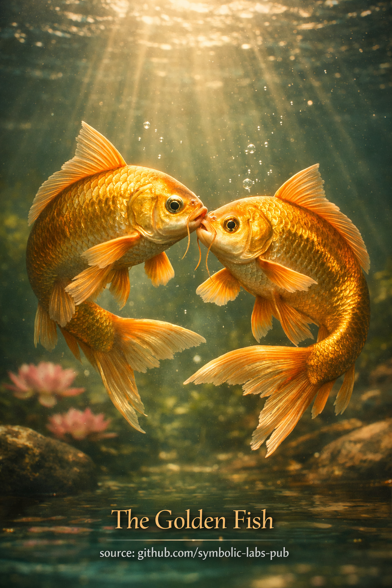

## [Les Poissons d'Or — selon les enseignements bouddhistes](https://github.com/symbolic-labs-pub/a-buddhist-view/blob/master/languages/fr/more/09_symbols/04_golden_fish/README.md#les-poissons-dor--selon-les-enseignements-bouddhistes)

---

Les **Poissons d'Or** sont l'un des **Huit Symboles Auspicieux (Ashtamangala)** dans le bouddhisme. Leur signification est subtile, expérientielle et profondément pratique.

---

### Signification Fondamentale

**Liberté de la peur et de la [souffrance](../../02_from_ignorance_to_awakening/2_the_four_noble_truths/README.md#1-there-is-suffering--dukkha).**

Les deux poissons d'or symbolisent les êtres qui ont **traversé l'océan du saṃsāra** — le flux cyclique de l'existence conditionnée — et se déplacent maintenant librement en lui.

Les poissons vivent dans l'eau sans se noyer.
De même, les êtres éveillés vivent **au sein de l'expérience** sans être piégés par elle.

---

### Enseignement Plus Profond

#### 1. Liberté *au sein* des Conditions

Les Poissons d'Or ne représentent **pas** l'échappatoire du monde.

Ils pointent vers :

* La maîtrise des conditions plutôt que l'évitement
* La présence sans enchevêtrement
* L'activité sans peur

Cela s'aligne avec un insight bouddhiste central :

> La libération n'est pas ailleurs — c'est **comment l'esprit se rapporte à l'expérience**.

---

#### 2. Absence de Peur Née de la Compréhension

La peur surgit de :

* La saisie
* La résistance
* La mécompréhension de l'[impermanence](../../01_core_teachings/impermanence/README.md#2-impermanence-anicca-is-structural-not-accidental)

Les poissons se déplacent sans effort car ils **comprennent le milieu dans lequel ils vivent**.
De même, la réalisation vient de la compréhension de :

* L'impermanence
* La [Vacuité](../../10_concepts/01_emptiness/README.md#emptiness-śūnyatā-in-vajrayāna-buddhism)
* L'interdépendance

La peur se dissout lorsque la réalité est **vue clairement**, pas lorsqu'elle est contrôlée.

---

#### 3. Joie et Spontanéité

Les Poissons d'Or symbolisent également :

* La joie qui ne dépend pas des circonstances
* La réactivité spontanée
* Le mouvement naturel de l'activité éveillée

Cette joie n'est pas l'excitation ou le plaisir — c'est la **facilité du non-attachement**.

---

#### 4. Les Deux Poissons

La paire est souvent interprétée comme :

* **[Sagesse](../../01_core_teachings/the_noble_eightfold_path/README.md#1-wisdom-paññā) et [compassion](../../02_from_ignorance_to_awakening/7_compassion/README.md#compassion-as-a-structural-principle-in-buddhist-teaching)** se déplaçant ensemble
* Équilibre de l'insight et de l'activité
* Liberté intérieure et extérieure unifiées

L'[éveil](../../10_concepts/README.md#3-enlightenment-bodhi-awakening) n'est pas un insight statique — il **se déplace**, répond et bénéficie aux êtres.

---

### Implication Pratique

Contempler les Poissons d'Or entraîne le pratiquant à se demander :

* Puis-je rester présent **sans me crisper** ?
* Puis-je me déplacer à travers les émotions, le travail et les relations sans me noyer en eux ?
* La compréhension peut-elle remplacer la peur ?

Le symbole nous rappelle doucement :

> L'éveil est **fluidité de l'esprit**, pas retrait.
> La liberté est **absence de peur en mouvement**, pas isolation.

---

< [La Conque (Śaṅkha) dans les Enseignements Bouddhistes](../06_conch_shell/README.md) | [Le Parasol (Chatra) — selon les enseignements bouddhistes](../05_parasol/README.md) >

_source: [github.com/symbolic-labs-pub](https://github.com/symbolic-labs-pub)_

---
