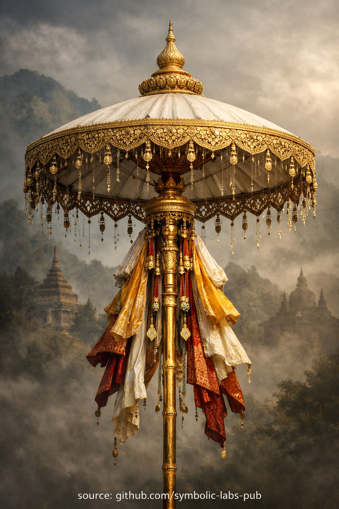

## [Le Parasol (Chatra) — selon les enseignements bouddhistes](https://github.com/symbolic-labs-pub/a-buddhist-view/blob/master/languages/fr/more/09_symbols/05_parasol/README.md#le-parasol-chatra--selon-les-enseignements-bouddhistes)

---

Le **Parasol** est l'un des **Huit Symboles Auspicieux (Aṣṭamaṅgala)** du bouddhisme. Sa signification est subtile, structurelle et profondément psychologique.

---

### Signification Fondamentale

**Protection contre la [souffrance](../../02_from_ignorance_to_awakening/2_the_four_noble_truths/README.md#1-there-is-suffering--dukkha) par la [conscience](../../10_concepts/README.md#2-awareness-rigpa-vijñāna-knowing) éveillée.**

Dans l'Inde ancienne, un parasol était un objet royal — utilisé pour protéger les rois et dignitaires du soleil ardent. Le bouddhisme réutilise délibérément ce symbole :

> Le Bouddha ne protège pas les êtres par la force,
> mais par **la clarté qui empêche le mal de surgir**.

Le parasol représente **l'esprit qui a appris à ne pas être brûlé par les conditions**.

---

### Ce Dont Il Protège (Pas Ce Que les Gens Supposent)

Le parasol ne symbolise **pas** :

* La protection surnaturelle
* La chance externe
* Le bouclier magique

Il **symbolise** la protection contre :

* L'ignorance (avidyā)
* Les extrêmes émotionnels (attachement & aversion)
* L'orgueil et l'arrogance spirituelle
* La « chaleur » de la réactivité compulsive

C'est une **protection cognitive**, pas une défense mystique.

---

### Enseignement Structurel

Dans la psychologie bouddhiste :

* **Soleil** → intensité sensorielle & émotionnelle brute
* **Parasol** → [sagesse](../../01_core_teachings/the_noble_eightfold_path/README.md#1-wisdom-paññā) qui *filtre*, ne supprime pas
* **Ombre** → espace mental où l'action éthique est possible

L'[éveil](../../10_concepts/README.md#3-enlightenment-bodhi-awakening) ne supprime pas l'expérience.
Il introduit une **médiation appropriée** entre le stimulus et la réponse.

Le parasol enseigne :

> La libération commence lorsque l'esprit ne réagit plus à nu.

---

### Dimension Éthique (Souvent Manquée)

Le parasol est étroitement lié à la **[conduite éthique (śīla)](../../01_core_teachings/the_noble_eightfold_path/README.md#2-ethical-conduct-śīla)**.

Pourquoi ?

* L'éthique refroidit l'esprit
* Le non-nuisible prévient l'agitation interne
* La discipline crée de l'ombre pour la [concentration](../../01_core_teachings/the_noble_eightfold_path/README.md#8-right-concentration-sammā-samādhi) et l'insight

Sans éthique, la [méditation](../../08_lineage/README.md) est comme s'asseoir au soleil sans abri.

---

### Symbole Royal → Souveraineté Intérieure

Dans le bouddhisme, **le vrai roi est la maîtrise de l'esprit**.

Le parasol signifie :

* Dignité intérieure
* Stabilité qui ne dépend pas de la louange ou du blâme
* Autorité qui vient de l'autorégulation

C'est pourquoi les parasols apparaissent :

* Au-dessus des Bouddhas
* Au-dessus des [stupas](../09_stupa/README.md#1-ce-quest-un-stupa-au-delà-de-larchitecture)
* Dans les [mandalas](../17_mandala/README.md#mandala--explained-according-to-buddhist-teachings) comme *canopée protectrice de sagesse*

---

### Perspective Vajrayāna (Couche Plus Profonde)

Dans le [Vajrayāna](../../05_yanas/README.md#4-vajrayāna-tantrayāna-mantrayāna---the-diamond-vehicle), le parasol implique également :

* **Protection de la vue** (compréhension juste)
* Garder la réalisation de la dilution, la paresse ou l'inflation de l'ego
* Maintenir l'orientation correcte une fois l'insight surgi

Ici, la protection n'est pas pour les débutants — mais pour les **pratiquants avancés** qui doivent préserver la clarté sous pression.

---

### Enseignement en Une Phrase

> **Le Parasol enseigne que l'éveil n'est pas l'exposition — c'est l'abri intelligent.**

Pas se cacher du monde,
pas échapper à l'expérience,
mais **savoir comment se tenir en elle sans brûler**.

---

< [Les Poissons d'Or — selon les enseignements bouddhistes](../04_golden_fish/README.md) | [Le Vase au Trésor (Skt. *Nidhāna-kumbha*, Tib. *Bumpa*)](../08_treasure_vase/README.md) >

_source: [github.com/symbolic-labs-pub](https://github.com/symbolic-labs-pub)_

---
