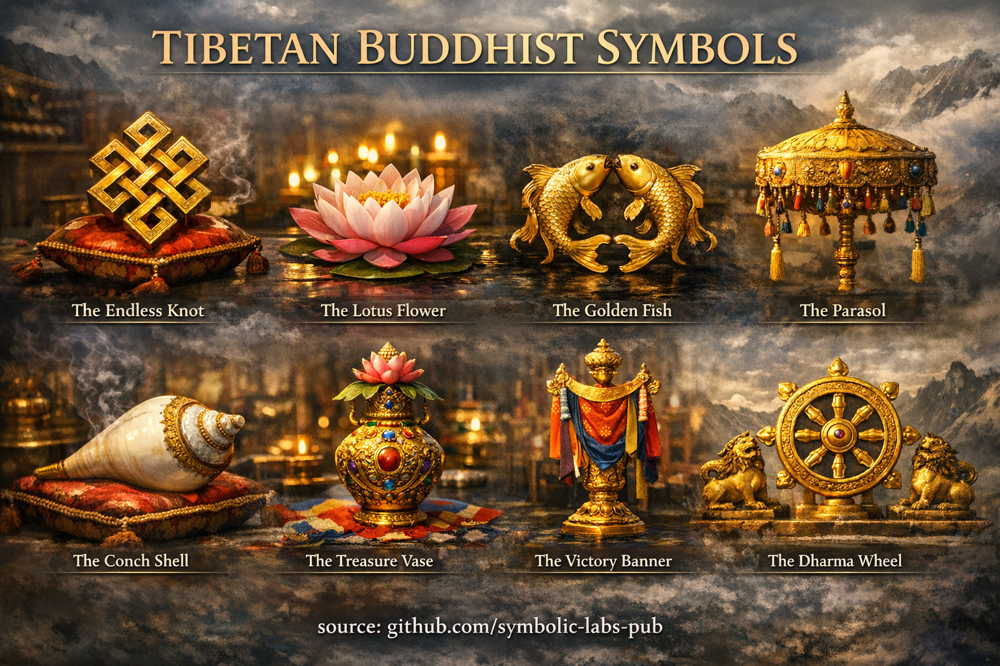
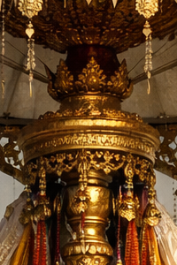
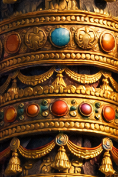
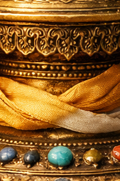

# [Symboles](https://github.com/symbolic-labs-pub/a-buddhist-view/blob/master/languages/fr/more/09_symbols/README.md#symboles)

## [1. Roue du Dharma (Dharmachakra)](01_dharma_wheel/README.md)

* Enseignement en mouvement
* Orientation éthique
* Structure octuple

---

## [2. Lotus](02_lotus/README.md)

* Pureté **sans rejet**
* Éveil *à travers* les conditions, pas loin d'elles

---

## [3. Nœud Sans Fin](03_endless_knot/README.md)

* Interdépendance
* Causalité non linéaire
* Le karma comme structure, pas comme destin

---

## [4. Poissons d'Or](04_golden_fish/README.md)

**Signification fondamentale**
Liberté de la peur et de la [souffrance](../02_from_ignorance_to_awakening/2_the_four_noble_truths/README.md#1-there-is-suffering--dukkha).

**Enseignement**
Les deux poissons d'or symbolisent les êtres qui ont traversé l'océan du saṃsāra et se déplacent maintenant librement, sans se noyer dans la souffrance. Les poissons nagent sans effort dans l'eau — tout comme les êtres éveillés se déplacent dans l'expérience sans être piégés par elle.

**Insight plus profond**

* La liberté n'est **pas l'évasion**, mais la maîtrise des conditions
* Représente la joie, la spontanéité et l'absence de peur
* Indique la libération **au sein** du monde, pas en dehors

Les Poissons d'Or rappellent aux pratiquants que l'éveil est *fluidité de l'esprit*, pas retrait.

---

## [5. Le Parasol](05_parasol/README.md)

**Signification fondamentale**
Protection contre la souffrance et les états mentaux nuisibles.

**Enseignement**
Traditionnellement associé à la royauté, le parasol représente la dignité et la protection de l'éveil. Il abrite l'esprit de la chaleur de l'ignorance, de l'attachement, de la colère et de l'orgueil.

**Insight plus profond**

* Symbolise la discipline éthique et la [pleine conscience](../01_core_teachings/the_noble_eightfold_path/README.md#7-right-mindfulness-sammā-sati)
* La protection est **interne**, pas externe
* Représente le leadership compassionnel de son propre esprit

Le Parasol enseigne que **la sagesse procure de l'ombre**, pas l'isolement.

---

## [6. Conque](06_conch_shell/README.md)

* Proclamation du Dharma
* Appel au réveil pour la conscience

---

## [7. Bannière de Victoire](07_victory_banner/README.md)

**Signification fondamentale**
Triomphe de la sagesse sur l'ignorance.

**Enseignement**
La bannière de victoire célèbre la victoire complète du Bouddha sur Māra — symbolisant la conquête des obstacles intérieurs : l'attachement à l'ego, le doute, la peur et l'illusion.

**Insight plus profond**

* La victoire est **interne**, pas compétitive
* Représente la persévérance et la discipline
* L'éveil est irréversible une fois stabilisé

La Bannière de Victoire proclame que **la clarté peut prévaloir**, même contre les habitudes profondément enracinées.

---

## [8. Vase au Trésor](08_treasure_vase/README.md)

**Signification fondamentale**
Abondance inépuisable et richesse spirituelle.

**Enseignement**
Le vase au trésor est toujours plein et jamais épuisé. Il représente la richesse sans limites du Dharma — mérite, sagesse, compassion et moyens habiles qui augmentent par l'utilisation plutôt que par la consommation.

**Insight plus profond**

* La véritable abondance est **non-nulle-somme**
* La générosité élargit la capacité intérieure
* La vacuité permet la plénitude sans saisie

Le Vase au Trésor enseigne **l'abondance sans attachement**.

---

## [9. Stupa](09_stupa/README.md)

**Ce qu'est un [stupa](09_stupa/README.md#1-ce-quest-un-stupa-au-delà-de-larchitecture)**

* **[Éveil](../10_concepts/README.md#3-enlightenment-bodhi-awakening) incarné**
* Représente l'esprit, la parole et le corps du Bouddha

**Pourquoi dans le sens des aiguilles d'une montre (pradakshina)**

* S'aligne avec **l'ordre cosmique**
* Reflète les cycles naturels (soleil, étoiles)
* Garde le **cœur vers l'éveil**

La circumambulation est **méditation marchée**, pas tourisme.

---

## [10. Mala](10_mala/README.md)

 (Chapelet)

**Structure**

* 108 perles (ou divisions de celui-ci)
* Perle guru = **ancre non comptée**

**Comment utiliser**

* Déplacer les perles **vers soi**
* Ne pas franchir la perle guru
* Utilisé pour mantra, respiration ou intention

**Signification**
Chaque perle = **un moment de conscience reconquis**

---

## [11. Vajra](11_vajra/README.md)

**Signification**

* **Clarté indestructible**
* Union de **méthode ([compassion](../02_from_ignorance_to_awakening/7_compassion/README.md#compassion-as-a-structural-principle-in-buddhist-teaching))** et **[sagesse](../01_core_teachings/the_noble_eightfold_path/README.md#1-wisdom-paññā) (vacuité)**
* Réalité qui ne peut être détruite par la confusion

**Fonction de pratique**

* Tenu dans la main droite durant les rituels
* Utilisé avec la cloche (sagesse)
* Représente **la [conscience](../10_concepts/README.md#2-awareness-rigpa-vijñāna-knowing) éveillée inébranlable**

---

## Insight Structurel (Très Important)

Les symboles bouddhistes tibétains ne sont **pas des métaphores**.
Ils sont :

* **Outils cognitifs**
* **Instructions incarnées**
* **Ancres de mémoire**
* **Dispositifs d'entraînement**

Ils fonctionnent **seulement lorsqu'ils sont intégrés** avec :

* [L'éthique (śīla)](../01_core_teachings/the_noble_eightfold_path/README.md#2-ethical-conduct-śīla)
* La méditation (samādhi)
* La vision juste (prajñā)

---

### Synthèse

Ces symboles forment ensemble une **carte structurelle de la libération** :

* **Poissons d'Or** → Liberté
* **Parasol** → Protection
* **Vase au Trésor** → Abondance
* **Bannière de Victoire** → Achèvement

Ils ne sont pas des motifs décoratifs — ce sont des **instructions cognitives et éthiques**, codées sous forme symbolique pour contemplation continuelle.

---

< [Bannière de Victoire (Skt. *Dhvaja*) — Signification Bouddhiste](07_victory_banner/README.md) | [Vacuité (Śūnyatā) dans le Bouddhisme Vajrayāna](../10_concepts/01_emptiness/README.md) >

_source: [github.com/symbolic-labs-pub](https://github.com/symbolic-labs-pub)_

---
