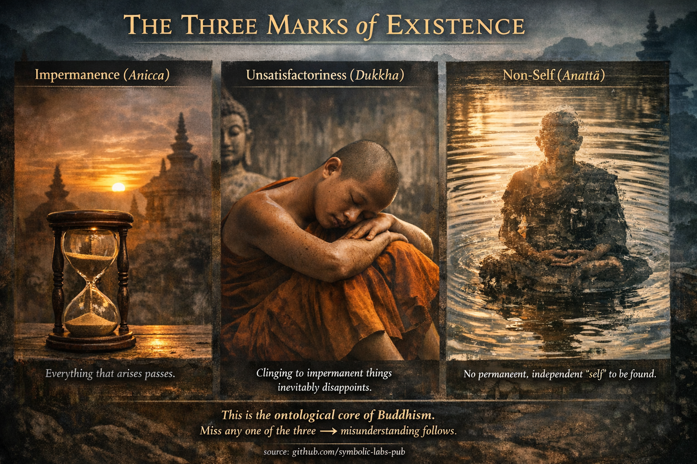

## [A létezés három jellemzője — buddhista magyarázat](https://github.com/symbolic-labs-pub/a-buddhist-view/blob/master/languages/hu/more/02_from_ignorance_to_awakening/1_the_three_marks_of_existence/README.md#the-three-marks-of-existence--buddhist-explanation)

A Buddha azt tanította, hogy **minden feltételekhez kötött jelenség** (minden, ami okok és feltételek révén keletkezik) **három elválaszthatatlan jellemzőt** oszt meg. Ezek nem metafizikai állítások; ezek **a tapasztalat ellenőrizhető tulajdonságai**.

---

### 1. **Mulandóság (Anicca)**

**"Minden, ami keletkezik, elmúlik."**

A buddhizmusban az [állandótlanság](../../01_core_teachings/impermanence/README.md#2-a-múlandóság-anicca-strukturális-nem-véletlen) nem azt jelenti, hogy "a dolgok valamikor véget érnek."
Azt jelenti, hogy:

* Semmi sem marad azonos **még egy pillanatig sem**
* A folytonosság illúzió, amit a gyors változás hoz létre
* A stabilitás *következtetés*, nem megfigyelés

A gondolatok változnak.
Az érzések pulzálnak.
A testek pillanatról pillanatra öregszenek.

**Miért számít ez**

Ha valami változik:

* nem biztosítható
* nem fagyasztható be
* nem szolgálhat megbízható menedékként

A Buddha belátása nem volt pesszimista — *pontos* volt:

> Ami instabil, az nem tud tartós elégedettséget nyújtani.

A mulandóság világos látása kezdi felszámolni a ragaszkodást.

---

### 2. **Kielégületlenség (Dukkha)**

**"A mulandó dolgokhoz való ragaszkodás elkerülhetetlenül csalódáshoz vezet."**

A Dukkha-t gyakran tévesen fordítják [szenvedésnek](../2_the_four_noble_truths/README.md#1-there-is-suffering--dukkha), de a buddhista tanításban ez jelenti:

* strukturális elégedetlenséget
* krónikus súrlódást
* az ellenállás által okozott stresszt

A Dukkha **nem azért keletkezik, mert az élet fájdalmas**, hanem mert az elme:

* akarja, hogy a kellemes megmaradjon
* akarja, hogy a kellemetlen megszűnjön
* akarja, hogy a semleges jelentőségteljes legyen

Ez feszültséget teremt.

**Kulcsfontosságú buddhista belátás**

> A Dukkha nem a tapasztalatban van — hanem a *kapaszkodásban*.

Még az öröm is Dukkha-vá válik, amikor:

* birtokolják
* megvédik
* féltik elveszteni

Így a Buddha nem az életből való menekülést tanította, hanem **a kényszerű követelésektől való szabadságot**.

---

### 3. **Nem-én (Anattā)**

**"Nem található állandó, független én."**

Az Anattā **nem** azt jelenti:

* "nem létezik"
* "semmi sem számít"

Azt jelenti:

* nem létezik rögzített irányító a tapasztalaton belül
* nem található változatlan lényeg

Amit "énnek" nevezünk, az egy **folyamat**, amely a következőkből áll:

* testi érzések
* érzések
* észlelések
* mentális formációk
* tudat

Mindezek:

* okok miatt keletkeznek
* változnak
* feloldódnak

**Alapvető tanítás**

> Ha valami változik, nem lehet én.
> Ha valami irányíthatatlan, nem lehet én.

Az "én" érzése egy *minta*, nem egy entitás.

---

## Miért kell a hármat együtt tanítani

A buddhizmus ragaszkodik ahhoz, hogy **elválaszthatatlanok**:

* Mulandóság nem-én nélkül → szorongás
* Nem-én Dukkha nélkül → filozófia
* Dukkha mulandóság nélkül → nihilizmus

Együtt felfedik:

> A tapasztalat dinamikus, kielégítetlen, amikor ragaszkodnak hozzá, és tulajdonos nélküli.

Ez a triád megelőzi a félreértést.

---

## A tanítás célja

A három jellemző **nem hittétel**, amit hinni kell.
Ezek **eszközök a felszabaduláshoz**.

Amikor közvetlenül látják őket:

* a ragaszkodás enyhül
* a félelem puhul
* az [együttérzés](../7_compassion/README.md#az-együttérzés-mint-strukturális-elv-a-buddhista-tanításban) természetesen keletkezik

Nem azért, mert jobbá válsz —
hanem mert **nem maradt semmi, amit védeni kellene**.

---

## A Buddha radikális következtetése

A felszabadulás nem:

* az én tökéletesítése
* az én megsemmisítése

A felszabadulás:

> **Annak világos látása, hogy az én soha nem volt az, aminek látszott.**

Amikor ezt látjuk, a szenvedésnek nincs alapja.

---

### Röviden

* Az **Anicca** eltávolítja a hamis stabilitást
* A **Dukkha** feltárja a ragaszkodás árát
* Az **Anattā** feloldja a képzelt tulajdonost

Együtt alkotják **a buddhizmus ontológiai magját**.

---

< [A három ékszer (hármas drágakő) — *Ti-ratana*](../../01_core_teachings/the_three_jewels/README.md) | [A négy nemes igazság — ahogyan Buddha értette](../2_the_four_noble_truths/README.md) >

_forrás: [github.com/symbolic-labs-pub](https://github.com/symbolic-labs-pub)_

---
