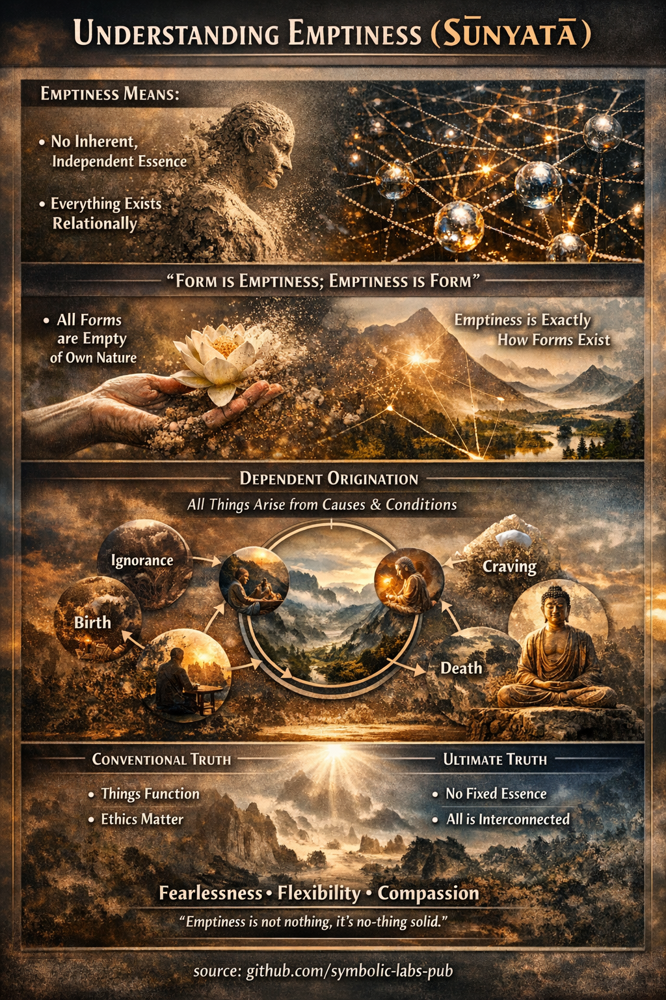

## [Üresség (Śūnyatā) a Mahāyāna buddhizmusban](https://github.com/symbolic-labs-pub/a-buddhist-view/blob/master/languages/hu/more/02_from_ignorance_to_awakening/4_emptiness/README.md#üresség-śūnyatā-a-mahāyāna-buddhizmusban)

A **Mahāyāna buddhizmusban** az **üresség (Śūnyatā)** az a **központi filozófiai és tapasztalati belátás**, amely felszabadítja a lényeket a [szenvedésből](../2_the_four_noble_truths/README.md#1-van-szenvedés-dukkha). Ez nem hiedelem, hanem a *valóság helyes látásmódja*.

---

### 1. Mit jelent valójában az üresség

A **Śūnyatā** azt jelenti, hogy **minden jelenség üres az inherens, független létezéstől**.

Ez **nem** azt jelenti:

* Semmi sem létezik ❌
* A valóság illúzió ❌
* Az élet értelmetlen ❌

**Igen** azt jelenti:

* Semmi sem létezik *önmagában*
* Minden **függően** létezik
* Minden dolog **relációs, esetleges és dinamikus**

Mahāyāna terminusokban ezt [**függő keletkezésnek**](../3_dependent_origination/README.md#a-tizenkét-láncszem-a-klasszikus-megfogalmazás) (*pratītyasamutpāda*) hívják, amikor világosan látják.

> Mivel a dolgok okok és feltételek miatt keletkeznek,
> nem rendelkezhetnek rögzített, független lényeggel.

---

### 2. Az üresség és a két igazság

A Mahāyāna **két elválaszthatatlan igazságon** keresztül artikulálja a valóságot:

1. [**Konvencionális igazság**](../5_the_two_truths/README.md#a-két-igazság-a-buddhista-tanításban)

   * A tárgyak, emberek, érzelmek és fogalmak működnek
   * A nyelv, [etika](../../01_core_teachings/the_noble_eightfold_path/README.md#2-etikus-magatartas-la) és okság működik
   * A szenvedés valóságos és az együttérzés szükséges

2. **Végső igazság (Śūnyatā)**

   * Egyetlen jelenség sem rendelkezik belső létezéssel
   * Minden identitás feloldódik elemzés alatt

Ezek **nem két külön valóság**.
Ezek *ugyanazon valóság megértésének két módja*.

> A konvencionális igazság tagadása nihilizmus.
> Az üresség tagadása eternalizmus.
> A Mahāyāna mindkettőt elkerüli.

---

### 3. Nāgārjuna és a Madhyamaka belátás

A filozófus **Nāgārjuna** sebészeti pontossággal artikulálta az ürességet.

Kulcsfontosságú belátása:

> **Az üresség az inherens létezés ürességét jelenti — semmi többet, semmi kevesebbet.**

Nāgārjuna megmutatta, hogy:

* Bármi, ami valóban függetlenül létezne, nem tudna változni
* Bármi, ami változik, nem lehet inherensen létező
* Mivel minden változik, minden üres

Döntően:

> **Maga az üresség is üres.**

A Śūnyatā **nem metafizikai szubsztancia** vagy végső "dolog".
Ez egy **korrekciós belátás**, nem helyettesítő hiedelem.

---

### 4. A Szív Szútra: A kanonikus kifejezés

A leghíresebb Mahāyāna tanítás az üresség kapcsán a **Szív Szútra**.

Központi sora:

> **A forma üresség; az üresség forma.**

Jelentése:

* Az üresség nem a jelenségek *mögött* van
* Az üresség nem *máshol* van
* Az üresség **maga a forma létezési módja**

A forma helyes látása *az* az üresség látása.

---

### 5. Üresség és együttérzés (Miért nem hideg filozófia ez)

Gyakori félreértés, hogy az üresség a távolságtartáshoz vagy apátiához vezet.

A Mahāyāna az ellenkezőjét tanítja:

* Amikor az ént üresnek látják → az ego-ragaszkodás összeomlik
* Amikor az ego összeomlik → a szétválasztás feloldódik
* Amikor a szétválasztás feloldódik → **az [együttérzés](../7_compassion/README.md#az-együttérzés-mint-strukturális-elv-a-buddhista-tanításban) természetessé válik**

Így az üresség a **[Bodhisattva](../../08_lineage/08_bodhisattva/README.md#4-the-bodhisattva-vow-as-structural-alignment) ösvény alapja**.

Nincs szilárd "én" amit védeni kell
→ nincs szilárd "más" akitől félni kell
→ erőfeszítés nélküli együttérzés

---

### 6. Az üresség tapasztalati, nem csupán fogalmi

A Mahāyāna ismételten figyelmeztet:

> **Az üresség intellektuális megértése nem felszabadulás.**

A Śūnyatā-t:

* Meditálni kell
* Stabilizálni kell a [tudatosságban](../../10_concepts/README.md#2-tudatosság-rigpa-vijñāna-knowing)
* Integrálni kell a magatartásba

Ez vezet:

* Félelemnélküliséghez
* Az elme rugalmasságához
* Spontán etikai válaszkészséghez

---

### 7. Pontos összefoglalás

A Mahāyāna buddhizmusban az **üresség (Śūnyatā)** azt jelenti:

* Minden jelenség hiányzik az inherens létezésből
* A valóság relációs és függően keletkező
* Az üresség elkerüli a nihilizmust és az eternializmust
* Az üresség és a forma elválaszthatatlanok
* Az üresség megvalósítása természetesen együttérzést hoz létre
* Az üresség egy **látásmód**, nem hiedelmrendszer

---

### Végső Mahāyāna belátás

> **Az üresség nem az, ami megmarad, amikor minden eltűnik.
> Az üresség az, ami megmarad, amikor mindent világosan látnak.**

---

< [Függő keletkezés (Paṭicca-samuppāda)](../3_dependent_origination/README.md) | [A két igazság a buddhista tanításban](../5_the_two_truths/README.md) >

_forrás: [github.com/symbolic-labs-pub](https://github.com/symbolic-labs-pub)_

---
