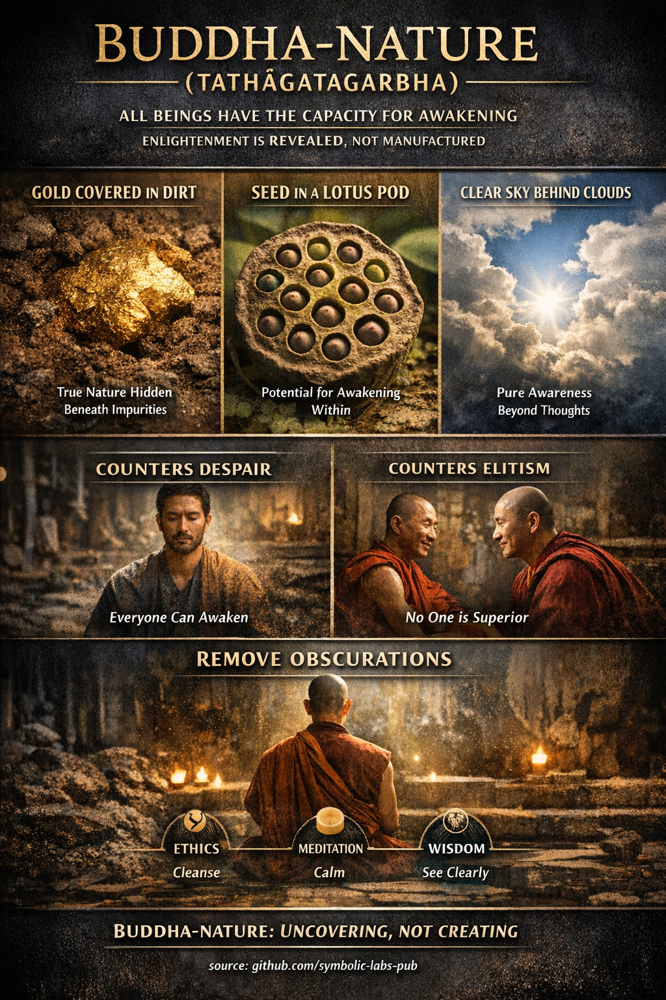

## [**Buddha-természet (Tathāgatagarbha)** — magyarázva a buddhista tanításokon keresztül](https://github.com/symbolic-labs-pub/a-buddhist-view/blob/master/languages/hu/more/02_from_ignorance_to_awakening/6_buddha_nature/README.md#buddha-nature-tathāgatagarbha--explained-through-buddhist-teachings)

### Mit mond valójában a tanítás

A **Buddha-természet** (*szanszkrit: Tathāgatagarbha, "a Buddha méhe/embriója"*) azt tanítja, hogy **minden érző lény rendelkezik a belső képességgel a felébredésre**.
Ez **nem** azt jelenti, hogy mindenki már megvilágosodott konvencionális értelemben. Azt jelenti, hogy **a [megvilágosodás](../../10_concepts/README.md#3-megvilágosodás-bodhi-awakening) feltételei már jelen vannak**, még ha el is vannak takarva.

A klasszikus [Mahāyāna](../../05_yanas/README.md#limitation-from-mahyna-view) nyelvben:

> Az ébredés nem *teremtődik* — *felfedődik*.

Ez a tanítás legvilágosabban olyan Mahāyāna szútrákban jelenik meg, mint a **Tathāgatagarbha Szútra**, **Śrīmālādevī Siṃhanāda Szútra**, és későbbi kommentár hagyományok, mint a **Mahāparinirvāṇa Szútra**.

---

### Mi **nem** a Buddha-természet

Kritikus tisztázás az ortodox buddhista értelmezésben:

* ❌ **Nem lélek (ātman)**
* ❌ **Nem örök én**
* ❌ **Nem metafizikai szubsztancia**

Ha rögzített én lenne, ellentmondana a **[nem-énnek (anattā)](../1_the_three_marks_of_existence/README.md#3-nem-en-anatt)** és az **ürességnek (śūnyatā)**.

Ehelyett a Buddha-természetet legjobban így értjük:

> **Az elme ürességét, amely lehetővé teszi az ébredést**

Más szóval:
Mivel az elme **nem rögzített**, **nem inherensen megszentségtelenített**, és **nincs birtokolva**, felébredhet.

---

### Miért számítanak a metaforák

A klasszikus metaforák, amelyeket felsoroltál, nem költői kiegészítések — ezek **precíziós eszközök** a félreértés megelőzésére.

#### 🟡 *Arany a sárral borítva*

* Az arany **soha nem sérült**
* A sár **járulékos**, nem lényeges
* A tisztítás nem *teremt* aranyat — **felfedi**

➡ A beszennyeződések (kapzsiság, gyűlölet, tévhit) **átmeneti feltételek**, nem az elme természete.

#### 🌱 *Mag egy lótusz hüvelyén belül*

* A [lótusz](../../09_symbols/08_lotus/README.md#a-lótusz-a-buddhista-tanításban) sárból nő
* A mag már tartalmazza a virág *formáját*
* Feltételek (víz, fény, idő) szükségesek

➡ A gyakorlat **szükséges**, de az **érés engedélyezésével** működik, nem találmánnyal.

#### ☁️ *Tiszta ég a felhők mögött*

* A felhők mozognak, az ég nem
* Az ég nem "javul", amikor a felhők eloszlanak
* A láthatóság változik, nem a lényeg

➡ A gondolatok és érzelmek eltakarják a [tudatosságot](../../10_concepts/README.md#2-tudatosság-rigpa-vijñāna-knowing), de **nem határozzák meg**.

---

### Hogyan illeszkedik ez az ürességhez (Śūnyatā)

Első ránézésre a Buddha-természet úgy hangozhat, mint az [üresség](../../10_concepts/01_emptiness/README.md#emptiness-nyat-in-vajrayna-buddhism) ellentmondása. Történelmileg ez valódi vitákat okozott.

A fő hagyományok által használt megoldás:

* Az **üresség** az **inherens létezés hiányát** írja le
* A **Buddha-természet** az **inherens akadály hiányát** írja le

> Mivel az elme üres a rögzített lényegtől, képes a felébredésre.

A Zen és a Madhyamaka gyakran óvatosan fogalmazza ezt:

> A Buddha-természet az **üresség, amelyet félelem nélkül tapasztalunk**.

---

### Miért létezik ez a tanítás (funkciója)

A Buddha-természet **pedagógiai orvosság**, amely konkrét veszélyekre írják fel:

#### 1. A kétségbeesés ellensúlyozása

E tanítás nélkül a gyakorlók arra következtethetnek:

* "Túlságosan összetört vagyok"
* "Az elmém reménytelen"
* "A megvilágosodás szerzeteseknek, szenteknek vagy eliteknek való"

A Buddha-természet közvetlenül cáfolja ezt.

#### 2. A spirituális elitizmus ellensúlyozása

Ugyanakkor megakadályozza:

* Az inherens felsőbbrendűség állításait
* A leszármazási arroganciát
* A "kiválasztott" gyakorlókat

Ha **mindenkinek van Buddha-természete**, senki sem birtokolja az ébredést.

#### 3. Az együttérzés támogatása

Ha minden lénynek megvan a képessége a felébredésre, akkor:

* Egyetlen lény sem eldobható
* Egyetlen lény sem alapvetően gonosz
* Az [együttérzés](../7_compassion/README.md#az-együttérzés-mint-strukturális-elv-a-buddhista-tanításban) racionálissá válik, nem szentimentálissá

---

### Hogyan kapcsolódik a gyakorlat a Buddha-természethez

A gyakorlat nem a tisztaság *hozzáadásáról* szól — az **elhomályosítások eltávolításáról**.

| Gyakorlat             | Funkció                          |
| -------------------- | --------------------------------- |
| [Etika (śīla)](../../01_core_teachings/the_noble_eightfold_path/README.md#2-etikus-magatartas-la)        | Stabilizálja a feltételeket             |
| [Meditáció ([samādhi](../../08_lineage/README.md))](../../03_the_path_to_end_suffering/README.md#right-action) | Csillapítja az elhomályosító turbulenciát        |
| [Bölcsesség (prajñā)](../../01_core_teachings/the_noble_eightfold_path/README.md#1-bölcsesség-pa)      | Átlát a hamis azonosuláson |

Ezért mondják sok hagyomány:

> Az ösvény nem a Buddha-természethez *vezet* —
> a zavarból a felismeréshez vezet.

---

### Tömör doktrinális összefoglalás

* A Buddha-természet megerősíti az **univerzális felébredési képességet**
* **Nem** vezeti be újra az ént
* Harmonizál az ürességgel, amikor helyesen értik
* Megakadályozza a nihilizmust *és* az arroganciát
* Újraértelmezi a gyakorlatot mint **felfedést, nem konstrukciót**

> Nem válsz valami újjá.
> Abbahagyod, hogy valami kisebbnek nézz magad.

---

< [A két igazság a buddhista tanításban](../5_the_two_truths/README.md) | [1. A bölcsesség és az együttérzés funkcionálisan elválaszthatatlanok](../7_compassion/README.md) >

_forrás: [github.com/symbolic-labs-pub](https://github.com/symbolic-labs-pub)_

---
