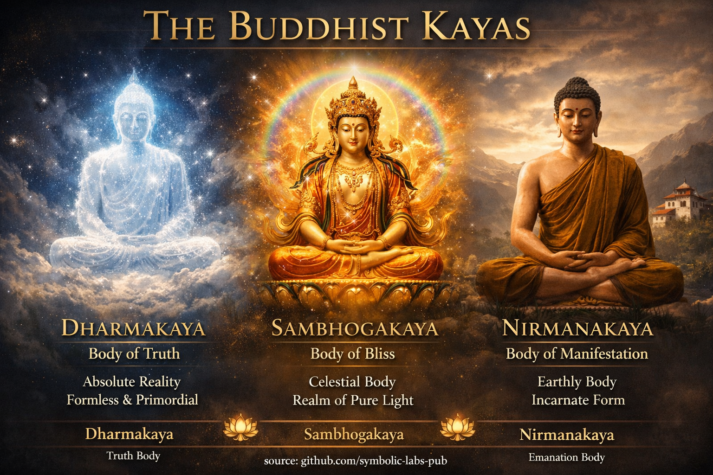

## [A Három Kāya (Trikāya)](https://github.com/symbolic-labs-pub/a-buddhist-view/blob/master/languages/hu/more/04_kayas/README.md#a-három-kāya-trikāya)

Tanítás

# Tanítás az Ébredés Három Testéről

*(Hogyan Egyek a Valóság, a Tapasztalat és az [Együttérzés](../02_from_ignorance_to_awakening/7_compassion/README.md#az-együttérzés-mint-strukturális-elv-a-buddhista-tanításban))*

---

## Bevezetés: Miért Beszélt Buddha "Testekről"

Buddha nem absztrakt eszmének tanította a [Megvilágosodást](../10_concepts/README.md#3-megvilágosodás-bodhi-awakening).
**A valóság megélt módjaként** tanította.

Mivel a lények különböznek képességeikben, az ébredett állapot különböző módokon jelenik meg.
Hogy ezt az eternalizmuson vagy nihilizmuson kívül magyarázza, a mesterek **három kāyáról** beszéltek — nem különálló entitásokként, hanem **az ébredés három elválaszthatatlan aspektusaként**.

Ezek nem szakaszok, amelyeket össze kell gyűjteni.
Ezek **dimenziók, amelyeket fel kell ismerni**.

---

## 1. Dharmakāya — Az Igazság Teste

A legmélyebb szinten az ébredés [**üres**](../10_concepts/01_emptiness/README.md#emptiness-nyat-in-vajrayna-buddhism).

Ez az üresség nem semmisség.
Ez a fixáció hiánya, a belső én hiánya, a torzítás hiánya.

Amikor valaki közvetlenül a tapasztalatra néz:

* Egyetlen gondolatnak sincs magja
* Egyetlen érzelem sem birtokolja magát
* Nem található "megfigyelő"

Mégis jelen van a [Tudatosság](../10_concepts/README.md#2-tudatosság-rigpa-vijñāna-knowing).

Ezt a nyitott, alaptalan tudást **Dharmakāya**-nak hívják.

Nem Gyakorlat hozza létre.
A Gyakorlat csak eltávolítja, ami elrejti.

> A Dharmakāya-t nem érik el.
> Felismerik, amikor a ragaszkodás ellazul.

Ha valaki a formához ragaszkodik, elszalasztja a Dharmakāya-t.
Ha valaki az ürességhez ragaszkodik, szintén elszalasztja a Dharmakāya-t.

Az igazi üresség **élő**.

---

## 2. Sambhogakāya — Az Élvezet Teste

Mivel az üresség nem halott, természetesen **tud**.

Ez a tudás tiszta, fénylő és jelentéssel bíró.
Belátásként, örömként, szimbolizmusként, látásként és finomított észlelésként jelenik meg.

Ezt **Sambhogakāya**-nak hívják.

Itt a Tudatosság gyönyörködik saját tisztaságában:

* A belátás erőfeszítés nélkül keletkezik
* A szépséget ragaszkodás nélkül észlelik
* A jelentés Fogalmak nélkül jelenik meg

A [Vajrayāna](../05_yanas/README.md#4-vajrayna-tantrayna-mantrayna-the-diamond-vehicle)-ban ezt kifejezik:

* Istenség formák
* [Mandalák](../09_symbols/07_mandala/README.md#mandala--explained-according-to-buddhist-teachings)
* [Mantra](../09_symbols/10_mantra/README.md#mi-is-a-mantra-valójában-buddhista-nézet) és hang
* Fény és szín

Ezek nem fantáziák.
Ezek **az ébredett kogníció nyelvei**.

> A Sambhogakāya az üresség, amely önmagához szól formában.

Ha valaki elutasítja ezt a tisztaságot, a Gyakorlat szárazabbá válik.
Ha valaki ragaszkodik hozzá, a Gyakorlat mámorba fordul.

A tisztaságnak **birtoktalannak** kell maradnia.

---

## 3. Nirmāṇakāya — Az Emanáció Teste

Amikor az üresség tiszta, természetesen **válaszol**.

Ez a válasz az Együttérzés.

Az Együttérzés nem erkölcsi parancs.
Ez az, amit a Tudatosság tesz, amikor akadálytalan.

Ez az együttérző válaszkészség így jelenik meg:

* Tanítók
* Cselekedetek
* Szavak
* Csend
* Hétköznapi emberi jelenlét

Ezt **Nirmāṇakāya**-nak hívják.

A Buddha járása, Tanítása, öregedése és halála nem a Megvilágosodás korlátja volt — hanem annak **kifejezése**.

> Ha az ébredés nem segít a lényeknek, akkor hiányos.

Ha valaki csak az ürességhez ragaszkodik, az Együttérzés elhal.
Ha valaki csak az Együttérzéshez ragaszkodik, a [Bölcsesség](../01_core_teachings/the_noble_eightfold_path/README.md#1-bölcsesség-pa) elvész.

Az igazi Együttérzés **erőfeszítés nélküli és pontos**.

---

## A Három Egysége

A három kāya nem három dolog.

* Az üresség tisztaság nélkül nem Dharmakāya
* A tisztaság Együttérzés nélkül nem Sambhogakāya
* A cselekvés Bölcsesség nélkül nem Nirmāṇakāya

Ezek egy valóság, három szögből nézve.

Mint:

* Az égbolt (üresség)
* A napfény (tisztaság)
* A melegség a bőrön (haszon)

Nem választasz egyet.
Mindhárom-at **egyszerre** ismered fel.

---

## A Gyakorló Hibája — és a Korrekció

**Gyakori hibák**

* Misztikus élmények kergetése → Sambhogakāya ragaszkodás
* Ürességbe oldódás → Dharmakāya félreértése
* Együttérzés erőltetése → Nirmāṇakāya utánzása

**Korrekció**

* Lazítsd el a fixációt
* Bízz a tisztaságban
* Engedd, hogy a válasz természetesen keletkezzen

> A Megvilágosodás nem intenzitás.
> Ez *akadálytalan működés*.

---

## Hogyan Gyakorolják Ezt a Tanítást

* Ülj és ismerd fel a nyitottságot → **Dharmakāya**
* Vedd észre az élénk tudást → **Sambhogakāya**
* Reagálj megfelelően → **Nirmāṇakāya**

A párnán, beszélgetésben, konfliktusban, munkában.

A megvalósítás próbája nem a látás.
Hanem a **folytonosság**.

---

## Záró Utasítás

Ne próbálj Buddha lenni.
Ne próbálj fenntartani egy állapotot.

Egyszerűen vedd észre:

* A Tudatosság már nyitott
* A tudás már jelen van
* Az Együttérzés már mozog

Amikor semmi nincs blokkolva,
**A Három Test teljes**.

---

Explanation

### 1. **Dharmakāya** — *Az Igazság Teste*
**Lényeg:** Maga a végső valóság
**Természet:** Üresség (*śūnyatā*) elválaszthatatlan a Tudatosságtól

**Kulcspontok**

* Formán, színen, helyen és időn túl
* Minden Buddha **alapja**
* Tiszta **tudás-tér**: üres, mégis tiszta
* Minden Buddha számára ugyanaz — nem személyes

**Klasszikus metaforák**

* Tiszta, nyitott égbolt
* Végtelen tér
* Csendes óceán mélysége

**A Gyakorlatban**

* Az ürességbe való **közvetlen belátással** valósul meg
* Központi a [**Dzogchen**-ben és a **Mahāmudrā**-ban](mahamudra_and_dzogcsen/README.md#1-dharmakya-ground-recognition)
* Nem valami, amivé "válsz" — valami, amit **felismersz**

> A Dharmakāya nem isten, lélek vagy szubsztancia.
> Ez a **valóság torzítás nélkül látva**.

---

### 2. **Sambhogakāya** — *Az Élvezet / Boldogság Teste*

**Lényeg:** Az ébredés sugárzó tisztasága
**Természet:** Boldog, fénylő Tudatosság formával

**Kulcspontok**

* Finom, archetipikus, szimbolikus forma
* **Magasan megvalósult [bodhiszattvák](../08_lineage/08_bodhisattva/README.md#4-the-bodhisattva-vow-as-structural-alignment)** észlelik
* **Tiszta birodalmakban** jelenik meg
* Mandalákként, fényként, színekként, istenségekként fejezi ki magát

**Klasszikus metaforák**

* Szivárvány fény
* Tükröződések egy kristályban
* Napfény ködön át

**A Gyakorlatban**

* [**Istenség jógán**](../03_the_path_to_end_suffering/README.md#helyes-cselekvés), mantrán, mandala vizualizáción keresztül érhető el
* Központi a **Vajrayāna tantrában**
* Nem képzelet — **szimbolikus kogníció**, amelyet a valóság feltárására tréningeznek

> A Sambhogakāya az **ébredés, amely önmagával kommunikál**
> finomított, jelentéssel bíró formában.

---

### 3. **Nirmāṇakāya** — *Az Emanáció Teste*

**Lényeg:** Együttérzés cselekvésben
**Természet:** Hétköznapi megjelenésű forma a világban

**Kulcspontok**

* Fizikai megnyilvánulás térben és időben
* Magában foglalja a történelmi tanítókat (pl. Śākyamuni Buddha)
* **Bármilyen forma** lehet, amely hasznos a lényeknek
* Születésnek, betegségnek, halálnak van alávetve

**Klasszikus metaforák**

* Hold tükröződése vízben
* Tanító hangja
* Gyógyszer adaptálva a betegséghez

**A Gyakorlatban**

* [Etika](../01_core_teachings/the_noble_eightfold_path/README.md#2-etikus-magatartas-la), szolgálat, Tanítás, mindennapi élet
* Ahol a Megvilágosodás **találkozik a [Szenvedéssel](../02_from_ignorance_to_awakening/2_the_four_noble_truths/README.md#1-van-szenvedés-dukkha)**
* Hogyan válik hasznossá az ébredés

> Ha a Dharmakāya az igazság
> és a Sambhogakāya a jelentés,
> a Nirmāṇakāya a **segítség**.

---

## Hogyan Viszonyulnak a Kāyák (Kulcsfontosságú Tibeti Belátás)

Ezek **nem három különálló dolog**.

| Aspektus           | Analógia                    |
| ---------------- | -------------------------- |
| [**Dharmakāya**](#1-dharmakāya-az-igazság-teste)   | A nyitott égbolt               |
| [**Sambhogakāya**](#2-sambhogakāya-az-élvezet-boldogság-teste) | Felhők, fény, szivárványok    |
| [**Nirmāṇakāya**](#3-nirmāṇakāya-az-emanáció-teste)  | Eső, amely táplálja a földet |

Mindhárom **egyidejűleg jelen van** az [ébredésben](../10_concepts/README.md#3-megvilágosodás-bodhi-awakening).

* Dharmakāya nélkül → az Együttérzés elveszíti a Bölcsességet
* Sambhogakāya nélkül → a Bölcsesség nem tud kommunikálni
* Nirmāṇakāya nélkül → a Bölcsesség senkinek sem segít

---

## Haladó Tibeti Kiterjesztések (Röviden)

Néhány tibeti rendszer **öt kāyáról** beszél:

* **Svabhāvikakāya** — a három elválaszthatatlanság (egységük)
* **Mahāsukhakāya** — nagy boldogság test (gyakran Dzogchen / Legmagasabb Jóga Tantra)

Ezek **finomítások**, nem ellentmondások.

---

## Miért Fontosak a Kāyák Gyakorlatilag

A tibeti buddhizmus a kāyákat használja, hogy válaszoljon:

* *Milyen valójában a Megvilágosodás?*
* *Hogyan segíthet a formátlan a világnak?*
* *Miért jelenhet meg az ébredés emberi Tanítóként?*

Biztosítják, hogy a buddhizmus elkerülje:

* Az **eternalizmust** (állandó istenszerű lényeg)
* A **nihilizmust** (semmi értelmes nem létezik)

---

## Egy Mondatos Összefoglalás

> A **Dharmakāya** az ébredés mint igazság,
> a **Sambhogakāya** az ébredés mint fénylő jelentés,
> a **Nirmāṇakāya** az ébredés mint együttérző cselekvés.

---

Meditáció

# Trikāya Meditációs Szekvencia

*(Az Alaptól → Fénylésig → Együttérzésig)*

---

## Preparation (2–5 minutes)

**Posture**

* Sit upright, relaxed, dignified
* Spine like a stack of coins
* Hands resting naturally
* Eyes softly open or gently closed

**Settling**

* Let breathing fall into its own rhythm
* Do **not** control it
* Let thoughts come and go without correction

> You are not preparing to *create* a state
> You are preparing to *recognize* one.

---

## Phase I — Dharmakāya

**Resting as Open Tudatosság** (10–15 minutes)

**Instruction**

1. Let attention relax **outward and inward at the same time**
2. Do not focus on an object
3. Do not block thoughts
4. Simply notice:

   * Tudatosság is present
   * It has no shape
   * It is not owned

**Key recognition**

* Thoughts arise **in** Tudatosság
* Sensations arise **in** Tudatosság
* Tudatosság itself does not move

If a thought appears:

* Do nothing
* Do not follow
* Do not suppress
* Let it dissolve by itself

**Pointer**

> Can you find the *edge* of Tudatosság?

If you try to locate it and fail — that failure *is the recognition*.

**Common mistake**

* Trying to “blank out”
* Trying to hold stillness

**Correct orientation**

* Open
* Uncontrived
* Naturally present

Rest here.

---

## Phase II — Sambhogakāya

**Allowing Luminous Presence** (8–12 minutes)

Now, without leaving openness:

1. Notice that Tudatosság is not dull
2. It is **clear**
3. It is **vivid**
4. It knows

Let perception become slightly more **sensory-rich**:

* Colors behind closed eyes
* Subtle light
* Warmth in the body
* Spacious clarity

If helpful, lightly imagine:

* Tudatosság as **soft radiant light**
* Not visualized sharply
* More *felt* than seen

Let feelings of:

* Ease
* Joy
* Quiet appreciation
  arise naturally **without grasping**

> This is not emotional excitement
> This is the *enjoyment of clarity itself*

**Mantra (optional, silent)**

* A gentle “Ah” on the out-breath
* As a sign of openness, not repetition

**Key recognition**

* Emptiness is not blank
* Clarity is not solid
* They are **inseparable**

Rest.

---

## Phase III — Nirmāṇakāya

**Együttérzés in Form** (8–12 minutes)

Without losing openness or clarity:

1. Bring to mind **one being**

   * Someone you care about
   * Or someone neutral
   * Or even yourself

2. Do **not** think about their story

3. Simply recognize:

   * They want happiness
   * They want relief from Szenvedés

Let the natural warmth of Tudatosság **move outward**.

You are not sending something.
You are **allowing expression**.

Silently:

> “May this Tudatosság take the form you need.”

Let Együttérzés be:

* Ordinary
* Unforced
* Practical

If images arise of helping, listening, or presence — let them pass naturally.

**Key recognition**

* Együttérzés is not effort
* It is **what clarity does when unobstructed**

---

## Integration — The Three as One (3–5 minutes)

Now notice:

* Tudatosság is **empty** → Dharmakāya
* Tudatosság is **clear** → Sambhogakāya
* Tudatosság is **responsive** → Nirmāṇakāya

They are not sequential anymore.

They are **one movement**.

Sit without modifying anything.

---

## Closing (1–2 minutes)

Before standing:

* Intend that this recognition continues
* Especially in:

  * Speech
  * Decisions
  * Small interactions

> Megvilágosodás is not proven in Meditáció
> It is proven in continuity.

---

## Daily-Life Micro-Gyakorlat (Very Important)

Several times a day, pause for **3 seconds**:

1. Notice Tudatosság ([Dharmakāya)](../10_concepts/README.md#2-tudatosság-rigpa-vijñāna-knowing)
2. Notice clarity (Sambhogakāya)
3. Respond kindly (Nirmāṇakāya)

This is how the Meditáció **enters life**.

---

## Signs You’re Practicing Correctly

* Less reactivity
* More space before speech
* Natural Együttérzés without fatigue
* Less interest in “spiritual achievement”
* More interest in **precision and kindness**

---

---

< [What “Ending Szenvedés” Actually Means](../03_the_path_to_end_suffering/README.md) | [1. Dharmakāya → *Ground Recognition*](mahamudra_and_dzogcsen/README.md) >

_source: [github.com/symbolic-labs-pub](https://github.com/symbolic-labs-pub)_

---
