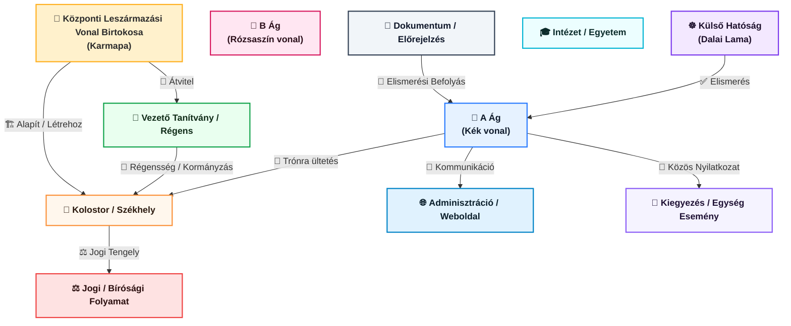
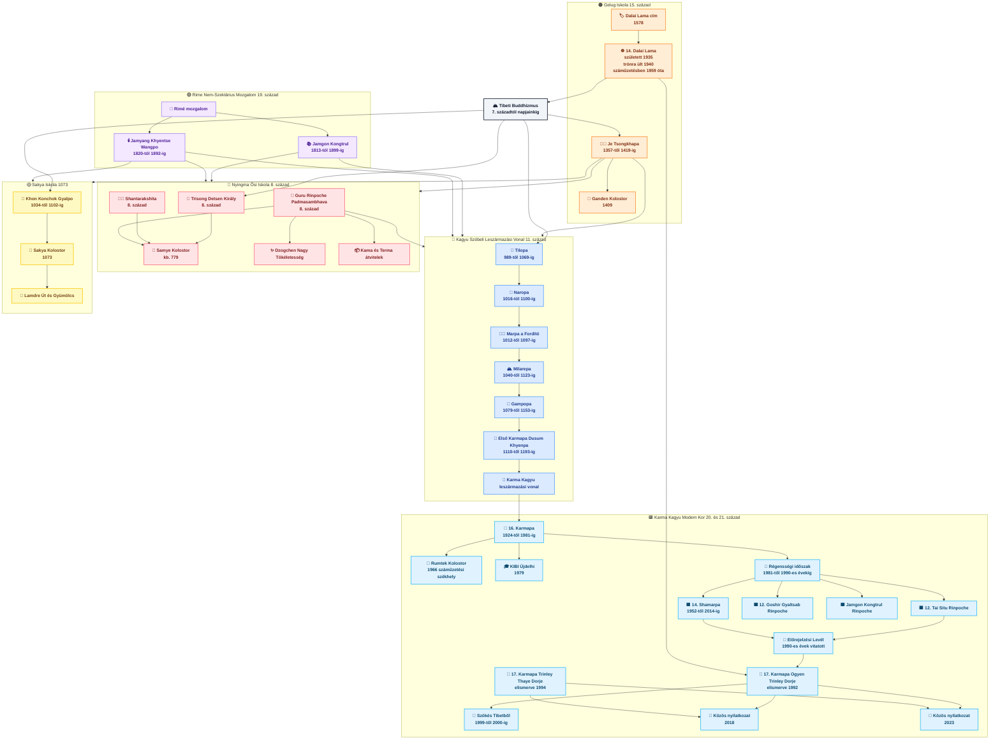

# Múlt

---

# Egyetlen Láng, Sok Lámpa

Amikor a Tibeti Buddhizmus-t csak iskolák, címek és ruhák gyűjteményeként tekintjük, mélyebb koherenciája kihagyható. Mégis amikor a leszármazási vonal lencséjén keresztül nézzük, sokkal organikusabb dologként tárja fel magát: **egyetlen láng, amelyet lámpáról lámpára visznek**, adaptálva alakját anélkül, hogy elvesztené fényét.

Az összegyűjtött alakok—**Gautama Buddha**, **Tilopa**, **Naropa**, **Marpa**, **Milarepa**, **Gampopa**, **Dusum Khyenpa**, **Rangjung Rigpe Dorje**, **Trinley Thaye Dorje**, **Je Tsongkhapa** és **Gedun Drupa**—nem véletlenszerű gyülekezetet alkotnak, hanem a **megvalósítás történelmi gerincét**.

Radikálisan különböznek temperamentumban, módszerben és társadalmi szerepben. Mégis mindegyik ugyanarra a kérdésre válaszol:

> *Hogyan lehet az ébredést lehetővé tenni az ebben a konkrét időben, testben és világban élő lények számára?*

---

## 1. Gautama Buddha: A Forrás Iskola Nélkül

**Gautama Buddha** (i.e. 5. század) nem tibeti alakként áll külön, hanem **magának a kísérletnek a forrása**. Betekintése nem metafizikai spekuláció volt, hanem diagnózis:

* A szenvedés létezik
* Okai vannak
* Megszűnhet
* Van út

Minden, ami következik—szerzetesi fegyelem, tantrikus rituálé, jógikus intenzitás, tudományos precizitás—**mérnöki válasz** erre az eredeti felfedezésre.

Fontos, hogy Buddha **nem alapított "buddhizmust".** Egy *módszert* alapított: az etika, meditáció és bölcsesség tesztelése az élt tapasztalattal szemben. A Tibeti Buddhizmus örökli ezt a pragmatizmust, még akkor is, amikor külső formái díszesnek tűnnek.

---

## 2. Tilopa és Naropa: Ébredés Intézmények Nélkül

**Tilopa** (10-11. század) és **Naropa** esetében a leszármazási vonal a **mahasiddha-k** világába kerül—olyan alakok, akik szándékosan elutasították a társadalmi tiszteletreméltóságot.

Tilopa megvalósítása nem kolostorokban, hanem **hétköznapi munkából** és a közvetlen tapasztalatba vetett radikális bizalomból eredt. Naropa, egykor ünnepelt tudós Nalanda-ban, **el kellett tanulnia az intellektuális bizonyosságot** egy sor megalázó próbatétel révén, mielőtt a megvalósítás megérett.

Üzenetük veszélyes és felszabadító volt:

> *Az ébredést nem intézmények adják.
> Az intézmények azért léteznek, hogy szolgálják az ébredést.*

Ez az elv ismételten visszhangzik a tibeti történelemben.

---

## 3. Marpa és Milarepa: Átvitel Emberi Áron Keresztül

**Marpa a Fordító** elhozta ezeket a tanításokat Tibetbe, nem misztikusként, hanem **házigazdaként, kereskedőként és fordítóként**. Szerepe nem a szentség volt, hanem a *pontosság*. Érintetlenül megőrizte a tanításokat, még akkor is, ha ezt durvaság révén kellett tennie.

Tanítványa, **Milarepa** a másik végpontot képviseli: egy gyilkos, aki yogi-vá alakult át elviselhetetlen fegyelem révén. Élete bemutat egy központi tibeti betekintést:

> *A karmát nem hit törli el—de megemészthetjük gyakorlat révén.*

Milarepa dalai mutatják, hogy a megvalósítás nem steril derű. Nyers, emberi, megtestesült, és gyakran csak mély szenvedés után örömteli.

---

## 4. Gampopa: A Nagy Integráció

**Gampopa** végrehajtotta a buddhista történelem egyik legfontosabb szintézisét. Először a Kadampa szerzetesi hagyományban képezték, egyesítette:

* **Szerzetesi fegyelmet**
* **Mahāyāna együttérzést**
* **Tantrikus közvetlenséget**

Ez a fúzió lehetővé tette a Kagyu leszármazási vonal **skálázását**—hogy a magányos yogi-któl közösségekbe lépjen anélkül, hogy elveszítené a tapasztalati mélységet. Gampopa nélkül nem lenne tartós Kagyu iskola.

---

## 5. Dusum Khyenpa és a Karmapa Elv

**Dusum Khyenpa**, az Első Karmapa esetében valami példa nélküli jelenik meg: **a tulku rendszer mint tudatos folytonossági mechanizmus**.

A Karmapa nem csupán újjászületik; **felismeri saját reinkarnációját**. Ez kevésbé misztikus, mint amilyennek hangzik—ez egy radikális megoldás egy gyakorlati problémára:

> *Hogyan élhet túl egy megvalósítási hagyomány évszázadokat korrupció vagy hígítás nélkül?*

A válasz a felelősség folytonossága volt, nem a hatalom.

---

## 6. Je Tsongkhapa és Gedun Drupa: Precizitás Mint Együttérzés

A Kagyu áramlattal párhuzamosan **Je Tsongkhapa** alapította a Gelug hagyományt a 14-15. században. Zsenialitása nem új betekintés feltalálása volt, hanem **az episztemikus tisztaságon való ragaszkodás**.

Tsongkhapa úgy vélte, hogy az együttérzés precizitás nélkül szentimentalizmussá válik, a meditáció elemzés nélkül pedig öncsalás kockázatát rejti.

Tanítványa, **Gedun Drupa**, akit később az Első Dalai Lama-ként ismertek el, ezt a tisztaságot testesítette meg intézményes formában—olyan kolostorokat alapítva, amelyek egyensúlyba hozták a szigorú tudományosságot az etikai fegyelemmel.

Ez a vonal később a Dalai Lama intézményt mint **erkölcsi hangot a szektarizmuson túl** hozná létre.

---

## 7. Rangjung Rigpe Dorje: Leszármazási Vonal Száműzetésben

A **16. Karmapa**, Rangjung Rigpe Dorje olyan kihívással nézett szembe, amellyel egyetlen korábbi birtokos sem: **magának a tibeti civilizációnak a pusztulása**.

Válasza nem visszavonulás, hanem **fordítás globális kontextusba** volt:

* A Rumtek Kolostor újjáépítése (1966)
* Nyugatra utazás (1974-től)
* A Kagyu leszármazási vonal átvitele a tibeti kultúrán kívül

Bemutatta, hogy a leszármazási vonal nem földrajzilag kötött. **A megvalósítás vándorol.**

---

## 8. Trinley Thaye Dorje: Leszármazási Vonal Modern Körülmények Között

**Trinley Thaye Dorje**, az elismert 17. Karmapa-k egyike, modern korlátok alatti leszármazási vonalat képvisel: diaszpóra, jogrendszerek, média felügyelet és globális gyakorlók.

Ami itt számít, az nem a kontroverzsia, hanem a folytonosság. Jelenléte bemutatja, hogy a Kagyu kérdés élő marad:

> *Megélheti a mély megvalósítás az átláthatóságot, pluralizmust és modern pszichológiát?*

A válasz még kibontakozóban van.

---

## 9. Rejtett Egység

Bár ezek az alakok különböző iskolákhoz tartoznak—különösen Kagyu és Gelug—**nem versenytársak**. A Tibeti Buddhizmus mindig tudta, hogy a módszerek azért különböznek, mert **a lények különböznek**.

Ami egyesíti őket, az nem doktrína, hanem **funkció**:

* A szenvedés csökkentése
* A betekintés megőrzése
* A megvalósítás átvitele torzítás nélkül

A képeden mosolyognak, mert nem aggódnak az ortodoxia miatt. A leszármazási vonal nem merevségtől függ. **Integritástól** függ.

---

## Következtetés: Miért Számít Még Ez a Leszármazási Vonal

Ez a leszármazási vonal nem a múltról szól. **Arról szól, hogyan éli túl a bölcsesség az időt**.

Minden alak ugyanazt a kérdést válaszolta meg másként:

* Buddha: *Ébredj.*
* Tilopa: *Bízz a tapasztalatban.*
* Milarepa: *Állj ki az átalakulást.*
* Tsongkhapa: *Légy precíz.*
* A Karmapa-k: *Folytasd.*

Együtt egyetlen élő rendszert alkotnak—adaptív, rugalmas és csendesen radikális.

Nem múzeum.

Átvitel.

---

---

< [Történelem](README.md) | [Napjaink](present.md) >

_forrás: [github.com/symbolic-labs-pub](https://github.com/symbolic-labs-pub)_

---
