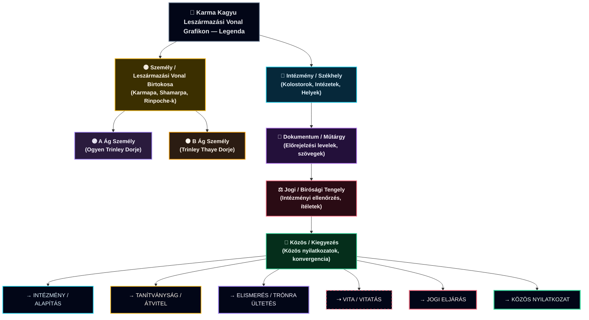

```mermaid
flowchart LR
  %% ==========================================
  %% 🌈 Karma Kagyu leszármazási vonal grafikon
  %% - Szín csoportok classDef + subgraph-okon keresztül
  %% - Vonalak színezve jelentés szerint linkStyle-on keresztül (sorrend-érzékeny)
  %% ==========================================

  %% ---------- Személyek ----------
  K16["👑 Őszentsége 16. Karmapa<br/>Rangjung Rigpe Dorje<br/>(1924–1981)"]
  K17A["👑 17. Karmapa (A Ág)<br/>Ogyen Trinley Dorje<br/>(szül. 1985)"]
  K17B["👑 17. Karmapa (B Ág)<br/>Trinley Thaye Dorje<br/>(szül. 1983)"]

  SH14["🟥 14. Shamarpa<br/>Mipham Chökyi Lodrö<br/>(1952–2014)"]
  TS12["🟦 12. Tai Situ Rinpoche"]
  GY12["🟩 12. Goshir Gyaltsab Rinpoche"]
  JKX["🟪 Jamgön Kongtrül Rinpoche<br/>(régensség korszak)"]

  DL14["☸️ Őszentsége 14. Dalai Lama"]

  %% ---------- Intézmények / Székhelyek ----------
  Rumtek["🏯 Rumtek Kolostor<br/>(Sikkim, India)<br/>Száműzetési székhely"]
  Tsurphu["🏯 Tsurphu Kolostor<br/>(Tibet)<br/>Hagyományos székhely"]
  KIBI["🎓 KIBI<br/>Újdelhi, India"]
  Dharamsala["🏔️ Dharamsala<br/>HP, India"]
  BodhGaya["🕯️ Bodh Gaya<br/>Bihar, India"]

  KagyuOffice["🌐 Kagyu Office<br/>(kagyuoffice.org)<br/>A Ág kommunikáció"]
  KarmapaOrg["🌐 karmapa.org<br/>B Ág kommunikáció"]

  %% ---------- Dokumentumok / Events ----------
  PredLetter["📜 Vitatott Előrejelzési Levél<br/>(elismerési folyamat)"]
  Joint2018["🤝 Közös Nyilatkozat<br/>2018-10-11<br/>(Franciaországi találkozó)"]
  Joint2023["🤝 Közös Nyilatkozat<br/>2023-12-04<br/>(Shamarpa reinkarnáció együttműködés)"]

  RumtekCase["⚖️ Rumtek jogi ítéletek<br/>2003-08-26 (Sikkim HC)<br/>2004-07-05 (India SC)"]

  %% ==========================================
  %% CSOPORTOSÍTÁS (subgraph-ok)
  %% ==========================================
  subgraph A["🧡 Központi Leszármazási Vonal Horgony"]
    K16
  end

  subgraph B["💛 Elismerés és Trónra Ültetés Ágak (1981 Utáni)"]
    K17A
    K17B
    PredLetter
  end

  subgraph C["💙 Régensség / Vezető Tanítványok (Szív-Fiak korszak)"]
    SH14
    TS12
    GY12
    JKX
  end

  subgraph D["💚 Székhelyek és Intézmények"]
    Rumtek
    Tsurphu
    KIBI
    Dharamsala
    BodhGaya
  end

  subgraph E["🩶 Kormányzás / Jogi / Adminisztráció"]
    RumtekCase
    KagyuOffice
    KarmapaOrg
  end

  subgraph F["💜 Kiegyezés / Egység Útvonal"]
    Joint2018
    Joint2023
  end

  %% ==========================================
  %% ÉLEK (sorrend megőrzése; linkStyle indexek ezekre utalnak)
  %% ==========================================

  %% (1) Intézményi építés
  K16 -->|🏗️ SZÉKHELY ALAPÍTÁSA • 1966| Rumtek
  K16 -->|🏗️ ALAPÍTÁS • 1979-11| KIBI

  %% (2) Tanítványság / átvitel
  K16 -->|🧘 ÁTVITEL • 1981 előtt| SH14
  K16 -->|🧘 ÁTVITEL • 1981 előtt| TS12
  K16 -->|🧘 ÁTVITEL • 1981 előtt| GY12
  K16 -->|🧘 ÁTVITEL • 1981 előtt| JKX

  %% (3) Régensségi szerepek
  SH14 -->|🧭 RÉGENSSÉG • 1981→1990-es évek| Rumtek
  TS12 -->|🧭 RÉGENSSÉG • 1981→1990-es évek| Rumtek
  GY12 -->|🧭 RÉGENSSÉG • 1981→1990-es évek| Rumtek
  JKX -->|🧭 RÉGENSSÉG • 1981→1990-es évek| Rumtek

  %% (4) Elismerési szakadás mechanika
  TS12 -->|📜 BEMUTATJA • korai 1990-es évek| PredLetter
  SH14 -->|❗ VITATJA • 1990-es évek| PredLetter
  PredLetter -->|🧩 BEFOLYÁSOLJA • 1992| K17A

  DL14 -->|✅ ELISMERÉS • 1992-06-30| K17A
  K17A -->|👑 TRÓNRA ÜLT • 1992-09-27| Tsurphu
  K17A -->|🧳 ÉRKEZÉS • 2000-01-05| Dharamsala

  SH14 -->|✅ ELISMERÉS • 1994-03| K17B
  K17B -->|👑 TRÓNRA ÜLT • 1996-12| BodhGaya

  %% (5) Adminisztráció / kommunikáció
  K17A -->|📣 KOMMUNIKÁCIÓ • 2000-es évek→| KagyuOffice
  K17B -->|📣 KOMMUNIKÁCIÓ • 1990-es évek→| KarmapaOrg

  %% (6) Jogi tengely
  Rumtek -->|⚖️ JOGI • 2003–2004| RumtekCase
  RumtekCase -->|🏛️ ADMINISZTRÁCIÓT BEFOLYÁSOLJA • 2000-es évek→| Rumtek

  %% (7) Kiegyezés
  K17A -->|🤝 KÖZÖS • 2018-10-11| Joint2018
  K17B -->|🤝 KÖZÖS • 2018-10-11| Joint2018
  K17A -->|🤝 KÖZÖS • 2023-12-04| Joint2023
  K17B -->|🤝 KÖZÖS • 2023-12-04| Joint2023
  Joint2023 -->|🧬 LESZÁRMAZÁSI VONAL FOLYAMAT • jövő| SH14

  %% ==========================================
  %% STÍLUSOK (csomópontok)
  %% ==========================================
  classDef core fill:#FFF1CC,stroke:#FFB020,stroke-width:2px,color:#2B2B2B,font-weight:700;
  classDef branchA fill:#E6F2FF,stroke:#2B7CFF,stroke-width:2px,color:#0F1A2B,font-weight:700;
  classDef branchB fill:#FFE6F2,stroke:#D81B60,stroke-width:2px,color:#2B0F1A,font-weight:700;

  classDef regent fill:#E9FFEF,stroke:#14A44D,stroke-width:2px,color:#0F2B17,font-weight:700;
  classDef dalai fill:#F3E8FF,stroke:#7C3AED,stroke-width:2px,color:#1D102B,font-weight:700;

  classDef seat fill:#FFF7ED,stroke:#FB923C,stroke-width:2px,color:#2B1A0F,font-weight:700;
  classDef institute fill:#ECFEFF,stroke:#06B6D4,stroke-width:2px,color:#0B2B2A,font-weight:700;

  classDef doc fill:#F1F5F9,stroke:#334155,stroke-width:2px,color:#0F172A,font-weight:700;
  classDef legal fill:#FEE2E2,stroke:#EF4444,stroke-width:2px,color:#2B0F0F,font-weight:700;
  classDef web fill:#E0F2FE,stroke:#0284C7,stroke-width:2px,color:#0B1F2B,font-weight:700;
  classDef unity fill:#F5F3FF,stroke:#8B5CF6,stroke-width:2px,color:#1E1033,font-weight:700;

  class K16 core
  class K17A branchA
  class K17B branchB

  class SH14 regent
  class TS12 regent
  class GY12 regent
  class JKX regent
  class DL14 dalai

  class Rumtek seat
  class Tsurphu seat
  class BodhGaya seat
  class Dharamsala seat
  class KIBI institute

  class PredLetter doc
  class Joint2018 unity
  class Joint2023 unity

  class RumtekCase legal
  class KagyuOffice web
  class KarmapaOrg web

  %% ==========================================
  %% STÍLUSOK (élek jelentés szerint) — sorrend-érzékeny
  %% 0-1: építés/intézmény (narancssárga)
  %% 2-5: átvitel (zöld)
  %% 6-9: régensség (türkiz)
  %% 10-12: elismerési mechanika (szürke)
  %% 13-15: A Ág elismerés/trónra ültetés/áthelyezés (kék)
  %% 16-17: B Ág elismerés/trónra ültetés (rózsaszín)
  %% 18-19: kommunikáció/adminisztráció (cyan)
  %% 20-21: jogi tengely (piros)
  %% 22-26: kiegyezés (lila)
  %% ==========================================
```

# Leszármazási Vonal Birtokosai

---

**[Guru Rinpoche (Padmasambhava)](https://en.wikipedia.org/wiki/Padmasambhava)** főként a **[Nyingma](https://www.rigpawiki.org/index.php?title=Nyingma)** ("Ősi") iskola és két átviteli áramlatának alapja: **Kama (szóbeli)** és **Terma (kincs)**. ([Wikipedia][1])

A **Karmapa** a **Karma Kagyu** leszármazási vonal feje (egy Kagyu iskola), amelynek saját elsődleges "gerince" van az átvitelben (Marpa → Milarepa → Gampopa → …). De a gyakorlatban a tibeti leszármazási vonalak sokat keresztbe porzanak (különösen a **Rimé/nem-szektárius mozgalom** óta), így gyakran látható **Padmasambhava gyakorlatok** és Nyingma átvitelek megjelenése a Kagyu tananyagban és felhatalmazásokban—anélkül, hogy Guru Rinpoche a *formális* Kagyu leszármazási vonal gyökere lenne.

---

## 1) A Karma Kagyu "gerinc"

A Karma Kagyu a tágabb **[Kagyu hagyományon](https://www.rigpawiki.org/index.php?title=The_Kagyu_Tradition)** belül helyezkedik el (a négy fő tibeti iskola egyike). A Kagyu ezen keresztül nyomon követhető:
**Marpa (fordító) → Milarepa → Gampopa → (Karma Kagyu ág) → Karmapa-k (tulku vonal).** ([Rigpa Wiki][2])

A **16. Karmapa-nál** kezdünk, így ott kezdődik a részletes idővonal.

---

## 2) Őszentsége a 16. Karmapa (1924–1981): kulcs események és miért számít

**Őszentsége a 16. Karmapa Rangjung Rigpe Dorje (született 1924, meghalt 1981)** széles körben elismerve **újjáépítette a Karma Kagyu intézményes bázisát száműzetésben** és **jelentős nyugati bázisokat hozott létre**. ([Karmapa Official][3])

### Központi idővonal (Kr.u.)

* **1959** — Elhagyja Tibetet és Sikkim-be (India) megy. ([Wikipedia][4])
* **1962–1966** — Újjáépíti a **[Rumtek Kolostort](https://en.wikipedia.org/wiki/Rumtek_Monastery)** mint a **Karmapa száműzetési székhelyét**; **1966-ban felavatták**. ([Wikipedia][4])
* **1972** — Nagy zarándoklat India-szerte főbb tanítványokkal (beleértve Shamar Rinpoche-t). ([Karmapa Official][3])
* **1974** — **Első jelentős Karmapa látogatás Nyugaton** (Európa/USA/Kanada); Fekete Korona ceremóniák széles körben tanúsítva. ([Karmapa Official][3])
* **1974 január közepén** — Találkozik **VI. Pál pápával** Rómában az európai turné során. ([Karmapa Official][3])
* **1976–1977** — További nyugati tanítási körút; Kagyu központok gyors terjedése Európában. ([Karmapa Official][3])
* **1979 november** — Leteszi az alapkövet a **Karmapa Nemzetközi Buddhista Intézet (KIBI)** számára Újdelhiben. ([Karmapa Official][3])
* **1981** — Elhunyt (parinirvāṇa). ([Rigpa Wiki][5])

### Intézményes "ág csomópontok", amelyeket megerősített (ma is fontosak)

* **Rumtek** (száműzetési székhely, Sikkim) ([Wikipedia][4])
* **KIBI** (Újdelhi) ([Karmapa Official][3])
* Kagyu központok bővítése **Európában/Észak-Amerikában** ([Karmapa Official][3])

---

## 3) 1981 után: a "Négy Szív Fiú" régensség (a kritikus csomópont)

A 16. Karmapa elhunyta után tanácsot/régensséget alakítottak négy fő tanítványa ("szív fiak"), általában így sorolva:

* **14. Shamarpa (Mipham Chökyi Lodrö, 1952–2014)** ([Wikipedia][6])
* **12. Tai Situ Rinpoche** ([Kagyu Office][7])
* **(3.) Jamgön Kongtrül Rinpoche** (leszármazási vonal székhely birtokosa akkoriban) ([Wikipedia][8])
* **12. Goshir Gyaltsab Rinpoche** ([Wikipedia][8])

Ez a régensség struktúra központi, mert a későbbi szakadás nagyrészt ahhoz köthető, **hogyan kezelték és vitatták a 17. Karmapa elismerését**. ([Wikipedia][8])

---

## 4) A 17. Karmapa elismerési szakadás (1992 → jelen): két ág

### A Ág — **Ogyen Trinley Dorje** (elismerve 1992; trónra ült Tsurphu-ban)

Kulcs, nagy bizonyosságú mérföldkövek:

* **1992. június 30.** — Nyilvános megerősítő nyilatkozat **Őszentségétől a 14. Dalai Lama**-tól, elismerve a 16. Karmapa reinkarnációját mint **Ogyen Trinley Dorje**. ([Wikipedia][9])
* **1992. szeptember 27.** — Trónra ült mint 17. Karmapa a **Tsurphu Kolostorban** (hagyományos székhely Tibetben). ([Wikipedia][9])
* **1999. december 28. → 2000. január 5.** — Megszökik Tibetből; megérkezik **Dharamsala-ba, India**. ([Kagyu Office][10])

Ez az ág gyakran társul a hivatalos **[kagyuoffice.org](https://kagyuoffice.org/karmapa/)** web jelenléttel. ([Kagyu Office][11])

### B Ág — **Trinley Thaye Dorje** (bemutatva 1994; trónra ült 1996)

Kulcs mérföldkövek:

* **1994 március** — Bemutatva/trónra ült Újdelhiben a **14. Shamarpa** által (ahogy több Karma Kagyu-hoz igazodó forrás leírja). ([Wikipedia][12])
* **1996 december** — Formálisan trónra ült **Bodh Gaya-ban**. ([Wikipedia][12])
* Ez az ág társul a **[karmapa.org](https://www.karmapa.org/)** és kapcsolódó hálózatokkal. ([Karmapa Official][13])

### Mi okozta a szakadást (egy mondatban)

Egy fő feszültségi pont volt egy **előrejelzési levél** (állítólag a 16. Karmapa hagyta hátra és Tai Situ mutatta be), amelyet **néhány vezető alak elfogadott, mások vitattak**—különösen a Shamarpa—ami két trónra üléshez és párhuzamos adminisztrációkhoz vezetett. ([Wikipedia][8])

---

## 5) Rumtek és intézményes/jogi ág hatások (2003–2004 és tovább)

Rumtek nem csak spirituális székhely lett, hanem **jogi/adminisztratív fókuszpont** is az 1981 utáni vitában.

* **2003. augusztus 26.** — Sikkim Főbírósága megerősített egy elutasítást (eset részletei Rumtek peres ügyhez kötődnek).
* **2004. július 5.** — Az **Indiai Legfelsőbb Bíróság** megerősítette a Főbíróság végzését (Kagyu Office közlemény szerint). ([Kagyu Office][14])

Kortárs újságírói beszámolók is vannak, amelyek a **Rumtek vitát** mint a vita korszak fő törésvonalát írják le. ([Phayul][15])

---

## 6) Kiegyezési jelek (2018 → 2023): új "meta-ág" az egység felé

Egy jelentős fejlemény (gyakran figyelmen kívül hagyott), hogy a két igénylő **nyilvános kiegyezési pályát** kezdett:

* **2018. október 11.** — **Közös nyilatkozat** franciaországi találkozó után: szándék a Karma Kagyu leszármazási vonal együttes erősítésére/megőrzésére. ([Karmapa Official][16])
* **2023. december 4.** — Közös nyilatkozat, hogy **együtt dolgoznak a Shamarpa reinkarnációjával kapcsolatban**, beleértve az elismerés és képzés felügyeletét (a megfogalmazás oldalanként különbözik, de a lényeg konzisztens). ([Karmapa Official][17])

Ez az "egység útvonal" számít, mert átalakítja, hogy a "leszármazási vonal a 16. Karmapa-tól előre" hogyan néz ki a gyakorlatban: **két intézményes áramlat, explicit kísérletekkel kulcs utódlási folyamatok konvergálására.**

---

## 7) A Shamarpa vonal mint párhuzamos "ág törzs" a Karma Kagyu-n belül

A Karma Kagyu-n belül a **Shamarpa**-t hagyományosan kivételesen vezető pozícióban tekintik—gyakran a **Karmapa után másodikként** írják le.

* **14. Shamarpa: Mipham Chökyi Lodrö (1952–2014)** — a 16. Karmapa ismerte el; meghalt **2014. június 11.** ([Wikipedia][6])
* **2014** — Nyugati Karma Kagyu szervezetek hivatalosan kérték Thaye Dorje-t, hogy ismerje el a **15. Shamarpa**-t (kérési szakasz). ([London Diamond Way Buddhist Centre][18])
* **2023** — Két Karmapa nyilvánosan elköteleződik egy **közös** megközelítés mellett a Shamarpa reinkarnációs folyamattal kapcsolatban (elismerés/oktatás). ([Karmapa Official][17])

---

## 8) "Ágak" a tágabb Tibeti Buddhizmus értelemben (kicsinyítés)

### Kagyu ágak (strukturális)

A Kagyu-t hagyományosan így írják le:

* "Korábbi" Kagyu iskolák (beleértve a **Karma Kagyu**-t) és "Későbbi" Kagyu iskolák (pl. **Drikung**, **Drukpa**, stb.). ([Rigpa Wiki][2])

Tehát amikor valaki azt mondja "Tibeti Buddhista leszármazási vonal", arra gondolhat:

1. **a tulku utódlási vonal** (Karmapa-k),
2. **a gyakorlati átviteli vonal** (tanítók → tanítványok), és/vagy
3. **az intézményes/szerzetesi hálózati vonal** (székhelyek, kolostorok, központok).

### Nyingma / Guru Rinpoche ág (strukturális)

A Nyingma önmegértése kiemelten középpontban tartja **Padmasambhava**-t és a két áramlatot:

* **Kama** (folyamatos szóbeli átvitel)
* **Terma** (rejtett kincsek, tertönök által felfedve) ([Padmasambhava.Org][19])

---

---

[1]: https://en.wikipedia.org/wiki/Padmasambhava?utm_source=chatgpt.com "Padmasambhava"
[2]: https://www.rigpawiki.org/index.php?title=The_Kagyu_Tradition&utm_source=chatgpt.com "The Kagyu Tradition"
[3]: https://www.karmapa.org/life-16th-karmapa/?utm_source=chatgpt.com "The Life of the 16th Karmapa Rangjung Rigpe Dorje"
[4]: https://en.wikipedia.org/wiki/Rumtek_Monastery?utm_source=chatgpt.com "Rumtek Monastery"
[5]: https://www.rigpawiki.org/index.php?title=Karmapa_Rangjung_Rigp%C3%A9_Dorje&utm_source=chatgpt.com "Karmapa Rangjung Rigpé Dorje"
[6]: https://en.wikipedia.org/wiki/Mipham_Chokyi_Lodro?utm_source=chatgpt.com "Mipham Chokyi Lodro"
[7]: https://kagyuoffice.org/official-releases/?utm_source=chatgpt.com "The Official Website of the 17th Karmapa"
[8]: https://en.wikipedia.org/wiki/Karmapa_controversy?utm_source=chatgpt.com "Karmapa controversy"
[9]: https://en.wikipedia.org/wiki/Ogyen_Trinley_Dorje?utm_source=chatgpt.com "Ogyen Trinley Dorje"
[10]: https://kagyuoffice.org/in-india/the-karmapas-great-escape-december-28-1999-january-5-2000/?utm_source=chatgpt.com "Escape from Tibet"
[11]: https://kagyuoffice.org/karmapa/?utm_source=chatgpt.com "The Official Website of the 17th Karmapa"
[12]: https://en.wikipedia.org/wiki/Trinley_Thaye_Dorje?utm_source=chatgpt.com "Trinley Thaye Dorje"
[13]: https://www.karmapa.org/?utm_source=chatgpt.com "The 17th Karmapa Thaye Dorje: Official Website of His ..."
[14]: https://kagyuoffice.org/official-releases/the-supreme-court-of-india-decision-regarding-litigation-in-sikkim-district-court/?utm_source=chatgpt.com "The Supreme Court of India Decision Regarding Litigation ..."
[15]: https://www.phayul.com/2003/12/24/5724/?utm_source=chatgpt.com "The tale of two Karmapas"
[16]: https://www.karmapa.org/joint-statement-of-his-holiness-trinley-thaye-dorje-and-his-holiness-ogyen-trinley-dorje/?utm_source=chatgpt.com "Joint statement of His Holiness Trinley Thaye Dorje and His ..."
[17]: https://www.karmapa.org/a-joint-statement-regarding-the-reincarnation-of-kunzig-shamar-rinpoche/?utm_source=chatgpt.com "A joint statement regarding the reincarnation of Kunzig ..."
[18]: https://www.buddhism-london.org/recognition-of-the-15th-shamarpa-karma-kagyu-organizations-request-of-hh-karmapa/?utm_source=chatgpt.com "Recognition of the 15th Shamarpa: Karma Kagyu ..."
[19]: https://www.padmasambhava.org/the-nyingma-lineage?utm_source=chatgpt.com "The Nyingma Lineage | Padmasambhava.Org"

---

< [Múlt](past.md) | [Történelem](README.md) >

_forrás: [github.com/symbolic-labs-pub](https://github.com/symbolic-labs-pub)_

---
