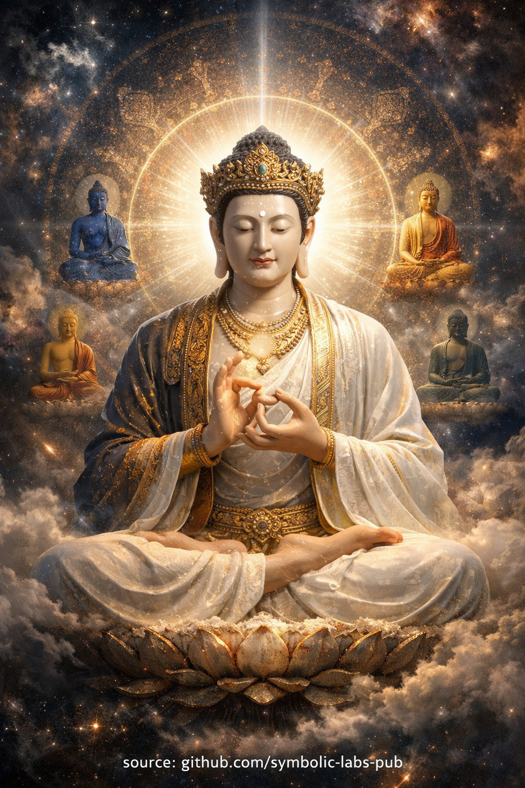

## [**Vairocana** — the Buddha of **universal illumination**](https://github.com/symbolic-labs-pub/a-buddhist-view/blob/master/languages/hu/more/08_lineage/16_vairocana/README.md#vairocana--the-buddha-of-universal-illumination)

Tanítás

## A buddhist teaching on **Vairocana**

### *Universal illumination as the path of recognition*

---

### 1. The view (not a belief, but an orientation)

All experience arises within a single field of [awareness](../../10_concepts/README.md#2-tudatosság-rigpa-vijñāna-knowing).
This field is not owned, created, or controlled by a self.

**Vairocana** names this field **when it is clearly recognized**.

Nothing stands outside it.
Nothing needs to be added to it.
Nothing can escape it.

Ignorance is not darkness—it is **failure to recognize light**.

---

### 2. The core problem: fragmentation

Ordinary perception divides reality into:

* subject and object
* sacred and profane
* practice and life
* meditation and distraction

This fragmentation is the *root ignorance*.

Vairocana teaches:

> Division is conceptual, not real.

The mind suffers not because phenomena exist,
but because it believes they exist **separately**.

---

### 3. The central insight

[Awakening](../../10_concepts/README.md#3-megvilágosodás-bodhi-awakening) does not occur by escaping the world.
It occurs when the world is **seen correctly**.

Every sound, form, thought, and emotion is:

* [empty](../../10_concepts/01_emptiness/README.md#emptiness-nyat-in-vajrayna-buddhism) of independent essence
* luminous in appearance
* intelligible as display

This unity of **emptiness and clarity** is Vairocana’s [wisdom](../../01_core_teachings/the_noble_eightfold_path/README.md#1-bölcsesség-pa).

---

### 4. The practice: inclusion, not rejection

Do not try to silence experience.
Do not purify by force.
Do not seek a special state.

Instead:

* Let perceptions arise
* Let thoughts form and dissolve
* Let emotions move freely

And notice:

> All of this appears **within awareness**,
> and awareness itself does not move.

This unmoving openness is the living presence of Vairocana.

---

### 5. Transformation of ignorance

Other teachings transform specific poisons:

* anger into clarity
* desire into discernment
* pride into equanimity

Vairocana works deeper.

He transforms **ignorance itself** by revealing:

> There was never a center missing.

Confusion collapses when the field is seen as whole.

---

### 6. Ethical consequence

When nothing is outside awareness:

* Harm to others is harm to the same field
* [Compassion](../../02_from_ignorance_to_awakening/7_compassion/README.md#az-együttérzés-mint-strukturális-elv-a-buddhista-tanításban) becomes structural, not emotional
* Responsibility arises naturally, without command

[Ethics](../../01_core_teachings/the_noble_eightfold_path/README.md#2-etikus-magatartas-la) is no longer obedience—it is **alignment**.

---

### 7. The cosmos as teacher

Reality is not silent.

Forms teach [impermanence](../../01_core_teachings/impermanence/README.md#2-a-múlandóság-anicca-strukturális-nem-véletlen).
Relations teach interdependence.
[Suffering](../../02_from_ignorance_to_awakening/2_the_four_noble_truths/README.md#1-there-is-suffering--dukkha) teaches misrecognition.

From the Vairocana view:

> The world itself is the [Dharma](../../01_core_teachings/the_three_jewels/README.md#2-dharma--the-path-and-the-law-of-reality) in motion.

Every moment instructs.

---

### 8. Maturation of the path

At first, awareness is glimpsed.
Then it is stabilized.
Finally, it becomes **unavoidable**.

At that point:

* meditation and non-meditation dissolve
* practice and life are no longer separate
* realization is ordinary, continuous, unbroken

This is called **dwelling in the [Dharmakāya](../../04_kayas/README.md#1-dharmakya-the-body-of-truth)**.

---

### 9. Closing teaching

> Awakening is not a new experience.
> It is the end of misreading experience.

> Vairocana does not appear *to you*.
> **You appear within Vairocana.**

---

Magyarázat

---

## 1. Core meaning

**Vairocana** literally means *“The All-Illuminating One.”*
He embodies **Dharma as such**—reality seen clearly, without distortion.

Key insight:

> Vairocana is not *someone who knows the truth*—
> **He is truth knowing itself.**

He corresponds to **Dharmakāya** (the *truth body* of the Buddha), the **ground of all Buddhas**.

---

## 2. Place in the five dhyāni buddhas

Vairocana sits at the **center** of the **Five Dhyāni (Wisdom) Buddhas** system.

| Aspect     | Meaning                                              |
| ---------- | ---------------------------------------------------- |
| Position   | Center                                               |
| Wisdom     | **All-encompassing wisdom**                          |
| Transforms | Ignorance / confusion                                |
| Element    | Space (ākāśa)                                        |
| Color      | White (or sometimes radiant gold)                    |
| Mudrā      | **Dharmachakra Mudrā** (turning the Wheel of Dharma) |

While other Buddhas transform specific poisons (anger, desire, pride), **Vairocana dissolves ignorance at its root**—the belief in separation.

---

## 3. Philosophical role

Vairocana represents:

* **Non-dual awareness** (no subject vs. object)
* **Interpenetration of all phenomena**
* **Emptiness + clarity simultaneously**

This is closely aligned with teachings such as:

* **Śūnyatā** (emptiness)
* **Indra’s Net** (everything reflects everything else)
* **Tathāgatagarbha** (Buddha-nature)

In this view:

> Every perception is already *inside* Vairocana.
> Nothing is outside awakened reality.

---

## 4. Scriptural foundation

Vairocana is central in:

* **Avataṃsaka (Flower Garland) Sūtra**
* **Mahāvairocana Tantra**

In these texts, the cosmos itself is presented as **Vairocana’s body**, teaching continuously through form, sound, and relationship.

Reality is not neutral—it is **instructional**.

---

## 5. Practice meaning (Vajrayāna)

Meditation on Vairocana trains:

* **Cognitive spaciousness**
* **Non-fragmented perception**
* Seeing thoughts, emotions, and sensations as **expressions of one field**

Rather than rejecting phenomena, the practitioner learns to:

> Recognize *everything* as the display of awakened mind.

This is why Vairocana is often depicted **radiant, symmetrical, and central**—symbolizing **perfect integration**.

---

## 6. Practical insight

From Vairocana’s perspective:

* Confusion is **misrecognition**, not sin
* Liberation is **recognition**, not construction
* Practice is **remembering**, not adding

**Nothing needs to be purified away—only clearly seen.**

---

## 7. One-line teaching

---

Meditáció

## **Vairocana meditation practice**

> ⚠️ **Note on scope**
> What follows is a **non-empowerment contemplative form** (a *practice of meaning*).
> It does **not** replace lineage transmission (*wang, lung, tri*).
> Its function is **stabilization, aspiration, and causal alignment**, not tantric authorization.

---

### *Universal illumination — recognition rather than construction*

This practice is **non-dual, inclusive, and stabilizing**.
It does not aim to create a special state; it trains **correct recognition**.

Use it as a **daily core practice** or as a **grounding meditation** before other Vajrayāna methods.

---

## 1. Preparation (2–3 minutes)

**Posture**

* Sit upright (chair or cushion), spine naturally straight
* Hands resting in the lap or lightly on the knees
* Eyes half-open or gently closed

**Orientation**

* Do not “try to meditate”
* Let the body settle on its own

Silently acknowledge:

> *Nothing is excluded from awareness.*

---

## 2. Establish the field (3–5 minutes)

Bring attention to **what is already present**:

* sounds
* bodily sensations
* thoughts
* emotional tone

Do **not** select an object.

Notice:

* Everything appears
* Nothing needs permission
* Awareness itself is already open

This open presence is the **field**.

---

## 3. Vairocana visualization (optional but powerful)

If visualization is natural for you:

* Imagine **Vairocana Buddha** seated at the **center of space**
* White or luminous-golden light
* Hands in **Dharmachakra Mudrā**
* Calm, symmetrical, unmoving

Then dissolve the image gently and recognize:

> The *space* in which Vairocana appeared
> is the same space in which your thoughts appear.

The visualization is a **pointer**, not a deity external to you.

---

## 4. Core recognition practice (10–20 minutes)

Rest in awareness and observe:

* Thoughts arise → dissolve
* Sensations arise → dissolve
* Emotions arise → dissolve

Now ask—not verbally, but attentively:

* *Does awareness move when thoughts move?*
* *Is awareness altered by what appears in it?*
* *Can awareness be found as a thing?*

Do not answer conceptually.

Let **direct knowing** respond.

This recognition is the **wisdom of Vairocana**:

> All phenomena are appearances
> within an unmoving, inclusive field.

---

## 5. Inclusion training (key instruction)

When distraction occurs:

❌ Do **not** suppress
❌ Do **not** correct
❌ Do **not** restart

Instead:

* Include the distraction **as part of the field**
* Notice that even confusion appears *within awareness*

Ignorance dissolves by **inclusion**, not rejection.

---

## 6. Stabilization (5 minutes)

Let effort drop further.

There is:

* no object to hold
* no state to maintain
* no meditator to protect

Only **continuous presence**.

If thoughts slow—fine.
If thoughts continue—fine.

Vairocana is **present in both**.

---

## 7. Integration into daily life

After the session, silently carry this instruction:

> Whatever appears
> appears *within* awareness
> and therefore cannot threaten it.

Practice during:

* conversation
* work
* emotional intensity
* sensory overload

This is **post-meditation Vairocana practice**.

---

## 8. Signs of correct practice

✔ Reduced need to control experience
✔ Increased spaciousness during stress
✔ Less fixation on “meditative states”
✔ Natural ethical sensitivity
✔ Stable clarity without effort

If you feel dull, dissociated, or blank → **reintroduce vivid sensory awareness**.

---

## 9. Closing dedication (optional)

Silently conclude:

> *May this recognition benefit all beings
> by dissolving confusion at its root.*

---

### Summary formula

> **Awareness does not awaken.
> Misrecognition ends.**

---

< [Amitāyus — a határtalan élet buddhája](../15_amitayus/README.md) | [Fehér Tārā (Sitatārā) – a hosszú élet és együttérzés anyja](../README.md) >

_forrás: [github.com/symbolic-labs-pub](https://github.com/symbolic-labs-pub)_

---
