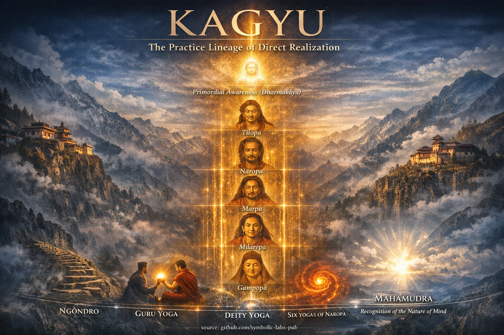
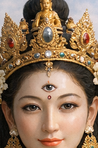
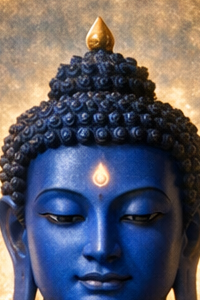
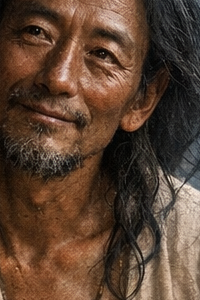
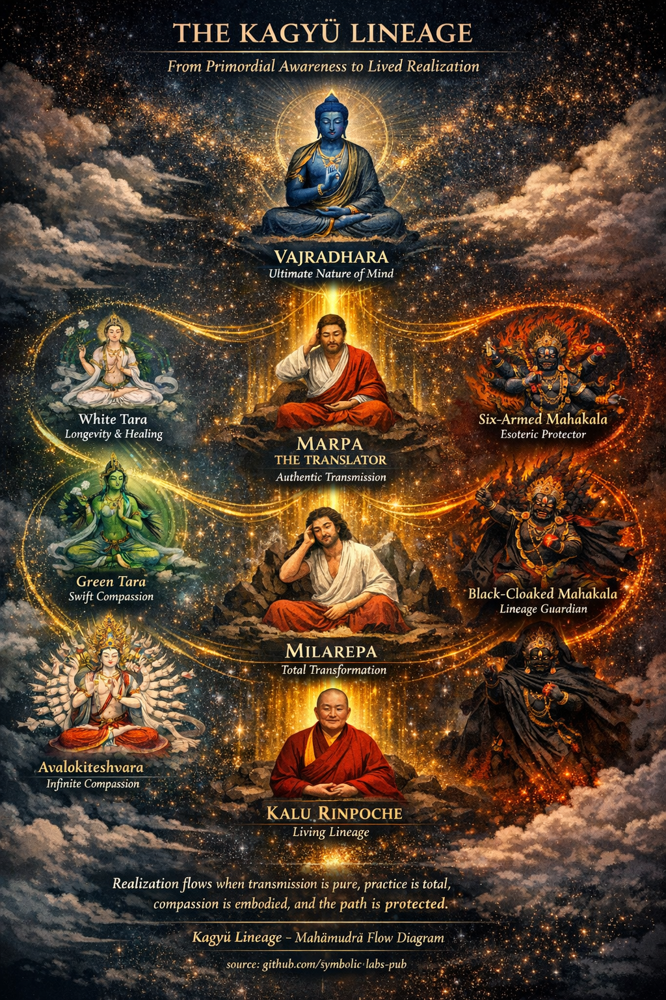

Leszármazási Vonalak és Buddhák

Ezen a ponton nagyon fontos hangsúlyozni a Sangha szerepét—útitársaink az úton. Ha még nem vettél fel kapcsolatot egy közeli buddhista központtal vagy közösséggel, fogd a keresőmotorod és találj egyet.

A szabály ugyanaz, mint a meditációval, amit eddig tanulhattál. A dolog az, hogy struktúrálisan lehetetlen fejlődni és fejleszteni a Sangha nélkül, ezért kelj fel, és találd meg őket!

---

## [Fehér Tārā (Sitatārā) – A Hosszú Élet és Együttérzés Anyja](01_white_tara/README.md)

|  |

**Fehér [Tara](#zöld-tārā-syamatārā-gyors-együttérzés-cselekvésben)** az **[együttérzést](#green-tārā--syamatārā---swift-compassion-in-action) testesíti meg gyógyításként és hosszú életként**.

A Kagyü hagyományban:

* Őt hívják **hosszú életre**, **egészségre** és **gyakorlat stabilitására**
* **Hét szeme** a mindent-látó [tudatosságot](../10_concepts/README.md#2-tudatosság-rigpa-vijñāna-knowing) szimbolizálja
* A gyakorlat a **gyengéd jelenlétet, folytonosságot és tápláló bölcsességet** hangsúlyozza

A Fehér Tārā nem elvont irgalom—ő a **gondoskodás, amely fenntartja az [ébredés](../10_concepts/README.md#3-megvilágosodás-bodhi-awakening) feltételeit**.

---

## [Zöld Tārā (Syamatārā) – Gyors Együttérzés Cselekvésben](02_green_tara/README.md)

**Zöld Tara** az **azonnali, rettenthetetlen együttérző cselekvést** képviseli.

A Kagyü megértésben:

* **Azonnal** reagál a félelemre és akadályokra
* Egy kinyújtott láb = **cselekvési készenlét**
* Különösen gyakorolják veszély, szorongás vagy átmenet idején

A Zöld Tārā megtanítja a gyakorlót, hogy **tisztaságból cselekedjen, ne habozásból**.

---

## [Mahākāla – Fekete Köpeny Védelmező (Dharma Őr)](03_mahakala/README.md)

**Mahakala** a **Kagyü leszármazási vonal elsődleges védelmezője**.

Kulcs pontok:

* Haragos megjelenés = **heves együttérzés**
* Elpusztítja az **ego-ragaszkodást, akadályokat és spirituális korrupciót**
* **A gyakorlat védelmezője**, nem a kényelemé

Mahākāla **az energia, amely megakadályozza a regressziót**.

---

## [Ezerkarú Avalokiteśvara (Chenrezig) – Végtelen Együttérzés](04_avalokitesvara/README.md)

[**Avalokiteśvara**](04_avalokitesvara/README.md#gyakorlati-integráció-párnán-kívül), ezerkarú formájában, a **korlátlan együttérző tevékenységet** testesíti meg.

A Kagyü útban:

* Központi az **elme-képzésben (lojong)**
* Az együttérzés nem érzelem, hanem **strukturális orientáció**
* A sok kar az **ügyes eszközök mindenhol alkalmazását** képviseli

Ez a gyakorlat **puhítja az önre-fixációt, miközben erősíti az elhatározást**.

---

## [Guru Rinpoche / Padmasambhava – A Tantrikus Mester](05_padmasambhava/README.md)

**Guru Rinpoche**, más néven **Padmasambhava**, a **megvilágosodott módszer megtestesítője**.

Bár központi a Nyingma iskolában, a Kagyü-ban:

* A **rettenthetetlen tantrikus mesterséget** képviseli
* Integrálja a **haragos és békés eszközöket**
* Haladó [Vajrayāna](../05_yanas/README.md#4-vajrayna-tantrayna-mantrayna-the-diamond-vehicle) kontextusokban hívják

Guru Rinpoche mutatja, hogy **az ébredés alkalmazkodik a feltételekhez**.

---

## [Gyógyító Buddha (Kék Bhaisajyaguru) – Gyógyító Bölcsesség](06_medicine_buddha/README.md)

[**Gyógyító Buddha**](06_medicine_buddha/README.md#2-the-medicine-buddhas-reorientation) a **[bölcsességet](../01_core_teachings/the_noble_eightfold_path/README.md#1-bölcsesség-pa) gyógyító tisztaságként** nyilvánítja meg.

A Kagyü használatban:

* A gyógyítás az **elmére, karmára és feltételekre** vonatkozik
* Kék szín = **mélység és precizitás**
* A gyakorlat finomítja az **ok és okozat** tudatosságát

A gyógyítás itt azt jelenti, **világosan látni, mit kell megváltoztatni**.

---

## [Kalu Rinpoche – Modern Kagyü Mester](07_kalu_rinpoche/README.md)

**Kalu Rinpoche** a **Kagyü tanítások nagy átvivőinek egyike volt Nyugatra**.

Jelentősége:

* **Mahāmudrā** és **Nāropa Hat Yogája** mestere
* A **közvetlen meditatív megvalósítást** hangsúlyozta
* Tisztaságáról, alázatosságáról és mélységéről ismert

Ő az **élő leszármazási vonalat képviseli, nem mitológiát**.

---

## [Bodhisattva – Az Ébredés-Mindenkiért Fogadalma](08_bodhisattva/README.md)

Egy [**Bodhisattva**](08_bodhisattva/README.md#4-the-bodhisattva-vow-as-structural-alignment) nem istenség, hanem **létezési mód**.

A Kagyü nézetben:

* A megvilágosodás hiányos mások nélkül
* Az együttérzés és bölcsesség **együtt keletkezik**
* A fogadalom **minden cselekvést és észlelést** alakít

Egy bodhisattva **mozgásban levő ébredés**.

---

## Strukturális Betekintés (Kagyü Lencse)

Ezek az alakok **nem imádat tárgyai**, hanem **funkcionális archetípusok**:

* **Tārá-k** → együttérző válaszkészség
* **Védelmezők** → a gyakorlat strukturális integritása
* **Bodhisattva-k** → etikai irány
* **Guru-k** → megvalósítás átvitele
* **Buddha-k** → stabilizált ébredett állapotok

Együtt egy **gyakorlati ökoszisztémát** alkotnak, nem egy panteont.

---

## [Milarepa — A Radikális Átalakulás Archetípusa](09_milarepa/README.md)

[**Milarepa**](09_milarepa/README.md#milarepa-élete-sötétségből-fénybe) a **megtestesült bizonyíték**, hogy az ébredés **egyetlen életen belül** lehetséges, múltunktól függetlenül.

**Kagyü jelentés**

* Korábban súlyos karmával terhelt, teljes megvalósítást ért el **szigorú meditáció** révén
* **Hegyi yogi**-ként élt, elszigetelten gyakorolva
* Spontán **megvalósítási dalairól (doha-k)** ismert

**Gyakorlati funkció**

* A **visszafordíthatatlan átalakulást** képviseli
* Tanítja, hogy a **lemondás + odaadás + kitartás** még a legnehezebbhomályosításokat is feloldja
* Központi inspirációs alak a Kagyü leszármazási vonal **elvonulási kultúrájában**

Milarepa mutatja, hogy **semmi sem diskvalifikálja az ébredést, kivéve a gyakorlás elutasítását**.

---

## [Marpa a Fordító — Az Autentikus Átvitel Birtokosa](10_marpa/README.md)

[**Marpa**](10_marpa/README.md#a-buddhist-teaching-marpa-the-translator-the-dharma-that-refuses-to-be-softened), *Marpa Lotsāwa* néven ismert, a **Kagyü átvitel építésze**.

**Kagyü jelentés**

* Ismételten Indiába utazott, hogy **tantrikus tanításokat kapjon közvetlenül**
* Rendkívüli precizitással fordította a szövegeket
* Érintetlenül adta át a leszármazási vonalat Milarepa-nak

**Gyakorlati funkció**

* A **leszármazási vonal hűségét** testesíti meg
* Bemutatja, hogy az együttérzés **szigorúnak vagy követelőnek** tűnhet
* Biztosítja, hogy a megvalósítás **nincs hígítva kényelemmel vagy szentimentalizmussal**

Marpa a **ébredés strukturális integritását** képviseli—az igazságot torzítás nélkül átadva.

---

## [Vajradhara — A Mahāmudrā Forrása](11_vajradhara/README.md)

[**Vajradhara**](11_vajradhara/README.md#vajradhara-and-the-teaching-of-recognition) az **ősi Buddha** a Kagyü hagyományban.

**Kagyü jelentés**

* A **[Mahāmudrā](../04_kayas/mahamudra_and_dzogcsen/README.md#mahmudr-nature-of-mind) megvalósítás** forrása
* Nem történelmi, hanem **időtlen tudatosság maga**
* [Vajra](../09_symbols/02_dorje/README.md#dorje-vajra--explained-according-to-buddhist-teachings)-t és csengőt tart—**módszer és bölcsesség egyesítve**

**Gyakorlati funkció**

* Az **elme alap állapotát** képviseli
* Nem valami elérni való, hanem **felismerni való**
* A Mahāmudrā utasítások közvetlenül Vajradhara-természetre mutatnak saját tudatosságunk belül

Vajradhara **ébredés a fogalmak előtt**.

---

## [Fekete Hatkarú Mahākāla — Ezoterikus Dharma Védelmező](12_six_armed_mahakala/README.md)

**Mahākāla** (Hatkarú, Fekete forma) a **legezoterikuskább védelmező** a Kagyü leszármazási vonalban.

**Kagyü jelentés**

* A megvilágosodott együttérzés emanációja **haragos formában**
* Hat kar szimbolizálja a **hat birodalmon való uralmat**
* Gyorsan és megalkuvás nélkül cselekszik

**Gyakorlati funkció**

* Védelmezi a **haladó Vajrayāna gyakorlatot**
* Eltávolítja a **belső akadályokat** (ego, lustaság, korrupció)
* Csak megfelelő felhatalmazással és fegyelemmel hívható

Ez a Mahākāla nem a kényelmet védi—**a megvalósítást védi**.

---

## Strukturális Betekintés (Kagyü Perspektíva)

Együtt, ez a négy egy **teljes vertikális tengelyt alkot a Kagyü útban**:

* **Vajradhara** → elme végső természete
* **Marpa** → hibátlan átvitel
* **Milarepa** → teljes átalakulás gyakorlat révén
* **Hatkarú Mahākāla** → megalkuvás nélküli védelem az úton

Nem szimbolikus díszítések; **funkcionális szükségletek** egy **közvetlen megvalósításra** épülő leszármazási vonalban.

---

---

< [**Vairocana** — az **Egyetemes Megvilágosodás** Buddhája](16_vairocana/README.md) | [Áldáskötél (Védelmi Kötél) — Buddhista Jelentés](../09_symbols/01_blessing_cord/README.md) >

_forrás: [github.com/symbolic-labs-pub](https://github.com/symbolic-labs-pub)_

---
