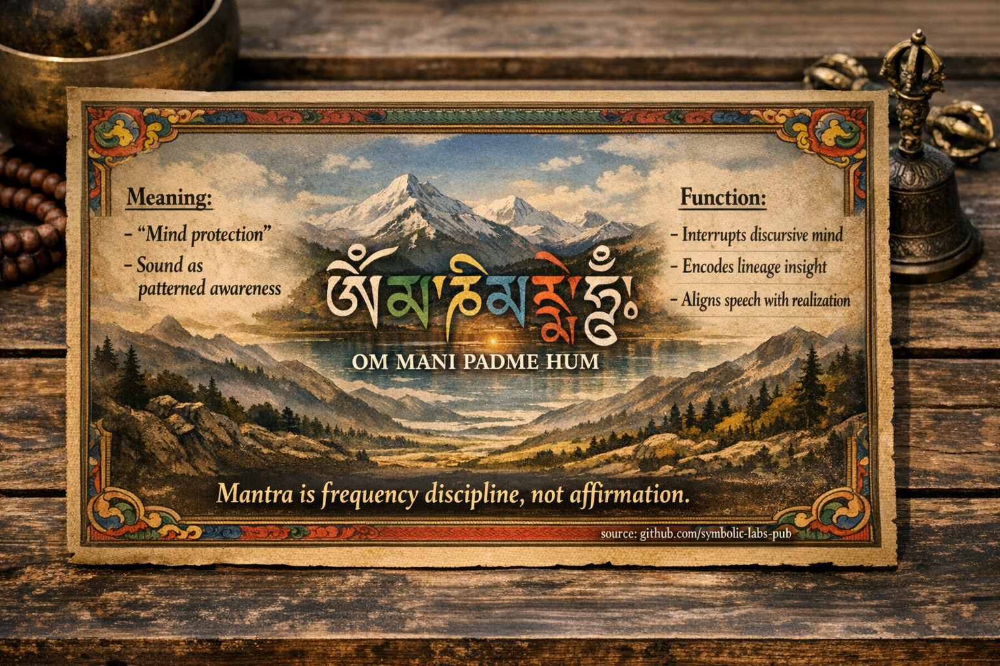

## [Mi is a Mantra *Valójában* (Buddhista Nézet)](https://github.com/symbolic-labs-pub/a-buddhist-view/blob/master/languages/hu/more/09_symbols/10_mantra/README.md#mi-is-a-mantra-valójában-buddhista-nézet)

---

A **mantra** **nem**:

* pozitív megerősítés
* ima, amely szívességeket kér
* varázslat

A mantra **viszont**:

> **Egy hangzási technológia, amely az elmét, a beszédet és a testet ébredett mintázatba hangolja.**

A klasszikus buddhista nyelvben a mantra a **beszéd gyakorlathoz (vāg)** tartozik, összhangban:

* **Helyes Erőfeszítéssel**
* **Helyes [Tudatossággal](../../01_core_teachings/the_noble_eightfold_path/README.md#7-helyes-tudatosság-sammā-sati)**
* **Helyes [Koncentrációval](../../01_core_teachings/the_noble_eightfold_path/README.md#8-helyes-koncentracio-samm-samdhi)**

**A megismerés átstrukturálásával** működik, nem meggyőzéssel vagy hittel.

---

## Miért Számít a Hang a Buddhizmusban

A buddhizmus **az elmét és az észlelést mintázott folyamatokként** kezeli.

A hang:

* gyorsabban megkerüli a koncepcionális gondolatot, mint az ötletek
* közvetlenül hat a figyelemre, a lélegzetre és a finom mentális mozgásra
* stabilizálja a [tudatosságot](../../10_concepts/README.md#2-tudatosság-rigpa-vijñāna-knowing) az **ismétlés + ritmus** által

Ez az oka annak, hogy a mantrát **közvetlen módszernek** tekintik, különösen a [Vajrayāna](../../05_yanas/README.md#4-vajrayna-tantrayna-mantrayna-the-diamond-vehicle)-ban.

> A mantra *a jelentés előtt* működik.
> A jelentés *a stabilitás után* érik.

---

## A Mantra Működésének Három Szintje

### 1. **Durva Szint — Figyelem Edzése**

* Az ismétlés megszakítja a diszkurzív gondolkodást
* Az elme **egy stabil tárgyat** kap
* Hasonló a lélegzet [meditációhoz](../../08_lineage/README.md), de *aktívabb*

Eredmény:

* Csökkentett mentális proliferáció
* Növelt tudatosság folytonosság

---

### 2. **Finom Szint — Mintázat Kódolás**

Mélyebb szinteken a mantra:

* hangol a lélegzet + idegrendszer
* harmonizálja az érzelmi tónust
* stabilizálja a vizualizációt és szándékot

A Vajrayāna-ban:

* a mantra az **istenség elméjének** felel meg
* a szótagok **tömörített utasításoknak** számítanak
* hang = struktúra, nem nyelv

Ez az oka annak, hogy sok mantrát **nem fordítanak le**.

---

### 3. **Nagyon Finom Szint — Felismerés**

Fejlett szakaszokban:

* a mantra csendbe oldódik
* az ismétlés jelenlétté omlik össze
* a hang **nem-duális tudatosságot** fed fel

Ezen a ponton:

* a mantrát már nem "mondják"
* a tudatosság *a hangon keresztül* ismeri fel magát

> A mantra ott végződik, ahol a megvalósítás kezdődik.

---

## Példa: *Om Mani Padme Hum*

Hagyományosan úgy értelmezik, mint:

* **[Avalokiteśvara](../../08_lineage/04_avalokitesvara/README.md#gyakorlati-integráció-párnán-kívül) [együttérzése](../../02_from_ignorance_to_awakening/7_compassion/README.md#az-együttérzés-mint-strukturális-elv-a-buddhista-tanításban) hangzási formában**
* Nem mondat, hanem **rezonancia mező**

Minden szótag összhangban van:

* egy mentális méreggel
* a [szenvedés](../../02_from_ignorance_to_awakening/2_the_four_noble_truths/README.md#1-van-szenvedés-dukkha) egyik birodalmával
* az ébredett együttérzés egy oldalával

De kritikusan:

> A mantra működik még **azelőtt**, hogy ezt megértenéd.

A megértés finomítja a gyakorlatot —
de **nem** aktiválja azt.

---

## Miért Nevezik a Mantrát "Elme Védelemnek"

Tibetiben a mantrát gyakran úgy írják le, mint:

> **elme-őrzés** vagy **elme-kötés**

Mert:

* megakadályozza, hogy a szokásos narratívák eltérítsék a tudatosságot
* védi a figyelem folytonosságát
* a tudattalan belső beszédet **szándékos beszéddel** helyettesíti

Ez *kognitív higiénia*, nem babona.

---

## Gyakori Félreértések (Korrigálva)

| Félreértés              | Buddhista Tisztázás                    |
| ----------------------- | -------------------------------------- |
| "A [mantra](#a-mantra-működésének-három-szintje) hit által működik"  | **Ismétlés + pontosság** által működik |
| "Több érzelem = jobb"   | Stabilitás > intenzitás                |
| "Gyorsabb erősebb"      | Folytonosság > sebesség                |
| "Misztikus nyelv"       | **Funkcionális hang**                  |

---

## A Mantra Viszonya Más Gyakorlatokhoz

A mantra integrálódik:

* [**Mala**](../06_mala/README.md#mala-prayer-beads--explained-according-to-buddhist-teachings) → trenírozza a ritmust & folytonosságot
* [**Imakerék**](../03_prayer_wheel/README.md#prayer-wheel-mani-wheel--explained-through-buddhist-teachings) → az ismétlés megtestesítése
* **Vizualizáció** → szinkronizálja az elmét & szimbólumot
* **Mudrā** → összehangolja a testet a hanggal
* **Csend** → befejezi a körforgást

A Vajrayāna-ban a mantra soha nem izolált — **egy rendszer része**.

---

## Az Alapvető Belátás

> **A mantra frekvencia fegyelem, nem megerősítés.**
> **A hangot az észlelés átszervezésére használják, nem az elme meggyőzésére.**

Helyesen gyakorolva:

* a mantra átlátszóvá válik
* a gyakorló csendesebbé válik
* a tudatosság önfenntartóvá válik

Ezen a ponton a mantra megtette a dolgát.

---

< [1. Tisztaság *Elutasítás Nélkül*](../08_lotus/README.md) | [Mudrák a Buddhista Tanításokban](../11_mudra/README.md) >

_forrás: [github.com/symbolic-labs-pub](https://github.com/symbolic-labs-pub)_

---
