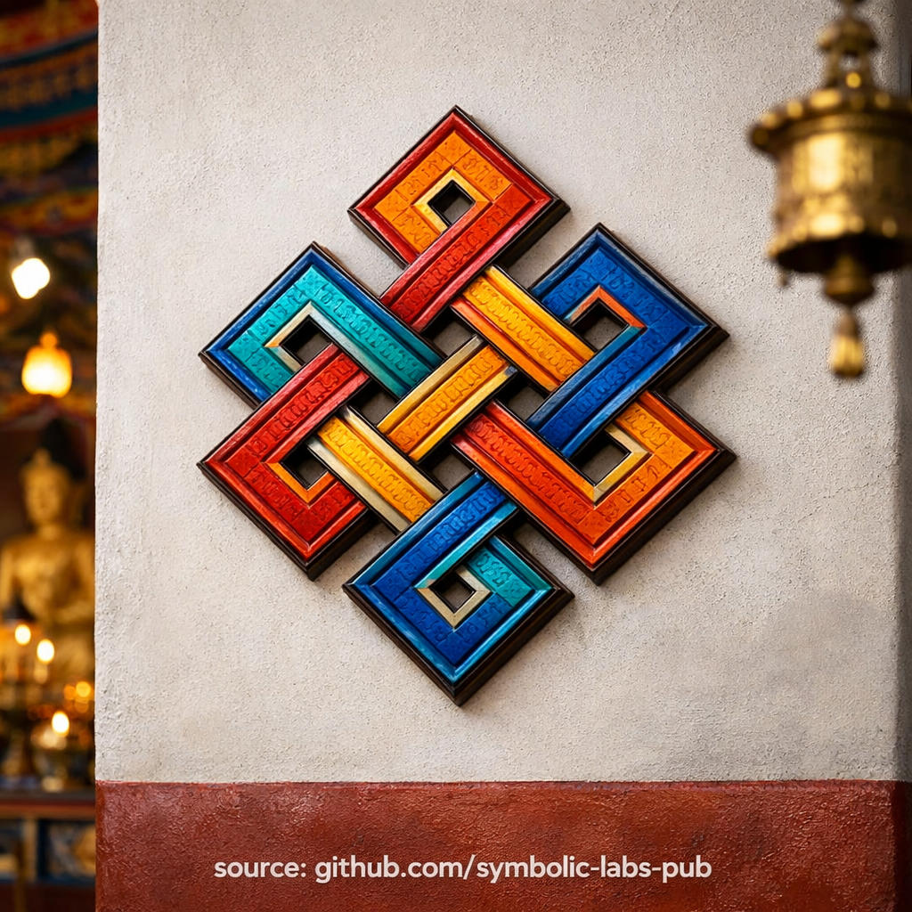

## [Végtelen Csomó (Śrīvatsa) — a buddhista tanítások szerint](https://github.com/symbolic-labs-pub/a-buddhist-view/blob/master/languages/hu/more/09_symbols/16_endless_knot/README.md#végtelen-csomó-śrīvatsa--a-buddhista-tanítások-szerint)

---

A **Végtelen Csomó** nem díszítő minta. Hanem **vizuális tanítás arról, hogyan működik valójában a valóság**.

### 1. Kölcsönös Függés (Pratītyasamutpāda)

A csomónak **nincs kezdete és vége**. Minden vonal csak azért létezik, mert a többivel össze van szőve.

Ez illusztrálja a [**függő keletkezést**](../../02_from_ignorance_to_awakening/3_dependent_origination/README.md#a-tizenkét-láncszem-a-klasszikus-megfogalmazás):

* Semmi sem keletkezik függetlenül
* Semmi sem létezik elszigetelten
* Minden jelenség **feltételek** eredménye

Nincs egyetlen "első ok." A valóság **relációs**, nem lineáris.

> Nem húzhatsz meg egyetlen szálat anélkül, hogy ne befolyásolnád az egészet.

---

### 2. Nem-lineáris okozatosság

Egy egyenes vonallal ellentétben (ok → okozat), a Végtelen Csomó **visszacsatolási hurkokat** mutat:

* Az okok okozatokká válnak
* Az okozatok átformálják a jövőbeli okokat
* A múlt, jelen és jövő **strukturálisan összefonódott**

Ez az oka annak, hogy a buddhizmus elutasítja az egyszerű erkölcsi számvitelt ("X-et csináltam, ezért Y-nak kell történnie").
A valóság **komplex, kontextuális és rekurzív**.

---

### 3. A Karma mint struktúra, nem végzet

A buddhista tanításban **a karma nem végzet**.

A Végtelen Csomó tisztázza, hogy:

* A karma **mintázott lendület**
* A szokások, szándékok és feltételek *architektúrája*
* Mivel a minták kondicionáltak, **újra kondicionálhatók**

A szabadság lehetséges **a struktúrán belül**, nem kívül.

> A karma csak azt köti meg, amit nem látnak világosan.

---

### 4. A bölcsesség és együttérzés egyesülése

A [Mahāyāna](../../05_yanas/README.md#limitation-from-mahyna-view) és [Vajrayāna](../../05_yanas/README.md#4-vajrayna-tantrayna-mantrayna-the-diamond-vehicle) értelmezésben a csomó az **elválaszthatatlanságot** is jelenti:

* [**Bölcsesség**](../../01_core_teachings/the_noble_eightfold_path/README.md#1-bölcsesség-pa) (az [üresség](../../10_concepts/01_emptiness/README.md#emptiness-nyat-in-vajrayna-buddhism) és kölcsönös függés látása)
* [**Együttérzés**](../../02_from_ignorance_to_awakening/7_compassion/README.md#az-együttérzés-mint-strukturális-elv-a-buddhista-tanításban) (ügyes reagálás a hálón belül)

A kölcsönös függés látása együttérzés *nélkül* elidegenedéshez vezet.
Az együttérző cselekvés bölcsesség *nélkül* összefonódáshoz vezet.

A Végtelen Csomó mutatja, hogy **együtt kell szőni őket**.

---

### 5. Praktikus kontemplatív jelentés

Mint [meditációs](../../08_lineage/README.md) támasz, a Végtelen Csomó az elmét trenírozza:

* A bináris gondolkodás feladására (jó/rossz, én/más)
* Az érzelmek és események mögötti rejtett feltételek észrevételére
* Türelem fejlesztése a komplexitással
* Felelősségvállalásra **bűntudat nélkül**

**Felelősséget tanít önvád nélkül** és **szabadságot az okozatosság tagadása nélkül**.

---

### Alapvető belátás (sűrítve)

* **Semmi sem létezik egyedül**
* **Semmi sem történik véletlenszerűen**
* **Semmi sincs örökre rögzítve**

A Végtelen Csomó ennek az igazságnak a vizuális nyelve.

Emlékezteti a gyakorlót:

> Az [ébredés](../../10_concepts/README.md#3-megvilágosodás-bodhi-awakening) nem a háló elhagyása —
> hanem **a háló világos látása és bölcs mozgás rajta belül**.

---

< [Thangka — Az Út Vizuális Átadása](../15_thangka/README.md) | [Dharma Kerék (Dharmachakra) — a buddhista tanítások szerint](../17_dharma_wheel/README.md) >

_forrás: [github.com/symbolic-labs-pub](https://github.com/symbolic-labs-pub)_

---
