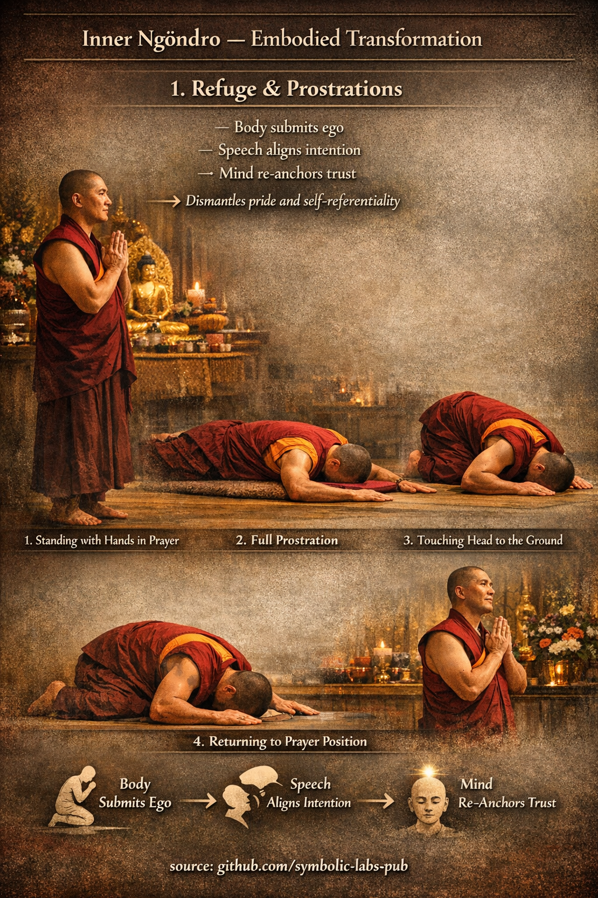

## [The First Ngöndro Gyakorlat](https://github.com/symbolic-labs-pub/a-buddhist-view/blob/master/languages/hu/more/11_ngondro/1_prostrations/README.md#the-first-ngöndro-Gyakorlat)

### **Precious Human Birth → Refuge & Prostrations**
In [Vajrayāna](../../05_yanas/README.md#4-vajrayna-tantrayna-mantrayna-the-diamond-vehicle) Buddhism, **Ngöndro** (“that which goes before”) is not a warm-up—it is **foundational re-engineering of the practitioner**. The first Ngöndro Gyakorlat combines **contemplation** with **embodied action**, transforming how body, speech, and mind relate to the path.

---

## 1. Precious Human Birth — the Cognitive Ground

Before any movement begins, the practitioner reflects on **Precious Human Birth**.

This contemplation establishes **orientation**:

* You have **access** to teachings
* You have **capacity** to Gyakorlat
* You have **time**, which is limited

The key insight is subtle but critical:

> This life is an **opportunity**, not an entitlement.

Without this reflection, Gyakorlat becomes mechanical or egoic. With it, urgency and gratitude naturally arise—fuel for disciplined Gyakorlat.

---

## 2. Refuge & Prostrations — the Embodied Gyakorlat

This is the **first Inner Ngöndro** Gyakorlat and is traditionally completed in **large numbers** (often 100,000+ repetitions). Quantity matters because repetition **rewires habits**, not because of superstition.

### Why Refuge?
Refuge answers a structural question:

> *Where does the mind orient when things fall apart?*

You take refuge in:

* **Buddha** — awakened [Tudatosság (example)](../../10_concepts/README.md#2-tudatosság-rigpa-vijñāna-knowing)
* [**Dharma**](../../01_core_teachings/the_three_jewels/README.md#2-dharma-az-ösvény-és-a-valóság-törvénye) — truth and method
* **Sangha** — realized Közösség

This re-anchors trust **outside egoic control**.

---

## 3. The Threefold Transformation (Body, Speech, Mind)

### A. **Body — Prostration**
* Standing → bowing → full length on the ground
* The **entire body** participates

**Function:**

* Dismantles pride
* Breaks subtle superiority and self-importance
* Converts understanding into **somatic humility**

The body learns what the intellect resists.

---

### B. **Speech — Refuge Prayer**
* Refuge verses are recited continuously
* Rhythm stabilizes attention

**Function:**

* Aligns intention
* Interrupts discursive thinking
* Trains speech as **intentional signal**, not noise

Speech becomes a *carrier of orientation*, not expression of habit.

---

### C. **Mind — Re-anchoring Trust**
* Visualize refuge objects (lineage, teachers, awakened figures)
* Trust is **placed**, not asserted

**Function:**

* Weakens self-referential loops
* Shifts the sense of agency from “me” to **path + method**
* Builds confidence rooted in **lineage continuity**, not personal mood

---

## 4. Why This Gyakorlat Comes First

Refuge & Prostrations are first because they address the **core obstacle**:

> *The belief that [awakening](../../10_concepts/README.md#3-megvilágosodás-bodhi-awakening) will happen without surrender.*

This Gyakorlat:

* Grounds devotion without blind faith
* Cultivates discipline without harshness
* Builds humility **without self-negation**

It prepares the practitioner to safely engage deeper Vajrayāna methods.

---

## 5. A Critical Clarification

Ngöndro is often misunderstood as:

* Preliminary = easy ❌
* Symbolic = metaphorical ❌

In reality:

* It is **physically demanding**
* Psychologically confronting
* Structurally precise

It is **training**, not performance.

---

## 6. The Resulting Shift

Over time, practitioners report:

* Reduced self-importance
* Increased steadiness
* Natural devotion without sentimentality
* Willingness to Gyakorlat even without motivation

This is the real sign of progress.

---

### In one sentence:
**The first Ngöndro Gyakorlat uses repetition, humility, and orientation to dismantle ego at the level where it actually lives—embodied habit.**

---

< [Fogalmak](../../10_concepts/README.md) | [2. Vajrasattva — Purification of Obscurations](../2_purification/README.md) >

_source: [github.com/symbolic-labs-pub](https://github.com/symbolic-labs-pub)_

---
