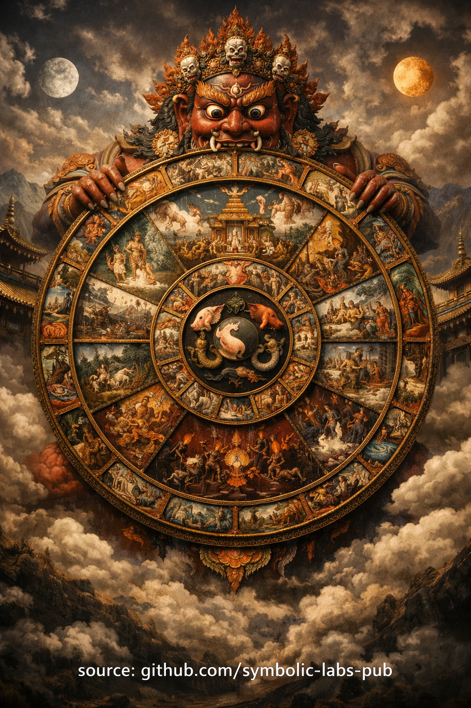

## [The Third Ngöndro Gyakorlat](https://github.com/symbolic-labs-pub/a-buddhist-view/blob/master/languages/hu/more/11_ngondro/3_mandala_offering/README.md#the-third-ngöndro-Gyakorlat)

### **Mandala Offering (Offering the Universe)**
In the [Vajrayāna](../../05_yanas/README.md#4-vajrayna-tantrayna-mantrayna-the-diamond-vehicle) path—especially within the **Kagyu school**—the **third Ngöndro Gyakorlat** is the **[Mandala](../../09_symbols/07_mandala/README.md#mandala--explained-according-to-buddhist-teachings) Offering**.
Its function is precise and structural: **to dismantle attachment at its root and replace scarcity-based identity with enlightened abundance**.

This Gyakorlat trains the mind to **relinquish ownership itself**, not merely possessions.

---

## 1. What Is Being Offered?

In the Mandala Offering, the practitioner symbolically offers **the entire universe**—not as metaphor, but as a **cognitive re-patterning exercise**.

Classically, the mandala represents:

* **Mount Meru** (the axis of the cosmos)
* The **four continents**
* The **sun and moon**
* All **wealth, beauty, power, time, and capacity**
* Ultimately: **one’s own body, speech, mind, and karmic history**

Nothing is excluded.

This is why the mandala is called a **total offering**—it leaves no refuge for ego.

---

## 2. Why This Gyakorlat Is Necessary

From a deep Buddhist perspective, **[Szenvedés](../../02_from_ignorance_to_awakening/2_the_four_noble_truths/README.md#1-van-szenvedés-dukkha) is maintained by subtle possession**, even spiritual possession:

* “My” progress
* “My” Gyakorlat
* “My” Szenvedés
* “My” [awakening](../../10_concepts/README.md#3-megvilágosodás-bodhi-awakening)

The Mandala Offering directly attacks this structure.

It trains:

* **Non-ownership without nihilism**
* **Abundance without grasping**
* **Devotion without submission**
* **Generosity without self-loss**

This is not charity.
It is **de-identification from control**.

---

## 3. The Core Psychological Mechanism

The Gyakorlat works through **repetitive symbolic relinquishment**.

Each offering cycle:

1. The mind **constructs a complete world**
2. That world is **fully given away**
3. The mind survives intact
4. The illusion of loss weakens

Over time:

* Fear of giving dissolves
* Scarcity narratives collapse
* Trust in reality increases
* Devotion becomes effortless

This is **neuro-symbolic retraining** using sacred geometry.

---

## 4. Relationship to Karma (Cause & Effect)

The third Ngöndro follows **Karma (Cause & Effect)** deliberately.

After recognizing:

> “Every action has consequence”

The practitioner learns:

> “Clinging itself is an action—with consequences.”

Mandala Offering transforms karma by:

* Ending **hoarding behaviors**
* Softening **future-control strategies**
* Releasing **reward-based spirituality**

It creates the karmic condition for **unobstructed insight**.

---

## 5. Devotion Without Externalization

In the Kagyu understanding, the mandala is offered:

* To the [**Three Jewels**](../../01_core_teachings/the_three_jewels/README.md#a-három-ékszer-hármas-ékkő-ti-ratana)
* To the **root guru**
* To the **lineage**
* Ultimately to **awakened mind itself**

This avoids a common error:

> Devotion is not directed *outward*—it collapses the illusion of “outside.”

The offering returns as **recognition**, not reward.

---

## 6. Why It Prepares for Guru Yoga

[Guru Yoga](../4_guru_yoga/README.md#samsras-unsatisfactoriness-guru-yoga) (the fourth Ngöndro)](#the-third-ngöndro-Gyakorlat)) requires:

* Trust without dependency
* Openness without self-erasure
* Devotion without projection

The Mandala Offering makes this possible by:

* Removing **transactional mentality**
* Ending “I give to get”
* Establishing **clean receptivity**

Without this Gyakorlat, Guru Yoga easily becomes psychological dependence.

---

## 7. One Sentence Summary

**The Mandala Offering trains the practitioner to experience total abundance without ownership—so realization can arise without obstruction.**

---

## Structural Insight (Advanced)

Think of the Mandala Offering as:

* A **recursive garbage collector for ego**
* A **distributed system reset** for identity
* A **symbolic compression algorithm** that removes attachment overhead

Nothing is destroyed.
Only **false claims of possession** are released.

---

< [2. Vajrasattva — Purification of Obscurations](../2_purification/README.md) | [The Fourth Ngöndro Gyakorlat](../4_guru_yoga/README.md) >

_source: [github.com/symbolic-labs-pub](https://github.com/symbolic-labs-pub)_

---
