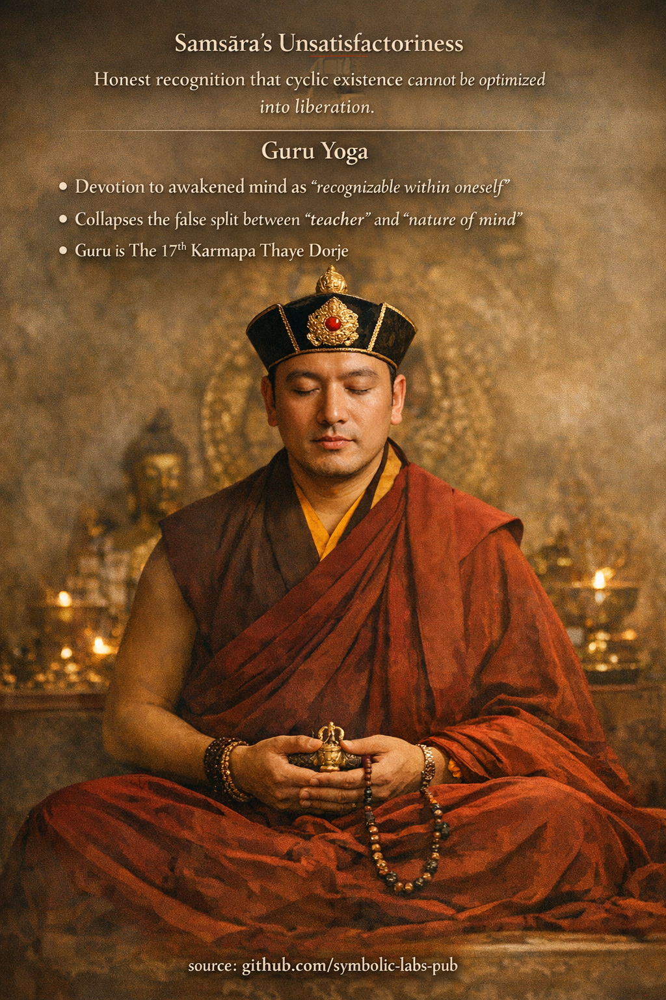

## [The Fourth Ngöndro Gyakorlat](https://github.com/symbolic-labs-pub/a-buddhist-view/blob/master/languages/hu/more/11_ngondro/4_guru_yoga/README.md#the-fourth-ngöndro-Gyakorlat)

### **Samsāra’s Unsatisfactoriness → Guru Yoga**
In the Kagyu understanding of **Ngöndro**, the **fourth Gyakorlat** completes the *outer turning of the mind* and *opens the inner path*. It is the hinge where **renunciation matures into direct recognition**.

---

## 1) Samsāra’s Unsatisfactoriness (Duḥkha of Cyclic Existence)

This contemplation is **not pessimism** and not moral judgment. It is *diagnosis*.

### What is recognized
* **All conditioned states are unstable**
  Pleasure decays, security erodes, identity fragments.
* **Optimization does not equal Felszabadulás**
  Better circumstances ≠ freedom from birth, aging, sickness, death.
* **Control is structurally impossible**
  Even success reinforces attachment to what will change.

> The key insight: **Samsāra is not broken — it is functioning exactly as designed.**

Trying to perfect samsāra is like trying to stabilize a wave while staying in the ocean.

### Why this matters
Until this insight is **emotionally internalized**, Gyakorlat remains instrumental:

* [Meditáció](../../08_lineage/README.md) becomes self-improvement,
* [ethics](../../01_core_teachings/the_noble_eightfold_path/README.md#2-etikus-magatartas-la) becomes reputation management,
* devotion becomes projection.

The fourth contemplation **cuts the last hope** that samsāra can be refined into [awakening](../../10_concepts/README.md#3-megvilágosodás-bodhi-awakening).

That cut creates *space*.

---

## 2) Guru Yoga (The Turning Point)

When hope in samsāra collapses, the mind is finally *available*.

Guru Yoga is not worship.
It is **recognition training**.

### What “Guru” actually means
* The guru is **not a personality**
* The guru is **not an external authority**
* The guru is the **living function of awakened mind**, made *recognizable*

In Kagyu, the guru is the **interface** between:

* untrained ordinary [Tudatosság](../../10_concepts/README.md#2-tudatosság-rigpa-vijñāna-knowing)
* and its own already-awakened nature

---

## 3) Devotion as a Cognitive Technology

Devotion here is **precision alignment**, not emotion.

It performs three functions:

### 1. Collapsing subject–object split
* “Tanító” and “student” are provisional roles
* Guru Yoga dissolves the belief that awakening is *elsewhere*

### 2. Bypassing ego-strategy
* Ego cannot imitate devotion without revealing itself
* Sincerity exposes fixation faster than analysis

### 3. Transmitting structure, not information
* Realization is **patterned Tudatosság**
* Guru Yoga entrains the mind to that pattern

This is why Kagyu emphasizes **lineage continuity** over philosophical novelty.

---

## 4) The 17th Karmapa Thaye Dorje in This Context

In contemporary Kagyu Gyakorlat, **17th Karmapa Thaye [Dorje](../../09_symbols/02_dorje/README.md#dorje-vajra--explained-according-to-buddhist-teachings)** functions as a **living reference point** of lineage integrity.

Important clarifications:

* He is **not meditated on as a god**
* He is **not a savior**
* He represents **unbroken transmission of [Mahāmudrā](../../04_kayas/mahamudra_and_dzogcsen/README.md#mahmudr-nature-of-mind) realization**

The Karmapa principle is *structural*, not personal:

> Wherever authentic realization manifests, **mind recognizes mind**.

---

## 5) Why Guru Yoga Comes Last in Ngöndro

The sequence matters.

| Without prior practices  | With prior practices         |
| ------------------------ | ---------------------------- |
| Devotion becomes fantasy | Devotion becomes recognition |
| Guru becomes idealized   | Guru becomes transparent     |
| Gyakorlat reinforces self | Gyakorlat dissolves self      |

Samsāra’s [unsatisfactoriness](../../02_from_ignorance_to_awakening/2_the_four_noble_truths/README.md#1-van-szenvedés-dukkha) **empties the cup**.
Guru Yoga **shows what was always there**.

---

## 6) Core Insight of the Fourth Gyakorlat

> **Felszabadulás is not achieved by fixing experience,
> but by recognizing the nature of the one experiencing.**

Guru Yoga does not add anything.
It **removes the final obstruction**: the belief that awakening belongs to someone else.

---

### One-line Kagyu summary
**When samsāra is seen as unworkable, devotion becomes workable — and recognition becomes inevitable.**

---

< [The Third Ngöndro Gyakorlat](../3_mandala_offering/README.md) | [The Előkészítő Gyakorlatok (Ngöndro)](../README.md) >

_source: [github.com/symbolic-labs-pub](https://github.com/symbolic-labs-pub)_

---
