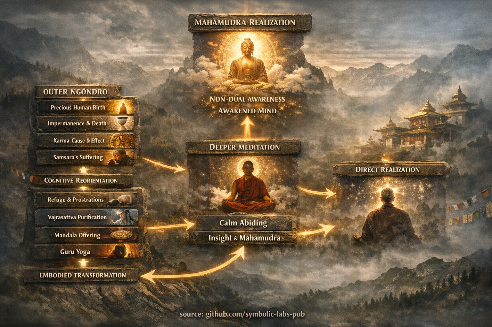

# [The Előkészítő Gyakorlatok (Ngöndro)](https://github.com/symbolic-labs-pub/a-buddhist-view/blob/master/languages/hu/more/11_ngondro/README.md#the-preliminary-practices-ngöndro)

> At this point you've arrived to a serious Tanítás, requiring lots of Gyakorlat. If you consider to proceed with the Előkészítő Gyakorlatok and still not contacted a local Buddhist center or Közösség yet, please do it now. 
> 
> Sangha is essential here, learn from them, together with them how to Gyakorlat Ngöndro. Don't aim for numbers like 100.000+, that's for monks, aim for something reasonable in your life.
>
> For those beginning this Gyakorlat, it is highly recommended to receive a formal reading transmission (lung) and specific instructions from a qualified Tanító.  

## What is **Ngöndro** in Mahāyāna Buddhism?

**Ngöndro** (Tibetan: *sngon ’gro*, “that which goes before”) is a **foundational training path** used primarily in Tibetan Mahāyāna—especially within [Vajrayāna](../05_yanas/README.md#4-vajrayna-tantrayna-mantrayna-the-diamond-vehicle) lineages—to **prepare the mind-stream** for deeper [Meditáció](../08_lineage/README.md) such as [Mahāmudrā](../04_kayas/mahamudra_and_dzogcsen/README.md#mahmudr-nature-of-mind) or [Dzogchen](../04_kayas/mahamudra_and_dzogcsen/README.md#dzogchen-rigpa-direct-introduction).

It is not preliminary in the sense of “basic” or “optional.”
Ngöndro is **structural conditioning**: it rewires motivation, perception, and habit patterns so that higher teachings can actually function.

---

## 1. Where Ngöndro Fits in Mahāyāna

In classical Mahāyāna terms, Ngöndro integrates:

* **Renunciation** → freedom from compulsive grasping
* **Bodhicitta** → [awakening](../10_concepts/README.md#3-megvilágosodás-bodhi-awakening) *for the benefit of all beings*
* **Śūnyatā ([emptiness](../10_concepts/01_emptiness/README.md#emptiness-nyat-in-vajrayna-buddhism))** → non-reified [Bölcsesség](../01_core_teachings/the_noble_eightfold_path/README.md#1-bölcsesség-pa)
* **Upāya (skillful means)** → embodied, repeatable methods

Tibetan lineages systematized this into a **precise psycho-spiritual curriculum**, preserved most strongly in the Kagyü school and Nyingma school traditions.

---

## 2. The Two Layers of Ngöndro

### A. **Outer Ngöndro** – Cognitive Reorientation
These contemplations recalibrate *how reality is valued*:

1. **Precious Human Birth**
   [Tudatosság](../10_concepts/README.md#2-tudatosság-rigpa-vijñāna-knowing) of opportunity, not entitlement.

2. **[Múlandóság](../01_core_teachings/impermanence/README.md#2-a-múlandóság-anicca-strukturális-nem-véletlen) & Death**
   Urgency without panic; clarity without nihilism.

3. **Karma (Cause & Effect)**
   Ethical precision replaces magical thinking.

4. **Samsāra’s [Unsatisfactoriness](../02_from_ignorance_to_awakening/2_the_four_noble_truths/README.md#1-van-szenvedés-dukkha)**
   Honest recognition that cyclic existence cannot be optimized into Felszabadulás.

👉 Function: breaks denial, complacency, and spiritual consumerism.

---

### B. **Inner Ngöndro** – Embodied Transformation
These are **quantified practices** (often 100,000+ repetitions), not symbolic gestures.

1. [**Refuge & Prostrations**](1_prostrations/README.md#the-first-ngöndro-gyakorlat)

   * Body submits ego
   * Speech aligns intention
   * Mind re-anchors trust
     → Dismantles pride and self-referentiality

2. [**Vajrasattva Purification**](2_purification/README.md#2-vajrasattva-purification-of-obscurations)

   * Purifies obscurations through Tudatosság + remorse + resolve
   * Not moral guilt, but **causal hygiene**

3. [**Mandala Offering**](3_mandala_offering/README.md#the-third-ngöndro-gyakorlat)

   * Systematic relinquishing of attachment
   * Trains abundance *without ownership*

4. [**Guru Yoga**](4_guru_yoga/README.md#the-fourth-ngöndro-gyakorlat)

   * Devotion to awakened mind as *recognizable within oneself*
   * Collapses the false split between "Tanító" and "nature of mind"

👉 Function: rewrites deep somatic and attentional patterns that insight alone cannot reach.

---

## 3. Why Ngöndro Is Necessary (Not Optional)

From a systems perspective:

* **Insight without preparation** → instability
* **[Együttérzés](../02_from_ignorance_to_awakening/7_compassion/README.md#az-együttérzés-mint-strukturális-elv-a-buddhista-tanításban) without structure** → burnout
* **Emptiness without [ethics](../01_core_teachings/the_noble_eightfold_path/README.md#2-etikus-magatartas-la)** → nihilism

Ngöndro solves this by:

* Synchronizing **body–speech–mind**
* Converting ideals into **trained reflexes**
* Making awakening **reliable**, not episodic

Many realized masters completed Ngöndro **multiple times**—not because they were unenlightened, but because Ngöndro *maintains coherence*.

---

## 4. A Modern Analogy (Engineering View)

Think of Ngöndro as:

* **Firmware flashing** before running advanced models
* **Data normalization** before high-dimensional learning
* **Pre-training** that prevents catastrophic overfitting to ego patterns

Skipping it is like deploying a powerful optimizer on corrupted data.

---

## 5. What Ngöndro Is *Not*

* ❌ Not superstition
* ❌ Not blind ritual
* ❌ Not cultural decoration

✔ It is **cognitive architecture + affect regulation + ethical alignment**, refined over centuries.

---

## 6. Key Insight

> **Ngöndro is already awakening—
> just practiced until it becomes irreversible.**

---

< [The Fourth Ngöndro Gyakorlat](4_guru_yoga/README.md) | [Gyakran Ismételt Kérdések](../80_faq/README.md) >

_source: [github.com/symbolic-labs-pub](https://github.com/symbolic-labs-pub)_

---
