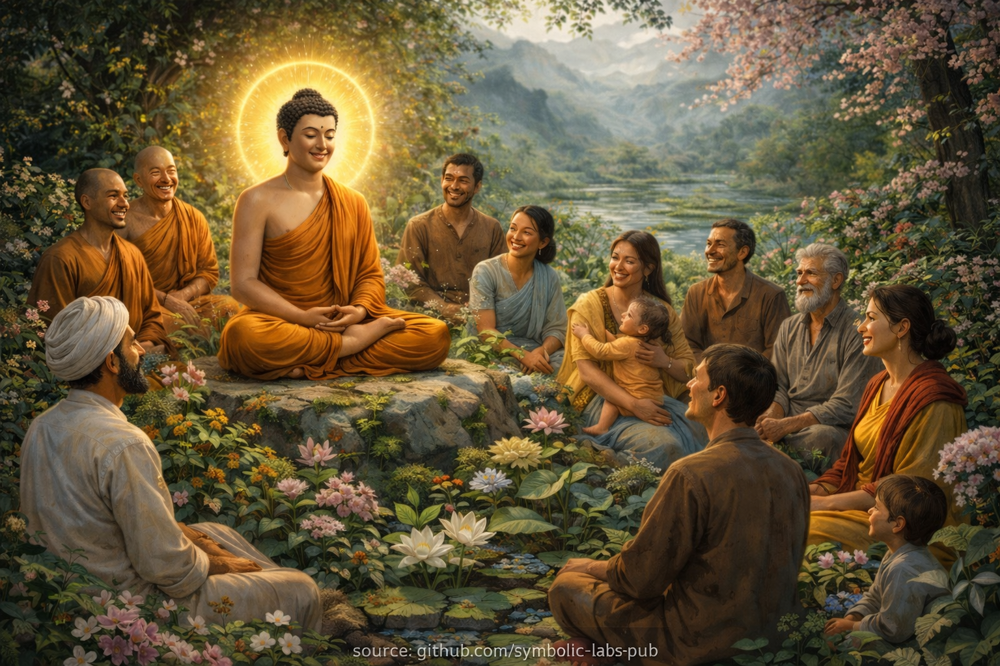
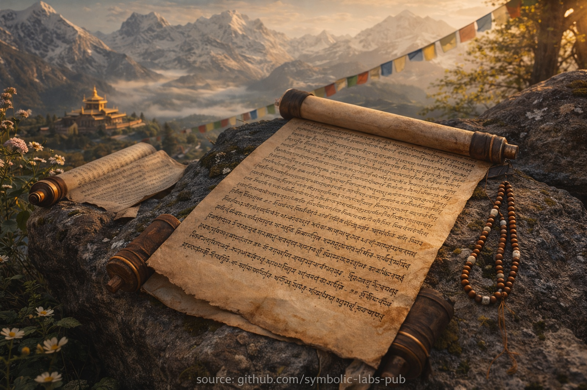
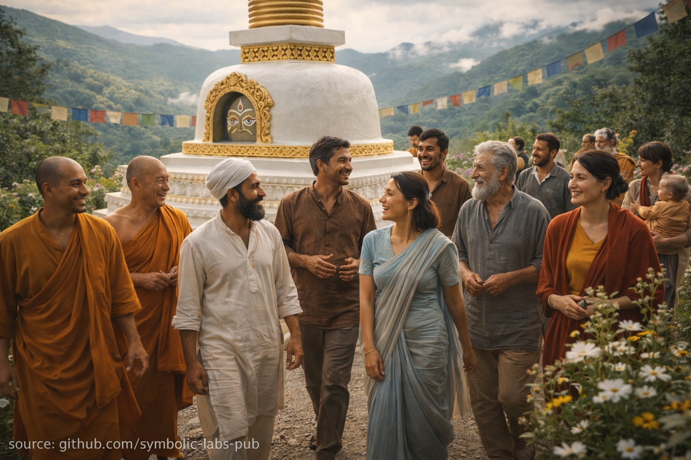
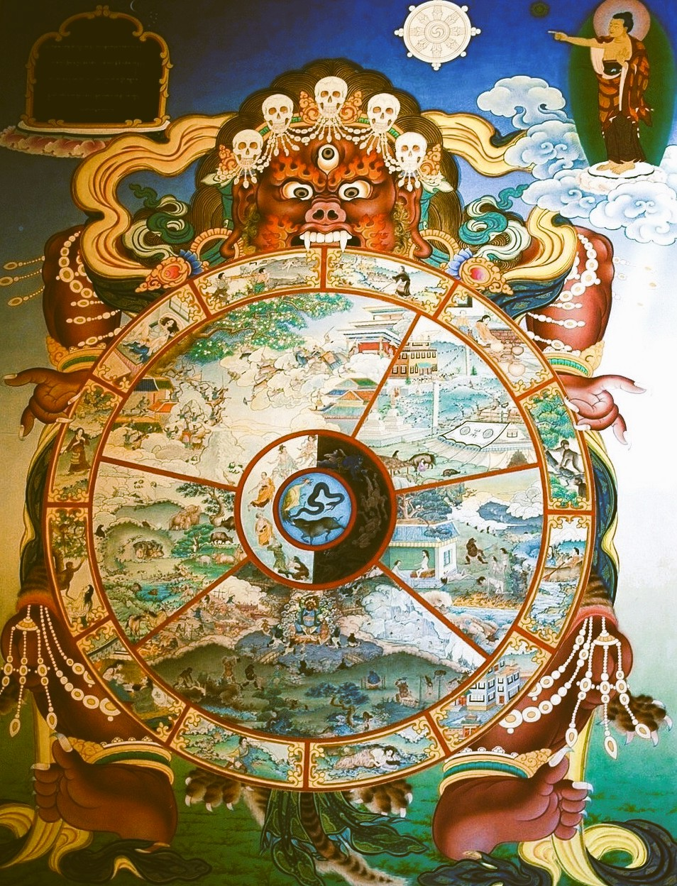
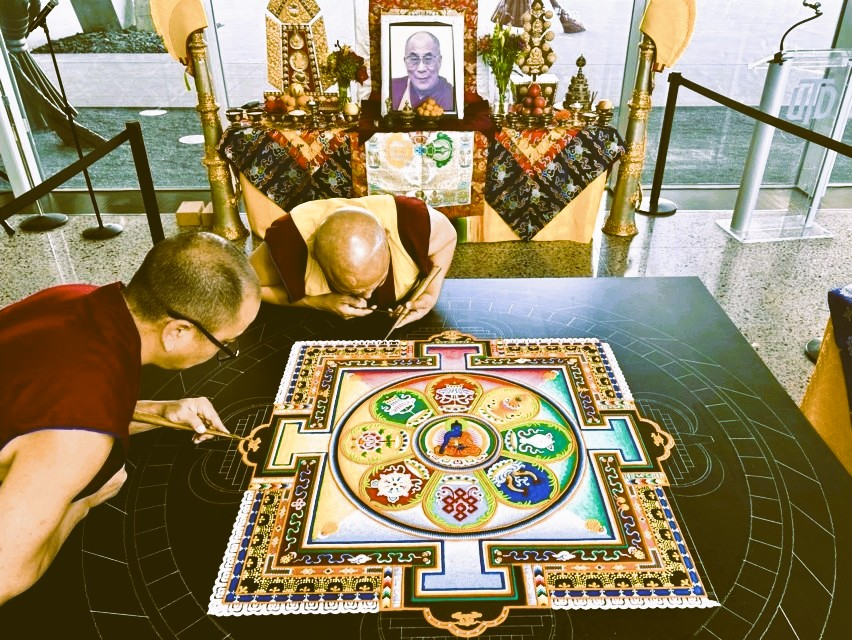

# [Una visione buddhista](https://github.com/symbolic-labs-pub/a-buddhist-view/blob/languages/it/master/README.md)

Se sorge un interesse e un impegno genuini, il sentiero buddhista classico raccomanda il seguente approccio:

* **Collegarsi con un centro o una comunità buddhista** vicino a te che mantenga un lignaggio autentico
* **Partecipare agli insegnamenti e alle sessioni di meditazione**, coltivando familiarità sia con la visione che con la pratica
* **Affidarsi a un maestro qualificato (lama, kalyāṇamitra)** la cui condotta, comprensione e compassione ispirano fiducia
* **Prendere formalmente rifugio** nel Buddha, nel Dharma e nel Saṅgha, stabilendo le fondamenta del sentiero
* **Ricevere trasmissioni orali (*lung*) e istruzioni pratiche (*tri*)** direttamente dal proprio maestro qualificato, assicurando la continuità del lignaggio
* **Iniziare le pratiche preliminari (*Ngöndro*)**, che preparano la mente e stabilizzano la realizzazione

---

### Chiarimenti importanti

* Un **maestro non viene "scelto" casualmente**; la fiducia si sviluppa gradualmente attraverso l'osservazione e la riflessione
* **Il rifugio non è simbolico**—rappresenta un riorientamento decisivo della propria vita verso il risveglio
* **Le trasmissioni sono essenziali nel Vajrayāna**, poiché la realizzazione è inseparabile dal lignaggio e dall'introduzione diretta
* **Le pratiche preliminari non sono correttive**—sono sentieri completi che purificano le oscurazioni e maturano la visione profonda

---

## Indice dei contenuti

- [Insegnamenti fondamentali](more/01_core_teachings/README.md)
- [Dall'ignoranza al risveglio](more/02_from_ignorance_to_awakening/README.md)
- [Il sentiero per porre fine alla sofferenza](more/03_the_path_to_end_suffering/README.md)
- [I tre corpi](more/04_kayas/README.md)
- [Veicoli del sentiero](more/05_yanas/README.md)
- [Stati intermedi e reincarnazione](more/06_intermediate_states_and_reincarnation/README.md)
- [Presente e storia](more/07_history/README.md)
- [Lignaggi e buddha](more/08_lineage/README.md)
- [Simboli](more/09_symbols/README.md)
- [Concetti](more/10_concepts/README.md)
- [Pratiche preliminari](more/11_ngondro/README.md)
- [Domande frequenti](more/80_faq/README.md)
---

 Gli insegnamenti (Dharma) 

## Gli insegnamenti (Dharma)

Anche se il buddhismo viene principalmente affrontato come una religione, **non** richiede fede cieca o un salto di credenza.

Al contrario, il buddhismo incoraggia esplicitamente l'esame attento. Sei invitato a interrogare, analizzare e testare ogni insegnamento—e ad accettare nulla a meno che non si dimostri vero attraverso la tua stessa esperienza.

Allo stesso tempo, il buddhismo non può essere realizzato attraverso la sola lettura, ascolto o comprensione intellettuale.

Comprendere le idee è solo l'inizio. Per sapere veramente se sono valide, devi **indagarle direttamente**.
Questa indagine avviene attraverso la **meditazione**.

La meditazione è il metodo attraverso il quale gli insegnamenti buddhisti vengono verificati. È così che la visione profonda diventa personale, vissuta e reale. Non c'è un percorso alternativo. Per questa stessa ragione, _non c'è praticante buddhista che eviti la meditazione_.

Nella maggior parte degli ambiti della vita, imparare attraverso il solo studio può essere sufficiente—puoi superare esami, costruire carriere e risolvere problemi senza mai meditare. Il buddhismo, tuttavia, non è strutturato in questo modo.

Studiare gli insegnamenti buddhisti senza meditazione è come ricevere un veicolo nuovo:
ne esamini la forma, ne ammiri il design, guardi all'interno, tieni persino la chiave—
ma non ti siedi mai al posto di guida e non avvii mai il motore.

La meditazione è ciò che gira la chiave.

La comunità: i nostri amici sul sentiero (Sangha)

## La comunità: i nostri amici sul sentiero (Sangha)

Le pratiche di meditazione buddhista sono ampiamente disponibili oggi, ma il modo più efficace per iniziare è sorprendentemente semplice: trova un centro o una comunità buddhista nelle vicinanze e partecipa ad alcune sessioni di meditazione guidata.

Se sperimenti un cambiamento positivo, continuerai naturalmente.
Se no, un'altra comunità o tradizione potrebbe adattarsi meglio a te.

Nel tempo, molte persone scoprono di aver trovato anche qualcos'altro lì:
persone ben intenzionate, equilibrate e solidali—e di conseguenza anche maestri saggi.

Un buddha adirato?

## Un buddha adirato?

In questa antica immagine tibetana appare una figura spaventosa con occhi feroci, ornamenti di teschi e denti scoperti. Questa apparenza può essere fuorviante all'inizio.

L'essere **non è ostile verso di noi**. La sua forma terrificante è destinata a **spaventare ostacoli, ignoranza e forze dannose**—non i praticanti stessi.

Nell'iconografia buddhista, tali figure sono conosciute come **protettori**. Incarnano un'energia potente e intransigente usata al servizio del risveglio. Per questo vengono invocati nella pratica: non per paura, ma per **protezione e chiarezza**.

La ruota tenuta da questa figura è chiamata la **ruota della vita**, o **Bhavachakra**. Rappresenta l'esistenza ciclica—nascita, morte e reincarnazione—guidata dall'ignoranza, dalla brama e dall'avversione. La figura feroce che tiene la ruota è **Yama**, il Signore della Morte, simboleggiando l'impermanenza e l'inevitabilità di causa ed effetto.

Yama non è una divinità maligna. Ci ricorda che tutto ciò che è condizionato è temporaneo, e che la liberazione deriva dalla comprensione della ruota—non dal negarla.

Mandala di sabbia

## Mandala di sabbia

I mandala vengono creati con straordinaria cura e precisione usando sabbia colorata. Il processo è delicato e richiede molto tempo, spesso richiedendo molte settimane di lavoro concentrato e paziente. Tuttavia, una volta che il mandala è completo, viene deliberatamente spazzato via—come in un singolo momento—da un maestro rispettato.

_fonte: [Local Profile](https://www.localprofile.com/arts-culture/tibetan-monk-mandala-sand-painting-at-the-crow-museum-9770562)_

Questa distruzione intenzionale non è un atto di perdita, ma di insegnamento.

I mandala di sabbia ci ricordano le visioni profonde buddhiste fondamentali, tra cui:

* **Impermanenza (anicca)** — tutte le cose condizionate sorgono e svaniscono
* **Non-attaccamento** — la bellezza e il significato non richiedono possesso
* **La preziosità del momento presente** — il valore risiede nell'atto, non nel risultato
* **Interdipendenza** — innumerevoli piccole azioni creano un insieme coerente
* **Lasciar andare** — la pace deriva dal rilascio, non dall'accumulo
* **Intenzione compassionevole** — il mandala è fatto per il beneficio di tutti gli esseri, non per il possesso personale

In questo modo, il mandala stesso diventa una meditazione:
creato con cura, apprezzato pienamente e rilasciato senza rimpianto.

---

< [Domande frequenti](more/80_faq/README.md) | [Insegnamenti fondamentali](more/01_core_teachings/README.md) >

_fonte: [github.com/symbolic-labs-pub](https://github.com/symbolic-labs-pub)_

---
