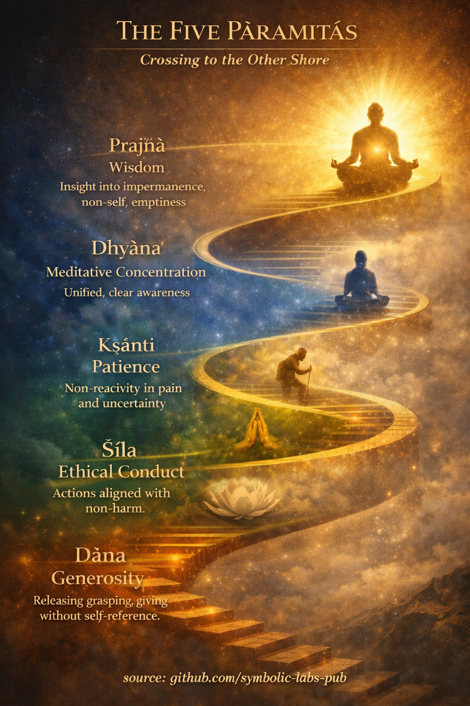

## [Cosa significa "Pāramitā" nel buddhismo](https://github.com/symbolic-labs-pub/a-buddhist-view/blob/master/languages/it/more/01_core_teachings/perfections/README.md#cosa-significa-pāramitā-nel-buddhismo)

**Pāramitā** significa letteralmente *"ciò che è andato all'altra sponda."*
In termini buddhisti, questo non è un luogo metafisico—è **la libertà dall'ignoranza (avidyā)** e dalle abitudini di attaccamento che generano [sofferenza (dukkha)](../../02_from_ignorance_to_awakening/2_the_four_noble_truths/README.md#1-cè-sofferenza--dukkha).

Sono chiamate *perfezioni* **non perché si diventa moralmente impeccabili**, ma perché ogni qualità è praticata **senza auto-riferimento, attaccamento o aspettativa di ricompensa**.

Nel [Mahāyāna](../../05_yanas/README.md#limitazione-dal-punto-di-vista-mahāyāna), le pāramitā sono coltivate da un [**bodhisattva**](../../08_lineage/08_bodhisattva/README.md#4-il-voto-del-bodhisattva-come-allineamento-strutturale)—uno che cerca il [risveglio](../../10_concepts/README.md#3-illuminazione-bodhi-risveglio) **per il beneficio di tutti gli esseri**, non solo per se stesso.

---

## 1. **Dāna (Generosità)** — Annullare l'attaccamento

**Problema centrale affrontato:** attaccamento e mentalità di scarsità

L'insegnamento buddhista sottolinea che la sofferenza sorge dall'**attaccamento**—a possessi, identità, opinioni, risultati.

Dāna non è semplicemente dare oggetti; è **rilasciare la proprietà**:

* Dare senza aspettarsi gratitudine
* Dare senza rafforzare "io sono il donatore"
* Dare senza calcolare i meriti

A livelli più profondi, si dà:

* **Assenza di paura** (non causare danno)
* [**Dharma**](../the_three_jewels/README.md#2-dharma--il-sentiero-e-la-legge-della-realtà) (chiarezza, verità, guida)

👉 *Funzione trasformativa:* allenta l'illusione di "mio" e "me".

---

## 2. **Śīla (Condotta etica)** — Stabilizzare karma e mente

**Problema centrale affrontato:** azione dannosa guidata dalla confusione

[Śīla](../the_noble_eightfold_path/README.md#2-condotta-etica-śīla) non è obbedienza a regole; è **contenimento intelligente** basato sulla comprensione di causa ed effetto (karma).

Nella psicologia buddhista:

* Azione non etica → agitazione → [meditazione](../../08_lineage/README.md) instabile
* Azione etica → calma → chiarezza

Śīla include:

* Non danneggiare (corpo, parola, mente)
* Onestà e responsabilità
* Allineamento dell'intenzione con la [consapevolezza](../../10_concepts/README.md#2-consapevolezza-rigpa-vijñāna-conoscere)

👉 *Funzione trasformativa:* crea le **condizioni** per meditazione e comprensione.

---

## 3. **Kṣānti (Pazienza)** — Libertà dalla reattività

**Problema centrale affrontato:** avversione e rabbia

Kṣānti è spesso fraintesa come tolleranza passiva. Nel buddhismo significa:

* **Vedere la sofferenza senza aggiungere resistenza**
* Rimanere aperti in presenza di dolore, insulto, ritardo o incertezza

Questo include:

* Pazienza con gli altri
* Pazienza con le circostanze
* Pazienza con la verità stessa (specialmente comprensioni difficili)

La rabbia è vista come un **momento di ignoranza**—una contrazione attorno a un falso sé.

👉 *Funzione trasformativa:* dissolve il riflesso di difendere un ego immaginato.

---

## 4. **Vīrya (Sforzo diligente)** — Energia giusta, non tensione

**Problema centrale affrontato:** letargia, evitamento, sforzo mal indirizzato

Vīrya significa **perseveranza gioiosa**, non disciplina severa.

L'insegnamento buddhista distingue:

* **Sforzo non salutare** (guidato da desiderio o senso di colpa)
* **Sforzo salutare** (allineato con chiarezza e [compassione](../../02_from_ignorance_to_awakening/7_compassion/README.md#la-compassione-come-principio-strutturale-nellinsegnamento-buddhista))

Retto sforzo:

* Previene stati non salutari
* Coltiva stati salutari
* Sostiene la pratica senza esaurimento

👉 *Funzione trasformativa:* mantiene il sentiero **vivo e incarnato**.

---

## 5. **Dhyāna (Concentrazione meditativa)** — Unificazione della mente

**Problema centrale affrontato:** distrazione e frammentazione

Dhyāna si riferisce a **profonda raccolta** dove la mente diventa:

* Stabile
* Chiara
* Non-reattiva

Questo non è trance o fuga, ma **presenza lucida**.

Attraverso la meditazione:

* Il rumore mentale si placa
* La comprensione diventa possibile
* Il senso di un sé solido inizia ad ammorbidirsi

Nel Mahāyāna, la [concentrazione](../the_noble_eightfold_path/README.md#8-retta-concentrazione-sammā-samādhi) è sempre abbinata a **compassione e saggezza**, non isolamento.

👉 *Funzione trasformativa:* crea il **terreno esperienziale diretto** per la comprensione.

---

## 6. **Prajñā (Saggezza)** — Vedere la realtà così com'è

**Problema centrale affrontato:** ignoranza (avidyā)

[Prajñā](../the_noble_eightfold_path/README.md#1-saggezza-paññā) non è conoscenza intellettuale. È **comprensione diretta** di:

* [**Impermanenza**](../impermanence/README.md#2-limpermanenza-anicca-è-strutturale-non-accidentale) (anicca)
* [**Non-sé**](../../02_from_ignorance_to_awakening/1_the_three_marks_of_existence/README.md#3-non-sé-anattā) (anattā)
* [**Vacuità**](../../10_concepts/01_emptiness/README.md#vacuità-śūnyatā-nel-buddhismo-vajrayāna) (śūnyatā)

Questa saggezza vede che:

* Tutti i fenomeni sorgono in modo dipendente
* Nulla esiste in modo indipendente o permanente
* Il "sé" è un processo, non un'entità

Nel Mahāyāna, prajñā è inseparabile dalla **compassione**—perché quando l'attaccamento al sé si dissolve, la separazione si dissolve.

👉 *Funzione trasformativa:* pone fine alla radice della sofferenza.

---

## Come le pāramitā lavorano insieme

Non sono **passi sequenziali**, ma un **sistema che si rafforza reciprocamente**:

* La generosità indebolisce l'attaccamento → l'etica diventa naturale
* L'etica stabilizza la mente → la pazienza diventa possibile
* La pazienza consente uno sforzo sostenuto
* Lo sforzo approfondisce la meditazione
* La meditazione dà origine alla saggezza
* La saggezza perfeziona tutte le altre

Senza saggezza, le pāramitā diventano **progetti dell'ego**.
Con la saggezza, diventano **espressioni spontanee del risveglio**.

---

## In una frase (visione buddhista)

> Le pāramitā non sono virtù da acquisire, ma **modi di essere che emergono man mano che l'ignoranza svanisce**.

---

< ["Tutte le cose condizionate sono impermanenti"](../impermanence/README.md) | [Cos'è il Nobile Ottuplice Sentiero (nel buddhismo)](../the_noble_eightfold_path/README.md) >

_fonte: [github.com/symbolic-labs-pub](https://github.com/symbolic-labs-pub)_

---
