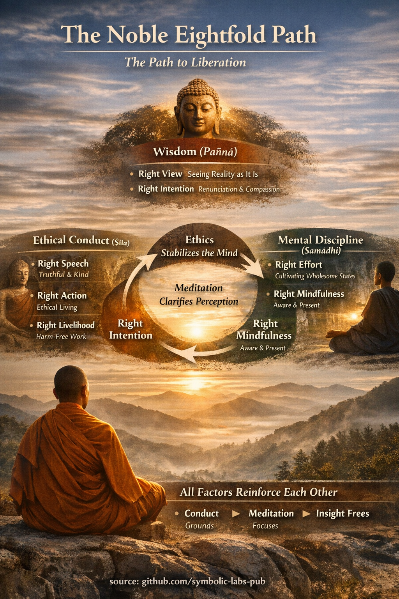

## [Што претставува Племенитиот осмоделен пат *во будизмот*](https://github.com/symbolic-labs-pub/a-buddhist-view/blob/master/more/01_core_teachings/the_noble_eightfold_path/README.md#what-the-noble-eightfold-path-is-in-buddhism)

Во сопствената рамка на Буда **Племенитиот осмоделен пат (ariya aṭṭhaṅgika magga)** е:

* **четвртата племенита вистина**
* **средството со кое [страдањето (dukkha)](../../02_from_ignorance_to_awakening/2_the_four_noble_truths/README.md#1-има-страдање--dukkha) навистина престанува**
* не систем на верувања, туку **обука во перцепција, дејствување и сознавање**

Тој се нарекува *пат* само метафорично. На практика ова е **истовремено култивирање** на услови кои ја отслабуваат незнаењето (*avijjā*) и копнежот (*taṇhā*).

Буда експлицитно ја отфрли идејата дека ослободувањето доаѓа од:

* ритуал
* аскетизам
* само интелектуално знаење
* само морална чистота

Наместо тоа, ослободувањето настанува кога **погледот, однесувањето и умот се усогласени со реалноста**.

---

## Тројната структура (како се учи во сутрите)

Осмоделниот пат традиционално се групира во **три обуки (tisikkhā)**:

1. **Мудрост (Paññā)** – гледање на реалноста правилно
2. **Етичко однесување (Śīla)** – ненавлекување на ново страдање
3. **Ментална дисциплина (Samādhi)** – стабилизирање и појаснување на умот

Оваа структура не е теоретска — таа ја одразува *каузалната зависност*:

> **Нестабилно однесување → нестабилен ум → искривена перцепција**
> **Етичка стабилност → ментална стабилност → ослободувачки увид**

---

## 1. Мудрост (Paññā)

### 1. Правилен поглед (Sammā-diṭṭhi)

**Основно значење во будизмот:**
Правилниот поглед не е филозофија — ова е *точна перцепција* на тоа како нештата навистина функционираат.

Тој вклучува:

* [непостојаност (*anicca*)](../impermanence/README.md#2-непостојаност-anicca-е-структурна-а-не-случајна)
* незадоволителност (*dukkha*)
* [не-јас (*anattā*)](../../02_from_ignorance_to_awakening/1_the_three_marks_of_existence/README.md#3-не-јас-anattā)
* [зависно настанување (*paṭicca-samuppāda*)](../../02_from_ignorance_to_awakening/3_dependent_origination/README.md#дванаесетте-врски-класичната-формулација)
* карма како причина-и-последица, не судбина

Важно е:

> Правилниот поглед започнува концептуално, но **созрева само преку директен увид**.

Буда прави разлика помеѓу:

* **светски правилен поглед** (етичка каузалност, прераѓање, одговорност)
* **натсветски правилен поглед** (директна реализација на не-јас и прекинување)

Без правилен поглед:

* напорувањето оди во погрешна насока
* [медитацијата](../../08_lineage/README.md) станува бегство
* етиката станува цврста морал

---

### 2. Правилна намера (Sammā-saṅkappa)

Правилната намера е **афективното усогласување** на умот.

Буда ги именува три квалитети:

1. **Отфрлање** (ослободување, не потиснување)
2. **Доброжелателност** (не-злонамерност)
3. **Ненавредување** (не-суровост)

Ова има значење затоа што:

> Ослободувањето е блокирано не само од незнаење, туку од **емоционален импулс**.

Правилната намера го отслабува копнежот (*taṇhā*) во неговиот емоционален корен.

---

## 2. Етичко однесување (Śīla)

Етиката во будизмот е **функционална**, не морализаторска.

Буда **не** вели:

> "Бидете етички, за да бидете добри."

Тој вели:

> "Неетичкото дејствување го возбудува умот и ја отежнува концентрацијата."

---

### 3. Правилен говор (Sammā-vācā)

Дефиниран негативно и позитивно:

Избегнувајте:

* лажлив говор
* разделувачки говор
* груб говор
* празно, компулсивно зборување

Култивирајте:

* вистинитост
* навременост
* добрина
* корисност

Говорот се нагласува затоа што:

> Говорот е каде **намерата станува социјална карма**.

---

### 4. Правилно дејствување (Sammā-kammanta)

Покрива телесното однесување:

* ненавредување
* некрадење
* не-сексуална експлоатација

Буда ја поврзува телесната воздржливост директно со **слобода од жалење**, што е предуслов за длабока медитација.

---

### 5. Правилен препород (Sammā-ājīva)

Преподот не треба систематски да предизвикува штета.

Класичните забрани вклучуваат:

* трговија со оружје
* трафик на луѓе
* заклање
* опијати
* отрови

Подлабокиот принцип:

> Човек не може да култивира ослободување додека **заработува од страдањето**.

---

## 3. Ментална дисциплина (Samādhi)

Овој оддел често се разбира погрешно како "само медитација."
Во будизмот ова е **динамична обука на менталната енергија**.

---

### 6. Правилно напорување (Sammā-vāyāma)

Четирикратно напорување:

1. Спречување на неблагодатни состојби
2. Отфрлање на настанати неблагодатни состојби
3. Култивирање на благодатни состојби
4. Одржување и задлабочување на благодатни состојби

Ова не е волева сила — ова е **вешто регулирање на внимание и навика**.

Буда повеќекратно предупреди против:

* присилување
* потиснување
* духовна амбиција

---

### 7. Правилна внимателност (Sammā-sati)

Дефинирана *прецизно* во Satipaṭṭhāna Sutta како [свесност](../../10_concepts/README.md#2-awareness-rigpa-vijñāna-knowing) на:

* тело
* чувства
* состојби на умот
* феномени (dhammas)

Внимателноста не е само голо внимание.
Таа вклучува:

* запаметување на учењето
* препознавање на непостојаноста
* гледање на копнежот додека настанува

Следователно:

> Внимателноста е **мудрост, применета во реално време**.

---

### 8. Правилна концентрација (Sammā-samādhi)

Се однесува конкретно на **jhāna** (медитативна поглтеност).

Клучни точки:

* концентрацијата е обединета, стабилна, радосна
* таа ги потиснува пречките
* таа ја обезбедува *јасноста*, потребна за увид

Во будизмот:

> Концентрацијата не е целта — **таа е лештата**, преку која увидот станува продорен.

---

## Структурен увид (будистичка каузалност)

Вашата обобщена анализа е точна и длабоко будистичка:

* **Етиката го стабилизира умот** → ја отстранува возбудата и жалењето
* **Медитацијата ја појаснува перцепцијата** → ги открива непостојаноста и копнежот
* **Мудроста го раствора незнаењето** → го прекинува циклусот на страдањето

Суштински важно:

> Ниту еден фактор не се практикува изолирано.
> Практикувањето на еден **ги зајакнува останатите**.

Затоа Буда го нарече **пат**, а не скала.

---

## Финална будистичка рамка

Во сопствените зборови на Буда (перифразирано):

> "Како што океанот има еден вкус — вкусот на сол —
> така моето учење има еден вкус — вкусот на ослободувањето."

**Племенитиот осмоделен пат** е **инженерството на тоа ослободување**:

* етички
* когнитивно
* искуствено

---

< [Што значи "Pāramitā" во будизмот](../perfections/README.md) | [Трите драгоцености (Тројната драгоценост) — *Ti-ratana*](../the_three_jewels/README.md) >

_извор: [github.com/symbolic-labs-pub](https://github.com/symbolic-labs-pub)_

---
