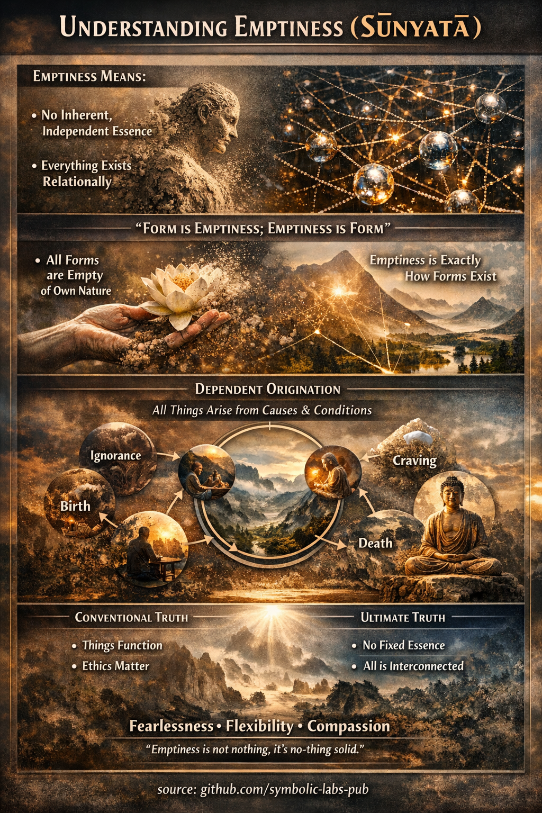

## [Празнина (Śūnyatā) во Mahāyāna будизмот](https://github.com/symbolic-labs-pub/a-buddhist-view/blob/master/more/02_from_ignorance_to_awakening/4_emptiness/README.md#emptiness-śūnyatā-in-mahāyāna-buddhism)

Во **Mahāyāna будизмот** **празнината (Śūnyatā)** е **централниот филозофски и искуствен увид**, кој ги ослободува суштествата од [страдање](../2_the_four_noble_truths/README.md#1-има-страдање--dukkha). Тоа не е вера, туку *правилен начин на гледање на реалноста*.

---

### 1. Што празнината всушност значи

**Śūnyatā** значи дека **сите феномени се празни од присутно, независно постоење**.

Ова **не** значи:

* Ништо не постои ❌
* Реалноста е илузија ❌
* Животот е безмислен ❌

Тоа **значи**:

* Ништо не постои *самостојно*
* Сè постои **зависно**
* Сите нешта се **релациони, случајни и динамични**

Во термини на Mahāyāna ова се нарекува [**зависно настанување**](../3_dependent_origination/README.md#дванаесетте-врски-класичната-формулација) (*pratītyasamutpāda*), гледано јасно.

> Бидејќи нештата настануваат поради причини и услови,
> тие не можат да поседуваат фиксирана, независна суштина.

---

### 2. Празнината и двете вистини

Mahāyāna ја артикулира реалноста преку **две неодделиви вистини**:

1. [**Конвенционална вистина**](../5_the_two_truths/README.md#двете-вистини-во-будистичките-учења)

   * Објекти, луѓе, емоции и концепти функционираат
   * Јазик, [етика](../../01_core_teachings/the_noble_eightfold_path/README.md#2-етичко-однесување-śīla) и каузалност работат
   * Страдањето е реално и сочувството е потребно

2. **Крајна вистина (Śūnyatā)**

   * Никој феномен нема присутно постоење
   * Сите идентитети се раствораат при анализа

Тие **не се две одделни реалности**.
Тие се *два начини на разбирање на истата реалност*.

> Да се негира конвенционалната вистина е нихилизам.
> Да се негира празнината е етернализам.
> Mahāyāna ги избегнува двете.

---

### 3. Nāgārjuna и увидот на Madhyamaka

Филозофот **Nāgārjuna** ја артикулираше празнината со хируршка прецизност.

Неговиот клучен увид:

> **Празнината е празнина на присутно постоење — ништо повеќе, ништо помалку.**

Nāgārjuna покажа дека:

* Сè што навистина постои независно, не би можело да се менува
* Сè што се менува, не може да биде присутно постоечко
* Бидејќи сè се менува, сè е празно

Суштински важно:

> **Празнината самата е празна.**

Śūnyatā **не е метафизичка супстанца** или крајно "нешто."
Ова е **коригирачки увид**, не заменувачко верување.

---

### 4. Сутра на срцето: каноничкото изразување

Најпознатото учење на Mahāyāna за празнината е **Сутра на срцето**.

Нејзиниот основен ред:

> **Формата е празнина; празнината е форма.**

Значење:

* Празнината не е *зад* феномените
* Празнината не е *другаде*
* Празнината е **начинот на постоење на самата форма**

Гледањето на формата правилно *е* гледање на празнината.

---

### 5. Празнина и сочувство (зошто ова не е ладна филозофија)

Често погрешно разбирање е дека празнината води до отстранетост или апатија.

Mahāyāna учи спротивното:

* Кога јас-от се гледа како празен → его-приврзаноста се урива
* Кога егото се урива → разделувањето се раствора
* Кога разделувањето се раствора → **[сочувството](../7_compassion/README.md#сочувството-како-структурен-принцип-во-будистичките-учења) станува природно**

Следователно празнината е **основата на патот на [Bodhisattva](../../08_lineage/08_bodhisattva/README.md#4-the-bodhisattva-vow-as-structural-alignment)**.

Нема цврсто "јас" за заштита
→ нема цврсто "друго" за страв
→ безнапорно сочувство

---

### 6. Празнината е искуствена, не само концептуална

Mahāyāna повеќекратно предупредува:

> **Разбирањето на празнината интелектуално не е ослободување.**

Śūnyatā треба да се:

* Медитира врз
* Стабилизира во [свесност](../../10_concepts/README.md#2-awareness-rigpa-vijñāna-knowing)
* Интегрира во однесувањето

Ова води до:

* Безстрашност
* Флексибилност на умот
* Спонтана етичка одзивност

---

### 7. Прецизно резиме

Во Mahāyāna будизмот **празнина (Śūnyatā)** значи:

* Сите феномени немаат присутно постоење
* Реалноста е релациона и зависно настаната
* Празнината ги избегнува и нихилизмот и етернализмот
* Празнината и формата се неодделиви
* Реализирањето на празнината природно раѓа сочувство
* Празнината е **начин на гледање**, не систем на верувања

---

### Финален увид на Mahāyāna

> **Празнината не е она што останува, кога сè исчезне.
> Празнината е она што останува, кога сè се гледа јасно.**

---

< [Зависно настанување (Paṭicca-samuppāda)](../3_dependent_origination/README.md) | [Двете вистини во будистичките учења](../5_the_two_truths/README.md) >

_извор: [github.com/symbolic-labs-pub](https://github.com/symbolic-labs-pub)_

---
