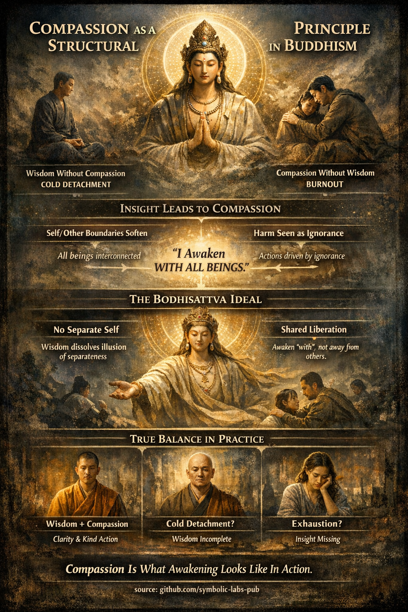

### Сочувството како структурен принцип во будистичките учења

*(Зошто тоа не е по избор, туку неизбежно)*

Во будизмот **сочувството (karuṇā)** не е морален додаток или црта на личноста. Тоа е **структурна последица од увидот во реалноста**. Кога мудроста се задлабочува, сочувството **мора** да настане—исто како што топлината настанува од оган.

Ајде да го разгрнеме ова преку основни будистички доктрини.

---

## 1. Мудроста и сочувството се функционално неодделиви

Будистичката [мудрост (**prajñā**)](../../01_core_teachings/the_noble_eightfold_path/README.md#1-мудрост-paññā) не е апстрактно знаење. Ова е *директен увид* во:

* [непостојаност (anicca)](../../01_core_teachings/impermanence/README.md#2-непостојаност-anicca-е-структурна-а-не-случајна)
* [не-јас (anattā)](../1_the_three_marks_of_existence/README.md#3-не-јас-anattā)
* [зависно настанување (paṭicca-samuppāda)](../3_dependent_origination/README.md#дванаесетте-врски-класичната-формулација)
* празнина (śūnyatā, во [Mahāyāna артикулацијата)](../../10_concepts/01_emptiness/README.md#emptiness-śūnyatā-in-vajrayāna-buddhism)

Кога тие се гледаат јасно:

* Идејата за **цврсто, одделено јас се отслабува**
* "Другите" веќе не се перципираат како фундаментално различни
* [Страдањето](../2_the_four_noble_truths/README.md#1-има-страдање--dukkha) се препознава како **системски процес**, не лична неуспех

Следователно:

* **Мудрост без сочувство** станува *непонимање*—замрзната, дисоцирана позиција
* **Сочувство без мудрост** станува *неодржливо*—исцрпеност, движена од приврзаност и пре-идентификација

Класичните текстови повеќекратно го нагласуваат овој баланс. Буда не ја фали увидот само, туку увидот **споен со ослободување од злонамерност**.

---

## 2. Зошто увидот природно се изразува како сочувство

### а) Омекотување на границите јас / друг

Преку зависното настанување човек гледа дека:

* "Моето" страдање и "вашето" страдање настануваат од **истите услови**
* Идентитетот е **привремена конфигурација**, не фиксирана суштина

Од оваа перспектива:

* Помошта на друг не е саможртва
* Ова е **системско воспоставување на поврзаноста**

Затоа пробудените суштества се опишуваат како дејствувачки **спонтано**, не хероично.

---

### б) Штетата се гледа како движена од незнаење

Клучна будистичка транзиција е ова преформулирање:

> Штетното дејствување не е злинна суштина—тоа е **незнаење, што се изразува**.

Ова **не** значи извинување на штетата.
Тоа значи одговор **без омраза**, затоа што омразата претпоставува цврсто, виновно јас.

Буда го споредува неблагодатното дејствување со:

* слепило
* болест
* заплеткување во причини

Од овој поглед сочувството не е сентиментално—тоа е **точна дијагноза**.

---

## 3. Решението на Mahāyāna: идеалот на Bodhisattva

[Mahāyāna](../../05_yanas/README.md#limitation-from-mahāyāna-view) будизмот ја радикализира оваа логика.

Ако:

* нема независно јас
* [будењето](../../10_concepts/README.md#3-enlightenment-bodhi-awakening) ја раствора илузијата за раздвојување
* страдањето е споделено низ условите

Тогаш будењето **не може да биде лично**.

Оттука заветот на [Bodhisattva](../../08_lineage/08_bodhisattva/README.md#4-the-bodhisattva-vow-as-structural-alignment):

> "Суштества се безбројни; ветувам да ги ослободам."

Ова не е алтруизам во конвенционален смисол.
Ова е **не-дуална реализација, изразена во дејствување**.

Bodhisattva не го одлага просветлувањето поради жалење.
Поскоро:

* просветлувањето *вклучува* другите
* ослободувањето е **ко-настануваат**, не индивидуално бегство

---

## 4. Сочувството како структурно својство на реалноста-гледана-јасно

Во напреднатото будистичко разбирање:

* [Етика](../../01_core_teachings/the_noble_eightfold_path/README.md#2-етичко-однесување-śīla) произлегува од онтологија
* Сочувството произлегува од увидот
* Ослободувањето е релационо, не солипсистично

Токму како што гравитацијата го искривува просторот,
**мудроста го искривува дејствувањето кон сочувство**.

Не затоа што човек *мора*,
туку затоа што веќе нема концептуална граница која го спречува.

---

## 5. Практична импликација за практиката

Ова учење функционира како **дијагностички инструмент**:

* Ако увидот води до ладнина → мудроста е непотполна
* Ако сочувството води до исцрпеност → увидот недостасува
* Кога двете созреат → дејствувањето станува стабилно, јасно и непрегорено

Затоа будистичките патишта секогаш интегрираат:

* мудрост (prajñā)
* етичко однесување (śīla)
* култивирање на срдечни квалитети (brahmavihāras)

Тие се **еден систем**, не три избори.

---

### Накратко

Сочувството не е доблест, наслоена врз будењето.
Тоа е **како будењето изгледа, кога се движи**.

---

< [**Будова природа (Tathāgatagarbha)** — објаснета преку будистичките учења](../6_buddha_nature/README.md) | [1. Трите обележја на постоењето](../README.md) >

_извор: [github.com/symbolic-labs-pub](https://github.com/symbolic-labs-pub)_

---
